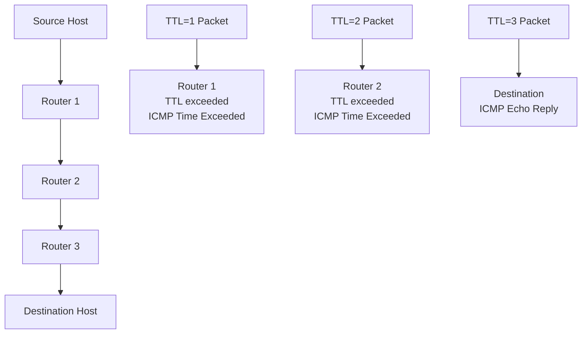

# Ping and Traceroute

Ping and traceroute are fundamental command-line diagnostic tools for network troubleshooting. They help identify connectivity issues, measure response times, and map network paths between source and destination devices.

## Ping Command

### Basic Usage

Ping sends ICMP Echo Request packets to a target host and displays response times:

```bash
# Basic ping to test connectivity
ping 8.8.8.8

# Limited number of packets
ping -c 5 google.com

# Ping with specific packet size
ping -s 1000 192.168.1.1
```

### Windows Ping Syntax

```cmd
# Basic ping
ping google.com

# Continuous ping (Ctrl+C to stop)
ping -t 192.168.1.1

# Ping with specific buffer size
ping -l 1000 10.0.0.1

# Record route (similar to traceroute)
ping -R 8.8.8.8
```

### Interpreting Ping Results

**Successful ping output:**
```
PING google.com (142.250.190.46): 56 data bytes
64 bytes from 142.250.190.46: icmp_seq=1 ttl=119 time=12.3 ms
64 bytes from 142.250.190.46: icmp_seq=2 ttl=119 time=11.8 ms

--- google.com ping statistics ---
3 packets transmitted, 3 packets received, 0% packet loss
round-trip min/avg/max/stddev = 11.8/12.1/12.3/0.2 ms
```

**Key metrics:**
- **ICMP Sequence:** Packet numbering (identifies lost packets)
- **TTL (Time to Live):** Remaining hops before packet expires
- **Round-trip time:** Network latency measurement
- **Packet loss:** Percentage of lost packets

**Common ping issues:**

| Response                       | Meaning                | Possible Cause                  |
| ------------------------------ | ---------------------- | ------------------------------- |
| `Request timeout`              | No response            | Firewall blocking, network down |
| `Destination host unreachable` | Routing failure        | Wrong subnet, link down         |
| `Time to live exceeded`        | Routing loop           | Misconfigured routing           |
| `Unknown host`                 | DNS resolution failure | DNS server issues               |

### Advanced Ping Usage

**Flood ping (stress testing):**
```bash
# Requires root/admin privileges
sudo ping -f 192.168.1.1

# Linux: Ping flood with intervals
ping -i 0.2 10.0.0.1
```

**Source interface specification:**
```bash
# Ping from specific interface
ping -I eth0 google.com

# Windows: Source IP specification
ping -S 192.168.1.100 8.8.8.8
```

**MTU discovery:**
```bash
# Don't fragment packets
ping -M do -s 1472 google.com

# Path MTU discovery
tracepath google.com
```

## Traceroute Command

### How Traceroute Works

Traceroute maps the path packets take from source to destination by manipulating the TTL field:



### Basic Traceroute Usage

```bash
# Trace route to host
traceroute google.com

# Linux alternate syntax
tracepath www.example.com

# Windows (tracert)
tracert google.com
```

### Detailed Output Analysis

**Typical traceroute output:**
```
traceroute to google.com (172.217.6.238), 30 hops max, 60 byte packets
 1  192.168.1.1 (192.168.1.1)  1.234 ms  1.111 ms  1.098 ms
 2  10.0.0.1 (10.0.0.1)  12.345 ms  11.111 ms  10.987 ms
 3  edge-router.isp.net (203.0.113.1)  23.456 ms  22.111 ms  21.098 ms
 4  core-router.isp.net (203.0.113.2)  34.567 ms  33.222 ms  32.001 ms
 5  * * *
 6  google-gw.network.net (108.170.240.1)  45.678 ms  44.333 ms  43.111 ms
 7  172.253.69.148 (172.253.69.148)  56.789 ms  55.444 ms  54.222 ms
 8  google.com (172.217.6.238)  67.890 ms  66.555 ms  65.333 ms
```

**Reading the output:**
- **Numbers (1, 2, 3...):** Hop count (router position in path)
- **Three columns:** Round-trip times for each probe packet
- **Asterisks (*):** No response received for that probe
- **Gateway names:** Reverse DNS lookup of router IPs

### Advanced Traceroute Options

**Specify probe protocol:**
```bash
# Use TCP SYN packets (bypasses some firewalls)
traceroute -T -p 80 google.com

# Use UDP with specific port range
traceroute -U -p 33434 google.com

# Use ICMP (traditional)
traceroute -I google.com
```

**Control packet parameters:**
```bash
# Set initial TTL and max hops
traceroute -f 5 -m 10 google.com

# Change packet size
traceroute -s 100 google.com

# Specify source interface/IP
traceroute -i eth0 -s 192.168.1.100 google.com
```

### Windows Tracert

```cmd
# Basic trace
tracert google.com

# Don't resolve names (faster)
tracert -d 8.8.8.8

# Use ICMP instead of UDP
tracert -I 192.168.1.1

# Set maximum hops
tracert -h 15 google.com
```

## Troubleshooting Common Scenarios

### Network Connectivity Issues

**Symptom: Cannot reach server**
```bash
# Test local connectivity first
ping 127.0.0.1                    # Loopback test
ping 192.168.1.1                  # Gateway test
ping 8.8.8.8                       # Internet connectivity

# If ping works but traceroute fails
traceroute -I 192.168.1.1         # ICMP traceroute (firewall friendly)
traceroute -T -p 80 192.168.1.1   # TCP traceroute
```

### High Latency Problems

**Identify where latency increases:**
```bash
# Multiple traceroute runs
for i in {1..5}; do traceroute google.com; sleep 1; done

# Check for consistent delays
# Look for significant increases between hops
```

### Asymmetric Routing

**Download/upload speed mismatch:**
```bash
# Test both directions
traceroute source_ip destination_ip
traceroute destination_ip source_ip  # Reverse path
```

### Firewall and Security Issues

**Detect blocking devices:**
```bash
# Try different protocols
ping hostname                    # ICMP (often blocked)
traceroute -T -p 80 hostname     # TCP port 80
traceroute -U -p 33434 hostname   # UDP high port

# Test specific ports
telnet hostname 80               # Test port connectivity
```

## Advanced Diagnostic Commands

### MTR (My Traceroute)

Combines ping and traceroute functionality:

```bash
# Real-time path monitoring
mtr google.com

# Report mode (10 cycles)
mtr -r -c 10 google.com

# Report with CSV output
mtr -r -c 10 -o "LDR NBAW JMX" google.com > report.csv
```

### Pathping (Windows)

Combines traceroute with path testing:

```cmd
pathping -n google.com
```

**Features:**
- Traceroute to determine path
- Packet loss statistics for each hop
- Network latency and jitter analysis

### Tcptraceroute

TCP-based traceroute for firewall traversal:

```bash
# Syn scan on high ports
tcptraceroute google.com 80

# Specify source port
tcptraceroute -s 12345 google.com 22
```

## Performance Analysis

### Network Latency Patterns

**Normal latency ranges:**
- Local network: < 1ms
- Same city: 5-20ms
- Continent: 50-150ms
- Inter-continental: 150-300ms

### Identifying Bottlenecks

```bash
# Measure latency to each hop
sudo hping3 --traceroute -V -1 google.com

# ICMP timestamp analysis
ping -T tsonly 192.168.1.1
```

### Jitter Measurement

```bash
# Basic jitter calculation (manual)
ping -i 0.1 -c 10 google.com | tail -1

# Advanced jitter tools
iperf3 -u -c server.com -t 10 -b 1M
```

Ping and traceroute remain essential network diagnostics tools despite their age. They provide quick, reliable methods for identifying connectivity issues, routing problems, and performance bottlenecks across all types of networks.
