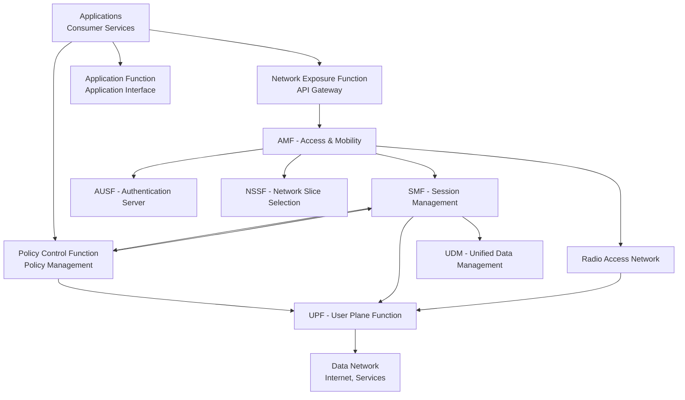
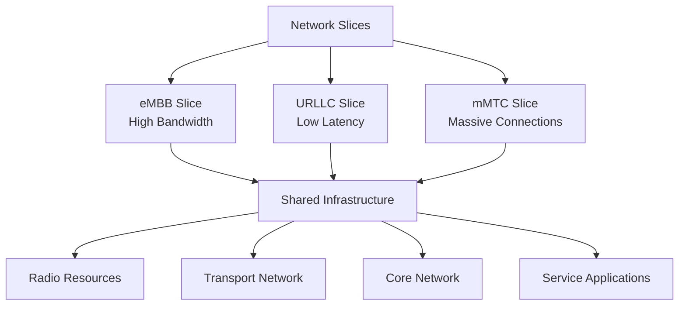
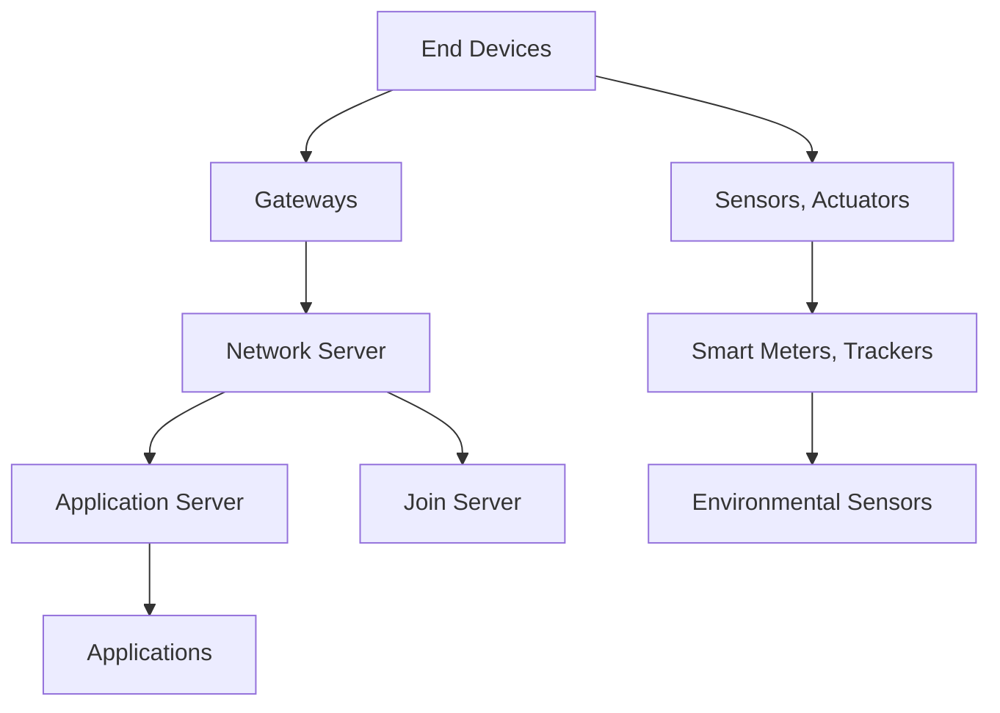
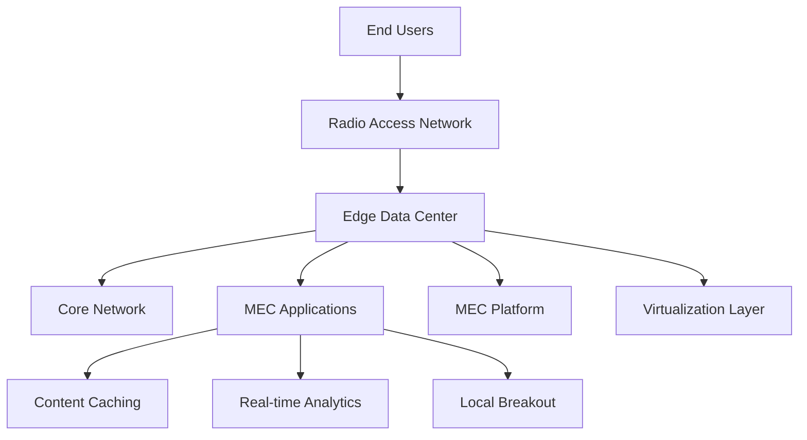
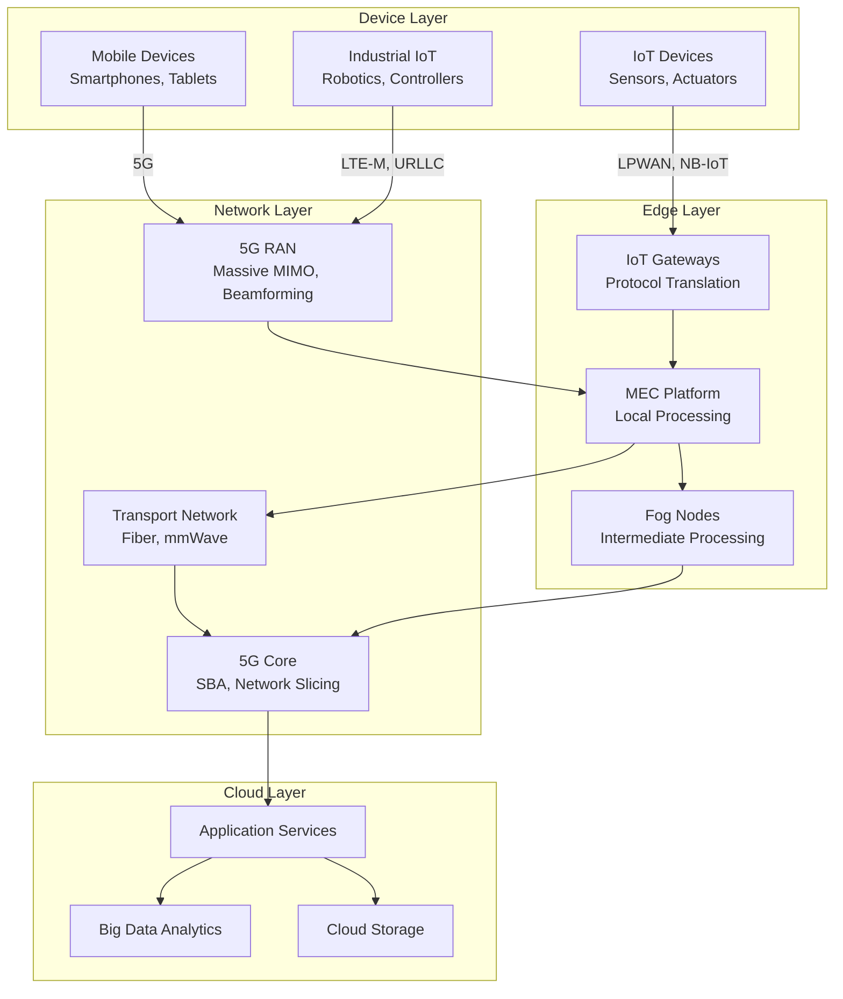
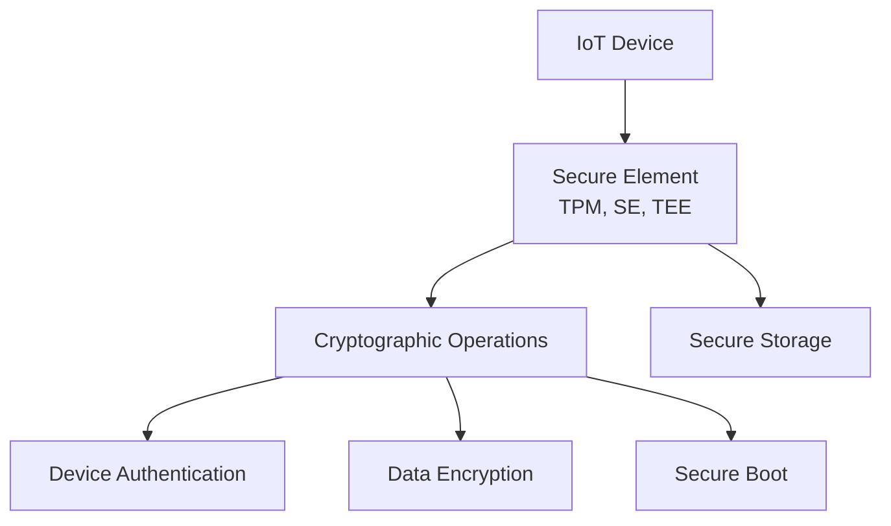

# 5G Networking, IoT, and Edge Computing

5G, IoT, and edge computing represent the convergence of high-speed wireless connectivity, massive device connectivity, and distributed computing. This combination enables real-time responsive applications, pervasive connectivity, and intelligent processing at the network edge.

## 5G Network Architecture

### Service-Based Architecture (SBA)

5G adopts a cloud-native approach with microservices:



### Key Network Functions

| Function | Purpose                        | Key Responsibilities                   |
| -------- | ------------------------------ | -------------------------------------- |
| **AMF**  | Access and mobility management | Registration, authentication, mobility |
| **SMF**  | Session management             | PDU sessions, IP address allocation    |
| **UPF**  | User plane                     | Packet routing, QoS enforcement        |
| **PCF**  | Policy control                 | QoS policies, access control           |
| **AUSF** | Authentication                 | Primary authentication                 |
| **UDM**  | User data                      | Subscriber data, SIM management        |
| **NRF**  | Network repository function    | Service discovery                      |

## 5G Performance Characteristics

### Three Service Categories

**eMBB (Enhanced Mobile Broadband):**
- Peak data rates: 20 Gbps (downlink)
- User experienced data rates: 100 Mbps+
- Use cases: High-definition video, AR/VR, cloud gaming

**URLLC (Ultra-Reliable Low Latency Communications):**
- Latency: < 1ms end-to-end
- Reliability: 99.999% availability
- Jitter: < 1μs
- Use cases: Autonomous vehicles, industrial robotics

**mMTC (Massive Machine Type Communications):**
- Connection density: 1 million devices/km²
- Device cost: ~$1-5 per module
- Battery life: 10+ years
- Use cases: Smart cities, agriculture, asset tracking

## Network Slicing

### End-to-End Network Isolation



### Slice Management Architecture

**NSSMF (Network Slice Subnet Management Function):**
```yaml
NSSMF Responsibilities:
├── RAN slice subnet management
├── Transport slice subnet management
├── Core slice subnet management
├── Resource orchestration
└── Lifecycle management
```

## IoT Connectivity Technologies

### LPWAN Technologies

**LoRaWAN Architecture:**


### NB-IoT vs LTE-M

| Technology | Frequency Bands    | Data Rates  | Coverage             | Power Consumption     |
| ---------- | ------------------ | ----------- | -------------------- | --------------------- |
| **NB-IoT** | Licensed LTE bands | 20-250 kbps | 164 dB coupling loss | Ultra low (10+ years) |
| **LTE-M**  | Licensed LTE bands | 1 Mbps      | 155 dB coupling loss | Low (2-10 years)      |

## Edge Computing Architecture

### MEC (Multi-access Edge Computing)



### Edge Computing Benefits

**Reduced Latency:**
- Processing closer to users
- Real-time response capabilities
- Bandwidth optimization

**Data Sovereignty:**
- Local data processing
- Privacy compliance
- Reduced core network load

**Reliability:**
- Network resilience
- Local failover capabilities
- Independent operation

## Integration of 5G, IoT, and Edge Computing

### Converged Network Architecture



## Network Slicing for IoT

### Service-Specific Slices

**Smart City Slice:**
```yaml
Characteristics:
├── Uplink: 100 kbps
├── Downlink: 200 kbps
├── Latency: < 100ms
├── Reliability: 99.9%
└── Energy Efficiency: High
```

**Industrial Automation Slice:**
```yaml
Characteristics:
├── URLLC requirements
├── Latency: < 5ms
├── Reliability: 99.999%
├── Bandwidth: Variable
└── Deterministic networking
```

### Slice Lifecycle Management

**NSMF (Network Slice Management Function):**
```yaml
Slice Lifecycle:
├── Preparation: Resource allocation
├── Commissioning: Service activation
├── Operation: Performance monitoring
├── Decommissioning: Resource cleanup
│
└── Performance metrics:
    ├── Latency
    ├── Bandwidth utilization
    ├── Packet loss
    ├── Slice isolation
```

## Security in 5G IoT Edge Networks

### End-to-End Security Architecture

**SUPI (Subscription Permanent Identifier):**
```yaml
Permanent identifiers for device authentication:
├── Never transmitted in cleartext
├── Cryptographically protected
└── Used for key generation
```

### Edge Security Considerations

**Secure Element Integration:**


### Zero Trust for IoT

**Continuous Authentication:**
- Device identity verification
- Location-based access control
- Behavioral anomaly detection
- Firmware integrity checking

## Use Cases and Applications

### Smart Cities

**Infrastructure Monitoring:**
- Traffic management with adaptive signaling
- Environmental quality sensing
- Waste management optimization
- Public safety and security systems

### Industrial IoT (IIoT)

**Manufacturing Automation:**
```yaml
Industry 4.0 Requirements:
├── Real-time control loops
├── High-reliability connectivity
├── Deterministic latency
└── Cyber-physical system integration
```

### Healthcare and Telemedicine

**Remote Patient Monitoring:**
- Continuous vital sign transmission
- AI-powered anomaly detection
- Emergency response coordination
- Telemedicine consultations

### Autonomous Vehicles

**V2X Communication:**
```yaml
Vehicle-to-Everything requirements:
├── Ultra-low latency (< 3ms)
├── High reliability (> 99.999%)
├── Positioning accuracy (< 5cm)
└── Bandwidth: Variable based on needs
```

## Performance Metrics and KPIs

### 5G Network KPIs

**RAN Metrics:**
- Throughput: 20 Gbps peak, 100 Mbps experienced
- Latency: < 5ms for eMBB, < 1ms for URLLC
- Connection density: 1 million devices/km²
- Coverage: 100% indoor/outdoor

### IoT Performance Metrics

**Connectivity Metrics:**
- Packet Delivery Ratio: > 99%
- Latency statistics
- Energy efficiency (messages per Joule)
- Network lifetime prediction

### Edge Computing Metrics

**Processing Metrics:**
- Response time improvement
- Bandwidth reduction percentage
- Computational resource utilization
- Service level agreement compliance

## Challenges and Solutions

### Network Slicing Complexity

**Management Challenges:**
- Resource allocation optimization
- Interference management across slices
- Quality of service guarantees

**Solutions:**
- AI/ML for resource management
- Intent-based slice creation
- Automated orchestration

### IoT Security at Scale

**Device Management:**
- Zero-touch provisioning
- Firmware update mechanisms
- Certificate lifecycle management
- Secure device decommissioning

### Edge Resource Management

**Resource Constraints:**
- Limited computing resources
- Power consumption optimization
- Thermal management
- Network bandwidth economics

The convergence of 5G, IoT, and edge computing creates unprecedented opportunities for innovation. By bringing intelligence and processing closer to end devices, these technologies enable responsive, efficient, and secure applications that will transform industries and society.
