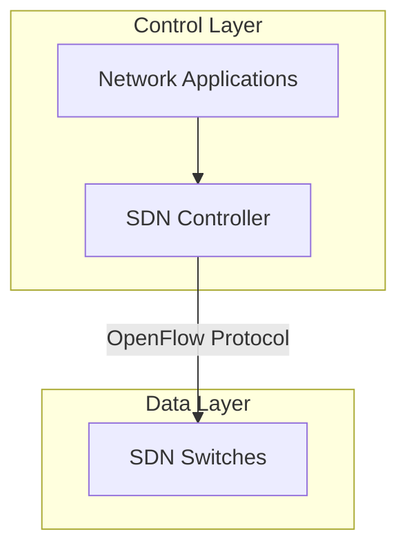
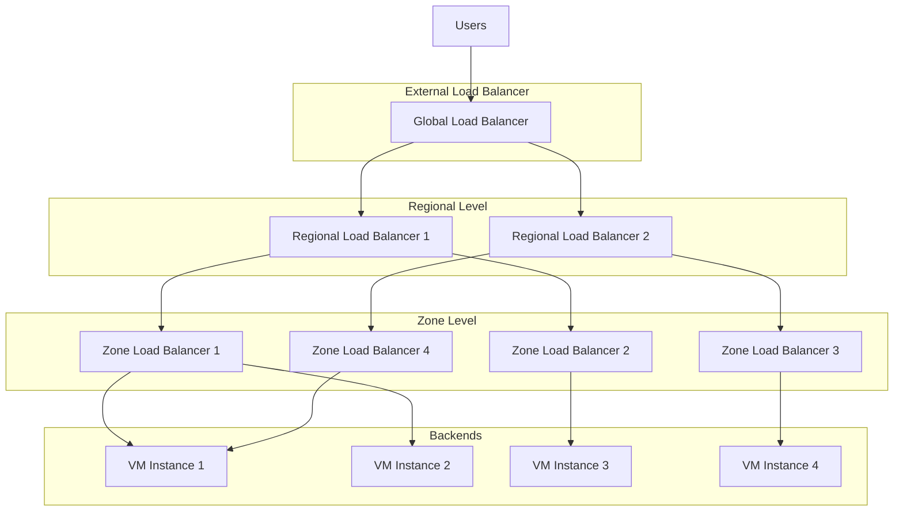
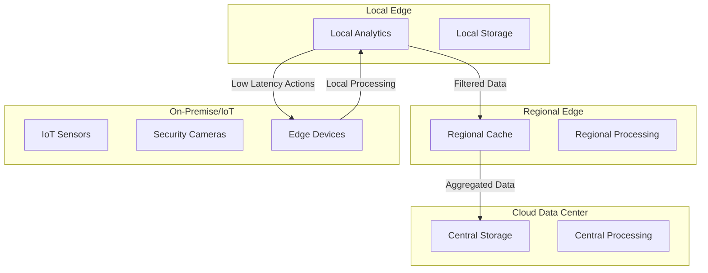

# Wireless & Cloud Networking

This section explores the evolution of networking beyond traditional wired infrastructure, covering wireless communication standards, mobile networking technologies, cloud networking patterns, and the intersection of networking with distributed computing. As networks become more wireless, software-defined, and cloud-oriented, understanding these technologies is crucial for modern network engineers and architects.

## Overview

Wireless and cloud networking represents the cutting edge of network technology, enabling flexible, scalable, and ubiquitous connectivity. From wireless local area networks to global mobile networks, these technologies support the distributed, mobile nature of modern computing. Cloud networking fundamentally changes how we think about network boundaries, while edge computing pushes processing closer to data sources.

The topics covered in this section demonstrate how networking has evolved from wired-only, hardware-centric infrastructure to software-defined, cloud-integrated systems that support mobility and distributed computing patterns.

## Wireless LAN Technologies

### Wi-Fi Standards Evolution

Wi-Fi standards have continuously improved speed, range, and capabilities to meet growing wireless networking demands:

**802.11 Standards Timeline:**
- **802.11 (1997)**: 2 Mbps, 2.4 GHz, primordial Wi-Fi
- **802.11a (1999)**: 54 Mbps, 5 GHz, first in 5 GHz band
- **802.11g (2003)**: 54 Mbps, 2.4 GHz, backward compatible with b
- **802.11n (2009)**: 150-600 Mbps, MIMO technology, 2.4/5 GHz
- **802.11ac (2013)**: Up to 1.3 Gbps, 5 GHz only, wave 2 improvements
- **802.11ax (Wi-Fi 6, 2019)**: 10 Gbps theoretical, OFDMA, improved efficiency

```mermaid
graph LR
    subgraph Frequency Bands
        A[2.4 GHz] -->|Legacy, crowded| B[High interference]
        C[5 GHz] -->|Better performance| D[Less interference]
        E[6 GHz] -->|Wi-Fi 6E|x F[Massive bandwidth]
    end

    subgraph Key Technologies
        G[MIMO] --> H[Spatial multiplexing]
        I[OFDMA] --> J[Multi-user efficiency]
        K[Beamforming] --> L[Targeted signals]
    end
```

### Wireless Security Evolution

Security mechanisms have evolved alongside wireless standards:

**Security Methods:**
- **WEP (Wired Equivalent Privacy)**: Original standard, highly insecure
- **WPA (Wi-Fi Protected Access)**: TKIP encryption, well-intentioned but flawed
- **WPA2 (802.11i)**: AES-CCMP encryption, industry standard for years
- **WPA3**: Stronger encryption, forward secrecy, improved authentication

**Enterprise Security:**
- **802.1X/EAP**: RADIUS authentication framework
- **PEAP (Protected EAP)**: Tunneled authentication
- **EAP-TLS**: Certificate-based mutual authentication

## Mobile Networking & 5G

### Mobile Network Generations

Each generation brought transformative improvements:

**2G (GSM/CDMA):**
- Digital voice, SMS
- 9.6-14.4 Kbps data

**3G (UMTS/EVDO):**
- Broadband data
- Video calling, mobile internet
- 384 Kbps - 2 Mbps

**4G LTE:**
- High-speed data, low latency
- Foundation for mobile computing
- 100 Mbps - 1 Gbps

**5G Technologies:**
- **eMBB (Enhanced Mobile Broadband)**: Massive bandwidth
- **URLLC (Ultra-Reliable Low Latency)**: Industrial IoT, autonomous vehicles
- **mMTC (Massive Machine Type Communications)**: IoT connectivity

### 5G Architecture Components

```mermaid
graph TB
    subgraph UE[User Equipment]
        Smartphone
        IoT Device
        Vehicle
    end

    subgraph Access Network
        gNB[gNB Base Station]
        RRU[Remote Radio Unit]
        BBU[Baseband Unit]
    end

    subgraph Core Network
        AMF[Access & Mobility Management]
        SMF[Session Management]
        UPF[User Plane Function]
        PCF[Policy Control]
        AUSF[Authentication Server]
    end

    UE -- Radio Interface -- gNB
    gNB -- Fronthaul -- BBU
    BBU -- Midhaul -- Access Network
    Access Network -- Backhaul -- Core Network
```

### 5G Key Innovations

- **Network Slicing**: Independent virtual networks for different use cases
- **Edge Computing Integration**: Low-latency processing at network edge
- **Massive MIMO**: Hundreds of antenna elements for capacity gains
- **Beamforming**: Focused signal transmission for efficiency

## Software-Defined Networking (SDN)

### SDN Architecture

SDN decouples control and data planes:



### SDN Components

- **Northbound Interfaces**: APIs for applications and services
- **Southbound Interfaces**: Protocols for controlling network devices (primarily OpenFlow)
- **East-West Interfaces**: Communication between controllers
- **Management Interfaces**: Configuration and monitoring

### SDN Benefits

- **Centralized Control**: Programmatic network management
- **Network Programmability**: Automated configuration and optimization
- **Vendor Independence**: Standard protocols across hardware
- **Rapid Innovation**: Faster feature deployment

## Cloud Networking Patterns

### Cloud Network Architectures

**Virtual Private Cloud (VPC) Design Patterns:**

- **Hub-and-Spoke**: Centralized connectivity with branch offices
- **Mesh Networks**: Full interconnectivity between VPCs
- **Transit Gateway**: Scalable hub for multiple VPCs

**Multi-Cloud Connectivity:**
- **Inter-Cloud Peering**: Direct connections between cloud providers
- **Hybrid Cloud**: Connection between private data centers and public clouds
- **Cloud Connector**: VPN-based connectivity for remote offices

### Cloud Load Balancing



### Container Networking in Cloud

**Container Network Interface (CNI) Patterns:**
- **Bridge Mode**: Containers connect via virtual bridges
- **Overlay Networks**: VXLAN-based multi-host connectivity
- **Host Networking**: Direct host interface access for containers

## Edge Computing & IoT Networking

### Edge Computing Architecture

Edge computing distributes processing closer to data sources:



### IoT Network Protocols

**Constrained Application Protocol (CoAP):**
- HTTP-like for constrained devices
- UDP-based, built for efficiency
- Observe pattern for pub/sub messaging

**MQTT (Message Queuing Telemetry Transport):**
```text
PUBLISH topic: sensors/temperature, payload: {"value": 22.5, "unit": "C"}
PUBLISH topic: actuators/led, payload: {"state": "on", "color": "red"}
```

**LPWAN Technologies:**
- **LoRaWAN**: Long-range, low-power for IoT applications
- **NB-IoT**: Cellular-based IoT connectivity
- **Sigfox**: Ultra-narrowband for simple sensors

### Edge Infrastructure Challenges

- **Security at Scale**: Protecting distributed infrastructure
- **Data Privacy**: Processing sensitive data at edge locations
- **Network Connectivity**: Ensuring reliable edge-to-cloud connectivity
- **Resource Constraints**: Limited power and processing capabilities
- **Management Complexity**: Orchestrating distributed systems

## Emerging Technologies

### Wi-Fi 7 (802.11be)

Next-generation wireless standard:

- **4.8 Gbps theoretical speed**
- **Multi-link operation**: Simultaneous connections on multiple bands
- **Enhanced QoS**: Better support for latency-sensitive applications
- **Improved efficiency**: 46% higher throughput in dense environments

### Open Radio Access Network (ORAN)

Virtualized, disaggregated RAN architecture:

- **Open Interfaces**: Standardized APIs between network components
- **Multi-Vendor Support**: Mix and match equipment from different vendors
- **Cloud-Native**: Containerized network functions
- **AI/ML Integration**: Smart radio resource management

### Cloud-Edge Continuum

Integrated computing paradigm:

- **Seamless Services**: Applications span cloud and edge seamlessly
- **Distributed Applications**: Microservices deployed across locations
- **Unified Management**: Single control plane for hybrid infrastructure

## Best Practices

### Wireless Network Design

- **Site Surveys**: RF analysis to optimize access point placement
- **Channel Planning**: Minimize co-channel interference
- **Capacity Planning**: Account for concurrent users and applications
- **Security Zoning**: Guest networks, employee separation

### Cloud Network Configuration

- **Microsegmentation**: Zero-trust network segmentation in cloud
- **Hybrid Integration**: Secure connectivity between cloud and on-premise
- **Cost Optimization**: Efficient resource utilization and traffic routing
- **Compliance**: Data residency and regulatory requirements

### Edge Deployment Considerations

- **Latency Requirements**: Match computing to application needs
- **Connectivity Reliability**: Redundant paths and failover mechanisms
- **Security Posture**: Protect edge devices and data in transit
- **Lifecycle Management**: Update and patch distributed infrastructure

Wireless and cloud networking technologies are fundamentally reshaping how we design, deploy, and manage network infrastructure. These technologies enable the flexible, distributed computing paradigms required for modern applications while maintaining the performance, security, and reliability standards essential for business and mission-critical operations.


