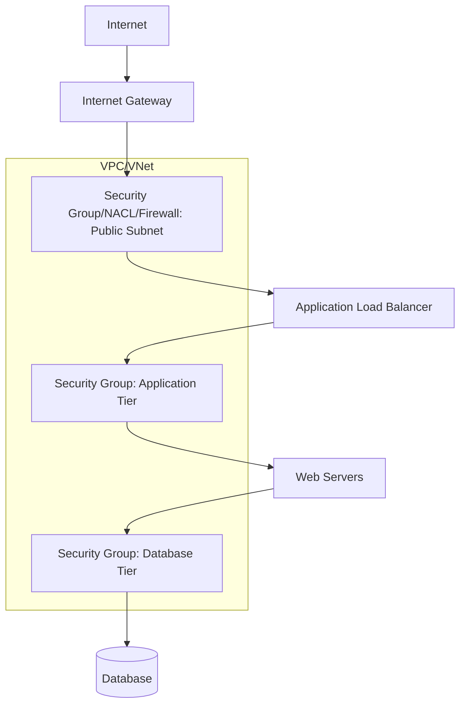
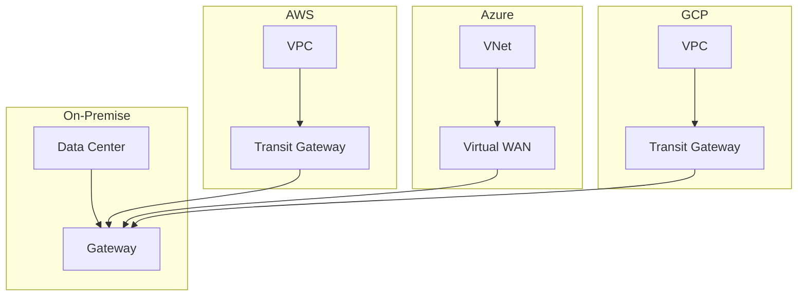

# Cloud Networking

Cloud networking provides virtualized network infrastructure that enables scalable, secure, and flexible connectivity for cloud workloads. This guide covers fundamental concepts and implementation across major cloud platforms: AWS VPC, GCP VPC, and Azure Virtual Network.

## Fundamental Concepts

### Virtual Private Cloud (VPC)

A **VPC** is a logically isolated section of the cloud platform where you can launch resources in a virtual network that you define. VPCs provide complete control over the virtual networking environment.

**Key Characteristics:**
- **Isolated**: Network traffic is isolated from other VPCs and public internet by default
- **Configurable**: Customizable IP address ranges, subnets, and routing tables
- **Scalable**: Dynamic allocation and deallocation of resources
- **Secure**: Built-in security groups and network access control lists (ACLs)

### Subnets

**Subnets** are subdivisions of a VPC's IP address range that allow segmentation of the network. They enable grouping resources based on security requirements, application tiers, or organizational boundaries.

**Types of Subnets:**
- **Public Subnets**: Accessible from the internet via Internet Gateway
- **Private Subnets**: Not accessible from the internet (but can access outbound via NAT Gateway)
- **Protected Subnets**: Additional security layers for sensitive workloads

### Routing Tables

**Route tables** contain rules (routes) that determine where network traffic is directed. Each subnet in a VPC must be associated with a route table.

**Common Route Types:**
- **Local routes**: Traffic within the VPC
- **Internet Gateway**: Access to public internet
- **NAT Gateway**: Outbound internet access for private subnets
- **Virtual Private Gateway**: VPN or Direct Connect connections
- **Peering connections**: Traffic between peered VPCs
- **Transit Gateway**: Centralized routing for complex architectures

## AWS VPC (Amazon Web Services)

### AWS VPC Components

#### VPC Creation
```bash
# Create VPC with CIDR block
aws ec2 create-vpc --cidr-block 10.0.0.0/16 --tag-specifications 'ResourceType=vpc,Tags=[{Key=Name,Value=my-vpc}]'

# Output: vpc-12345678
```

#### Subnets
```bash
# Create public subnet
aws ec2 create-subnet --vpc-id vpc-12345678 --cidr-block 10.0.1.0/24 --availability-zone us-east-1a

# Create private subnet
aws ec2 create-subnet --vpc-id vpc-12345678 --cidr-block 10.0.2.0/24 --availability-zone us-east-1a
```

#### Internet Gateway
```bash
# Create and attach Internet Gateway
aws ec2 create-internet-gateway
aws ec2 attach-internet-gateway --internet-gateway-id igw-12345678 --vpc-id vpc-12345678
```

#### NAT Gateway
```bash
# Create NAT Gateway in public subnet
aws ec2 create-nat-gateway --subnet-id subnet-12345678 --allocation-id eip-12345678
```

### AWS Security Features

#### Security Groups
```bash
# Create security group
aws ec2 create-security-group --group-name web-server --description "Web server access" --vpc-id vpc-12345678

# Add inbound rules
aws ec2 authorize-security-group-ingress --group-id sg-12345678 --protocol tcp --port 80 --cidr 0.0.0.0/0
aws ec2 authorize-security-group-ingress --group-id sg-12345678 --protocol tcp --port 443 --cidr 0.0.0.0/0
```

#### Network ACLs
```bash
# Create NACL
aws ec2 create-network-acl --vpc-id vpc-12345678

# Add rules (rule numbers determine evaluation order)
aws ec2 create-network-acl-entry --network-acl-id acl-12345678 --rule-number 100 --protocol tcp --port-range From=80,To=80 --cidr-block 0.0.0.0/0 --rule-action allow
```

### AWS Advanced Networking

#### VPC Peering
```bash
# Create VPC peering connection
aws ec2 create-vpc-peering-connection --vpc-id vpc-requester --peer-vpc-id vpc-accepter

# Accept peering connection
aws ec2 accept-vpc-peering-connection --vpc-peering-connection-id pcx-12345678
```

#### Transit Gateway
```bash
# Create Transit Gateway
aws ec2 create-transit-gateway

# Attach VPC to Transit Gateway
aws ec2 create-transit-gateway-vpc-attachment --transit-gateway-id tgw-12345678 --vpc-id vpc-12345678
```

## GCP VPC (Google Cloud Platform)

### GCP VPC Components

#### VPC Networks
```bash
# Create VPC network
gcloud compute networks create my-network --subnet-mode custom

# Create subnet
gcloud compute networks subnets create my-subnet --network my-network --range 10.0.1.0/24 --region us-central1
```

#### Firewall Rules
```bash
# Create firewall rules (GCP's security groups equivalent)
gcloud compute firewall-rules create allow-http --network my-network --allow tcp:80 --source-ranges 0.0.0.0/0

# More specific rules
gcloud compute firewall-rules create allow-ssh --network my-network --allow tcp:22 --source-ranges 192.168.1.0/24 --target-tags ssh-access
```

### GCP Unique Features

#### Shared VPC
```bash
# Create Shared VPC (requires organization-level setup)
gcloud compute shared-vpc enable [HOST_PROJECT_ID]

# Associate service project
gcloud compute shared-vpc associated-projects add [SERVICE_PROJECT_ID] --host-project [HOST_PROJECT_ID]
```

#### VPC Service Controls
```bash
# Create VPC Service Controls perimeter
gcloud access-context-manager perimeters create my-perimeter --policy [POLICY_ID] --resources projects/[PROJECT_NUMBER] --restricted-services=storage.googleapis.com,bigquery.googleapis.com
```

#### Cloud Router & NAT
```bash
# Create Cloud Router
gcloud compute routers create my-router --network my-network --asn 65001 --region us-central1

# Create Cloud NAT
gcloud compute routers nats create my-nat --router my-router --nat-external-ip-pool [IP_RANGE] --nat-all-subnet-ip-ranges --enable-logging
```

## Azure Virtual Network

### Azure VNets Components

#### Virtual Networks
```powershell
# Create virtual network
New-AzVirtualNetwork -Name 'myVnet' -ResourceGroupName 'myRG' -Location 'EastUS' -AddressPrefix '10.0.0.0/16'

# Create subnets
$subnetConfig = New-AzVirtualNetworkSubnetConfig -Name 'mySubnet' -AddressPrefix '10.0.1.0/24'
Add-AzVirtualNetworkSubnetConfig -Name 'mySubnet2' -AddressPrefix '10.0.2.0/24' -VirtualNetwork $vnet
```

#### Network Security Groups (NSGs)
```powershell
# Create NSG
$nsg = New-AzNetworkSecurityGroup -ResourceGroupName 'myRG' -Location 'EastUS' -Name 'myNSG'

# Add rules
$nsg | Add-AzNetworkSecurityRuleConfig -Name 'Allow-HTTP' -Access 'Allow' -Protocol 'Tcp' -Direction 'Inbound' -Priority 100 -SourceAddressPrefix 'Internet' -SourcePortRange '*' -DestinationAddressPrefix '*' -DestinationPortRange 80
$nsg | Set-AzNetworkSecurityGroup
```

### Azure Advanced Features

#### Virtual Network Peering
```powershell
# Create VNet peering
Add-AzVirtualNetworkPeering -Name 'Peer01To02' -VirtualNetwork $vnet1 -RemoteVirtualNetworkId $vnet2.Id -AllowForwardedTraffic -AllowGatewayTransit
Add-AzVirtualNetworkPeering -Name 'Peer02To01' -VirtualNetwork $vnet2 -RemoteVirtualNetworkId $vnet1.Id -AllowForwardedTraffic -UseRemoteGateways
```

#### Azure Firewall
```powershell
# Create Azure Firewall
$Azfw = New-AzFirewall -Name 'myAzureFirewall' -ResourceGroupName 'myRG' -Location 'EastUS' -VirtualNetworkName 'myVnet' -PublicIpName 'myPublicIP'

# Configure application rules
$AppRule = New-AzFirewallApplicationRule -Name 'Allow-Google' -SourceAddress '10.0.1.0/24' -Protocol 'http:80','https:443' -TargetFqdn 'google.com'
$AppRuleCollection = New-AzFirewallApplicationRuleCollection -Name 'MyAppRuleCollection' -Priority 100 -Rule $AppRule -ActionType 'Allow'
$Azfw.ApplicationRuleCollections = $AppRuleCollection
Set-AzFirewall -AzureFirewall $Azfw
```

## Cross-Platform Comparison

| Feature               | AWS VPC                 | GCP VPC              | Azure VNet            |
| --------------------- | ----------------------- | -------------------- | --------------------- |
| **CIDR Support**      | Flexible                | Flexible             | Flexible              |
| **Subnets**           | Regional                | Regional             | Regional + Global     |
| **Security**          | Security Groups + NACLs | Firewall Rules       | NSGs                  |
| **Peering**           | VPC Peering             | VPC Network Peering  | VNet Peering          |
| **Global Networking** | Transit Gateway         | Global VPCs          | Virtual WAN           |
| **Firewall**          | Security Groups         | VPC Firewall         | Azure Firewall + NSGs |
| **Load Balancing**    | ELB/ALB                 | Cloud Load Balancing | Load Balancer         |
| **VPN**               | VPN Gateway             | Cloud VPN            | VPN Gateway           |

### Connectivity Options

#### VPN Connections
```bash
# AWS Site-to-Site VPN
aws ec2 create-vpn-connection --type ipsec.1 --customer-gateway-id cgw-12345678 --vpn-gateway-id vgw-12345678
```

```bash
# GCP Cloud VPN
gcloud compute vpn-tunnels create my-tunnel --peer-address 192.168.1.1 --shared-secret my-secret --local-traffic-selector 0.0.0.0/0 --remote-traffic-selector 10.0.0.0/16 --ike-version 2 --region us-central1
```

```powershell
# Azure VPN Gateway
New-AzVpnSite -ResourceGroupName 'myRG' -Name 'myVPNSite' -Location 'EastUS' -IPAddress '192.168.1.1' -VirtualWanId $virtualWan.Id -DeviceModel 'MyDevice' -DeviceVendor 'MyCompany'
```

#### Direct Connect (Dedicated Connections)
- **AWS Direct Connect**: 1Gbps, 10Gbps, 100Gbps speeds
- **GCP Dedicated Interconnect**: 10Gbps or 100Gbps circuits
- **Azure ExpressRoute**: 50Mbps to 100Gbps dedicated bandwidth

## Network Segmentation and Security

### Micro-Segmentation



### Best Practices

#### Isolation
- Use separate VPCs/VNets for different environments (dev, staging, prod)
- Implement network segmentation within VPCs using subnets
- Apply least-privilege security rules

#### Security
- Enable VPC Flow Logs (AWS), VPC Flow Logs (GCP), NSG Flow Logs (Azure)
- Use encryption for data in transit and at rest
- Implement network monitoring and alerting

#### High Availability
- Design across multiple availability zones/regions
- Use redundant gateways and load balancers
- Implement automatic failover mechanisms

### Compliance and Governance

#### Tag-Based Organization
```bash
# AWS resource tagging
aws ec2 create-tags --resources i-12345678 --tags Key=Environment,Value=Production Key=Owner,Value=DevOps
```

#### Policy Enforcement
```json
{
  "Version": "2012-10-17",
  "Statement": [
    {
      "Effect": "Deny",
      "Action": "ec2:CreateVpc",
      "Resource": "*",
      "Condition": {
        "StringNotEquals": {
          "aws:PrincipalArn": "arn:aws:iam::123456789012:user/NetworkAdmin"
        }
      }
    }
  ]
}
```

## Hybrid Cloud Networking

### Cloud-Edge Integration

**Edge Computing Integration:**
- IoT gateway connectivity
- CDNs integration
- Branch office connections

### Multi-Cloud Architectures



## Monitoring and Troubleshooting

### Network Monitoring

#### AWS CloudWatch Metrics
```bash
# Monitor VPC metrics
aws cloudwatch get-metric-statistics --namespace AWS/EC2 --metric-name NetworkIn --start-time 2023-01-01T00:00:00Z --end-time 2023-01-02T00:00:00Z --period 3600 --statistics Maximum
```

#### Azure Monitor
```powershell
# Query NSG flow logs
Get-AzNetworkWatcherFlowLog -NetworkWatcherName 'myNW' -ResourceGroupName 'myRG' -Name 'myFlowLog'
```

### Common Issues and Solutions

**Common Networking Problems:**
- **Connectivity Issues**: Verify route tables and security groups
- **Performance Problems**: Check network ACLs and subnet configurations
- **Security Violations**: Review firewall rules and peering connections
- **DNS Resolution**: Ensure DNS configurations are correct

**Diagnostic Tools:**
- AWS: VPC Reachability Analyzer
- GCP: Network Intelligence Center
- Azure: Network Watcher

## Cost Optimization

### Reserved Instances vs On-Demand
- Reserve capacity for steady-state workloads
- Use on-demand for variable traffic

### Data Transfer Costs
- Minimize cross-region and cross-zone traffic
- Use edge locations and CDNs strategically

### Resource Right-Sizing
- Monitor utilization and scale appropriately
- Use auto-scaling groups for dynamic workloads

## Summary

Cloud networking provides powerful abstractions for network infrastructure management:

- **AWS VPC** excels with comprehensive feature set and enterprise integrations
- **GCP VPC** offers global networking and managed service simplicity
- **Azure Virtual Network** provides deep Windows integration and hybrid connectivity

Key design principles remain consistent across platforms:
- **Isolation** through virtual networks and subnets
- **Security** via layered controls and micro-segmentation
- **Scalability** through dynamic resource allocation
- **Resilience** via redundant architectures and automated failover

Select the platform that best aligns with your existing infrastructure, operational preferences, and business requirements while designing networks that support growth and maintain security postures appropriate for your workloads.
