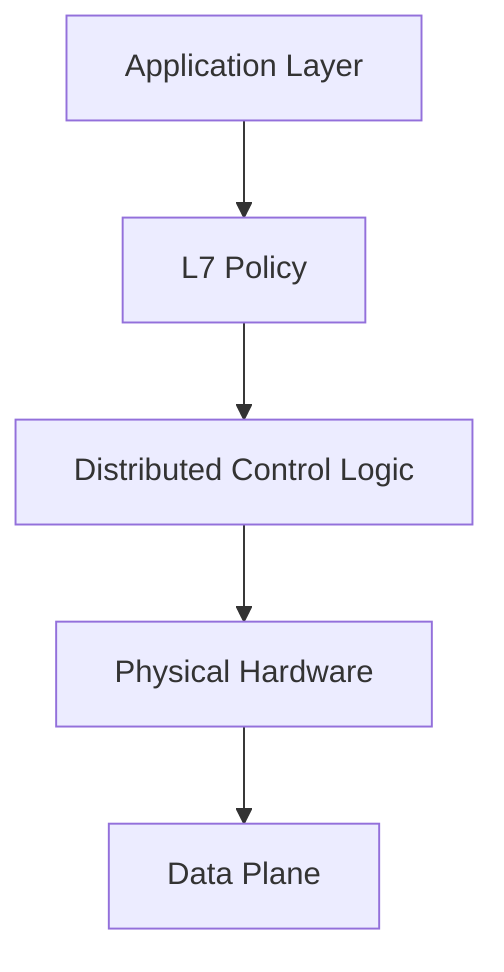
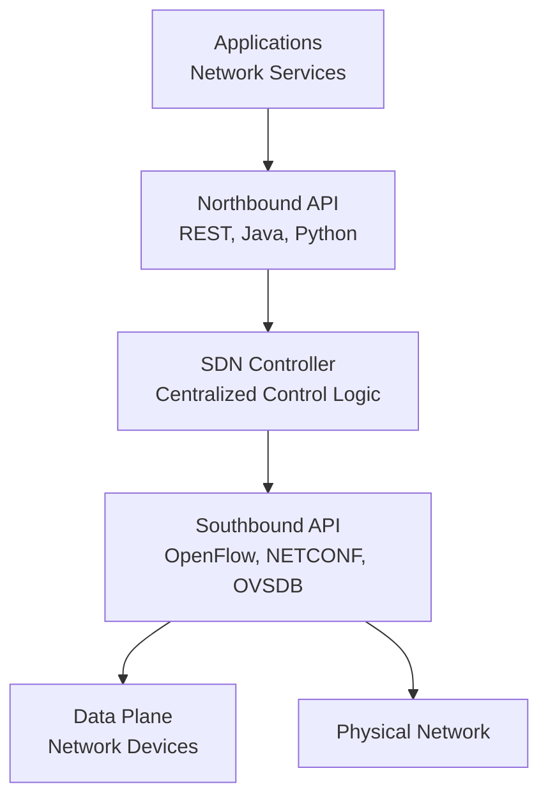
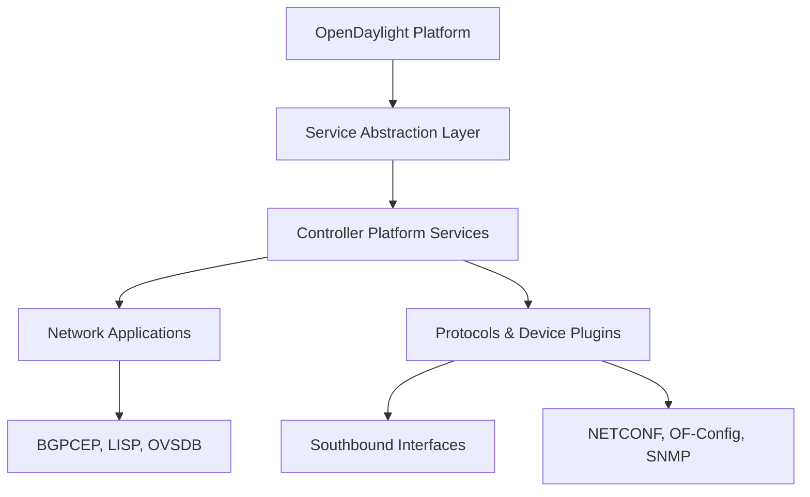
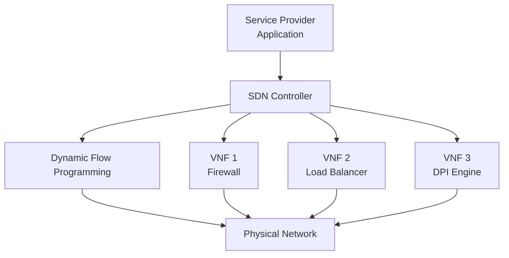
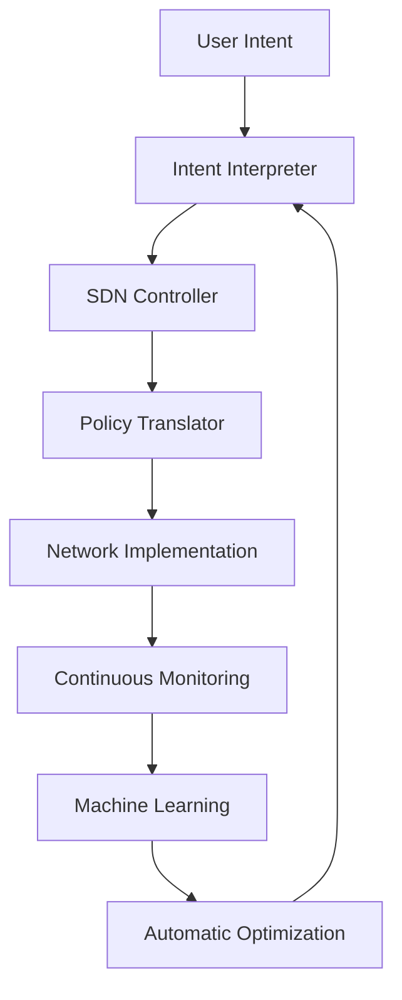

# SDN (Software Defined Networking)

SDN separates the network control plane from the data plane, enabling centralized network management and programmatic control. It abstracts network intelligence from underlying hardware, making networks more flexible and application-aware.

## SDN Architecture

### Traditional vs SDN Networks

**Traditional Networking:**


**SDN Architecture:**


### Three-Plane Architecture

**Control Plane:** Makes decisions about where traffic is sent
**Data Plane:** Forwards traffic based on control plane decisions
**Management Plane:** Monitors and configures network devices

## OpenFlow Protocol

### Flow Table Entry Structure

OpenFlow defines how flows are processed through match-action rules:

```yaml
# OpenFlow 1.3 Flow Entry
Flow Entry:
  Priority: 1000
  Match:
    - Input Port: 1
    - Ethernet Source: 00:11:22:33:44:55
    - IP Destination: 192.168.1.1
    - IP Protocol: 6 (TCP)
    - TCP Destination Port: 80
  Instructions:
    - Apply Actions:
      - Output Port: 2
    - Meter: Rate Limit (1000 packets/sec)
  Counters:
    - Packet Count: 1500
    - Byte Count: 120000
  Timeouts:
    - Idle Timeout: 60 seconds
    - Hard Timeout: 300 seconds
    - Cookie: Flow Identifier
```

### OpenFlow Switch Components

**Flow Table:** Contains flow entries with match criteria and actions
**Group Table:** Enables more complex forwarding (multicast, failover)
**Meter Table:** Implements QoS and rate limiting
**Controller Connection:** Secure channel to SDN controller

### Typical OpenFlow Actions

```yaml
Actions:
- Output: Send packet to specified port(s)
- Drop: Discard packet
- Modify-Field: Change header fields (VLAN, MPLS, etc.)
- Group: Send to group table processing
- Meter: Rate limit packet
- Queue: Queue packet for QoS processing
```

## SDN Controllers

### ONOS (Open Network Operating System)

```bash
# ONOS Architecture
Controller Components:
├── Network Graph: Device and link management
├── Intent Framework: High-level policies
├── Distributed Core: Multi-instance clustering
├── REST API: Northbound interface
└── OpenFlow Driver: Southbound protocol
```

**ONOS Features:**
- Distributed architecture for scale
- Intent-based networking
- Path computation optimization
- Network function virtualization support

### OpenDaylight

**Platform Components:**


### Ryu Controller

**Python-based SDN Framework:**
```python
from ryu.base import app_manager
from ryu.controller import ofp_event
from ryu.controller.handler import CONFIG_DISPATCHER, MAIN_DISPATCHER
from ryu.controller.handler import set_ev_cls
from ryu.ofproto import ofproto_v1_3

class SimpleSwitch13(app_manager.RyuApp):
    OFP_VERSIONS = [ofproto_v1_3.OFP_VERSION]

    @set_ev_cls(ofp_event.EventOFPSwitchFeatures, CONFIG_DISPATCHER)
    def switch_features_handler(self, ev):
        msg = ev.msg
        dp = msg.datapath

        # Install default flow
        ofp_parser = dp.ofproto_parser
        match = ofp_parser.OFPMatch()
        actions = [ofp_parser.OFPActionOutput(ofproto_v1_3.OFPP_CONTROLLER)]
        self.add_flow(dp, 0, match, actions)

    def add_flow(self, datapath, priority, match, actions):
        ofp = datapath.ofproto
        parser = datapath.ofproto_parser

        inst = [parser.OFPInstructionActions(ofp.OFPIT_APPLY_ACTIONS, actions)]
        mod = parser.OFPFlowMod(
            datapath=datapath,
            priority=priority,
            match=match,
            instructions=inst
        )
        datapath.send_msg(mod)
```

## SDN Applications

### Network Function Virtualization (NFV)

**VNF Integration with SDN:**


### Data Center Networking

**SDN in Data Centers:**
- Automated provisioning
- Virtual machine migration
- Load balancing
- Network slicing

### Campus and Enterprise Networks

**Policy-Based Automation:**
```yaml
# Intent-based policy example
Policy: "Finance department gets priority traffic"
  Match: Source IP 10.100.0.0/16
  Action: Queue priority 1, Rate limit 100Mbps

Controller translates intent to:
- Identify Finance department devices
- Configure switches with appropriate QoS
- Implement policy enforcement
- Continuous monitoring and adjustment
```

## SDN Protocols and Standards

### Southbound Protocols

| Protocol     | Description              | Use Case                 |
| ------------ | ------------------------ | ------------------------ |
| **OpenFlow** | Flow programming         | Data plane control       |
| **NETCONF**  | Configuration management | Device configuration     |
| **OVSDB**    | Database synchronization | Open vSwitch control     |
| **PCEP**     | Path computation         | MPLS traffic engineering |

### Northbound Protocols

| Protocol            | Description          | Use Case                |
| ------------------- | -------------------- | ----------------------- |
| **REST**            | HTTP-based API       | Application integration |
| **Python/Java SDK** | Programmatic access  | Custom applications     |
| **Intent APIs**     | Declarative policies | Business logic          |

## SDN Implementation

### Mininet Network Emulation

**Create SDN topology:**
```bash
# Install Mininet and OpenFlow
sudo apt install mininet openvswitch-switch

# Create simple topology with SDN controller
mn --controller=remote,ip=127.0.0.1 --switch ovsk --test pingall
```

**Custom topology:**
```python
#!/usr/bin/env python
from mininet.net import Mininet
from mininet.node import Controller, OVSSwitch
from mininet.cli import CLI

def create_topology():
    net = Mininet(controller=Controller, switch=OVSSwitch)

    # Add controller
    c0 = net.addController('c0')

    # Add switches
    s1 = net.addSwitch('s1')
    s2 = net.addSwitch('s2')

    # Add hosts
    h1 = net.addHost('h1')
    h2 = net.addHost('h2')
    h3 = net.addHost('h3')
    h4 = net.addHost('h4')

    # Create links
    net.addLink(h1, s1)
    net.addLink(h2, s1)
    net.addLink(h3, s2)
    net.addLink(h4, s2)
    net.addLink(s1, s2)

    # Start network
    net.start()
    CLI(net)
    net.stop()

if __name__ == '__main__':
    create_topology()
```

## SDN Security Considerations

### Control Plane Protection

**Secure Controller-Device Communication:**
```yaml
# TLS encryption for control channel
Controller-Switch Security:
- Mutual TLS authentication
- Encrypted control traffic
- Integrity checking with HMAC
```

### DDoS Protection

**SDN-Specific Threats:**
- Controller flooding attacks
- Control channel exhaustion
- Application layer attacks

**Mitigation Strategies:**
```yaml
Defense Mechanisms:
├── Rate limiting on southbound interfaces
├── Controller clustering for redundancy
├── Secure application development practices
└── Network segmentation
```

## SDN Futures and Evolution

### Intent-Based Networking (IBN)

**Cognitive Networking:**


### 5G Network Slicing with SDN

**Network Slicing Architecture:**
- End-to-end isolation
- Dynamic resource allocation
- Service-specific optimization
- Automated scaling

### Cloud-Native SDN

**Kubernetes Network Plugins:**
- CNI (Container Network Interface)
- SDN controller integration
- Service mesh integration
- Multi-cluster networking

SDN represents a fundamental shift in how networks are designed and operated. By separating control and data planes, it enables unprecedented flexibility, automation, and intelligence in network management, paving the way for next-generation network architectures.
