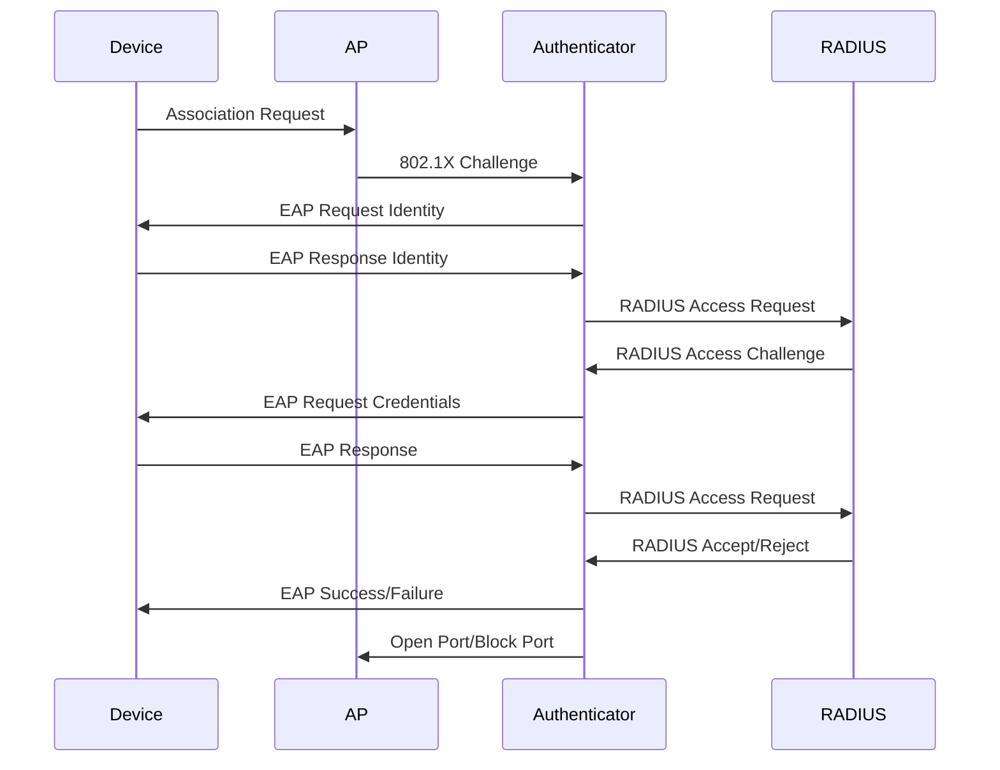

# Wi-Fi Security

Wi-Fi security represents the evolution of protocols designed to protect wireless networks from unauthorized access, eavesdropping, and various attack vectors. From the flawed early WEP system to modern WPA3 standards, Wi-Fi security has matured significantly to address the unique challenges of wireless communication. This document examines the historical progression, current implementations, and best practices for securing wireless networks.

## Historical Evolution of Wi-Fi Security

### WEP (Wired Equivalent Privacy) - 1999

Initiated as part of the original 802.11 standard, WEP aimed to provide "wire-like" security to wireless networks. However, fundamental cryptographic flaws rendered it largely ineffective.

**Key Flaws:**
- **Weak RC4 Implementation:** Used a static 40-bit or 104-bit key
- **No Key Management:** Same encryption key used for all devices
- **IV Collisions:** 24-bit initialization vectors led to key reuse
- **Authentication Bypass:** Open system authentication was trivial

**Cryptographic Weaknesses:**
- RC4 cipher susceptible to known plaintext attacks
- Statistical attacks using AirSnort and WEPCrack tools
- FMS attack could recover keys in minutes with sufficient traffic

**Legacy Impact:**
```bash
# Warning: WEP is completely broken - never use
# This is shown only for historical reference
wep_key = "AB23CD45EF"  # 40-bit key (effectively 24-bit due to IV)
```

### WPA (Wi-Fi Protected Access) - 2003

Released as an interim solution after WEP's failure, WPA introduced dynamic keying and stronger encryption through TKIP (Temporal Key Integrity Protocol).

**Key Improvements:**
- **Dynamic Keys:** TKIP rotates keys for each packet
- **MIC (Message Integrity Code):** Prevents replay and forgery attacks
- **802.1X Authentication:** Support for enterprise authentication

**Technical Details:**
- TKIP: Enhanced RC4 implementation with per-packet key mixing
- PBKDF2: Password-to-key derivation function
- EAP (Extensible Authentication Protocol) integration

**Known Vulnerabilities:**
- Michael attack: Weakness in MIC function (rare in practice)
- Transient exploits in TKIP implementation

## WPA2 (Wi-Fi Protected Access 2) - 2004

The most widely deployed Wi-Fi security standard, using CCMP-AES encryption and providing robust protection for both personal and enterprise networks.

### Personal Mode (WPA2-PSK)

Pre-Shared Key mode for home and small business networks:

```bash
# WPA2-PSK Configuration
security_type = "WPA2"
encryption = "AES"
password = "MyComplexPassphrase123!"
# Derives 256-bit PMK using PBKDF2
```

**Four-Way Handshake Process:**
1. **AP → STA:** Sends ANonce (Master nonces)
2. **STA → AP:** Responds with SNonce (Station nonces)
3. **AP → STA:** Installs unicast key (GTK) encrypted with PTK
4. **STA → AP:** Confirms and installs GTK

### Enterprise Mode (WPA2-Enterprise)

Advanced authentication using 802.1X with RADIUS backend:

```bash
# WPA2-Enterprise Configuration
auth_type = "802.1X"
eap_method = "PEAP"
radius_server = "192.168.1.100:1812"
certificate = "/path/to/ca-cert.pem"
```

**EAP Methods:**
- **PEAP (Protected EAP):** Popular choice with inner authentication (MS-CHAPv2)
- **EAP-TTLS:** Similar to PEAP but with more flexibility
- **EAP-TLS:** Client and server certificates for mutual authentication

**Key Advantages:**
- Individual credentials per user (not shared key)
- Centralized authentication via RADIUS
- Strong cryptographic assurance

## WPA3 (Wi-Fi Protected Access 3) - 2018

Latest generation addressing WPA2's shortcomings, particularly in dictionary attack resistance and forward secrecy.

### WPA3-Personal (SAE - Simultaneous Authentication of Equals)

**Simultaneous Authentication of Equals Protocol:**
- **Password Authenticated Key Exchange (PAKE):** Non-interactive protocol
- **Perfect Forward Secrecy:** Protects against captured encrypted frames
- **No PMKID Exposure:** Eliminates KRACK-style vulnerabilities

**SAE Handshake:**
1. STA and AP exchange scalar values
2. Use committed-V values to prevent reflection attacks
3. Derive shared secret resistant to offline dictionary attacks

### WPA3-Enterprise

Extended 192-bit security mode for environments requiring stronger cryptographic protection:

- **Suite B Compatible:** Using 128-bit AES for most traffic, 192-bit for enhanced security
- **Protected Management Frames:** PMF becomes mandatory
- **Automated Configuration:** DPP (Device Provisioning Protocol) for easier setup

### WPA3 Transition Mode

Allows mixed WPA2/WPA3 client support during migration periods:

```bash
# WPA3 Transition Mode (SAP)
op_mode = "WPA3_SAE_WPA2_PSK"
# Supports both SAE and PSK clients simultaneously
```

## Authentication and Key Management

### 802.1X Authentication Framework

The foundation for enterprise Wi-Fi security, providing port-based network access control:



### Roaming and Fast Transition

**802.11r (Fast BSS Transition):**
- Key caching for seamless roaming
- Reduces reconnection time when moving between APs
- FT-IE (Information Element) enables pre-authentication

## Common Attacks and Countermeasures

### Dictionary and Brute Force Attacks

**WPA2-PMKID Attack:**
- Captures PMKID value during client association
- Uses hashcat with PMKID to recover passphrase

**Countermeasures:**
- Use complex, long passphrases (minimum 20 characters)
- Implement MAC filtering as secondary protection
- Regular monitoring for brute force attempts

### KRACK (Key Reinstallation Attacks)

Fundamental weakness in WPA2 handshake allowing nonce reuse:

**Attack Vector:**
- Forces client to reinstall encryption key
- Enables nonce reuse and packet decryption
- Affects all WPA/WPA2 networks

**Mitigation:**
- WPA3 provides complete protection
- WPA2 with Protected Management Frames (PMF) partially addresses issue
- Keep firmware updated on all wireless equipment

### WPS Vulnerabilities

**Wi-Fi Protected Setup Issues:**
- PIN-based setup susceptible to brute force (8-digit, halves)
- Restricted access provided insufficient protection
- Enabled by default on many consumer devices

**Modern WPS Protections:**
- New WPS implementations include brute force protection
- Time-delays between PIN attempts
- Virtual PIN methods reduce attack surface

## Encryption Standards Deep Dive

### CCMP (Counter Mode with CBC-MAC Protocol)

**Primary WPA2 Encryption:**
- Uses AES-128 in counter mode with CBC-MAC
- 48-bit Packet Number (PN) for uniqueness
- Ensures confidentiality and authenticity

**Block Diagram:**
```
Plaintext → AES-CTR → Ciphertext XOR → CCMP Header
          ↓
       MIC Generation (CBC-MAC)
```

### GCMP (Galois/Counter Mode Protocol)

**WPA3/GCMP-256:**
- Uses Galois field arithmetic instead of CBC-MAC
- Higher throughput than CCMP on capable hardware
- Mandatory for WPA3 enterprise deployments

## Best Practices for Wi-Fi Security

### Network Design

1. **Segment Critical Networks:** Use VLANs to isolate sensitive systems
2. **Dedicated SSID Management:** Separate employee, guest, and IoT networks
3. **AP Placement:** Strategic positioning to minimize coverage gaps

### Authentication Policies

```bash
# Enterprise RADIUS Configuration Best Practice
eap_methods = ["PEAP", "EAP-TLS"]  # Prefer EAP-TLS when possible
cert_validation = true
ttl_sessions = true  # Enforce session timeouts
accounting = enabled  # Track authentication events
```

### Encryption Standards

- **Minimum Standard:** WPA3 where supported
- **Acceptance Criteria:** WPA2-AES-CCMP for legacy clients
- **Avoid:** TKIP, WEP, and open networks for sensitive data

### Monitoring and Management

**Wireless Network Monitoring:**
- Regular spectrum analysis for interference
- Rogue AP detection and alerting
- Client association logging and analysis
- Firmware update automation

**Intrusion Detection:**
- Deauthentication flood detection
- Association table monitoring
- Unusual traffic pattern recognition

## Enterprise Deployment Considerations

### Large-Scale Wi-Fi Security

**Centralized Management:**
- **Wi-Fi Controllers:** Managing hundreds of APs centrally
- **Policy Enforcement:** Consistent security across sites
- **Certificate Management:** Automated certificate distribution

### IoT and Special Use Cases

**IoT Network Security:**
- Separate VLANs for IoT devices
- Simple password policies acceptable (short lifetime, frequent rotation)
- Certificate-based authentication for critical IoT

### Guest Access Management

**Captive Portal Solutions:**
- External authentication integration (social login, SMS verification)
- Bandwidth rate limiting and session times
- Acceptable use policy enforcement

## Future Directions

### WPA3 Adoption Challenges

**Hardware Limitations:**
- Legacy devices support only WPA2
- Internet of Things devices often cannot update
- Enterprise infrastructure may require APMT upgrades

### Next-Generation Security

**Emerging Technologies:**
- **OWE (Opportunistic Wireless Encryption):** For open networks
- **DPP (Device Provisioning Protocol):** Secure initial device setup
- **Encrypted DNS:** Preventing DNS spoofing on Wi-Fi networks

### Regulatory Compliance

**Industry Standards:**
- **PCI DSS:** Cardholder data protection requires WPA2 minimum
- **HIPAA:** Protected health information on secure wireless
- **GDPR:** User data handling in wireless context

## Troubleshooting Wi-Fi Security Issues

### Common Configuration Problems

1. **Mixed Encryption Modes:** TKIP-AES confusion causing connection failures
2. **RADIUS Server Issues:** CA certificate validation problems
3. **Firmware Mismatch:** AP firmware not supporting desired security modes

### Diagnostic Tools

```bash
# Wireless scanning and analysis
iwlist wlan0 scan
wpa_cli status

# Certificate validation
openssl s_client -connect radius.example.com:2083 -CAfile ca.pem

# PMKID capture for security assessment
hcxdumptool -i wlan0 -o capture.pcapng
```

## Conclusion

Wi-Fi security has evolved from fundamentally broken systems to sophisticated cryptographic protection. Understanding the progression from WEP through WPA3, along with practical implementation considerations, enables network administrators to deploy secure wireless infrastructure. While WPA3 represents the current state-of-the-art, awareness of vulnerabilities and best practices remains crucial for maintaining robust wireless network security in an increasingly connected world.
