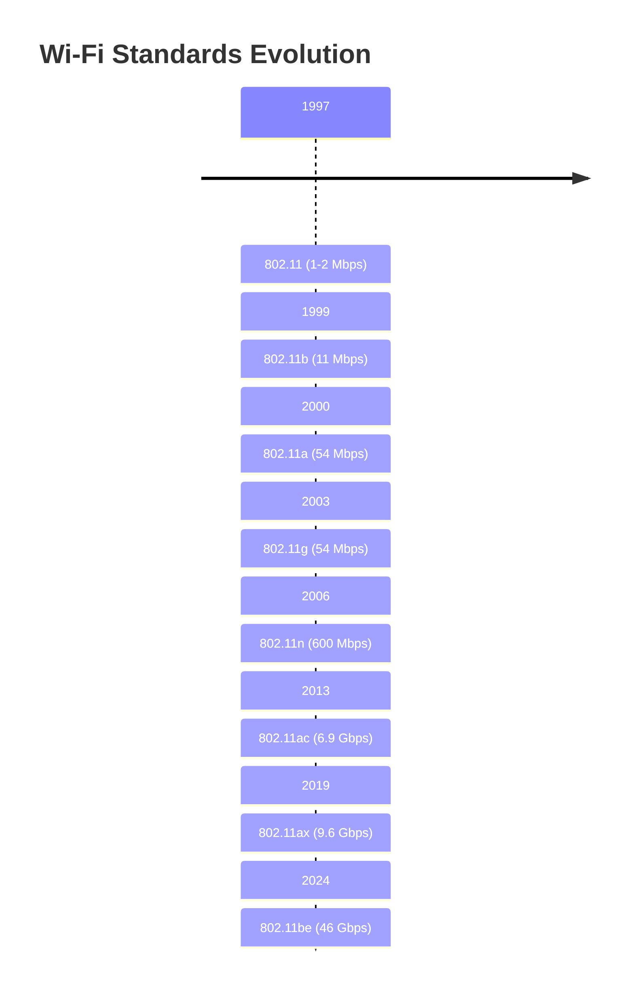
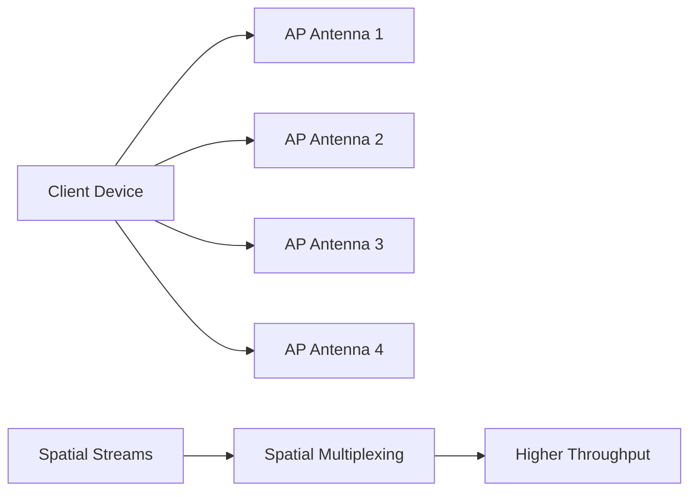
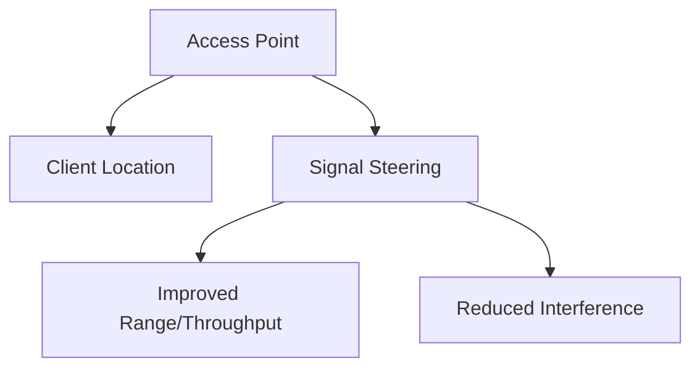
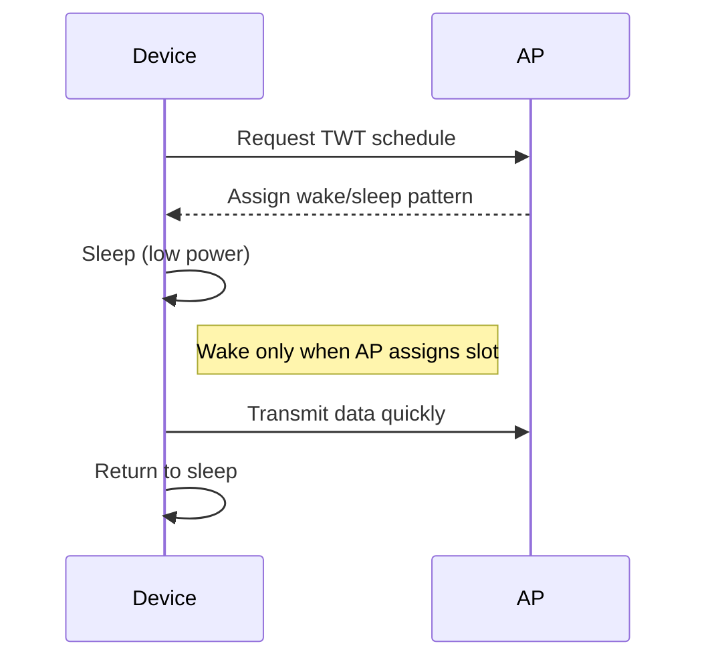
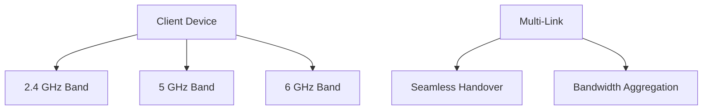
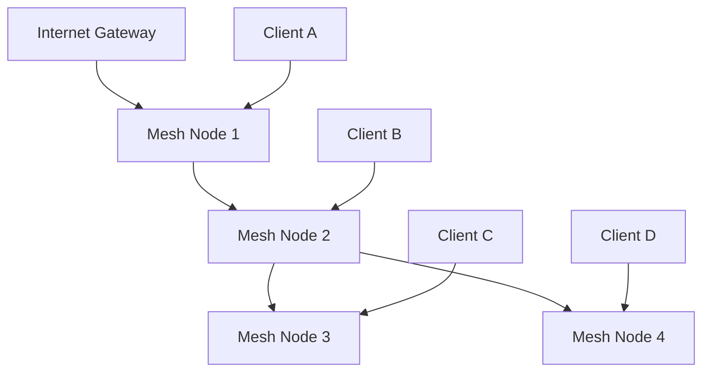

# Wi-Fi Standards and Technologies

Wi-Fi standards, governed by IEEE 802.11 specifications, define wireless local area network (WLAN) technologies. Each generation improves speed, range, security, and efficiency while maintaining backward compatibility.

## Wi-Fi Evolution Timeline



## 802.11 Standards Comparison

| Standard               | Frequency   | Max Speed | Max MIMO | Year | Features            |
| ---------------------- | ----------- | --------- | -------- | ---- | ------------------- |
| **802.11**             | 2.4 GHz     | 2 Mbps    | N/A      | 1997 | Legacy, slow        |
| **802.11b**            | 2.4 GHz     | 11 Mbps   | N/A      | 1999 | High compatibility  |
| **802.11a**            | 5 GHz       | 54 Mbps   | N/A      | 1999 | Less interference   |
| **802.11g**            | 2.4 GHz     | 54 Mbps   | N/A      | 2003 | Backward compatible |
| **802.11n**            | 2.4/5 GHz   | 600 Mbps  | 4x4      | 2009 | MIMO technology     |
| **802.11ac**           | 5 GHz       | 6.9 Gbps  | 8x8      | 2013 | Wave 2 features     |
| **802.11ax (Wi-Fi 6)** | 2.4/5/6 GHz | 9.6 Gbps  | 8x8      | 2019 | OFDMA, TWT          |
| **802.11be (Wi-Fi 7)** | 2.4/5/6 GHz | 46 Gbps   | 16x16    | 2024 | 320 MHz channels    |

## Key Technologies

### MIMO (Multiple Input Multiple Output)

Using multiple antennas for enhanced throughput:



- **SU-MIMO:** Single user streams
- **MU-MIMO:** Multi-user streams (downlink only in Wi-Fi 5)
- **OFDMA:** Orthogonal Frequency Division Multiple Access (Wi-Fi 6)

### Channel Bonding

Combining adjacent channels for increased bandwidth:

```bash
# 802.11n (40 MHz channels)
Channel 36 + Channel 40 = 80 MHz total bandwidth

# 802.11ac (80 MHz channels)
Channel 36 + 40 + 44 + 48 = 160 MHz total bandwidth

# 802.11ax (160 MHz + 80 MHz)
Channel bonding for ultra-high speeds
```

### Beamforming

Focusing signal toward client devices:



## Wi-Fi 6 (802.11ax) Features

### OFDMA (Orthogonal Frequency Division Multiple Access)

Efficient multiple device communication:

```yaml
# Traditional CSMA/CA
- One device transmits at a time
- Inefficient with many devices
- High latency for small packets

# OFDMA (Wi-Fi 6)
- Multiple devices share channel simultaneously
- Frequency division multiplexing
- Reduced latency and improved efficiency
```

### Target Wake Time (TWT)

Power management for IoT devices:



### BSS Coloring

Improved spatial reuse in dense environments:

```yaml
# Color coding BSS (Basic Service Set)
BSS1: Color = 3
BSS2: Color = 5
BSS3: Color = 2

# Adjacent BSS can transmit simultaneously if colors differ
```

## Wi-Fi 7 (802.11be) Innovations

### 320 MHz Channel Width

Ultra-wideband channels for maximum throughput:

```bash
# Channel bonding possibilities:
- 160 MHz + 160 MHz (320 MHz)
- 240 MHz + 80 MHz (320 MHz)
- Single 320 MHz channel

# Theoretical maximum: 46 Gbps
```

### Multi-Link Operation (MLO)

Using multiple bands simultaneously:



### Enhanced MU-MIMO

Uplink and downlink multi-user MIMO:

```yaml
# Wi-Fi 6: Downlink only
AP → Multiple clients simultaneously

# Wi-Fi 7: Bidirectional
AP ↔ Multiple clients simultaneously
```

## Frequency Bands

### 2.4 GHz Band

**Characteristics:**
- Longer range (better wall penetration)
- 11 channels (3 non-overlapping)
- Crowded with interference sources
- Suitable for basic connectivity

### 5 GHz Band

**Characteristics:**
- Shorter range but higher speeds
- 25 channels (23 non-overlapping)
- Less interference
- Better for high-bandwidth applications

### 6 GHz Band (Wi-Fi 6E/7)

**Characteristics:**
- Exclusive Wi-Fi spectrum (no interference)
- 59 channels (35 non-overlapping)
- Very high speeds
- Limited range
- Requires Wi-Fi 6E/7 devices

## Wi-Fi Security Evolution

### WEP (Wired Equivalent Privacy)

**802.11 original security (broken):**
```bash
# Weak RC4 encryption
- 64-bit or 128-bit keys
- Static keys shared among users
- Serious vulnerabilities discovered
```

### WPA (Wi-Fi Protected Access)

**Temporary solution:**
```bash
# Improved security over WEP
- TKIP encryption
- Dynamic key exchange
- Message integrity checks
```

### WPA2 (802.11i)

**Enterprise-grade security:**
```bash
# Mandatory for modern networks
- AES-CCMP encryption
- 802.1X authentication
- Enterprise RADIUS support
```

### WPA3

**Latest security standard:**
```bash
# Enhanced security features
- Simultaneous Authentication of Equals (SAE)
- Forward secrecy
- Protected management frames
- Easy Connect (DPP) for IoT devices
```

## Mesh Networks

### Wireless Mesh Topology



**Benefits:**
- Extended range without wired backhaul
- Self-healing connectivity
- Easy expansion

### EasyMesh Standard

Interoperable mesh networking:

```yaml
# EasyMesh features:
- Multi-vendor compatibility
- Automatic band steering
- Seamless roaming
- Centralized management
```

## Wi-Fi Planning and Deployment

### Channel Planning

```bash
# Avoid adjacent channel interference
Good: Ch 1, Ch 6, Ch 11
Bad:  Ch 1, Ch 2, Ch 3

# 5 GHz channel planning
Non-overlapping: Ch 36, 40, 44, 48, 149, 153, 157, 161
```

### Coverage Planning

**Signal Strength Guidelines:**
- **Excellent:** -30 to -50 dBm
- **Good:** -50 to -60 dBm
- **Fair:** -60 to -70 dBm
- **Poor:** Below -70 dBm

### Capacity Planning

**Factors affecting performance:**
- Number of clients per AP
- Application bandwidth requirements
- Channel utilization
- Interference sources

Wi-Fi continues to evolve rapidly, with each generation bringing significant improvements in speed, efficiency, and reliability. The latest standards support the growing demands of modern wireless networks, from smart homes to enterprise deployments.
