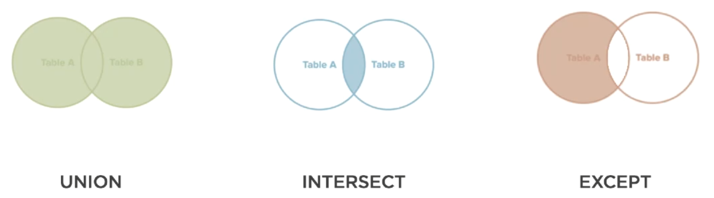

+++
title = "PostgreSQL"
tags = [ "postgresql", "database" ]
author = "Me"
showToc = true
TocOpen = false
draft = true
hidemeta = false
comments = false
disableShare = false
disableHLJS = false
hideSummary = false
searchHidden = true
ShowReadingTime = true
ShowBreadCrumbs = true
ShowPostNavLinks = true
ShowWordCount = true
ShowRssButtonInSectionTermList = true
UseHugoToc = true
+++


## Data Types in PostgreSQL

**Data type** defines what values can be stored in a column in PostgreSQL. Features:

- **Data Types** are not immutable.
- Can be changed or reassigned.
- Can be converted to other data types in query executions.

### Numeric Types

- **Integer Types**: Whole numbers, positive or negative, without decimals.

  - `smallint`: 2-byte integer.
    - Example:
    ```sql
    CREATE TABLE example_smallint (value SMALLINT);
    INSERT INTO example_smallint (value) VALUES (123);
    ```
  - `integer`: 4-byte integer.
    - Example:
    ```sql
    CREATE TABLE example_integer (value INTEGER);
    INSERT INTO example_integer (value) VALUES (123456);
    ```
  - `bigint`: 8-byte integer.
    - Example:
    ```sql
    CREATE TABLE example_bigint (value BIGINT);
    INSERT INTO example_bigint (value) VALUES (123456789012);
    ```

- **Floating-Point Types**: Numbers with fractional parts.

  - `real`: 4-byte floating-point number.
    - Example:
    ```sql
    CREATE TABLE example_real (value REAL);
    INSERT INTO example_real (value) VALUES (123.45);
    ```
  - `double precision`: 8-byte floating-point number.
    - Example:
    ```sql
    CREATE TABLE example_double (value DOUBLE PRECISION);
    INSERT INTO example_double (value) VALUES (123456.789);
    ```

- **Fixed-Point Types**: Numbers with a specific number of digits after the decimal point.

  - `numeric`: Variable precision, exact.
    - Example:
    ```sql
    CREATE TABLE example_numeric (value NUMERIC(10, 2));
    INSERT INTO example_numeric (value) VALUES (123456.78);
    ```
  - `decimal`: Equivalent to `numeric`.
    - Example:
    ```sql
    CREATE TABLE example_decimal (value DECIMAL(10, 2));
    INSERT INTO example_decimal (value) VALUES (123456.78);
    ```

- **Serial Types**: Auto-incrementing integers.
  - `serial`: 4-byte integer.
    - Example:
    ```sql
    CREATE TABLE example_serial (id SERIAL);
    ```
  - `bigserial`: 8-byte integer.
    - Example:
    ```sql
    CREATE TABLE example_bigserial (id BIGSERIAL);
    ```

### Date/Time Types

- **Date/Time Types**: For handling dates and times.
  - `date`: Calendar date (year, month, day).
    - Example:
    ```sql
    CREATE TABLE example_date (value DATE);
    INSERT INTO example_date (value) VALUES ('2024-06-14');
    ```
  - `time [ (p) ] [ without time zone ]`: Time of day (hour, minute, second, optional fractional seconds).
    - Example:
    ```sql
    CREATE TABLE example_time (value TIME);
    INSERT INTO example_time (value) VALUES ('14:30:00');
    ```
  - `time [ (p) ] with time zone`: Time of day with time zone.
    - Example:
    ```sql
    CREATE TABLE example_time_tz (value TIME WITH TIME ZONE);
    INSERT INTO example_time_tz (value) VALUES ('14:30:00+02');
    ```
  - `timestamp [ (p) ] [ without time zone ]`: Date and time (without time zone).
    - Example:
    ```sql
    CREATE TABLE example_timestamp (value TIMESTAMP);
    INSERT INTO example_timestamp (value) VALUES ('2024-06-14 14:30:00');
    ```
  - `timestamp [ (p) ] with time zone`: Date and time with time zone.
    - Example:
    ```sql
    CREATE TABLE example_timestamp_tz (value TIMESTAMP WITH TIME ZONE);
    INSERT INTO example_timestamp_tz (value) VALUES ('2024-06-14 14:30:00+02');
    ```
  - `interval`: Time span (duration).
    - Example:
    ```sql
    CREATE TABLE example_interval (value INTERVAL);
    INSERT INTO example_interval (value) VALUES ('1 year 2 months 3 days');
    ```

### Geometric Types

- **Geometric Types**: For representing geometric figures.
  - `point`: A point in a 2D plane.
    - Example:
    ```sql
    CREATE TABLE example_point (value POINT);
    INSERT INTO example_point (value) VALUES ('(2, 3)');
    ```
  - `line`: Infinite line.
    - Example:
    ```sql
    CREATE TABLE example_line (value LINE);
    INSERT INTO example_line (value) VALUES ('{1, -1, 0}');
    ```
  - `lseg`: Line segment.
    - Example:
    ```sql
    CREATE TABLE example_lseg (value LSEG);
    INSERT INTO example_lseg (value) VALUES ('[(2, 3), (4, 5)]');
    ```
  - `box`: Rectangular box.
    - Example:
    ```sql
    CREATE TABLE example_box (value BOX);
    INSERT INTO example_box (value) VALUES ('((2, 3), (4, 5))');
    ```
  - `path`: Geometric path.
    - Example:
    ```sql
    CREATE TABLE example_path (value PATH);
    INSERT INTO example_path (value) VALUES ('[(2, 3), (4, 5), (7, 8)]');
    ```
  - `polygon`: Closed geometric path (polygon).
    - Example:
    ```sql
    CREATE TABLE example_polygon (value POLYGON);
    INSERT INTO example_polygon (value) VALUES ('((2, 3), (4, 5), (7, 8))');
    ```
  - `circle`: Circle.
    - Example:
    ```sql
    CREATE TABLE example_circle (value CIRCLE);
    INSERT INTO example_circle (value) VALUES ('<(2, 3), 5>');
    ```

### Network Address Types

- **Network Address Types**: For storing network addresses.
  - `cidr`: IPv4 or IPv6 networks.
    - Example:
    ```sql
    CREATE TABLE example_cidr (value CIDR);
    INSERT INTO example_cidr (value) VALUES ('192.168.100.128/25');
    ```
  - `inet`: IPv4 or IPv6 host address.
    - Example:
    ```sql
    CREATE TABLE example_inet (value INET);
    INSERT INTO example_inet (value) VALUES ('192.168.100.128');
    ```
  - `macaddr`: MAC addresses.
    - Example:
    ```sql
    CREATE TABLE example_macaddr (value MACADDR);
    INSERT INTO example_macaddr (value) VALUES ('08:00:2b:01:02:03');
    ```
  - `macaddr8`: EUI-64 MAC addresses.
    - Example:
    ```sql
    CREATE TABLE example_macaddr8 (value MACADDR8);
    INSERT INTO example_macaddr8 (value) VALUES ('08:00:2b:01:02:03:04:05');
    ```

### Character Types

- **Character Types**: For storing text.
  - `char(n)`: Fixed-length character string.
    - Example:
    ```sql
    CREATE TABLE example_char (value CHAR(10));
    INSERT INTO example_char (value) VALUES ('hello');
    ```
  - `varchar(n)`: Variable-length character string.
    - Example:
    ```sql
    CREATE TABLE example_varchar (value VARCHAR(10));
    INSERT INTO example_varchar (value) VALUES ('hello');
    ```
  - `text`: Variable-length character string with unlimited length.
    - Example:
    ```sql
    CREATE TABLE example_text (value TEXT);
    INSERT INTO example_text (value) VALUES ('This is a long text field.');
    ```

### Binary Data Types

- **Binary Data Types**: For storing binary data.
  - `bytea`: Variable-length binary string.
    - Example:
    ```sql
    CREATE TABLE example_bytea (value BYTEA);
    INSERT INTO example_bytea (value) VALUES (E'\\xDEADBEEF');
    ```

### Boolean Type

- **Boolean Type**: For storing boolean values.
  - `boolean`: Logical Boolean (true/false).
    - Example:
    ```sql
    CREATE TABLE example_boolean (value BOOLEAN);
    INSERT INTO example_boolean (value) VALUES (TRUE);
    INSERT INTO example_boolean (value) VALUES (FALSE);
    ```

### Enumerated Types

- **Enumerated Types**: For defining a custom data type with a set of predefined values.
  - Example:
    ```sql
    CREATE TYPE mood AS ENUM ('sad', 'ok', 'happy');
    CREATE TABLE example_enum (value mood);
    INSERT INTO example_enum (value) VALUES ('sad');
    INSERT INTO example_enum (value) VALUES ('ok');
    INSERT INTO example_enum (value) VALUES ('happy');
    ```

### Composite Types

- **Composite Types**: For defining a structured data type that can hold multiple fields.
  - Example:
    ```sql
    CREATE TYPE complex AS (r DOUBLE PRECISION, i DOUBLE PRECISION);
    CREATE TABLE example_composite (value complex);
    INSERT INTO example_composite (value) VALUES (ROW(1.0, 0.0));
    ```

### Range Types

- **Range Types**: For representing a range of values.
  - `int4range`: Range of `integer`.
    - Example:
    ```sql
    CREATE TABLE example_int4range (value INT4RANGE);
    INSERT INTO example_int4range (value) VALUES ('[1,10)');
    ```
  - `numrange`: Range of `numeric`.
    - Example:
    ```sql
    CREATE TABLE example_numrange (value NUMRANGE);
    INSERT INTO example_numrange (value) VALUES ('[1.5, 2.5)');
    ```
  - `tsrange`: Range of `timestamp without time zone`.
    - Example:
    ```sql
    CREATE TABLE example_tsrange (value TSRANGE);
    INSERT INTO example_tsrange (value) VALUES ('["2024-06-14 14:30:00", "2024-06-14 15:30:00")');
    ```
  - `tstzrange`: Range of `timestamp with time zone`.
    - Example:
    ```sql
    CREATE TABLE example_tstzrange (value TSTZRANGE);
    INSERT INTO example_tstzrange (value) VALUES ('["2024-06-14 14:30:00+02", "2024-06-14 15:30:00+02")');
    ```
  - `daterange`: Range of `date`.
    - Example:
    ```sql
    CREATE TABLE example_daterange (value DATERANGE);
    INSERT INTO example_daterange (value) VALUES ('["2024-06-14", "2024-06-21")');
    ```

### UUID Type

- **UUID Type**: For storing universally unique identifiers.
  - Example:
    ```sql
    CREATE TABLE example_uuid (value UUID);
    INSERT INTO example_uuid (value) VALUES ('a0eebc99-9c0b-4ef8-bb6d-6bb9bd380a11');
    ```

### XML Type

- **XML Type**: For storing XML data.
  - Example:
    ```sql
    CREATE TABLE example_xml (value XML);
    INSERT INTO example_xml (value) VALUES ('<foo>bar</foo>');
    ```

### JSON Types

- **JSON Types**: For storing JSON data.
  - `json`: Textual JSON data.
    - Example:
    ```sql
    CREATE TABLE example_json (value JSON);
    INSERT INTO example_json (value) VALUES ('{"name": "John", "age": 30}');
    ```
  - `jsonb`: Binary JSON data (more efficient for certain operations).
    - Example:
    ```sql
    CREATE TABLE example_jsonb (value JSONB);
    INSERT INTO example_jsonb (value) VALUES ('{"name": "John", "age": 30}');
    ```

### Arrays

- **Array Types**: For storing arrays of values.
  - `integer[]`: Array of integers.
    - Example:
    ```sql
    CREATE TABLE example_int_array (value INTEGER[]);
    INSERT INTO example_int_array (value) VALUES ('{1, 2, 3}');
    ```
  - `text[]`: Array of text.
    - Example:
    ```sql
    CREATE TABLE example_text_array (value TEXT[]);
    INSERT INTO example_text_array (value) VALUES ('{hello, world}');
    ```

### Hstore

- **Hstore Type**: For storing sets of key/value pairs.
  - Example:
    ```sql
    CREATE EXTENSION hstore;
    CREATE TABLE example_hstore (value HSTORE);
    INSERT INTO example_hstore (value) VALUES ('key1 => value1, key2 => value2');
    ```

## [Database](https://www.postgresql.org/docs/13/sql-createdatabase.html)

```sql
CREATE DATABASE airlines
    WITH
    OWNER = postgres
    ENCODING = 'UTF8'
    LC_COLLATE = 'English_India.1252'
    LC_CTYPE = 'English_India.1252'
    TABLESPACE = pg_default
    CONNECTION LIMIT = -1;

COMMENT ON DATABASE postgres
    IS 'default administrative connection database';
```

## Tables

### Show tables definition

```sql
-- list all relations
\dSEL
            List of relations
 Schema |    Name     | Type  |  Owner
--------+-------------+-------+----------
 public | performance | table | postgres
 public | person      | table | postgres
(2 rows)

-- Table definition
\d person
                        Table "public.person"
   Column   |          Type          | Collation | Nullable | Default
------------+------------------------+-----------+----------+---------
 person_id  | bigint                 |           | not null |
 last_name  | character varying(255) |           | not null |
 first_name | character varying(255) |           |          |
 age        | integer                |           | not null |
Indexes:
    "person_pkey" PRIMARY KEY, btree (person_id)

-- Extended table definition
\d+ person
                                            Table "public.person"
   Column   |          Type          | Collation | Nullable | Default | Storage  | Stats target | Description
------------+------------------------+-----------+----------+---------+----------+--------------+-------------
 person_id  | bigint                 |           | not null |         | plain    |              |
 last_name  | character varying(255) |           | not null |         | extended |              |
 first_name | character varying(255) |           |          |         | extended |              |
 age        | integer                |           | not null |         | plain    |              |
Indexes:
    "person_pkey" PRIMARY KEY, btree (person_id)
Access method: heap
```

### [Create table](https://www.postgresql.org/docs/13/sql-createtable.html)

```sql
-- create a person table
CREATE [UNLOGGED] TABLE person (
	person_id BIGINT NOT NULL [PRIMARY KEY],
	last_name VARCHAR(255)NOT NULL,
	first_name VARCHAR(255),
	age INT NOT NULL,
	PRIMARY KEY(person_id)
);
-- An unlogged table skips writing a write ahead log, its not crash safe and cannot be replicated.
-- Primary key can also be column property or table property in create statement.

-- Create table from select statement
CREATE TABLE PEOPLE_OVER_30 AS
SELECT *
FROM PERSON
WHERE AGE > 30;

-- Create table referencing other table.
-- Agencies table id is referenced by users table.
CREATE TABLE AGENCIES (
  	ID SERIAL PRIMARY KEY,
	NAME TEXT NOT NULL
);


CREATE TABLE USERS (
	ID SERIAL PRIMARY KEY,
	AGENCY_ID INTEGER NOT NULL REFERENCES AGENCIES(ID) DEFERRABLE INITIALLY DEFERRED
);
```

#### Drop Table

Drop Table

- DROP TABLE removes tables from the database.
- Can drop multiple tables at once.
- CASCADE keyword is used to drop objects that depend on the table.
- RESTRICT keyword prevents the table from being dropped if any objects depend on it.

```sql
-- Drop a single table
DROP TABLE person;

-- Drop multiple tables
DROP TABLE person, people_over_30;

-- Drop table with cascade
DROP TABLE agencies CASCADE;

-- Drop table with restrict
DROP TABLE users RESTRICT;
```

#### Alter Table

ALTER TABLE modifies the structure of an existing table.

- Can add, drop, or rename columns and constraints.
- Can change the data type of a column.

```sql
-- Add a new column
ALTER TABLE person
ADD COLUMN email VARCHAR(255);

-- Drop a column
ALTER TABLE person
DROP COLUMN age;

-- Rename a column
ALTER TABLE person
RENAME COLUMN last_name TO surname;

-- Add a new constraint
ALTER TABLE users
ADD CONSTRAINT fk_agency
FOREIGN KEY (agency_id) REFERENCES agencies(id);

-- Drop a constraint
ALTER TABLE users
DROP CONSTRAINT fk_agency;

-- Change the data type of a column
ALTER TABLE person
ALTER COLUMN person_id TYPE INT;
```

## Querying Data

### Playground

the data in the dir airline is a data dump that can be resorted using the following command.

```sh
> pg_restore.exe --host "localhost" --port "5432" --username "postgres" --no-password --dbname "airlines" --format=d --verbose "C:\\Users\\raghu\\Desktop\\COMBIN~1\\airlines\\"
pg_restore: connecting to database for restore
pg_restore: creating TABLE "public.codes_cancellation"
pg_restore: creating TABLE "public.codes_carrier"
pg_restore: creating TABLE "public.perform_feb"
pg_restore: creating TABLE "public.performance"
pg_restore: processing data for table "public.codes_cancellation"
pg_restore: processing data for table "public.codes_carrier"
pg_restore: processing data for table "public.perform_feb"
pg_restore: processing data for table "public.performance"
```

### Aliasing

```sql
-- Aliasing select columns
SELECT mkt_carrier AS carrier, mkt_carrier_fl_num AS flight_number, origin FROM performance;
 carrier | flight_number | origin
---------+---------------+--------
 UA      | 2429          | EWR
 UA      | 2427          | LAS
 UA      | 2426          | SNA
 ..... many more rows
```

### Limiting

```sql
-- limiting number of entries
SELECT * FROM performance LIMIT 1;
  fl_date   | mkt_carrier | mkt_carrier_fl_num | origin | origin_city_name | origin_state_abr | dest | dest_city_name | dest_state_abr | dep_delay_new | arr_delay_new | cancelled | cancellation_code | diverted | carrier_delay | weather_delay | nas_delay | security_delay | late_aircraft_delay
------------+-------------+--------------------+--------+------------------+------------------+------+----------------+----------------+---------------+---------------+-----------+-------------------+----------+---------------+---------------+-----------+----------------+---------------------
 2018-01-01 | UA          | 2429               | EWR    | Newark, NJ       | NJ               | DEN  | Denver, CO     | CO             |             0 |             0 |         0 |                   |        0 |               |               |           |                |
(1 row)
```

### Distinct

```sql
-- selecting distinct values of a column
SELECT DISTINCT mkt_carrier FROM performance;
 mkt_carrier
-------------
 AS
 NK
 VX
 AA
 F9
 B6
 G4
 HA
 DL
 UA
 WN
(11 rows)

-- selecting distinct across multiple columns
SELECT DISTINCT mkt_carrier, origin as depart_city FROM performance;
 mkt_carrier | depart_city
-------------+-------------
 UA          | PIA
 NK          | OAK
 AA          | RDU
 UA          | ABQ
 DL          | CLE
 ..... 1176 rows
```

### Filtering

> :exclamation: Note: AND has higher operator precedence than OR. use appropriate parenthesis to reduce confusion. :exclamation:

```sql
 -- select all fields with a where condition
SELECT * FROM performance WHERE origin = 'EWR';
  fl_date   | mkt_carrier | mkt_carrier_fl_num | origin | origin_city_name | origin_state_abr | dest |         dest_city_name         | dest_state_abr | dep_delay_new | arr_delay_new | cancelled | cancellation_code | diverted | carrier_delay | weather_delay | nas_delay | security_delay | late_aircraft_delay
------------+-------------+--------------------+--------+------------------+------------------+------+--------------------------------+----------------+---------------+---------------+-----------+-------------------+----------+---------------+---------------+-----------+----------------+---------------------
 2018-01-01 | UA          | 2429               | EWR    | Newark, NJ       | NJ               | DEN  | Denver, CO                     | CO             |             0 |             0 |         0 ||        0 |               |               |           |                |
 2018-01-01 | UA          | 2415               | EWR    | Newark, NJ       | NJ               | PDX  | Portland, OR                   | OR             |             0 |             0 |         0 ||        0 |               |               |           |                |
 .... many more rows

 --select with complex where condition
 SELECT fl_date, mkt_carrier AS airline, mkt_carrier_fl_num AS flight, origin, dest FROM performance  WHERE origin = 'ORD' AND dest = 'BZN';
  fl_date   | airline | flight | origin | dest
------------+---------+--------+--------+------
 2018-01-01 | UA      | 1990   | ORD    | BZN
 2018-01-01 | UA      | 926    | ORD    | BZN
 2018-01-02 | UA      | 1990   | ORD    | BZN
 ... many more rows
 -- for not equal condition use <> or != and try out OR operator

  --select where value is in between a range - Lower and upper boundaries are inclusive
SELECT fl_date, mkt_carrier, mkt_carrier_fl_num, dep_delay_new, origin, dest FROM performance WHERE dep_delay_new BETWEEN 60 AND 120;
  fl_date   | mkt_carrier | mkt_carrier_fl_num | dep_delay_new | origin | dest
------------+-------------+--------------------+---------------+--------+------
 2018-01-01 | UA          | 2413               |            76 | ORD    | BTV
 2018-01-01 | UA          | 2411               |            72 | EWR    | SMF
 2018-01-01 | UA          | 2155               |            94 | IND    | ORD
 ... many more rows

-- select in only specific values list
SELECT fl_date, mkt_carrier, mkt_carrier_fl_num, dep_delay_new, origin, dest FROM performance WHERE dep_delay_new BETWEEN 60 AND 120 AND origin IN ('MKE', 'AZO');
  fl_date   | mkt_carrier | mkt_carrier_fl_num | dep_delay_new | origin | dest
------------+-------------+--------------------+---------------+--------+------
 2018-01-01 | UA          | 3824               |           107 | MKE    | ORD
 2018-01-01 | UA          | 3817               |            62 | AZO    | ORD
 2018-01-01 | UA          | 3790               |            97 | AZO    | ORD
 ... many more rows
 --- try out NOT BETWEEN and NOT IN operators
```

### Pattern Matching

```sql
-- select fields that a match a pattern with like
-- Matching single character
SELECT DISTINCT origin_city_name FROM performance  WHERE origin_city_name LIKE '____, KS';
 origin_city_name
------------------
 Hays, KS
(1 row)

-- Matching one or more characters
SELECT DISTINCT origin_city_name FROM performance  WHERE origin_city_name LIKE 'Fort%';
  origin_city_name
---------------------
 Fort Smith, AR
 Fort Myers, FL
 Fort Lauderdale, FL
 Fort Wayne, IN
(4 rows)
--- These wildcard _ and % can be used anywhere in match string

--- Pattern matching with both _ and %
SELECT DISTINCT origin_city_name FROM performance  WHERE origin_city_name LIKE '__________________, %';
    origin_city_name
------------------------
 Bloomington/Normal, IL
 Hattiesburg/Laurel, MS
 Sarasota/Bradenton, FL
(3 rows)

--- To not match a pattern using NOT LIKE
SELECT DISTINCT origin_city_name FROM performance  WHERE origin_city_name NOT LIKE '%Fort%';
          origin_city_name
------------------------------------
 Colorado Springs, CO
 Roanoke, VA
 Christiansted, VI
 .... many more rows
```

### Null Values

```sql
-- select fields that do not null values
SELECT fl_date, mkt_carrier AS airline, mkt_carrier_fl_num AS flight, cancellation_code FROM performance  WHERE cancellation_code IS NOT NULL;
  fl_date   | airline | flight | cancellation_code
------------+---------+--------+-------------------
 2018-01-01 | UA      | 2034   | B
 2018-01-01 | UA      | 864    | A
 2018-01-01 | UA      | 488    | B
 ... many more rows
```

### Performing Joins


#### Inner Join

```sql
-- select all entries from performance table that has an entry in codes carrier table on mkt_carrier and carrier_code.
SELECT p.fl_date, p.mkt_carrier,cc.carrier_desc, p.mkt_carrier_fl_num as flight, p.origin, p.dest FROM performance p INNER JOIN codes_carrier cc ON p.mkt_carrier = cc.carrier_code;
 fl_date   | mkt_carrier |    carrier_desc    | flight | origin | dest
------------+-------------+--------------------+--------+--------+------
 2018-01-01 | UA          | United Air Lines   | 2429   | EWR    | DEN
 2018-01-01 | UA          | United Air Lines   | 2427   | LAS    | SFO
 2018-01-01 | UA          | United Air Lines   | 2426   | SNA    | DEN
 2018-01-01 | UA          | United Air Lines   | 2425   | RSW    | ORD
 ... many more rows
```

#### Outer Join

##### Left Join

```sql
-- fetching only details of the flight that was cancelled
	SELECT P.FL_DATE,
	P.MKT_CARRIER,
	CA.CANCEL_DESC,
	P.MKT_CARRIER_FL_NUM AS FLIGHT,
	P.ORIGIN,
	P.DEST
FROM CODES_CANCELLATION CA
LEFT JOIN PERFORMANCE P ON P.CANCELLATION_CODE = CA.CANCELLATION_CODE;
  fl_date   | mkt_carrier |     cancel_desc     | flight | origin | dest
------------+-------------+---------------------+--------+--------+------
 2018-01-01 | UA          | Weather             | 2034   | IAH    | MFE
 2018-01-01 | UA          | Carrier             | 864    | LAS    | SFO
 2018-01-01 | UA          | Weather             | 488    | MFE    | IAH
```

##### Right Join

> :exclamation: Note: Use Left Join as a standard practice, until right join is absolutely necessary. :exclamation:

```sql
--- select all records from table B and joins with table A.
```

#### Full Join

```sql
--- Selects all records from both the tables and performs join operation.
SELECT P.FL_DATE,
  P.MKT_CARRIER,
  CA.CANCEL_DESC,
  P.MKT_CARRIER_FL_NUM AS FLIGHT,
  P.ORIGIN,
  P.DEST
FROM CODES_CANCELLATION CA
FULL JOIN PERFORMANCE P ON P.CANCELLATION_CODE = CA.CANCELLATION_CODE;
  fl_date   | mkt_carrier |     cancel_desc     | flight | origin | dest
------------+-------------+---------------------+--------+--------+------
 2018-01-01 | UA          |                     | 2429   | EWR    | DEN
 2018-01-01 | UA          |                     | 2427   | LAS    | SFO
 2018-01-01 | UA          |                     | 2426   | SNA    | DEN
 2018-01-01 | UA          |                     | 2425   | RSW    | ORD
```

### Ordering

### Aggregate Functions

#### Count

#### Sum

#### Min Max

```sql
-- select min and max deplay for an airport pair
SELECT ORIGIN,
	DEST,
	MAX(ARR_DELAY_NEW),
	MIN(ARR_DELAY_NEW)
FROM PERFORMANCE
WHERE ARR_DELAY_NEW IS NOT NULL
	AND ARR_DELAY_NEW > 0
GROUP BY ORIGIN,
	DEST
ORDER BY DEST;
origin | dest | max  | min
--------+------+------+------
 ATL    | ABE  |  281 |    1
 CLT    | ABE  |  181 |    1
 DTW    | ABE  |  353 |    1
 FLL    | ABE  |   89 |    1
 ORD    | ABE  |  195 |    2
 ... many more rows
```

#### Average

```sql
-- Calculating AVG delay for flights that have delay > 0 ordering by most departure delay
SELECT p.mkt_carrier,
	cc.carrier_desc as airline,
	AVG(p.dep_delay_new) AS avg_dep_delay,
	AVG(p.arr_delay_new) AS avg_arr_delay
	FROM performance p
INNER JOIN codes_carrier cc
	ON cc.carrier_code = p.mkt_carrier
WHERE dep_delay_new > 0 AND arr_delay_new > 0
GROUP BY  p.mkt_carrier,
	cc.carrier_desc
ORDER BY avg_dep_delay desc;
 mkt_carrier |      airline       |    avg_dep_delay    |    avg_arr_delay
-------------+--------------------+---------------------+---------------------
 DL          | Delta Air Lines    | 70.5181465755953480 | 67.1188111500830718
 UA          | United Air Lines   | 66.0501955939880585 | 64.4807082561251802
 F9          | Frontier Airlines  | 65.9053406998158379 | 61.6850828729281768
 B6          | JetBlue Airways    | 64.9873220906590121 | 63.2437507475182394
 NK          | Spirit Air Lines   | 55.4537678207739308 | 53.5845213849287169
 G4          | Allegiant Air      | 52.6692737430167598 | 51.4497206703910615
 AA          | American Airlines  | 49.5509546633142139 | 49.0363793509860926
 AS          | Alaska Airlines    | 40.0871443089430894 | 39.2555894308943089
 VX          | Virgin America     | 39.9071691176470588 | 40.2012867647058824
 WN          | Southwest Airlines | 32.7705248760471876 | 29.0510172679090443
 HA          | Hawaiian Airlines  | 21.5402704291593180 | 23.5996472663139330
(11 rows)
```

#### Filtering Aggregates - HAVING

```sql
-- Calculating AVG delay for flights that have delay > 0 and having more than 60 min avg delay and order by most departure delay
SELECT P.MKT_CARRIER,
	CC.CARRIER_DESC AS AIRLINE,
	AVG(P.DEP_DELAY_NEW) AS AVG_DEP_DELAY,
	AVG(P.ARR_DELAY_NEW) AS AVG_ARR_DELAY
FROM PERFORMANCE P
INNER JOIN CODES_CARRIER CC ON CC.CARRIER_CODE = P.MKT_CARRIER
WHERE DEP_DELAY_NEW > 0
	AND ARR_DELAY_NEW > 0
GROUP BY P.MKT_CARRIER,
	CC.CARRIER_DESC
HAVING AVG(P.DEP_DELAY_NEW) > 60
OR AVG(P.ARR_DELAY_NEW) > 60
ORDER BY AVG_DEP_DELAY DESC;
 mkt_carrier |      airline      |    avg_dep_delay    |    avg_arr_delay
-------------+-------------------+---------------------+---------------------
 DL          | Delta Air Lines   | 70.5181465755953480 | 67.1188111500830718
 UA          | United Air Lines  | 66.0501955939880585 | 64.4807082561251802
 F9          | Frontier Airlines | 65.9053406998158379 | 61.6850828729281768
 B6          | JetBlue Airways   | 64.9873220906590121 | 63.2437507475182394
(4 rows)
```

## String Functions

### Concatenation

```sql
-- Concatenate two string fields
SELECT carrier_code || ', ' || carrier_desc  AS carrier FROM codes_carrier;
        carrier
------------------------
 AA, American Airlines
 AS, Alaska Airlines
 B6, JetBlue Airways
 DL, Delta Air Lines
 F9, Frontier Airlines
 G4, Allegiant Air
 HA, Hawaiian Airlines
 NK, Spirit Air Lines
 UA, United Air Lines
 VX, Virgin America
 WN, Southwest Airlines
(11 rows)

-- Alternative syntax
SELECT CONCAT(carrier_code, ', ' , carrier_desc)  AS carrier FROM codes_carrier;

-- Concatenate multiple strings
SELECT CONCAT_WS(', ' ,carrier_code,  carrier_desc, 'USA')  AS carrier FROM codes_carrier;
           carrier
-----------------------------
 AA, American Airlines, USA
 AS, Alaska Airlines, USA
 B6, JetBlue Airways, USA
 DL, Delta Air Lines, USA
 F9, Frontier Airlines, USA
 G4, Allegiant Air, USA
 HA, Hawaiian Airlines, USA
 NK, Spirit Air Lines, USA
 UA, United Air Lines, USA
 VX, Virgin America, USA
 WN, Southwest Airlines, USA
(11 rows)
```

### Trim Functions

```sql
-- trim leading and trailing spaces from a string
SELECT TRIM(' radar ');
 btrim
-------
 radar
(1 row)

-- trim leading and trailing characters from a string
SELECT TRIM('r' FROM 'radar');
 btrim
-------
 ada
(1 row)

--trim leading characters from a string
postgres=# SELECT TRIM(LEADING 'ra' FROM 'radar');
 ltrim
-------
 dar
(1 row)

--trim trailing characters from a string
SELECT TRIM(TRAILING 'dr' FROM 'radar');
 rtrim
-------
 rada
(1 row)
-- Note d is not present in the string as trailing character only r is trimmed.
```

### String isolation

```sql
-- select left n characters from a string
SELECT LEFT('Pluralsight',6);
  left
--------
 Plural
(1 row)

-- select right n characters from a string
SELECT RIGHT('Pluralsight',6);
 right
--------
 lsight
(1 row)
```

### Sub String

> :exclamation: **Note**: Array index starts from 1 in PostgreSQL.:exclamation:

```sql
-- split string by a delimiter and return the string n corresponding to the index
SELECT SPLIT_PART('USA/DC/202','/',2);
 split_part
------------
 DC
(1 row)

--- select substring using from index and length
SELECT SUBSTRING('USA/DC/202',5,2);
 substring
-----------
 DC
(1 row)
-- Alternative syntax
SELECT SUBSTRING('USA/DC/202' FROM 5 FOR 2);
 substring
-----------
 DC
(1 row)

-- select substring using from index to end of string
SELECT SUBSTRING('USA/DC/202',5);
 substring
-----------
 DC/202
(1 row)

```

## Arithmetic Functions & Operators

```sql
-- Addition / Subtraction
SELECT 2 + 2;
4

-- Division (beaware of data types)
 SELECT 13 / 2;
6

-- Division with data type fix
SELECT 13 / 2::float;
6.5

-- Modulo  MOD(a,b) returns the remainder of the division of a by b
SELECT 15 % 1;
0

-- Power - POWER(base,exponent)
SELECT 12 ^ 2;
144

-- Square Root - SQRT(a)
SELECT |/5;
2.23606797749979

-- Absolute value - ABS(a)
SELECT @(36-45);
9
```

## Set Fucntions

SQL Set theory basics:

- Results of a query can be considered as a set.
- SQL sets have same number of columns and same data types.



```sql
-- Union operation
-- Return results of two queries.
-- Union filters all duplicate records.
SELECT column1, column2 FROM table1
UNION
SELECT column1, column2 FROM table2;

-- Union all returns all records, including duplicates.
SELECT column1, column2 FROM table1
UNION ALL
SELECT column1, column2 FROM table2;

-- Intersect operation
-- Return result from two queries that are present in both.
-- Intersect filters all duplicate records.
SELECT column1, column2 FROM table1
INTERSECT
SELECT column1, column2 FROM table2;

-- Intersect all returns all records, including duplicates.
SELECT column1, column2 FROM table1
INTERSECT ALL
SELECT column1, column2 FROM table2;

-- Except operation
-- Return result from two queries that appears only in left query.
-- Except filters all duplicate records.
SELECT column1, column2 FROM table1
EXCEPT
SELECT column1, column2 FROM table2;

-- Except all returns all records, including duplicates.
SELECT column1, column2 FROM table1
EXCEPT ALL
SELECT column1, column2 FROM table2;
```

## SubQuery

A nested query where the result of one query can be use in other query.

Types:

- Correlated Subquery
- Non-Correlated Subquery

Features:

- Advantageous to calculate aggregates on the fly.
- Membership questions can be used in subqueries.

### Non-Correlated Subquery

```sql
-- select flights that were cancelled due to weather
SELECT FL_DATE,
	MKT_CARRIER || ' ' || MKT_CARRIER_FL_NUM AS FLIGHT,
	ORIGIN,
	DEST
FROM PERFORMANCE
WHERE CANCELLED = 1
	AND CANCELLATION_CODE IN
		(SELECT CANCELLATION_CODE
			FROM CODES_CANCELLATION
			WHERE CANCEL_DESC = 'Weather');
fl_date   | flight  | origin | dest
------------+---------+--------+------
 2018-01-01 | UA 2034 | IAH    | MFE
 2018-01-01 | UA 488  | MFE    | IAH
 2018-01-01 | UA 4748 | ORD    | RAP
 2018-01-01 | UA 4640 | DSM    | ORD
 ... many more rows
```

### Correlated Subquery

A subquery that uses values from the primary query i.e, its evaluated for each row of the primary query.

```sql
-- select flights from ORD to RAP which had delay greater than average delay here subquery depends on A.ORIGIN.
SELECT CONCAT_WS(' ',A.MKT_CARRIER,A.MKT_CARRIER_FL_NUM) AS FLIGHT,
	A.ORIGIN,
	A.DEST,
	A.DEP_DELAY_NEW
FROM PERFORMANCE A
WHERE A.ORIGIN = 'ORD'
	AND A.DEST = 'RAP'
	AND A.DEP_DELAY_NEW >
		(SELECT AVG(DEP_DELAY_NEW)
			FROM PERFORMANCE
			WHERE DEP_DELAY_NEW > 0
				AND ORIGIN = A.ORIGIN);
flight  | origin | dest | dep_delay_new
---------+--------+------+---------------
 UA 4748 | ORD    | RAP  |           144
 UA 4748 | ORD    | RAP  |           124
 AA 3652 | ORD    | RAP  |            67
(3 rows)

-- Average delay for flights from ORD to RAP is
SELECT AVG(DEP_DELAY_NEW)
			FROM PERFORMANCE
			WHERE DEP_DELAY_NEW > 0
				AND ORIGIN = 'ORD'
47.25
```

## Common Table Expressions

Create result sets that can be referenced in subsequest queries

Types:

- Non Recursive CTE
- Recursive CTE

Features:

- Easier to read and interpret complex queries.
- Can be performance optimizations for correlated subqueries.

### Non Recursive CTE

```sql
-- list all the flights based with delay greater than average delay grouped by origin.
WITH AVG_DELAY_PER_ORIGIN AS
	(SELECT AVG(DEP_DELAY_NEW) AS DELAY, ORIGIN
		FROM PERFORMANCE
		WHERE DEP_DELAY_NEW > 0
		GROUP BY ORIGIN)
SELECT CONCAT_WS(' ',A.MKT_CARRIER,A.MKT_CARRIER_FL_NUM) AS FLIGHT,
	A.ORIGIN,
	A.DEST,
	A.DEP_DELAY_NEW
FROM PERFORMANCE A
INNER JOIN AVG_DELAY_PER_ORIGIN B
ON A.ORIGIN = B.ORIGIN
WHERE A.DEP_DELAY_NEW > B.DELAY;
flight  | origin | dest | dep_delay_new
---------+--------+------+---------------
 UA 4279 | EWR    | GSP  |            96
 UA 4303 | ORD    | GRR  |           101
 UA 4305 | PVD    | ORD  |           112
... many more rows
```

### Recursive CTE

> Note: In CTE we can optionally specify a column name which is seful in recursion.

```sql
--- recursively evaluate sum of % with itself till 25 is reached
WITH RECURSIVE SERIES(LIST_NUM) AS
	(SELECT 5
		UNION ALL SELECT LIST_NUM + 5
		FROM SERIES
		WHERE LIST_NUM + 5 <= 25 )
SELECT LIST_NUM
FROM SERIES;
 list_num
----------
        5
       10
       15
       20
       25
(5 rows)
```

## Pivot and Unpivot

These are used to transform one table into another

- Pivot - Rows into columns
- Unpivot - Columns into rows

Suppose we have a table named `sales`:

| product | quarter | sales |
| ------- | ------- | ----- |
| A       | Q1      | 100   |
| A       | Q2      | 150   |
| A       | Q3      | 200   |
| A       | Q4      | 250   |
| B       | Q1      | 300   |
| B       | Q2      | 350   |
| B       | Q3      | 400   |
| B       | Q4      | 450   |

We want to pivot this table to have quarters as columns.

```sql
SELECT
    product,
    SUM(CASE WHEN quarter = 'Q1' THEN sales ELSE 0 END) AS Q1,
    SUM(CASE WHEN quarter = 'Q2' THEN sales ELSE 0 END) AS Q2,
    SUM(CASE WHEN quarter = 'Q3' THEN sales ELSE 0 END) AS Q3,
    SUM(CASE WHEN quarter = 'Q4' THEN sales ELSE 0 END) AS Q4
FROM
    sales
GROUP BY
    product;
```

| product | Q1  | Q2  | Q3  | Q4  |
| ------- | --- | --- | --- | --- |
| A       | 100 | 150 | 200 | 250 |
| B       | 300 | 350 | 400 | 450 |

To unpivot the `quarterly_sales` result back to original table

```sql
SELECT
    product,
    quarter,
    sales
FROM
    quarterly_sales
UNPIVOT
(
    sales FOR quarter IN (Q1, Q2, Q3, Q4)
) AS unpivoted_sales;
```

## Window Functions

A window is a set of table rows over which a function is applied.

Features:

- Aggregagte functions can also be applied over window functions.
- Order of Evaluation
  - Evaluated after joins, groupings and having clause.
  - Evaluated same time as select statements.
  - To use others selections in a window functions
    - include selection in a subquery or CTE.
    - apply window function on the outer query.
- Cannot be used in WHERE or HAVINg clause.

### Row Number

Assigns sequential number to each row, the window is defined by OVER() clause.

```sql
--- list all distinct carriers with ROW_NUMBER assigned to each row
WITH DISTINCT_CARRIER AS
	(SELECT DISTINCT (MKT_CARRIER) AS CARRIER
		FROM PERFORMANCE)
SELECT ROW_NUMBER() OVER() AS SL,
	CARRIER
FROM DISTINCT_CARRIER;
sl | carrier
----+---------
  1 | AS
  2 | NK
  3 | VX
  4 | AA
  5 | B6
  6 | F9
  7 | G4
  8 | HA
  9 | DL
 10 | UA
 11 | WN
(11 rows)

-- list all distinct carriers with ROW_NUMBER assigned to each row with ordering
WITH DISTINCT_CARRIER AS
	(SELECT DISTINCT (MKT_CARRIER) AS CARRIER
		FROM PERFORMANCE)
SELECT ROW_NUMBER() OVER(ORDER BY CARRIER) AS SL,
	CARRIER
FROM DISTINCT_CARRIER;
 sl | carrier
----+---------
  1 | AA
  2 | AS
  3 | B6
  4 | DL
  5 | F9
  6 | G4
  7 | HA
  8 | NK
  9 | UA
 10 | VX
 11 | WN
(11 rows)

```

### Partition

```sql
-- list count of flights from a origin to dest across all carriers
SELECT DISTINCT ORIGIN,
	DEST,
	COUNT(*) OVER(PARTITION BY ORIGIN)
FROM PERFORMANCE
GROUP BY ORIGIN,
	DEST
ORDER BY ORIGIN DESC,
	DEST;
origin | dest | count
--------+------+-------
 YUM    | PHX  |     1
 YNG    | PIE  |     2
 YNG    | SFB  |     2
 YKM    | SEA  |     1
 YAK    | CDV  |     2
 YAK    | JNU  |     2
... many more rows
```

### Ranking

Ranking assigns sequential number to each row, however matching rows are matched the same.

Dense Rank is used to avoid gaps in ranking.

```sql
SELECT mkt_carrier,
       mkt_carrier_fl_num,
       origin,
       dest,
       arr_delay_new,
       Row_number()
         OVER(
           ORDER BY mkt_carrier_fl_num),
       Rank()
         OVER(
           ORDER BY arr_delay_new DESC) AS DELAY_RANK,
       Dense_rank()
         OVER(
           ORDER BY arr_delay_new DESC) AS DELAY_DENSE_RANK
FROM   performance
WHERE  arr_delay_new IS NOT NULL
       AND arr_delay_new > 0
       AND mkt_carrier = 'AA'
       AND origin = 'MCI'
       AND fl_date = '2018-01-16'
ORDER  BY arr_delay_new ASC;
 mkt_carrier | mkt_carrier_fl_num | origin | dest | arr_delay_new | row_number | delay_rank | delay_dense_rank
-------------+--------------------+--------+------+---------------+------------+------------+------------------
 AA          | 2640               | MCI    | DFW  |             1 |          3 |         10 |                8
 AA          | 5121               | MCI    | CLT  |             1 |         10 |         10 |                8
 AA          | 4586               | MCI    | MIA  |             8 |          7 |          8 |                7
 AA          | 1224               | MCI    | DFW  |             8 |          1 |          8 |                7
 AA          | 4604               | MCI    | DCA  |             9 |          8 |          7 |                6
 AA          | 248                | MCI    | ORD  |            12 |          2 |          5 |                5
 AA          | 2983               | MCI    | ORD  |            12 |          4 |          5 |                5
 AA          | 3456               | MCI    | ORD  |            16 |          6 |          4 |                4
 AA          | 4659               | MCI    | DCA  |            25 |          9 |          3 |                3
 AA          | 601                | MCI    | PHX  |            32 |         11 |          2 |                2
 AA          | 3135               | MCI    | ORD  |            90 |          5 |          1 |                1
(11 rows)
```

### Special values

FIRST_VALUE() and LAST_VALUE() are used to get the first and last value of a column.

```sql
SELECT DEST,
	LAST_VALUE(ARR_DELAY_NEW) OVER W,
	FIRST_VALUE (ARR_DELAY_NEW) OVER W
FROM PERFORMANCE
WHERE ARR_DELAY_NEW IS NOT NULL
	AND ARR_DELAY_NEW > 0 WINDOW W AS (PARTITION BY DEST);
--- Wierd result
```

### Lag and Lead

Lagging rows are the rows that occur before the current row.
Leading rows are the rows that occur after the current row.

Features:

- These are used in month to month or year over year analysis.

```sql
-- get daily count group by day and lag by 5 day in another column and delta over five days.
WITH DAILY_FLIGHT_COUNT AS
	(SELECT FL_DATE,
			COUNT(*) AS DAILY_COUNT
		FROM PERFORMANCE
		GROUP BY FL_DATE)
SELECT FL_DATE,
	DAILY_COUNT,
	LAG(DAILY_COUNT,
		5) OVER (ORDER BY FL_DATE) AS LAG_COUNT,
	DAILY_COUNT - LAG(DAILY_COUNT,
		5) OVER (ORDER BY FL_DATE) AS DELTA_COUNT
FROM DAILY_FLIGHT_COUNT
ORDER BY FL_DATE;
 fl_date   | daily_count | lag_count | delta_count
------------+-------------+-----------+-------------
 2018-01-01 |       19515 |           |
 2018-01-02 |       21672 |           |
 2018-01-03 |       20940 |           |
 2018-01-04 |       20980 |           |
 2018-01-05 |       21026 |           |
 2018-01-06 |       17484 |     19515 |       -2031
 2018-01-07 |       20812 |     21672 |        -860
 2018-01-08 |       21021 |     20940 |          81
 2018-01-09 |       19942 |     20980 |       -1038
 2018-01-10 |       20487 |     21026 |        -539
 2018-01-11 |       21151 |     17484 |        3667
 2018-01-12 |       21319 |     20812 |         507
 2018-01-13 |       16037 |     21021 |       -4984
 ... Rows till end of month
```

## Performance

### Explain and Analyse

#### Select Query

```sql
EXPLAIN ANALYSE
SELECT *
FROM PUBLIC.PERFORMANCE;
"Seq Scan on performance  (cost=0.00..14614.61 rows=621461 width=84) (actual time=0.067..126.664 rows=621461 loops=1)"
"Planning Time: 0.068 ms"
"Execution Time: 224.380 ms"
```

- 0.00 (Planning/Startup cost).
- 14614.61 Query plan cost. (Total cost)
  - COST = `(disk pages read _ sequential page cost) + (rows scanned _ cpu tuple cost) = (8400 * 1.0) + (621461 * 0.01) = 14614.61`

```sql
SELECT RELPAGES AS "Disk Page Read",
RELTUPLES AS "Rows Scanned"
FROM PG_CLASS
WHERE RELNAME = 'performance'
```

- 621461 rows is the number of rows returned by the query. (Number of rows returned)
- 84 Bytes is the size of the returned rows. (Total size of data/number of returned rows)

### Indexing

Indexs are a way to speed up queries. But indexes also add overhead to the database system as a whole, so they should be used sensibly.

#### Select with Where clause

```sql
EXPLAIN (ANALYSE, VERBOSE) SELECT *
FROM PUBLIC.PERFORMANCE WHERE ORIGIN = 'EWR';
"Gather  (cost=1000.00..13890.08 rows=12533 width=84) (actual time=0.206..33.883 rows=12888 loops=1)"
"  Output: fl_date, mkt_carrier, mkt_carrier_fl_num, origin, origin_city_name, origin_state_abr, dest, dest_city_name, dest_state_abr, dep_delay_new, arr_delay_new, cancelled, cancellation_code, diverted, carrier_delay, weather_delay, nas_delay, security_delay, late_aircraft_delay"
"  Workers Planned: 2"
"  Workers Launched: 2"
"  ->  Parallel Seq Scan on public.performance  (cost=0.00..11636.78 rows=5222 width=84) (actual time=0.027..28.880 rows=4296 loops=3)"
"        Output: fl_date, mkt_carrier, mkt_carrier_fl_num, origin, origin_city_name, origin_state_abr, dest, dest_city_name, dest_state_abr, dep_delay_new, arr_delay_new, cancelled, cancellation_code, diverted, carrier_delay, weather_delay, nas_delay, security_delay, late_aircraft_delay"
"        Filter: ((performance.origin)::text = 'EWR'::text)"
"        Rows Removed by Filter: 202858"
"        Worker 0:  actual time=0.017..29.242 rows=4372 loops=1"
"        Worker 1:  actual time=0.021..29.648 rows=4217 loops=1"
"Planning Time: 0.044 ms"
"Execution Time: 36.007 ms"
```

Creating index on `origin` column is a good idea.

```sql
CREATE INDEX origin_idx ON PERFORMANCE (origin);
EXPLAIN (ANALYSE, VERBOSE) SELECT *
FROM PUBLIC.PERFORMANCE WHERE ORIGIN = 'EWR';
"Bitmap Heap Scan on public.performance  (cost=141.56..9103.93 rows=12533 width=84) (actual time=0.676..17.586 rows=12888 loops=1)"
"  Output: fl_date, mkt_carrier, mkt_carrier_fl_num, origin, origin_city_name, origin_state_abr, dest, dest_city_name, dest_state_abr, dep_delay_new, arr_delay_new, cancelled, cancellation_code, diverted, carrier_delay, weather_delay, nas_delay, security_delay, late_aircraft_delay"
"  Recheck Cond: ((performance.origin)::text = 'EWR'::text)"
"  Heap Blocks: exact=2747"
"  ->  Bitmap Index Scan on origin_idx  (cost=0.00..138.42 rows=12533 width=0) (actual time=0.453..0.453 rows=12888 loops=1)"
"        Index Cond: ((performance.origin)::text = 'EWR'::text)"
"Planning Time: 0.161 ms"
"Execution Time: 19.913 ms"

EXPLAIN (ANALYSE, VERBOSE) SELECT *
FROM PUBLIC.PERFORMANCE WHERE ORIGIN = 'EWR' AND DEST = 'PDX';
"Bitmap Heap Scan on public.performance  (cost=138.46..9132.16 rows=132 width=84) (actual time=1.256..5.416 rows=89 loops=1)"
"  Output: fl_date, mkt_carrier, mkt_carrier_fl_num, origin, origin_city_name, origin_state_abr, dest, dest_city_name, dest_state_abr, dep_delay_new, arr_delay_new, cancelled, cancellation_code, diverted, carrier_delay, weather_delay, nas_delay, security_delay, late_aircraft_delay"
"  Recheck Cond: ((performance.origin)::text = 'EWR'::text)"
"  Filter: ((performance.dest)::text = 'PDX'::text)"
"  Rows Removed by Filter: 12799"
"  Heap Blocks: exact=2747"
"  ->  Bitmap Index Scan on origin_idx  (cost=0.00..138.42 rows=12533 width=0) (actual time=0.864..0.865 rows=12888 loops=1)"
"        Index Cond: ((performance.origin)::text = 'EWR'::text)"
"Planning Time: 0.108 ms"
"Execution Time: 5.450 ms"

-- What happens if order of columns is changed?
EXPLAIN (ANALYSE, VERBOSE) SELECT *
FROM PUBLIC.PERFORMANCE WHERE DEST = 'PDX' AND ORIGIN = 'EWR';

```

Creating index on `dest` column is a good idea.

```sql
CREATE INDEX dest_idx ON PERFORMANCE (dest);

EXPLAIN (ANALYSE, VERBOSE) SELECT *
FROM PUBLIC.PERFORMANCE WHERE ORIGIN = 'EWR' AND DEST = 'PDX';
"Bitmap Heap Scan on public.performance  (cost=212.10..689.00 rows=132 width=84) (actual time=0.845..0.948 rows=89 loops=1)"
"  Output: fl_date, mkt_carrier, mkt_carrier_fl_num, origin, origin_city_name, origin_state_abr, dest, dest_city_name, dest_state_abr, dep_delay_new, arr_delay_new, cancelled, cancellation_code, diverted, carrier_delay, weather_delay, nas_delay, security_delay, late_aircraft_delay"
"  Recheck Cond: (((performance.dest)::text = 'PDX'::text) AND ((performance.origin)::text = 'EWR'::text))"
"  Heap Blocks: exact=89"
"  ->  BitmapAnd  (cost=212.10..212.10 rows=132 width=0) (actual time=0.833..0.834 rows=0 loops=1)"
"        ->  Bitmap Index Scan on dest_idx  (cost=0.00..73.36 rows=6525 width=0) (actual time=0.353..0.353 rows=6613 loops=1)"
"              Index Cond: ((performance.dest)::text = 'PDX'::text)"
"        ->  Bitmap Index Scan on origin_idx  (cost=0.00..138.42 rows=12533 width=0) (actual time=0.391..0.392 rows=12888 loops=1)"
"              Index Cond: ((performance.origin)::text = 'EWR'::text)"
"Planning Time: 0.211 ms"
"Execution Time: 0.976 ms"
```

#### Index types

- B-tree: Balanced tree index useful for equality and range queries.
- Hash: Useful for equality, But index need to be built manually on crashes.
- Generalized inverted Index (GIN): Useful for Array or full text search.
- Genneralized search index (GIST): Useful for Geometric data and full text search.

#### Index Optimization

```sql
EXPLAIN (ANALYSE, VERBOSE) SELECT *
FROM PUBLIC.PERFORMANCE WHERE ORIGIN = 'EWR' AND DEP_DELAY_NEW > 0;
"Gather  (cost=1000.00..13682.63 rows=3985 width=84) (actual time=0.160..42.342 rows=4453 loops=1)"
"  Output: fl_date, mkt_carrier, mkt_carrier_fl_num, origin, origin_city_name, origin_state_abr, dest, dest_city_name, dest_state_abr, dep_delay_new, arr_delay_new, cancelled, cancellation_code, diverted, carrier_delay, weather_delay, nas_delay, security_delay, late_aircraft_delay"
"  Workers Planned: 2"
"  Workers Launched: 2"
"  ->  Parallel Seq Scan on public.performance  (cost=0.00..12284.13 rows=1660 width=84) (actual time=0.089..37.477 rows=1484 loops=3)"
"        Output: fl_date, mkt_carrier, mkt_carrier_fl_num, origin, origin_city_name, origin_state_abr, dest, dest_city_name, dest_state_abr, dep_delay_new, arr_delay_new, cancelled, cancellation_code, diverted, carrier_delay, weather_delay, nas_delay, security_delay, late_aircraft_delay"
"        Filter: ((performance.dep_delay_new > '0'::numeric) AND ((performance.origin)::text = 'EWR'::text))"
"        Rows Removed by Filter: 205669"
"        Worker 0:  actual time=0.048..37.040 rows=1307 loops=1"
"        Worker 1:  actual time=0.213..37.313 rows=1610 loops=1"
"Planning Time: 0.097 ms"
"Execution Time: 43.200 ms"
CREATE INDEX origin_idx ON PERFORMANCE (origin);

EXPLAIN (ANALYSE, VERBOSE) SELECT *
FROM PUBLIC.PERFORMANCE WHERE ORIGIN = 'EWR' AND DEP_DELAY_NEW > 0;
"Bitmap Heap Scan on public.performance  (cost=139.42..9133.13 rows=3985 width=84) (actual time=0.774..6.846 rows=4453 loops=1)"
"  Output: fl_date, mkt_carrier, mkt_carrier_fl_num, origin, origin_city_name, origin_state_abr, dest, dest_city_name, dest_state_abr, dep_delay_new, arr_delay_new, cancelled, cancellation_code, diverted, carrier_delay, weather_delay, nas_delay, security_delay, late_aircraft_delay"
"  Recheck Cond: ((performance.origin)::text = 'EWR'::text)"
"  Filter: (performance.dep_delay_new > '0'::numeric)"
"  Rows Removed by Filter: 8435"
"  Heap Blocks: exact=2747"
"  ->  Bitmap Index Scan on origin_idx  (cost=0.00..138.42 rows=12533 width=0) (actual time=0.550..0.551 rows=12888 loops=1)"
"        Index Cond: ((performance.origin)::text = 'EWR'::text)"
"Planning Time: 0.160 ms"
"Execution Time: 7.614 ms"

-- Multicolumn index
-- Creating a new index on both columns
CREATE INDEX origin_dep_delay_new_idx ON PERFORMANCE (origin, dep_delay_new);

EXPLAIN (ANALYSE, VERBOSE) SELECT *
FROM PUBLIC.PERFORMANCE WHERE ORIGIN = 'EWR' AND DEP_DELAY_NEW > 0;
"Bitmap Heap Scan on public.performance  (cost=93.27..7053.38 rows=3985 width=84) (actual time=0.671..2.903 rows=4453 loops=1)"
"  Output: fl_date, mkt_carrier, mkt_carrier_fl_num, origin, origin_city_name, origin_state_abr, dest, dest_city_name, dest_state_abr, dep_delay_new, arr_delay_new, cancelled, cancellation_code, diverted, carrier_delay, weather_delay, nas_delay, security_delay, late_aircraft_delay"
"  Recheck Cond: (((performance.origin)::text = 'EWR'::text) AND (performance.dep_delay_new > '0'::numeric))"
"  Heap Blocks: exact=1634"
"  ->  Bitmap Index Scan on origin_dep_delay_new_idx  (cost=0.00..92.27 rows=3985 width=0) (actual time=0.484..0.485 rows=4453 loops=1)"
"        Index Cond: (((performance.origin)::text = 'EWR'::text) AND (performance.dep_delay_new > '0'::numeric))"
"Planning Time: 0.170 ms"
"Execution Time: 3.582 ms"

DROP INDEX origin_dep_delay_new_idx;

-- Index order
-- Changing the order of index - Performance is slower
CREATE INDEX dep_delay_new_origin_idx ON PERFORMANCE (origin, dep_delay_new);

EXPLAIN (ANALYSE, VERBOSE) SELECT *
FROM PUBLIC.PERFORMANCE WHERE ORIGIN = 'EWR' AND DEP_DELAY_NEW > 0;
"Bitmap Heap Scan on public.performance  (cost=139.42..9133.13 rows=3984 width=84) (actual time=0.646..5.768 rows=4453 loops=1)"
"  Output: fl_date, mkt_carrier, mkt_carrier_fl_num, origin, origin_city_name, origin_state_abr, dest, dest_city_name, dest_state_abr, dep_delay_new, arr_delay_new, cancelled, cancellation_code, diverted, carrier_delay, weather_delay, nas_delay, security_delay, late_aircraft_delay"
"  Recheck Cond: ((performance.origin)::text = 'EWR'::text)"
"  Filter: (performance.dep_delay_new > '0'::numeric)"
"  Rows Removed by Filter: 8435"
"  Heap Blocks: exact=2747"
"  ->  Bitmap Index Scan on origin_idx  (cost=0.00..138.42 rows=12533 width=0) (actual time=0.415..0.416 rows=12888 loops=1)"
"        Index Cond: ((performance.origin)::text = 'EWR'::text)"
"Planning Time: 0.252 ms"
"Execution Time: 6.501 ms"

-- Cover Index - Not useful in this case
CREATE INDEX cover_idx ON PERFORMANCE (fl_date, mkt_carrier, mkt_carrier_fl_num, origin, origin_city_name,
									  origin_state_abr, dest, dest_city_name, dest_state_abr, dep_delay_new,
									   arr_delay_new, cancelled, cancellation_code, diverted, carrier_delay,
									   weather_delay, nas_delay, security_delay, late_aircraft_delay);
-- Useful when we have less number of columns in tables and it can minimize heap blocks scanned.
```

##### Unique Index and Primary Key

Primary key and unique columns already have indexes, even though its not visible in pg_admin UI.

```sql
DROP TABLE public.sample;

CREATE TABLE public.sample
(
    id integer NOT NULL,
    firstcol character varying(40) COLLATE pg_catalog."default",
    secondcol integer,
    CONSTRAINT sample_pkey PRIMARY KEY (id)
)
TABLESPACE pg_default;

ALTER TABLE public.sample
    OWNER to postgres;

-- To check if there is already an index
SELECT *
FROM PG_INDEX
JOIN PG_CLASS AS C ON C.OID = PG_INDEX.INDEXRELID
WHERE PG_INDEX.INDRELID = 'sample'::REGCLASS;

-- verify creating multiple indexes on same column
CREATE INDEX id_idx on sample(id)

-- verify creating unique constraint
ALTER TABLE SAMPLE ADD CONSTRAINT FIRSTCOL_UNQ_CONSTRAINT UNIQUE (FIRSTCOL)

-- verify creating unique index on
CREATE UNIQUE INDEX FIRSTCOL_UNQ_IDX on sample(firstcol)
```

##### Case Insensitivity

```sql
SELECT *
FROM PUBLIC.PERFORMANCE WHERE origin_city_name = 'newark, NJ';

--- Making the query case insensitive
EXPLAIN (ANALYSE, VERBOSE) SELECT *
FROM PUBLIC.PERFORMANCE WHERE lower(origin_city_name) = lower('newark, Nj');
"Gather  (cost=1000.00..13594.83 rows=3107 width=85) (actual time=0.205..75.207 rows=12888 loops=1)"
"  Output: fl_date, mkt_carrier, mkt_carrier_fl_num, origin, origin_city_name, origin_state_abr, dest, dest_city_name, dest_state_abr, dep_delay_new, arr_delay_new, cancelled, cancellation_code, diverted, carrier_delay, weather_delay, nas_delay, security_delay, late_aircraft_delay"
"  Workers Planned: 2"
"  Workers Launched: 2"
"  ->  Parallel Seq Scan on public.performance  (cost=0.00..12284.13 rows=1295 width=85) (actual time=0.096..70.928 rows=4296 loops=3)"
"        Output: fl_date, mkt_carrier, mkt_carrier_fl_num, origin, origin_city_name, origin_state_abr, dest, dest_city_name, dest_state_abr, dep_delay_new, arr_delay_new, cancelled, cancellation_code, diverted, carrier_delay, weather_delay, nas_delay, security_delay, late_aircraft_delay"
"        Filter: (lower((performance.origin_city_name)::text) = 'newark, nj'::text)"
"        Rows Removed by Filter: 202858"
"        Worker 0:  actual time=0.163..71.812 rows=4500 loops=1"
"        Worker 1:  actual time=0.084..71.995 rows=4401 loops=1"
"Planning Time: 0.080 ms"
"Execution Time: 77.392 ms"

CREATE INDEX ORIGIN_CITY_NAME_INDEX ON PERFORMANCE (ORIGIN_CITY_NAME)

-- verify index is not used for query
CREATE INDEX ORIGIN_CITY_NAME_CASE_INSENSITIVE_INDEX ON PERFORMANCE (LOWER(ORIGIN_CITY_NAME))

EXPLAIN (ANALYSE, VERBOSE) SELECT *
FROM PUBLIC.PERFORMANCE WHERE lower(origin_city_name) = lower('newark, Nj');
"Bitmap Heap Scan on public.performance  (cost=36.50..6177.88 rows=3107 width=85) (actual time=0.619..15.666 rows=12888 loops=1)"
"  Output: fl_date, mkt_carrier, mkt_carrier_fl_num, origin, origin_city_name, origin_state_abr, dest, dest_city_name, dest_state_abr, dep_delay_new, arr_delay_new, cancelled, cancellation_code, diverted, carrier_delay, weather_delay, nas_delay, security_delay, late_aircraft_delay"
"  Recheck Cond: (lower((performance.origin_city_name)::text) = 'newark, nj'::text)"
"  Heap Blocks: exact=2747"
"  ->  Bitmap Index Scan on origin_city_name_case_insensitive_index  (cost=0.00..35.73 rows=3107 width=0) (actual time=0.408..0.409 rows=12888 loops=1)"
"        Index Cond: (lower((performance.origin_city_name)::text) = 'newark, nj'::text)"
"Planning Time: 0.159 ms"
"Execution Time: 18.005 ms"
```

##### Partial Index

```sql
--- Creating partial index (based on usecase)
CREATE INDEX DEP_DEL_NEW_IDX ON PERFORMANCE (DEP_DELAY_NEW)
WHERE DEP_DELAY_NEW > 10;
```

#### Index Maintenance

#### Reinitialize Indexes

In case of heavy OLTP workload, lots of deletes, Reindex periodically.

```sql
REINDEX INDEX origin_idx;
REINDEX TABLE PERFORMANCE;

-- with pg_cron
SELECT cron.schedule('30 3 * * 6', $$REINDEX INDEX origin_idx$$);
```

### Populating Large Data

#### Disable Auto Commit

- Wrap the query in transaction block

```sql
BEGIN;
-- Insert statements
COMMIT;
```

#### Bulk Insert with COPY

- Drop indexs before bulk insert

```sql
--- Copying to a file
Copy (Select \* From performance) To 'performance.csv' With CSV DELIMITER ',' HEADER;

--- Loading from a file
COPY performance  From 'performance.csv' With CSV DELIMITER ',' HEADER;
```

- Perform `ANALYZE PERFORMANCE` after bulk insert. This will create statistics on the table, helps postgres optimizer engine to optimize query plans.

```sql
ANALYZE VERBOSE PERFORMANCE;
INFO:  analyzing "public.performance"
INFO:  "performance": scanned 8400 of 8400 pages, containing 621461 live rows and 0 dead rows; 30000 rows in sample, 621461 estimated total rows
ANALYZE

```

- Analyse tables once a week.

### Vacuuming Tables and Database

```sql
VACCUUM VERBOSE PERFORMANCE;
INFO:  vacuuming "public.performance"
INFO:  launched 2 parallel vacuum workers for index cleanup (planned: 2)
INFO:  "performance": found 0 removable, 7 nonremovable row versions in 1 out of 8400 pages
DETAIL:  0 dead row versions cannot be removed yet, oldest xmin: 514
There were 0 unused item identifiers.
Skipped 0 pages due to buffer pins, 0 frozen pages.
0 pages are entirely empty.
CPU: user: 0.00 s, system: 0.00 s, elapsed: 0.01 s.
INFO:  vacuuming "pg_toast.pg_toast_16396"
INFO:  "pg_toast_16396": found 0 removable, 0 nonremovable row versions in 0 out of 0 pages
DETAIL:  0 dead row versions cannot be removed yet, oldest xmin: 514
There were 0 unused item identifiers.
Skipped 0 pages due to buffer pins, 0 frozen pages.
0 pages are entirely empty.
CPU: user: 0.00 s, system: 0.00 s, elapsed: 0.00 s.
VACUUM

DELETE FROM PERFORMANCE WHERE DEP_DELAY_NEW > 10;

VACCUUM VERBOSE PERFORMANCE;
INFO:  vacuuming "public.performance"
INFO:  launched 2 parallel vacuum workers for index vacuuming (planned: 2)
INFO:  scanned index "dep_del_new_idx" to remove 472701 row versions
DETAIL:  CPU: user: 0.01 s, system: 0.00 s, elapsed: 0.01 s
INFO:  scanned index "origin_city_name_case_insensitive_index" to remove 472701 row versions
DETAIL:  CPU: user: 0.05 s, system: 0.00 s, elapsed: 0.08 s
INFO:  scanned index "origin_city_name_index" to remove 472701 row versions
DETAIL:  CPU: user: 0.04 s, system: 0.01 s, elapsed: 0.08 s
INFO:  "performance": removed 472701 row versions in 8399 pages
DETAIL:  CPU: user: 0.01 s, system: 0.00 s, elapsed: 0.01 s
INFO:  index "origin_city_name_index" now contains 148760 row versions in 546 pages
DETAIL:  472701 index row versions were removed.
0 index pages have been deleted, 0 are currently reusable.
CPU: user: 0.00 s, system: 0.00 s, elapsed: 0.00 s.
INFO:  index "origin_city_name_case_insensitive_index" now contains 148760 row versions in 546 pages
DETAIL:  472701 index row versions were removed.
0 index pages have been deleted, 0 are currently reusable.
CPU: user: 0.00 s, system: 0.00 s, elapsed: 0.00 s.
INFO:  index "dep_del_new_idx" now contains 124759 row versions in 345 pages
DETAIL:  0 index row versions were removed.
0 index pages have been deleted, 0 are currently reusable.
CPU: user: 0.00 s, system: 0.00 s, elapsed: 0.00 s.
INFO:  "performance": found 472701 removable, 148760 nonremovable row versions in 8400 out of 8400 pages
DETAIL:  0 dead row versions cannot be removed yet, oldest xmin: 515
There were 0 unused item identifiers.
Skipped 0 pages due to buffer pins, 0 frozen pages.
0 pages are entirely empty.
CPU: user: 0.09 s, system: 0.02 s, elapsed: 0.14 s.
INFO:  vacuuming "pg_toast.pg_toast_16396"
INFO:  "pg_toast_16396": found 0 removable, 0 nonremovable row versions in 0 out of 0 pages
DETAIL:  0 dead row versions cannot be removed yet, oldest xmin: 515
There were 0 unused item identifiers.
Skipped 0 pages due to buffer pins, 0 frozen pages.
0 pages are entirely empty.
CPU: user: 0.00 s, system: 0.00 s, elapsed: 0.00 s.
VACUUM
```

- Vacuum tables once a week.

```sql
VACUUM VERBOSE; -- Vacuum all tables
```
