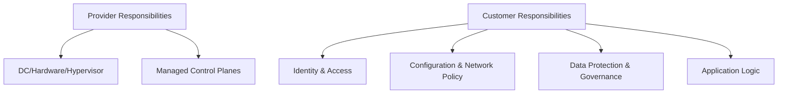

# Cloud Shared Responsibility Model

Cloud security is a partnership. Providers operate secure infrastructure and managed control planes; you configure and operate workloads securely on top. Misunderstanding this split is a root cause of many incidents (public buckets, open databases, over‑privileged roles).

This guide clarifies who is responsible for what across service models (IaaS, PaaS, SaaS), the practical controls you must implement, and how to evidence compliance.

---

## Responsibilities by Service Model

High‑level view
- IaaS (VMs, disks, VPCs)
  - Provider: data center, hardware, hypervisor, base networking.
  - Customer: OS, runtime, applications, network segmentation, IAM in account/project, data protection.
- PaaS (DBaaS, queues, KMS, functions, container platforms)
  - Provider: service availability, patching of managed control plane and service binaries.
  - Customer: configuration (encryption, auth, roles, network), application logic, data classification, key usage policy.
- SaaS (productivity suites, identity, analytics)
  - Provider: app security and infrastructure.
  - Customer: tenant configuration (MFA, sharing, DLP, retention), identity and access, data governance.

Rule: regardless of model, you always own identity, access, and your data.

---

## What You Must Do (Customer Controls)

Identity & Access
- Enforce least privilege with short‑lived roles (STS/OIDC); no long‑lived access keys.
- Separate duties: deploy, operate, admin; use break‑glass with hardware MFA.
- Per‑environment accounts/projects; avoid shared “global admin” across prod and non‑prod.

Configuration Baselines
- Default‑deny security groups/NSGs; private endpoints for managed services.
- Block public object storage at org level; explicit exceptions time‑boxed and reviewed.
- Require encryption at rest with KMS; distinct keys per system, usage policies, and rotation.
- Enable backups, PITR, and immutable retention for critical data.

Data Protection
- Classify data; restrict egress; use tokenization or field‑level encryption where needed.
- Key management segregation: KMS admins separate from data/application admins.

Monitoring & Detection
- Centralize audit logs (API calls, auth events) and workload logs; integrity protected (WORM).
- Detections for privilege escalation, cross‑region anomalies, mass deletions, public exposure.

Change Management & IaC
- All infra via IaC; policy as code gates in CI (CSPM/IaC scanners) before apply.
- Artifact signing and provenance for container/images; verify at deploy.

Incident Response
- Runbooks for key compromise, public exposure, and misconfiguration rollback.
- Pre‑authorized emergency actions (deny policies) to quickly contain blast radius.

---

## What the Provider Does (and Doesn’t)

Provider does
- Physical security, power/cooling, hardware lifecycle.
- Isolation and virtualization (hypervisor), base network fabric.
- Availability and patching of managed control planes and managed service binaries.
- Provides primitives for encryption, identity, logging, and policy.

Provider does not
- Secure your IAM design, role permissions, and access workflows.
- Decide your network segmentation, egress controls, or public exposure exceptions.
- Encrypt your data “correctly” without you selecting/enforcing KMS policies.
- Configure your workloads, containers, functions, or application code.

---

## Evidence and Auditing

Collect artifacts per control area:
- IAM: role definitions, last‑used reports, access reviews, break‑glass tests.
- Config: org policies, SCP/constraints, CSPM snapshots, NetworkPolicy/SG baselines.
- Encryption: KMS key policies, rotation logs, key usage audit trails.
- Logging: ingestion configuration, retention/WORM settings, tamper‑evidence proofs.
- Deploy trust: SBOMs, signatures, attestation verification logs.
- DR: backup policies, restore drill results, RTO/RPO reports.

Link these to frameworks (ISO 27001 Annex A, SOC 2 CCs, PCI DSS), and store in a tamper‑evident repository.

---

## Common Failure Modes

- Long‑lived access keys and broad admin roles shared across environments.
- Public buckets or open DB listeners due to drift or missing org‑level guardrails.
- No KMS usage policies; implicit provider‑managed keys with weak separation of duties.
- Shadow IT projects outside org structure; logs not centralized or immutable.
- IaC bypass via manual console changes; no drift detection/guardrails.

---

## Quick Reference Matrix

Customer responsibilities (always)
- Identity & access design, account/project layout, network segmentation and egress.
- Data classification, encryption policy and KMS usage, backups and retention.
- Workload configuration, container runtime policy, serverless IAM and event auth.
- Logging, detection rules, incident response, compliance evidence.

Provider responsibilities (always)
- DC to hypervisor stack, managed control planes, service availability, shared fabric security.

---

## Checklist

- [ ] Separate accounts/projects per environment/tenant; org guardrails enabled.
- [ ] Least‑privilege IAM with STS/OIDC; no long‑lived keys; break‑glass + hardware MFA.
- [ ] Default‑deny networks; private endpoints; egress via NAT/proxy with domain allow‑lists.
- [ ] KMS enforced for all data‑at‑rest; key policies and rotation defined; usage audited.
- [ ] Object storage public access blocked at org; exceptions time‑boxed and reviewed.
- [ ] Centralized audit/workload logs with WORM/immutability and retention.
- [ ] CSPM/IaC scanning in CI and runtime; auto‑remediation for critical findings.
- [ ] Signed artifacts/images; verification at deploy; provenance/attestations retained.
- [ ] IR playbooks exercised; deny policies ready for containment.

---

## Cross‑References

- Cloud overview: [/docs/security/cloud-security/_index.md](./_index.md)
- Best practices: [/docs/security/cloud-security/cloud-best-practices.md](./cloud-best-practices.md)
- Encryption & Storage: [/docs/security/cloud-security/encryption-storage.md](./encryption-storage.md)
- Posture Management (CSPM): [/docs/security/cloud-security/cspm.md](./cspm.md)
- Cloud IAM: [/docs/security/cloud-security/cloud-iam.md](./cloud-iam.md)
