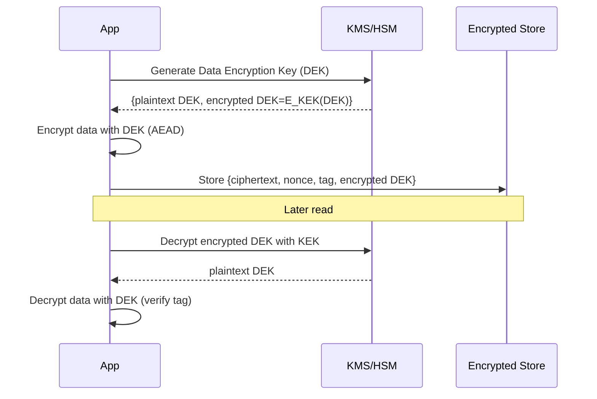

# Cryptography

Cryptography provides the primitives that implement confidentiality, integrity, and authenticity across your stack. Good crypto is less about inventing ciphers and more about composing well‑vetted algorithms with robust key management, operational hygiene, and secure defaults.

---

## Core Building Blocks

### Symmetric Encryption

- What it is: One key for both encryption and decryption.
- Modern choices: AES‑GCM, AES‑CTR + HMAC, ChaCha20‑Poly1305.
- Strengths: Fast; ideal for storage encryption, service‑to‑service payloads (when keys are pre‑shared/derived).
- Pitfalls: Never use AES‑ECB; never reuse IVs/nonces; prefer AEAD modes (GCM, Poly1305) to get integrity.

Guidance
- Prefer AEAD: AES‑256‑GCM or ChaCha20‑Poly1305 (better on low‑power/CPU without AES‑NI).
- Nonces/IVs: Random or sequential per algorithm guidance; never reuse with the same key.
- Key size: 256‑bit for new designs; rotate keys routinely and on compromise.

### Asymmetric (Public‑Key) Cryptography

- What it is: Keypair (public/private) enabling key agreement, encryption, and signatures.
- Algorithms:
  - RSA (encryption with OAEP; signatures with PSS) — mature, larger keys.
  - Elliptic Curve (ECDH/ECDSA; Ed25519 for signatures) — smaller keys, faster.
- Uses:
  - Key exchange (ECDH) to derive symmetric session keys.
  - Digital signatures (ECDSA/Ed25519, RSA‑PSS).
  - Identity and bootstrapping trust (certificates, PKI).

Guidance
- Use hybrid crypto: Public‑key for key exchange; symmetric for bulk data.
- Prefer Ed25519 for signatures in new systems; ECDH on curve25519/curve P‑256 for agreement.

### Hashing and Message Authentication

- Cryptographic hash: SHA‑256/SHA‑512 (avoid MD5 and SHA‑1).
- MACs: HMAC‑SHA‑256/512 to ensure integrity and authenticity.
- Password hashing: bcrypt, scrypt, Argon2id with per‑user unique salts; tune cost/iterations/memory to slow offline cracking.

Guidance
- Do not use raw SHA‑256 for passwords.
- Separate keys: Never reuse the same key for encryption and MAC.
- Timestamps and IDs: Use hashes only for integrity/lookup; not for secrecy.

### Digital Signatures

- Purpose: Integrity and non‑repudiation.
- Algorithms: Ed25519 (preferred), ECDSA (P‑256), RSA‑PSS.
- Practices:
  - Embed algorithm and key ID in signed artifact metadata.
  - Rotate keys; publish public keys via JWKS for services; use transparency where possible (e.g., Sigstore).

---

## Key Management

Keys are your crown jewels. The strongest algorithms fail with weak key hygiene.

- Generation: Use CSPRNGs only. Seed properly (OS entropy). Avoid custom PRNGs.
- Storage:
  - Cloud KMS/HSM (AWS KMS, GCP KMS, Azure Key Vault) for root/KEK.
  - Application secrets in managed stores (AWS Secrets Manager, GCP Secret Manager) with rotation.
- Rotation:
  - Separate DEK (data encryption keys) from KEK (key‑encryption keys).
  - Envelope encryption: Rotate KEKs regularly; rewrap DEKs without re‑encrypting bulk data.
- Access control: Least privilege on key usage; audit every decrypt/sign operation.
- Backup and escrow: Protect key backups with equal or stronger controls; monitor restoration paths.

Envelope encryption flow

---

## PKI and Certificates

- PKI roles:
  - Root CA: Offline, long‑lived, used to sign intermediate CAs.
  - Intermediate CA: Online issuance within constrained policy.
  - End‑entity certs: For servers/clients/code signing; short‑lived preferred.
- Lifecycle:
  - Issuance: CSR with correct SANs; short validity periods (90 days or less for TLS if feasible).
  - Revocation: OCSP stapling; CRLs where required; automated renewal.
- mTLS:
  - Use distinct trust stores per environment/tenant.
  - Constrain client certs via EKU and SAN; rotate intermediates with overlap.

---

## TLS/SSL Overview

- Prefer TLS 1.3; disable TLS 1.0/1.1; phase out weak ciphers on 1.2.
- Server configuration:
  - Minimum version: TLS 1.2 (prefer 1.3 where supported).
  - Ciphers: Strong forward‑secret suites; avoid CBC/RC4/3DES.
  - Certificates: Use SANs; enable OCSP stapling; HSTS for web (with care).
- Client configuration:
  - Validate hostnames; enforce certificate pinning only when you can maintain agility (HPKP is deprecated; use Certificate Transparency + short lifetimes).
- mTLS for service‑to‑service:
  - Automate cert provisioning (SPIRE/SPIRE‑agent, Istio, Linkerd, or custom with ACME).

What to publish next
- Detailed guidance in [tls-ssl.md](tls-ssl.md), including NGINX/HAProxy/Apache and Java/Golang client examples.

---

## Post‑Quantum Cryptography

- Why: Large‑scale quantum computers would break RSA/ECDH/ECDSA via Shor’s algorithm.
- State: NIST selections (2024/2025):
  - Key encapsulation: ML‑KEM (Kyber).
  - Signatures: ML‑DSA (Dilithium), SLH‑DSA (SPHINCS+).
- Migration:
  - Inventory where public‑key crypto is used (TLS, SSH, code signing, PKI).
  - Use hybrid key exchange (classical + PQ) where supported to preserve backwards compatibility.
  - Prefer agile crypto libraries and protocols supporting algorithm negotiation.
  - Plan for larger key/ciphertext sizes and performance impacts.

---

## Anti‑Patterns and Gotchas

- “Roll your own crypto” — use vetted libraries (libsodium, BoringSSL, OpenSSL, age).
- Static IVs/nonces — guarantee uniqueness per key.
- Homegrown token formats — use JWT/PASETO carefully with correct algorithms and validation.
- Long‑lived secrets — prefer short‑lived credentials and automated rotation.
- Incomplete integrity — encryption without authentication enables malleability attacks; use AEAD.

---

## Where to Go Next

- Symmetric vs Asymmetric: [symmetric-vs-asymmetric.md](symmetric-vs-asymmetric.md)
- Hashing and Password Storage: [hashing.md](hashing.md)
- Digital Signatures & Certificates: [digital-signatures-certificates.md](digital-signatures-certificates.md)
- Public Key Infrastructure: [pki.md](pki.md)
- TLS/SSL Configuration: [tls-ssl.md](tls-ssl.md)
- Post‑Quantum Security: [post-quantum.md](post-quantum.md)
