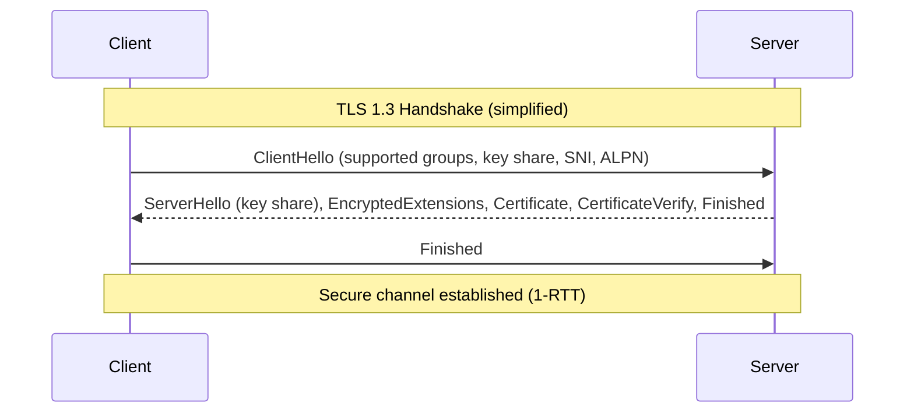

# TLS/SSL Configuration

TLS provides confidentiality, integrity, and endpoint authenticity for data in transit. This guide focuses on secure defaults, practical server/client configuration, key/cert lifecycle, and verification. Favor modern protocols, forward secrecy, and automation.

---

## What “Good” Looks Like

- Protocols: TLS 1.3 preferred; TLS 1.2 as minimum; disable 1.0/1.1.
- Ciphers: Strong AEAD with ECDHE for forward secrecy. Avoid CBC/RC4/3DES.
- Certificates: Short-lived, automated renewal, correct SANs, OCSP stapling.
- Verification: Strict hostname verification; pin cautiously; use CT and short lifetimes.
- mTLS (internal): Automate client cert issuance/rotation; constrain EKU/SAN.

---

## TLS 1.3 vs 1.2 (What Changes)

- Faster handshake (1-RTT) and 0-RTT option (avoid for replay-prone endpoints).
- Simpler cipher suites (AEAD only) and mandatory PFS (ECDHE).
- Session resumption with PSKs; no static RSA key exchange.



---

## Server Configuration

### NGINX (modern defaults)

Use OpenSSL 1.1.1+ or BoringSSL (for TLS 1.3).

```nginx
server {
  listen 443 ssl http2;
  server_name example.com;

  # Certificates
  ssl_certificate /etc/ssl/certs/fullchain.pem;
  ssl_certificate_key /etc/ssl/private/privkey.pem;

  # Protocols
  ssl_protocols TLSv1.3 TLSv1.2;

  # Cipher suites
  # TLS 1.3 ciphers are not configurable in OpenSSL (pre-3.0); they are strong by default.
  ssl_ciphers 'ECDHE-ECDSA-AES256-GCM-SHA384:
               ECDHE-RSA-AES256-GCM-SHA384:
               ECDHE-ECDSA-CHACHA20-POLY1305:
               ECDHE-RSA-CHACHA20-POLY1305:
               ECDHE-ECDSA-AES128-GCM-SHA256:
               ECDHE-RSA-AES128-GCM-SHA256';
  ssl_prefer_server_ciphers on;

  # OCSP Stapling
  ssl_stapling on;
  ssl_stapling_verify on;
  resolver 1.1.1.1 8.8.8.8 valid=300s;
  resolver_timeout 5s;

  # Security headers (web)
  add_header Strict-Transport-Security "max-age=31536000; includeSubDomains; preload" always;
  add_header X-Content-Type-Options nosniff;
  add_header X-Frame-Options DENY;
  add_header Referrer-Policy no-referrer-when-downgrade;

  # Session settings
  ssl_session_cache shared:SSL:50m;
  ssl_session_timeout 1d;

  # Prefer ECDSA certificate when supported for performance
  # Provide both ECDSA and RSA certificates via dual-cert config if needed.

  location / {
    proxy_set_header Host $host;
    proxy_set_header X-Forwarded-Proto https;
    proxy_pass http://app_backend;
  }
}
```

Notes
- Use HTTP/2 or HTTP/3 (QUIC) where supported. For QUIC, use a recent NGINX or a proxy like Envoy/Caddy.
- HSTS can lock you into HTTPS—roll out in stages (no preload initially) and ensure subdomains are ready.

### HAProxy

```haproxy
global
  tune.ssl.default-dh-param 2048

frontend https_in
  bind :443 ssl alpn h2,http/1.1 crt /etc/haproxy/certs/ \
       ssl-min-ver TLSv1.2 no-tls-tickets
  http-response add-header Strict-Transport-Security "max-age=31536000; includeSubDomains"
  default_backend app

backend app
  server app1 127.0.0.1:8080 check
```

Tune with modern ciphers:
```haproxy
ssl-default-bind-ciphers ECDHE+AESGCM:CHACHA20+POLY1305
ssl-default-bind-options no-sslv3 no-tls-tickets
```

### Apache httpd

```apache
<VirtualHost *:443>
  ServerName example.com
  SSLEngine on
  Protocols h2 http/1.1
  SSLProtocol -all +TLSv1.3 +TLSv1.2
  SSLCipherSuite TLSv1.3 TLS_AES_256_GCM_SHA384:TLS_CHACHA20_POLY1305_SHA256:TLS_AES_128_GCM_SHA256
  SSLCipherSuite ECDHE-ECDSA-AES256-GCM-SHA384:ECDHE-RSA-AES256-GCM-SHA384:\
                 ECDHE-ECDSA-CHACHA20-POLY1305:ECDHE-RSA-CHACHA20-POLY1305:\
                 ECDHE-ECDSA-AES128-GCM-SHA256:ECDHE-RSA-AES128-GCM-SHA256
  SSLHonorCipherOrder on

  SSLCertificateFile /etc/ssl/certs/fullchain.pem
  SSLCertificateKeyFile /etc/ssl/private/privkey.pem
  SSLOptions +StrictRequire
  Header always set Strict-Transport-Security "max-age=31536000; includeSubDomains"

  ProxyPass / http://127.0.0.1:8080/
  ProxyPassReverse / http://127.0.0.1:8080/
</VirtualHost>
```

---

## Client Configuration

### Go

```go
package main

import (
  "crypto/tls"
  "crypto/x509"
  "io"
  "log"
  "net/http"
  "os"
)

func main() {
  // Optional: custom root pool (e.g., for private PKI)
  roots := x509.NewCertPool()
  caCert, _ := os.ReadFile("rootCA.pem")
  roots.AppendCertsFromPEM(caCert)

  tr := &http.Transport{
    TLSClientConfig: &tls.Config{
      MinVersion: tls.VersionTLS12,
      RootCAs:    roots,          // omit to use system roots
      ServerName: "example.internal", // enforce SNI+Hostname verification
    },
  }

  client := &http.Client{Transport: tr}
  resp, err := client.Get("https://example.internal/health")
  if err != nil { log.Fatal(err) }
  defer resp.Body.Close()
  body, _ := io.ReadAll(resp.Body)
  log.Println(string(body))
}
```

mTLS (client cert):
```go
cert, _ := tls.LoadX509KeyPair("client.crt", "client.key")
tr.TLSClientConfig.Certificates = []tls.Certificate{cert}
```

### Java (TLS 1.3+)

```java
import javax.net.ssl.*;
import java.net.http.*;
import java.net.URI;
import java.time.Duration;

public class TlsClient {
  public static void main(String[] args) throws Exception {
    SSLContext ctx = SSLContext.getInstance("TLSv1.3");
    ctx.init(null, null, null); // system defaults; use TrustManager for custom roots

    HttpClient client = HttpClient.newBuilder()
      .sslContext(ctx)
      .connectTimeout(Duration.ofSeconds(5))
      .build();

    HttpRequest req = HttpRequest.newBuilder()
      .uri(URI.create("https://example.com/"))
      .GET().build();

    HttpResponse<String> res = client.send(req, HttpResponse.BodyHandlers.ofString());
    System.out.println(res.statusCode());
    System.out.println(res.body());
  }
}
```

### curl / OpenSSL

- Check negotiated protocol and certificate chain:
```bash
curl -vk --tlsv1.2 https://example.com/
openssl s_client -connect example.com:443 -servername example.com -tls1_3 -showcerts
```

---

## Certificates and PKI

- Use ACME (Let’s Encrypt, ZeroSSL) for public services; automate renewal (e.g., certbot, lego).
- For internal services, use private PKI (SPIRE, HashiCorp Vault PKI, Smallstep CA) with short‑lived certs.
- Always include correct SANs (DNS/IP) — CN is ignored by modern clients.
- Enable OCSP stapling on servers; prefer short validity over pinning.

Dual-cert strategy
- Provide both ECDSA and RSA certs for broad client compatibility.
- Many servers (NGINX, HAProxy) will choose the best cert per client capabilities.

---

## mTLS for Service-to-Service

- Use per-service identities and automate cert issuance/rotation.
- Constrain client certificates via EKU (ClientAuth) and SAN (SPIFFE ID, DNS).
- Example Envoy filter chain (conceptual):
```yaml
transport_socket:
  name: envoy.transport_sockets.tls
  typed_config:
    "@type": type.googleapis.com/envoy.extensions.transport_sockets.tls.v3.DownstreamTlsContext
    common_tls_context:
      tls_params:
        tls_minimum_protocol_version: TLSv1_2
      tls_certificates:
        - certificate_chain: {filename: "/etc/tls/tls.crt"}
          private_key: {filename: "/etc/tls/tls.key"}
      validation_context:
        trusted_ca: {filename: "/etc/tls/ca.crt"}
        match_subject_alt_names:
          - exact: "spiffe://example.local/ns/prod/sa/payment"
    require_client_certificate: true
```

---

## Testing and Validation

- SSL Labs: https://www.ssllabs.com/ssltest/
- testssl.sh: https://testssl.sh
- Validate HSTS, OCSP stapling, supported protocols/ciphers, ALPN (h2), and SNI behavior.
- Monitor cert expiry and renewal events.

---

## Common Pitfalls

- Supporting legacy protocols/ciphers “for compatibility” without segmentation.
- Missing SANs causing hostname verification failures.
- Long-lived certificates (1+ year) increasing compromise blast radius.
- Secret leakage in config repos; keep private keys out of Git and restrict permissions.
- Enabling 0-RTT on non-idempotent endpoints (replay risk).

---

## Reference Cipher Guidance

- TLS 1.3: Use defaults (AES_128_GCM, AES_256_GCM, CHACHA20_POLY1305).
- TLS 1.2 (fallback):
  - ECDHE-ECDSA-AES128-GCM-SHA256
  - ECDHE-RSA-AES128-GCM-SHA256
  - ECDHE-ECDSA-CHACHA20-POLY1305
  - ECDHE-RSA-CHACHA20-POLY1305
  - ECDHE-ECDSA-AES256-GCM-SHA384
  - ECDHE-RSA-AES256-GCM-SHA384

Disable: RC4, 3DES, NULL, aNULL, eNULL, MD5-based suites, static RSA key exchange.

---

## Checklist

- [ ] TLS 1.3 enabled; TLS 1.2 allowed; older disabled.
- [ ] Strong AEAD ciphers only; PFS via ECDHE.
- [ ] Certificates with correct SANs; automated renewal and OCSP stapling.
- [ ] HSTS deployed after validation; HTTP to HTTPS redirects enforced.
- [ ] Strict hostname verification on clients; mTLS for internal services as needed.
- [ ] Cert/key storage with least privilege; keys not committed to source control.
- [ ] Continuous testing with SSL Labs/testssl.sh and monitoring for expiry.
