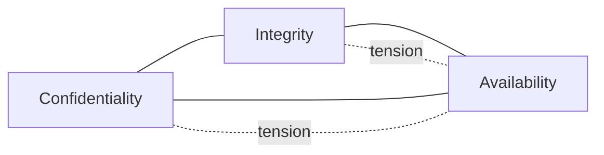
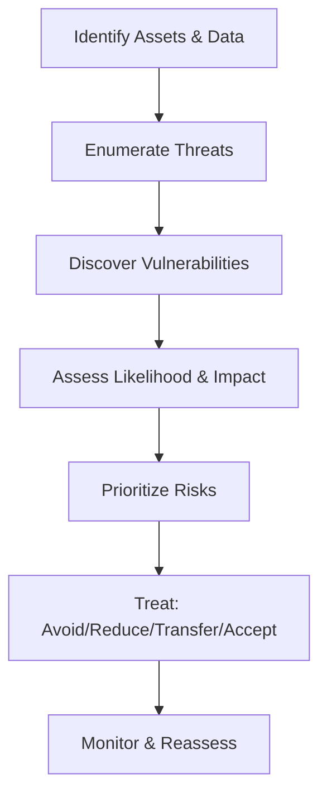

# Security Fundamentals

Security engineering is the practice of preserving system value in the presence of adversaries, accidents, and uncertainty. At its core are a few foundational ideas that show up everywhere—from application code and operating systems to networks and cloud environments. This page presents those fundamentals with practical guidance and trade‑offs you will face in real systems.

---

## CIA Triad

The CIA triad frames three primary security objectives:

- Confidentiality: Prevent unauthorized disclosure of information.
- Integrity: Prevent unauthorized modification or destruction of data.
- Availability: Ensure timely and reliable access to systems and data.

These goals often compete. Dialing one up can pressure the others; your design needs to balance them based on business risk and context.

Practical examples
- Confidentiality: Encrypt data at rest and in transit; apply least privilege; use tokenization for PII.
- Integrity: Use digital signatures and checksums; deploy WORM storage for logs; implement strict change control.
- Availability: Redundant components, multi‑AZ/region deployment, rate limiting, load shedding, autoscaling, DOS mitigation.

Common trade‑offs
- More authentication factors improve confidentiality but can reduce availability for users during outages of IDP or SMS/email channels.
- Strong integrity controls (e.g., mandatory access control, approvals) slow down change velocity; mitigate with automation and auditable workflows.
- Aggressive caching and replication boost availability but increase attack surface and integrity risk if invalidation is weak.

Key takeaways
- Express requirements explicitly per asset: “Customer PII” (C: High, I: High, A: Medium), “Public status page” (A: Very High, I: High, C: Low).
- Use objective SLOs for availability; use policy and technical controls for confidentiality and integrity.

---

## Authentication vs Authorization

- Authentication (AuthN): Prove identity.
  - Mechanisms: Passwords (with strong hashing), WebAuthn/passkeys, OTP/TOTP (MFA), client certificates, federated identity (OIDC/SAML).
  - Guidance: Prefer phishing‑resistant MFA (WebAuthn) over SMS; use device posture when available.

- Authorization (AuthZ): Decide what an authenticated principal may do.
  - Models: RBAC (roles), ABAC (attributes), ReBAC (relationships), policy‑based (OPA, Cedar).
  - Guidance: Centralize authorization policy, externalize from apps, implement deny‑by‑default, log allow and deny decisions.

Session and token considerations
- Prefer short‑lived tokens (minutes) with refresh tokens bound to device or session context.
- For JWTs, sign with asymmetric keys; rotate keys via JWKS; constrain scopes and audiences; keep token size reasonable.
- For session cookies, mark as Secure, HttpOnly, SameSite=Lax/Strict; bind to TLS channel and user agent characteristics where feasible.

---

## Security Models

Security models provide formal ways to reason about policy. They are useful for high‑assurance systems, regulated environments, and as mental models for engineering trade‑offs.

Bell–LaPadula (Confidentiality‑focused)
- Goal: Prevent information from flowing from high‑classification levels to lower ones.
- Rules: No Read Up (NRU), No Write Down (NWD).
- Use: Military/government classification, data leak prevention.
- Trade‑off: Can hinder collaboration; integrity not addressed.

Biba (Integrity‑focused)
- Goal: Prevent contamination of high‑integrity data by low‑integrity sources.
- Rules: No Read Down (NRD), No Write Up (NWU).
- Use: Safety‑critical systems, financial records, code promotion pipelines.
- Trade‑off: May reduce data availability for lower‑integrity users/tasks.

Clark–Wilson (Commercial integrity with separation of duties)
- Goal: Enforce well‑formed transactions and separation of duties.
- Concepts: Constrained Data Items (CDIs), Transformation Procedures (TPs), Integrity Verification Procedures (IVPs).
- Use: Financial systems, ERP, change management workflows.
- Trade‑off: Operational complexity; requires auditable processes.

Applying models in practice
- Data pipelines: Biba‑style integrity lanes (dev → test → prod); only promoted artifacts can “write up.”
- Multi‑tenant SaaS: Bell–LaPadula‑style isolation to prevent cross‑tenant reads.
- Payments: Clark–Wilson‑style enforced workflows with dual control for refunds and settlements.

---

## Risk Management

Security risk is the combination of the likelihood of a threat exploiting a vulnerability and the resulting impact. Good programs focus on measurable risk reduction, not just control checklists.

Key terms
- Threat: An agent or event that could cause harm (adversary, insider, outage, disaster).
- Vulnerability: A weakness that can be exploited (unpatched service, misconfigured S3 bucket).
- Exposure: The degree to which an asset is susceptible (publicly reachable, privileged).
- Impact: The consequence if realized (financial loss, legal penalties, downtime).

Risk assessment flow

Estimating risk
- Qualitative: Use a 3x3 or 5x5 matrix (Low/Medium/High) for early triage.
- Semi‑quant: Calibrate ordinal scales; use likelihood in events/year and bounded impact ranges.
- Quantitative: Use loss exceedance curves, Monte Carlo, FAIR, where data supports it.

Treatment strategies
- Avoid: Disable the risky feature or retire the system.
- Reduce: Patch, harden configs, segment networks, add detection/response.
- Transfer: Insurance; contractual risk transfer to vendors with clear responsibilities.
- Accept: Document rationale and revisit on a cadence; pair with detection.

Policies, standards, and compliance
- Policy: Executive intent (e.g., “We encrypt data at rest and in transit”).
- Standard: Specifics and configurations (e.g., approved ciphers, key lengths, TLS min version).
- Procedure: How to implement and operate (runbooks, checklists).
- Mapping: Tie controls to frameworks (ISO 27001, SOC 2, PCI DSS, NIST CSF) to reduce audit friction.

Practical guardrails
- Baseline hardening: CIS benchmarks; immutable infra; golden images.
- Vulnerability management: Inventory, SLAs per severity, patch pipelines, compensating controls.
- Change control: Peer review, approvals for sensitive changes, auditable trails.
- Logging and detection: Centralized logs, normalized schema, alerting with runbooks.
- Resilience: Backups, tested restore, DR plans with executable RTO/RPO.

---

## Putting It Together

- Start with asset classification and CIA targets per asset.
- Design controls that satisfy your CIA posture, then validate with threat modeling.
- Prioritize based on risk; invest first in controls that reduce high‑impact, high‑likelihood risks.
- Balance preventive, detective, and responsive controls to avoid brittle systems.

Next steps
- Apply these fundamentals in practice across cryptography, network security, application security, IAM, OS security, cloud, and incident response. Subsequent sections will provide concrete configurations, patterns, and checklists aligned to these principles.
