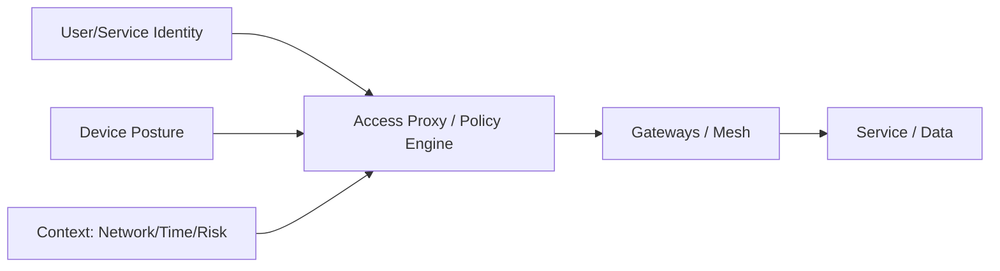

# Identity & Access Management (IAM)

IAM defines how principals (users, services, machines) prove who they are and what they are allowed to do. Strong IAM is the backbone of security: it enables least privilege, zero trust, auditable access, and safe automation across on‑prem and cloud.

This page provides an implementation‑oriented overview and links to focused guides (MFA, RBAC/ABAC/ReBAC, SSO, Federation, Cloud IAM patterns, and Zero Trust).

---

## Core Principles

- Strong authentication
  - Prefer phishing‑resistant factors (WebAuthn/passkeys, platform authenticators, security keys).
  - Layer factors by risk (step‑up auth for sensitive actions).
- Clear authorization
  - Deny‑by‑default; least privilege; explicit grants; short‑lived access.
  - Centralize policy and externalize enforcement from app code where possible.
- Segregation of duties
  - Separate administrators, approvers, and operators. Require dual control for sensitive operations.
- Short‑lived credentials
  - Use ephemeral tokens/credentials via brokers (e.g., STS, workload identity).
- Continuous verification (Zero Trust)
  - AuthZ decisions factor identity + device posture + context (network, time, risk).

---

## Authentication

- Baseline
  - Enforce MFA for all interactive users; require phishing‑resistant factors for admins.
  - Disable legacy protocols (IMAP/POP/Basic Auth); block password reuse; integrate breach checks.
- Non‑interactive/services
  - Use workload identity (OIDC/SPIFFE) or short‑lived credentials minted by a secure broker; avoid static keys.

See: [Multi‑Factor Authentication (MFA)](mfa.md) and [Single Sign‑On (SSO)](sso.md)

---

## Authorization Models

- RBAC (Role‑Based Access Control)
  - Simple, coarse permissions grouped by job function.
  - Watch for role explosion; use composable roles and inheritance.
- ABAC (Attribute‑Based Access Control)
  - Decisions based on attributes (user, resource, environment).
  - Good for multi‑tenant and context‑aware policies.
- ReBAC (Relationship‑Based Access Control)
  - Graph of relationships (e.g., user A can edit doc X if A has editor on group G that owns X).
  - Useful for collaborative and shared resource models.

Policy engines
- OPA/Rego, AWS Cedar, Zanzibar‑style systems.
- Externalize policy evaluation; log allow/deny with inputs and decisions.

See: [RBAC & ABAC](rbac-abac.md)

---

## Least Privilege & Zero Trust

Least privilege
- Grant the minimum required permissions; time‑bound and use just‑in‑time elevation.
- Prefer resource‑scoped permissions (e.g., per‑project, per‑namespace).

Zero Trust
- Identity‑aware access at every layer (edge, proxy, service mesh).
- Continuous checks: user/device posture, risk signals, behavior baselines.

See: [Least Privilege & Zero Trust](least-privilege-zero-trust.md)

---

## Federation, SSO, and Standards

- SSO
  - Centralize auth via an IdP; reduce password attack surface; consistent policy enforcement.
- Federation
  - OIDC (modern, JSON/HTTP) for most app integrations; SAML for legacy/enterprise apps.
- SCIM
  - Automate provisioning/deprovisioning (joiner/mover/leaver). Avoid orphaned access.

See: [SSO](sso.md) and [Federation (SAML/OIDC)](federation-saml-oidc.md)

---

## Credential and Key Hygiene

- Rotate regularly and automatically; prefer short lifetimes over long‑lived static secrets.
- Store secrets in managed vaults; restrict access; audit every use.
- For service‑to‑service, prefer mTLS identities and token exchange; avoid sharing user tokens downstream.

Cross‑references
- Transport: [TLS/SSL Configuration](/docs/security/cryptography/tls-ssl/)
- Password safety: [Hashing and Password Storage](/docs/security/cryptography/hashing/)
- Certificates/PKI: [PKI](/docs/security/cryptography/pki/)

---

## Cloud IAM Patterns

- Principle of least privilege per cloud account/project/subscription.
- Use separate accounts per environment/tenant; isolate blast radius.
- Prefer role assumption / STS over static access keys (AWS STS, GCP SA tokens, Azure Managed Identity).
- Resource‑level policies: bucket/object ACLs, KMS key policies, VPC service controls.
- Break‑glass accounts with hardware tokens; monitored and tested.

See: [Cloud IAM](cloud-iam.md)

---

## Auditing and Access Reviews

- Maintain immutable, centralized logs for authN, authZ, and admin changes.
- Periodic access reviews with owners; remove unused roles and stale accounts.
- Detect anomalies: impossible travel, excessive failures, privilege escalations.

---

## Where to Go Next

- [MFA](mfa.md)
- [RBAC & ABAC](rbac-abac.md)
- [Least Privilege & Zero Trust](least-privilege-zero-trust.md)
- [SSO](sso.md)
- [Federation (SAML/OIDC)](federation-saml-oidc.md)
- [Cloud IAM](cloud-iam.md)
