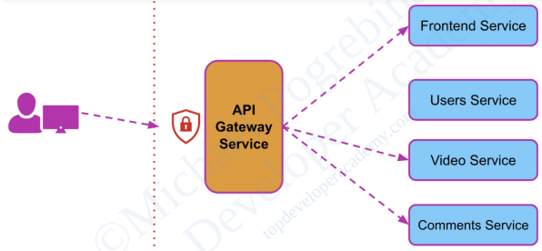
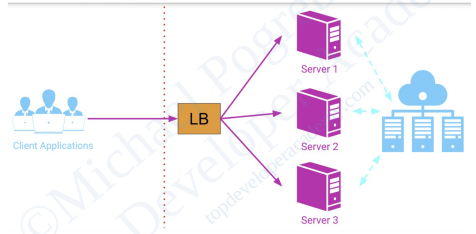
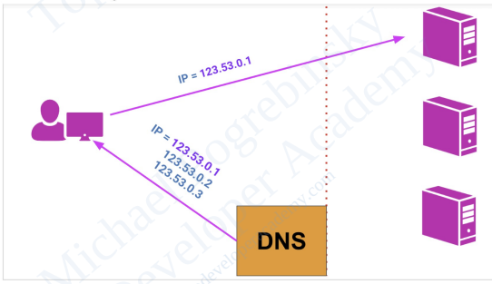
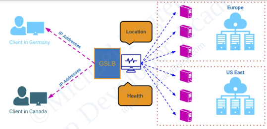
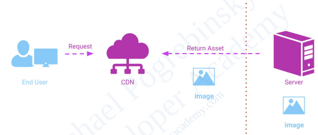
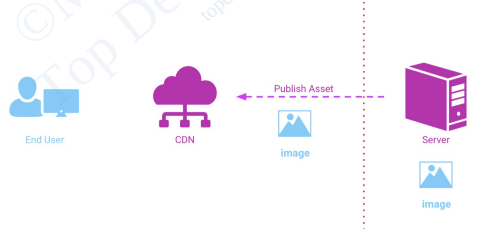

+++
title= "Architectural Patterns"
tags = [ "system-design", "architecture", "hld", "architectural-patterns" ]
date = 2024-08-26T00:01:00+05:30
author = "Me"
showToc = true
TocOpen = false
draft = false
hidemeta = false
comments = false
disableShare = false
disableHLJS = false
hideSummary = false
searchHidden = true
ShowReadingTime = true
ShowBreadCrumbs = true
ShowPostNavLinks = true
ShowWordCount = true
ShowRssButtonInSectionTermList = true
UseHugoToc = true
weight= 1
bookCollapseSection= true
+++

## Architectural Building Blocks

### API Gateway

#### Overview

An API Gateway is an API management service that acts as an intermediary between clients and backend services. It uses the API composition pattern to aggregate multiple backend services into a single API endpoint that clients interact with. This abstraction provides several key benefits:

#### Benefits of an API Gateway

1. **Seamless Internal Changes**:
   - Facilitates internal system changes without impacting external API consumers. For example, it enables the splitting of a frontend service into different services for various devices without altering the external API.

2. **Consolidated Security**:
   - Centralizes security, authentication, and authorization. The API Gateway can handle SSL termination, enforce rate limits, and control access, ensuring secure interactions and protecting against malicious requests.

3. **Improved Performance**:
   - **Request Routing**: Routes client requests to the appropriate backend services and aggregates responses into a single response, reducing the number of client-side calls.
   - **Caching**: Stores responses to common requests, improving response times by serving cached data instead of querying backend services repeatedly.

4. **Enhanced Monitoring and Alerting**:
   - Provides real-time visibility into system traffic patterns and load. Enables monitoring and alerting for traffic anomalies, helping in system observability and proactive issue management.

5. **Protocol Translation**:
   - Handles protocol and format translation between clients and backend services. Supports integration with various external systems by converting different protocols and data formats as needed.

#### Best Practices and Anti-Patterns

1. **Avoid Business Logic**:
   - The API Gateway should not include business logic. Its primary functions should be API composition and request routing. Adding business logic can lead to a monolithic architecture and undermine the benefits of service decomposition.

2. **Single Point of Failure**:
   - An API Gateway can become a single point of failure. To address this, deploy multiple instances behind a load balancer and ensure robust release management to prevent service disruptions.

3. **Performance Overhead**:
   - While an API Gateway introduces some performance overhead, the overall benefits generally outweigh this. Avoid bypassing or over-optimizing the API Gateway, as this can reintroduce tight coupling and complicate client interactions.

#### API Gateway Solutions & Cloud Technologies

##### Open Source API Gateways

###### Netflix Zuul
- **Description**: Zuul is a free and open-source application gateway written in Java.
- **Capabilities**: Provides dynamic routing, monitoring, resiliency, security, and more.

##### Cloud-Based API Gateways

###### Amazon API Gateway
- **Description**: A fully managed service for creating, publishing, maintaining, monitoring, and securing APIs at any scale.
- **Supports**: RESTful APIs and WebSocket APIs (bi-directional communication between client and server).

###### Google Cloud Platform API Gateway
- **Description**: Enables secure access to services through a well-defined REST API consistent across all services.
###### Microsoft Azure API Management
- **Description**: Helps organizations publish APIs to external, partner, and internal developers to unlock the potential of their data and services.

### Load Balancer

A **load balancer** is a fundamental building block in software architecture, especially for large-scale systems. Its primary role is to distribute incoming network traffic across multiple servers, ensuring no single server is overwhelmed. This distribution helps achieve high availability and horizontal scalability by running multiple instances of an application on different servers.

#### Motivation for Using Load Balancers

Without a load balancer, a client application would need to know the addresses and number of server instances directly. This tight coupling makes it challenging to modify the system's internal structure without affecting the client application. Load balancers provide an abstraction layer, making the entire system appear as a single server with immense computing power and memory.

#### Quality Attributes Provided by Load Balancers

1. **High Scalability**: 
   - Allows for scaling the system horizontally by adding or removing servers based on demand. In cloud environments, this can be automated with policies that react to metrics like request rate and bandwidth usage.

2. **High Availability**: 
   - Load balancers can monitor server health and route traffic only to healthy servers, ensuring continuous availability even if some servers fail.

3. **Performance**: 
   - While load balancers may introduce minimal latency, they enable higher throughput by distributing requests across multiple servers.

4. **Maintainability**: 
   - Facilitates rolling updates and maintenance by allowing servers to be taken offline for upgrades without disrupting the overall system.

##### Types of Load Balancers

1. **DNS Load Balancing**:

   - Uses DNS to map a domain name to multiple IP addresses. The list of addresses is rotated, balancing the load. However, this method lacks health checks and only supports simple round-robin strategies, making it less reliable and secure.

2. **Hardware Load Balancers**:
   - Dedicated devices optimized for load balancing tasks. They offer features like health checks, intelligent traffic distribution, and can secure the system by hiding internal server details.

3. **Software Load Balancers**:
   - Programs running on general-purpose hardware. They provide similar features to hardware load balancers but can be more flexible and cost-effective.

4. **Global Server Load Balancer (GSLB)**:

   - Combines DNS and load balancer functionalities, intelligently routing users based on location, server load, response time, and more. GSLBs are essential for multi-data center deployments and disaster recovery scenarios.

#### Load Balancing Solutions & Cloud Technologies

##### Open Source Software Load Balancing Solutions

###### HAProxy
HAProxy is a free and open-source, reliable, high-performance TCP/HTTP load balancer. It is particularly well-suited for high-traffic websites and powers many of the world's most visited ones. HAProxy is considered the de-facto standard open-source load balancer and is included with most mainstream Linux distributions. It supports most Unix-style operating systems.

###### NGINX
NGINX is a free, open-source, high-performance HTTP server and reverse proxy (load balancer). Known for its performance, stability, rich feature set, and simple configuration, NGINX is a popular choice for many applications. 

##### Cloud-Based Load Balancing Solutions

###### AWS - Elastic Load Balancing (ELB)
Amazon ELB is a highly scalable load balancing solution designed for use with AWS services. It operates in four modes:
- **Application (Layer 7) Load Balancer**: Ideal for advanced load balancing of HTTP and HTTPS traffic.
- **Network (Layer 4) Load Balancer**: Ideal for load balancing TCP and UDP traffic.
- **Gateway Load Balancer**: Ideal for deploying, scaling, and managing third-party virtual appliances.
- **Classic Load Balancer (Layer 4 and 7)**: Ideal for routing traffic to EC2 instances.

###### GCP - Cloud Load Balancing
Google Cloud Platform Load Balancer is a scalable and robust load-balancing solution. It allows you to put your resources behind a single IP address that is either externally accessible or internal to your Virtual Private Cloud (VPC) network. Available load balancer types include:
- **External HTTP(S) Load Balancer**: Externally facing HTTP(s) (Layer 7) load balancer.
- **Internal HTTP(S) Load Balancer**: Internal Layer 7 load balancer.
- **External TCP/UDP Network Load Balancer**: Externally facing TCP/UDP (Layer 4) load balancer.
- **Internal TCP/UDP Load Balancer**: Internally facing TCP/UDP (Layer 4) load balancer.

###### Microsoft Azure Load Balancer
Microsoft Azure provides three types of load balancers:
- **Standard Load Balancer**: Public and internal Layer 4 load balancer.
- **Gateway Load Balancer**: High performance and high availability load balancer for third-party Network Virtual Appliances.
- **Basic Load Balancer**: Ideal for small-scale applications.

##### GSLB Solutions

###### Amazon Route 53
Amazon Route 53 is a highly available and scalable cloud Domain Name System (DNS) web service.

###### AWS Global Accelerator
AWS Global Accelerator is a networking service that improves the availability, performance, and security of public applications.

###### Google Cloud Platform Load Balancer & Cloud DNS
Google Cloud Platform offers reliable, resilient, low-latency DNS services from its worldwide network, with comprehensive domain registration, management, and serving capabilities.

###### Azure Traffic Manager
Azure Traffic Manager provides DNS-based load balancing.

### Message Brokers: The Building Block for Asynchronous Architectures

A message broker is a software component that uses the queue data structure to store and manage messages between senders and receivers. Unlike load balancers, which manage external traffic and are visible to clients, message brokers operate internally within a system and are not exposed externally.

#### Synchronous Communication Drawbacks

In synchronous communication, both the sender and receiver must be active and maintain an open connection for the transaction to complete. This can lead to several issues:
- **Connection Dependence**: Both services must be healthy and running simultaneously.
- **Long Processing Times**: Services that take a long time to process requests can cause delays and hold up the entire system.
- **Traffic Handling**: Synchronous communication lacks the ability to handle sudden increases in traffic effectively.

**Example**: In a ticket reservation system, a frontend service must wait for the backend service to complete several operations before providing a response to the user. This creates a delay and can be problematic if the backend service crashes or if there’s a sudden spike in requests.

#### Benefits of Message Brokers

##### Decoupling and Asynchronous Processing

Message brokers allow services to communicate without requiring them to be available simultaneously. For instance:
- **Asynchronous Responses**: In the ticket reservation system, the user receives an immediate acknowledgment and the system processes the ticket reservation and payment in the background.
- **Service Decoupling**: Services can be broken down into smaller components, each handling a part of the transaction, and communicate through the message broker.

##### Buffering and Handling Traffic Spikes

Message brokers can queue messages, helping absorb traffic spikes. For example:
- **Order Fulfillment**: In an online store, orders can be queued during high traffic periods and processed sequentially when the load decreases.

##### Publish-Subscribe Pattern

Message brokers support the publish-subscribe pattern where:
- **Multiple Subscribers**: Different services can subscribe to the same channel to receive notifications or updates.
- **Flexible Integration**: New services can be added without altering existing systems, such as adding analytics or notification services.

#### Quality Attributes of Message Brokers

- **Fault Tolerance**: Message brokers enhance fault tolerance by allowing services to communicate even if some are temporarily unavailable.
- **Message Reliability**: They prevent message loss, contributing to higher system availability.
- **Scalability**: They help the system scale to handle high traffic by buffering messages.

#### Performance Considerations

While message brokers provide superior availability and scalability, they introduce some latency due to the indirection involved. However, this performance penalty is generally minimal for most systems.

#### Message Brokers Solutions & Cloud Technologies

#### Open Source Message Brokers

- **Apache Kafka**: The most popular open-source message broker today. Apache Kafka is a distributed event streaming platform used by thousands of companies for high-performance data pipelines, streaming analytics, data integration, and mission-critical applications.

- **RabbitMQ**: A widely deployed open-source message broker used globally by both small startups and large enterprises.

#### Cloud-Based Message Brokers

- **Amazon Simple Queue Service (SQS)**: A fully managed message queuing service that enables you to decouple and scale microservices, distributed systems, and serverless applications.

- **GCP Pub/Sub and Cloud Tasks**: Publisher/Subscriber and message queue solutions offered by Google Cloud Platform. 

- **Microsoft Azure**:
  - **Service Bus**: A fully managed enterprise message broker with message queues and publish-subscribe topics.
  - **Event Hubs**: A fully managed real-time data ingestion service that allows streaming millions of events per second from any source. Integrates seamlessly with Apache Kafka clients without code changes. Ideal for Big Data.
  - **Event Grid**: A reliable, serverless event delivery system at a massive scale. Uses the publish-subscribe model and is dynamically scalable. It offers a low-cost pay-as-you-go model and guarantees "at least once delivery of an event."

### Content Delivery Networks (CDNs)

#### Problem Addressed by CDNs
Even with distributed web hosting and technologies like Global Server Load Balancing, significant latency remains due to the physical distance between users and hosting servers, as well as the multiple network hops between routers.

#### Example of Latency Without CDN
- **User Location**: Brazil
- **Server Location**: East Coast, USA
- **Initial Latency**: 200 milliseconds
- **TCP Connection Latency**: 600 milliseconds (3-way handshake)
- **HTTP Request Latency**: 400 milliseconds
- **Asset Loading Latency**: 2,000 milliseconds
- **Total Latency**: Over 3 seconds

#### Introduction to CDNs
- **Definition**: A Content Delivery Network (CDN) is a globally distributed network of servers designed to speed up content delivery to end users.
- **Purpose**: Reduces latency by caching content on edge servers closer to users.
- **Usage**: Delivers webpage content, assets (images, text, CSS, JavaScript), and video streams.

#### Benefits of CDNs
1. **Faster Page Loads**: Reduces total latency to under one second by serving cached content from edge servers.
2. **Improved Availability**: Content is distributed, reducing the impact of server issues.
3. **Enhanced Security**: Protects against DDoS attacks by distributing traffic across multiple servers.

#### CDN Caching Strategies

##### Pull Strategy

- **How It Works**: CDN caches content on first request, subsequent requests are served from the cache.
- **Advantages**: Lower maintenance, CDN manages cache updates.
- **Drawbacks**: Initial latency for uncached assets, potential traffic spikes when assets expire simultaneously.

##### Push Strategy

- **How It Works**: Content is manually or automatically uploaded to the CDN. Updates require re-publishing.
- **Advantages**: Reduces traffic to the origin server, maintains high availability even if the origin server is down.
- **Drawbacks**: Requires active management to update content, risk of serving outdated content if not updated.

#### CDN Solutions & Cloud Technologies

#### Cloudflare
- **Description**: Offers ultra-fast static and dynamic content delivery over a global edge network.
- **Benefits**: Reduces bandwidth costs and provides built-in unmetered DDoS protection.

#### Fastly
- **Description**: Deliver@Edge is a modern, efficient, and highly configurable CDN.
- **Benefits**: Provides control over content caching to deliver user-requested content quickly.

#### Akamai
- **Description**: Offers a variety of services including API Acceleration, Global Traffic Management, Image & Video Management, and Media Delivery.

#### Amazon CloudFront
- **Description**: A high-performance CDN service built for security and developer convenience.
- **Use Cases**: Delivers fast, secure websites, accelerates dynamic content and APIs, supports live streaming, and video-on-demand.

#### Google Cloud Platform CDN
- **Description**: Provides fast, reliable web and video content delivery with global scale and reach.

#### Microsoft Azure Content Delivery Network
- **Description**: Offers global coverage, full integration with Azure services, and a simple setup.

