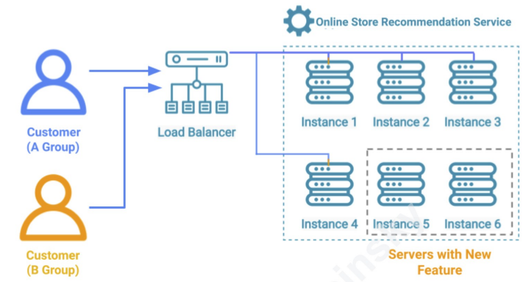

+++
title= "Deployment Patterns"
tags = [ "system-design", "architecture", "hld", "architectural-patterns", "deployment" ]
author = "Me"
showToc = true
TocOpen = false
draft = false
hidemeta = false
comments = false
disableShare = false
disableHLJS = false
hideSummary = false
searchHidden = true
ShowReadingTime = true
ShowBreadCrumbs = true
ShowPostNavLinks = true
ShowWordCount = true
ShowRssButtonInSectionTermList = true
UseHugoToc = true
weight= 1
bookFlatSection= true
+++

## Deployment Patterns

### Rolling Deployment

**Overview:**
The Rolling Deployment pattern is used for upgrading production servers without significant downtime. It involves gradually replacing application instances with a new version while maintaining service availability.

**How It Works:**
1. **Load Balancing:** Stop sending traffic to one server at a time using a load balancer.
2. **Upgrade:** Replace the old application instance with the new version on the server.
3. **Testing:** Optionally run tests on the upgraded server.
4. **Reintegration:** Add the updated server back into the load balancer's rotation.
5. **Repeat:** Continue the process for all servers until all are running the latest version.

**Benefits:**
- **No Downtime:** The system remains operational throughout the upgrade.
- **Gradual Release:** New versions are released gradually, reducing risk compared to a "big bang" approach.
- **Cost-Effective:** No need for additional hardware or infrastructure.

**Downsides:**
- **Cascading Failures:** New versions might cause failures that could impact old servers still in operation.
- **Compatibility Issues:** Running two versions side by side may cause issues if the new version is not fully compatible with the old one.

### Blue Green Deployment

**Overview:**
The Blue Green Deployment pattern is used to release a new version of software by maintaining two separate environments—Blue and Green. This approach aims to minimize risks and ensure a smooth transition between versions.

**How It Works:**

1. **Blue Environment:** The old version of the application continues running on this set of servers.
2. **Green Environment:** A new set of servers is provisioned, and the new version of the application is deployed here.
3. **Verification:** After deployment, the new instances in the Green environment are tested to ensure they work as expected.
4. **Traffic Shift:** Traffic is gradually redirected from the Blue environment to the Green environment using a load balancer.
5. **Rollback:** If issues are detected, traffic can be switched back to the Blue environment. If all is well, the Blue environment can be decommissioned or kept for the next release cycle.

**Benefits:**
- **No Downtime:** The Blue environment remains operational during the transition, ensuring continuous service availability.
- **Safe Rollbacks:** If problems arise, traffic can be easily shifted back to the old version, minimizing risk.
- **Consistent User Experience:** Customers experience only one version of the software at a time, reducing compatibility issues.

**Downsides:**
- **Increased Costs:** Running both Blue and Green environments simultaneously means needing twice the server capacity during the release.
- **Resource Usage:** Additional servers are required, which can lead to higher operational costs.

### Canary Release and A/B Testing

**Canary Release:**
The Canary Release pattern blends elements from both rolling and blue-green deployment strategies to offer a balanced approach to deploying new software versions.

**How It Works:**

1. **Initial Deployment:** Deploy the new version of the software to a small subset of existing servers (the Canary servers).
2. **Traffic Management:** Redirect either all or a subset of traffic (e.g., internal users or beta testers) to these Canary servers.
3. **Monitoring:** Observe the performance and functionality of the Canary servers compared to the rest of the servers running the old version.
4. **Rollout Decision:** If the Canary version performs well, gradually update the rest of the servers using a rolling release approach. If issues arise, traffic can be shifted back to the old servers.

**Benefits:**
- **Reduced Risk:** Issues affect only a small subset of users, making it easier to manage and rollback if needed.
- **Informed Decisions:** Provides confidence in the new version before a full-scale deployment.
- **Selective Traffic:** Directs traffic from internal users or beta testers to mitigate potential impacts.

**Challenges:**
- **Monitoring Complexity:** Requires clear success criteria and effective automation to monitor performance.
- **Resource Allocation:** Needs careful management to ensure that monitoring and rollback processes are efficient.

**A/B Testing:**
A/B Testing is similar to Canary Release but focuses on testing new features rather than full software versions.

**How It Works:**
1. **Experimental Deployment:** Deploy a new feature or version on a small subset of servers.
2. **User Segmentation:** Redirect a portion of real user traffic to these experimental servers.
3. **Data Collection:** Gather data on user interactions and performance metrics.
4. **Evaluation:** Analyze the results to determine if the new feature should be rolled out to all users or if changes are needed.

**Benefits:**
- **Real User Feedback:** Provides genuine insights into how users interact with the new feature.
- **Informed Decisions:** Helps make data-driven decisions about future features or changes.
- **Testing in Production:** Allows testing of features under real-world conditions.

**Challenges:**
- **User Awareness:** Users are typically unaware they are part of an experiment, which can complicate feedback collection.
- **Reversion Process:** Requires careful handling to revert back to the original version after testing.

### Chaos Engineering

**Overview:**
Chaos Engineering is a production testing technique used to improve the resilience and reliability of distributed systems by deliberately injecting controlled failures into a live environment. This approach helps identify and address potential weaknesses before they lead to catastrophic issues during unexpected real-world events.

**Why Chaos Engineering?**
- **Inevitability of Failures:** In distributed systems, failures are inevitable due to infrastructure issues, network problems, or third-party outages.
- **Limitations of Traditional Testing:** Traditional testing methods (unit tests, integration tests) may not capture all possible failure scenarios, especially those that occur in production environments.

**Key Concepts:**
1. **Controlled Failures:** Introduce failures such as server terminations, latency, resource exhaustion, or loss of access to simulate potential issues.
2. **Monitoring and Analysis:** Observe how the system responds to these failures and analyze the performance.
3. **Improvement:** Identify and fix any issues found during testing to enhance system resilience.

**Common Failures to Inject:**
- **Server Termination:** Randomly terminate servers to test system recovery and redundancy.
- **Latency Injection:** Introduce delays between services or between a service and its database.
- **Resource Exhaustion:** Fill up disk space or other resources to observe how the system handles resource limitations.
- **Traffic Restrictions:** Disable traffic to specific zones or regions to test failover mechanisms.

**Process of Chaos Engineering:**
1. **Baseline Measurement:** Establish a performance baseline before injecting failures.
2. **Hypothesis Formation:** Define expected behavior and system responses.
3. **Failure Injection:** Introduce the failure and monitor its impact.
4. **Documentation:** Record findings and observations during the test.
5. **Restoration:** Restore the system to its original state post-testing.
6. **Continuous Improvement:** Address identified issues and continuously test to ensure ongoing resilience.

**Considerations:**
- **Minimize Blast Radius:** Ensure failures are contained and do not excessively impact the system.
- **Error Budget:** Avoid promising 100% availability; maintain flexibility for unexpected and deliberate failures.