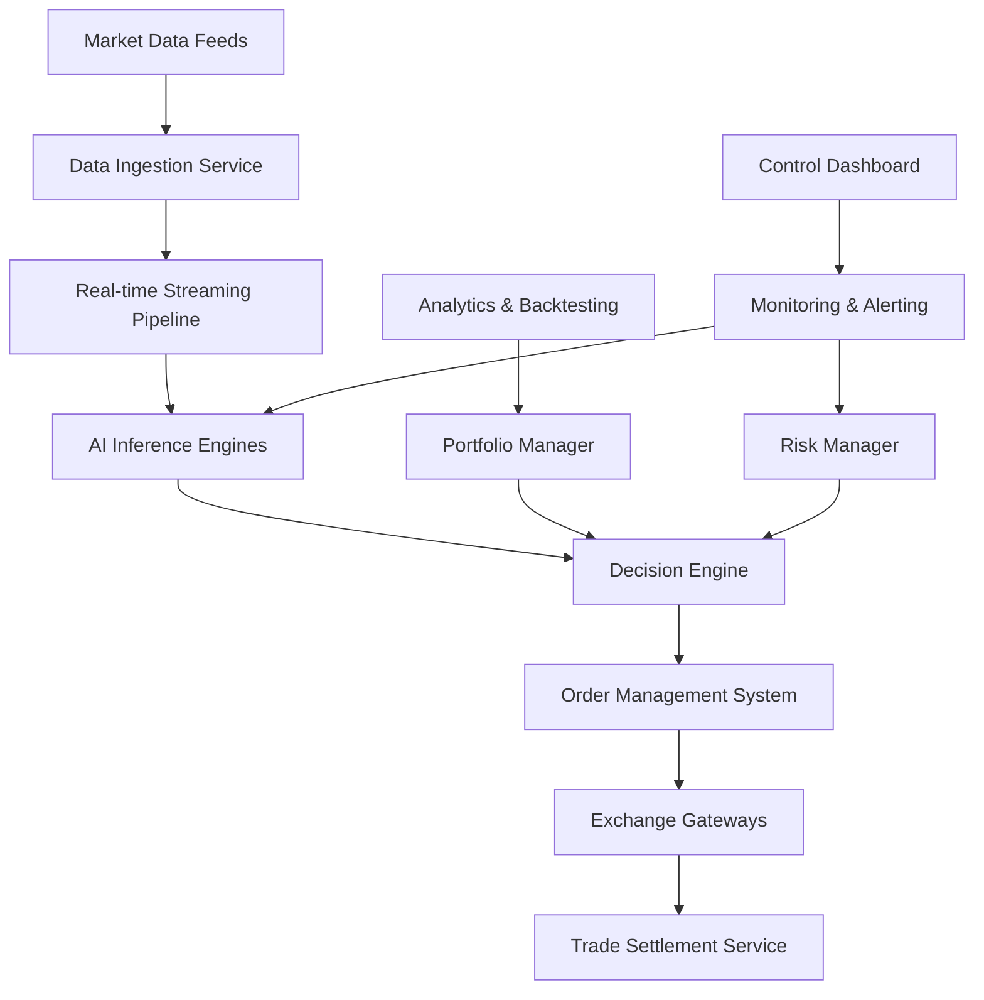

---
title: "AI-Driven Autonomous Trading Platform"
description: "System design example for AI-Driven Autonomous Trading Platform"
---

# AI-Driven Autonomous Trading Platform

## Problem Statement

Design a scalable, reliable autonomous trading platform that uses AI agents to execute trades in financial markets. The system must continuously monitor market conditions, analyze data in real-time, make trading decisions, and execute orders without human intervention. The platform should handle high-frequency trading scenarios, manage risk, ensure regulatory compliance, and adapt to market changes autonomously. Key challenges include handling market volatility, ensuring low-latency decision making, managing large volumes of financial data, and maintaining system reliability during market anomalies.

## Requirements

### Functional Requirements
- Real-time market data ingestion from multiple exchanges and data providers
- AI-powered analysis and signal generation for trading opportunities
- Autonomous trade execution with customizable risk management rules
- Portfolio management and position tracking across multiple assets
- Real-time performance monitoring and analytics
- Trade settlement and reconciliation
- Alert system for significant market events or system anomalies
- Historical data backtesting for strategy validation

### Non-Functional Requirements
- **Latency**: Sub-millisecond decision making for high-frequency trading signals
- **Throughput**: Process millions of data points per second from multiple sources
- **Availability**: 99.99% uptime with fault-tolerant architecture
- **Data Consistency**: Strong consistency for order execution, eventual consistency for analytics
- **Scalability**: Auto-scale to handle market volume spikes (e.g., 100x normal volume)
- **Security**: End-to-end encryption, secure API access, compliance with regulations like SOX/MiFID
- **Reliability**: Circuit breakers for rapid market changes, graceful degradation under failures
- **Observability**: Comprehensive logging, metrics, and tracing for debugging and auditing

## Key Constraints & Assumptions

- **Assumption**: The platform operates in a 24/7 global market environment with trading sessions across multiple time zones.
- **Assumption**: AI models are pre-trained and deployed; the system focuses on inference and decision execution rather than model training.
- **Constraint**: Must integrate with major exchanges (NYSE, NASDAQ, CME) via standardized APIs and protocols (FIX, REST).
- **Constraint**: System must handle crypto and traditional assets with different market mechanics.
- **Assumption**: Initial scale supports $10B AUM (Assets Under Management) with room for growth.
- **Constraint**: Regulatory compliance requires audit trails for all decisions and trades.
- **Assumption**: Data feed delays do not exceed 10ms for premium data sources.

## High-Level Design

The architecture follows a microservices pattern deployed in a hybrid cloud environment, with AI agents distributed across edge and central data centers for optimal latency.



**Architecture Overview**:
- **Data Ingestion Service**: Normalizes and aggregates market data from APIs, WebSockets, and vendor feeds
- **Real-time Streaming Pipeline**: Uses Apache Kafka/Flink for event streaming and real-time processing
- **AI Inference Engines**: Distributed GPU/TPU clusters for model inference with model versioning
- **Decision Engine**: Combines AI signals with risk rules to generate trade orders
- **Order Management System**: Manages order lifecycle, queuing, and execution routing
- **Exchange Gateways**: Protocol adapters for secure communication with trading venues
- **Portfolio & Risk Managers**: Continuous position monitoring and dynamic risk limits
- **Monitoring**: ELK stack with custom dashboards and alerting based on market events

## Data Model

**Core Entities**:

- **Instrument**: Asset details (symbol, type, exchange, base/quote currencies)
- **MarketData**: OHLCV data, order book snapshots, trade ticks with timestamps
- **Order**: Trade orders (market/limit/stop) with execution details and timestamps
- **Position**: Current holdings, unrealized P&L, margin utilization
- **Strategy**: AI model configurations, risk parameters, backtest results
- **Trade**: Executed trades with fees, slippage, and reconciliation data
- **Portfolio**: Aggregated positions across strategies and accounts
- **AuditLog**: Immutable ledger of all decisions, orders, and system events

**Database Schema Considerations**:
- Time-series database (e.g., TimescaleDB) for market data with compression
- Relational database (e.g., PostgreSQL) for transactions and relationships
- Document store (e.g., MongoDB) for strategy configurations and audit logs
- Caching layer (e.g., Redis) for hot market data and positions

## API Design

**External APIs** (for trading venues and external risk systems):
```
GET /api/v1/markets/{exchange}/instruments
POST /api/v1/orders/{orderId}
GET /api/v1/orders/{orderId}/status
DELETE /api/v1/orders/{orderId}
```

**Internal APIs** (for AI agents and monitoring):
```
POST /api/internal/v1/signals/generate
GET /api/internal/v1/portfolio/summary
POST /api/internal/v1/risk/limits/validate
GET /api/internal/v1/backtest/results/{strategyId}
```

**WebSocket Streams**:
- `/ws/market-data`: Real-time price feeds filtered by instruments
- `/ws/trades`: Live trade execution updates
- `/ws/alerts`: System and market event notifications

API Characteristics:
- Rate limiting with priority queuing for high-frequency requests
- API versioning with backward compatibility
- JWT authentication with role-based access (trader, analyst, admin)
- Response compression for bandwidth optimization

## Detailed Design

### Core Components

**Data Ingestion Service**:
- Built with Python/Go for performance
- Handles multiple protocols (WebSocket, REST, FIX)
- Features: Data validation, deduplication, rate adaptation
- Tech Choice: Node.js clusters for concurrent connections

**AI Inference Engines**:
- Deployed on GPU instances with Kubernetes auto-scaling
- Support for TensorFlow/PyTorch models with ONNX runtime
- Features: Model A/B testing, performance monitoring, fallback to rule-based logic
- Tech Choice: Ray for distributed computing, NVidia Triton for inference serving

**Decision Engine**:
- Combines signals from multiple AI models with risk constraints
- Implements reinforcement learning for strategy evolution
- Features: Decision confidence scoring, multi-agent coordination
- Tech Choice: Java/Scala with Akka for actor-based concurrency

**Order Management System**:
- Smart order routing across venues for best execution
- Implements VWAP, TWAP, and custom algorithms
- Features: Order slicing, iceberg orders, contingency orders
- Tech Choice: C++ for low-latency execution path

**Risk Management**:
- Real-time VaR calculations and stress testing
- Dynamic position limits and circuit breakers
- Features: Scenario analysis, compliance checks
- Tech Choice: Python with NumPy/pandas for financial computations

### Infrastructure Choices
- **Cloud Provider**: Multi-cloud (AWS/GCP/Azure) with hybrid deployment
- **Networking**: Direct Connect to exchanges, global CDN for data distribution
- **Security**: VPC isolation, end-to-end encryption, regular penetration testing
- **Deployment**: Kubernetes with Istio service mesh, GitOps with ArgoCD

## Scalability & Bottlenecks

**Scalability Vectors**:
- **Horizontal Scaling**: Stateless services auto-scale based on CPU/memory metrics
- **Data Partitioning**: Market data sharded by exchange/instrument, trades by account
- **Caching Strategy**: Multi-level caching (L1: local process, L2: Redis cluster, L3: CDN)

**Performance Optimizations**:
- **Data Locality**: Edge deployments for regional market data processing
- **Preprocessing**: Feature engineering and normalization at ingestion layer
- **Batch Processing**: Off-peak backtesting and model retraining

**Bottlenecks Identification**:
- **Latency**: Network hops to exchanges (mitigated by co-location)
- **Throughput**: AI inference during market spikes (GPU clusters with preemption)
- **Storage**: Time-series data growth (tiered storage with compression)
- **Concurrency**: Lock contention in order position updates (lock-free data structures)

**Capacity Planning**:
- Base load: 1M market updates/sec, 10K trade executions/sec
- Peak load: 10M updates/sec during news events or volatility spikes
- Growth projection: 3x annually, designed for 30x current capacity

## Trade-offs & Alternatives

**Microservices vs Monolith**:
- **Chosen**: Microservices for team autonomy and technology diversity
- **Alternative**: Monolith for simpler deployment but slower iteration
- **Trade-off**: Operational complexity vs development velocity

**AI Inference Location**:
- **Chosen**: Distributed GPU clusters near data centers
- **Alternative**: Edge inference on IoT devices (not viable for compute intensity)
- **Trade-off**: Latency vs infrastructure cost

**Data Consistency Model**:
- **Chosen**: Strong consistency for orders, eventual for analytics
- **Alternative**: Full eventual consistency (increases reconciliation complexity)
- **Trade-off**: High availability vs data accuracy complexity

**Proprietary vs Open Source**:
- **Chosen**: Mix (Kafka/Flink open, AI models proprietary)
- **Alternative**: Fully open-source for cost, proprietary for differentiation
- **Trade-off**: Innovation control vs ecosystem benefits

## Future Improvements

**Short-term (3-6 months)**:
- Implement predictive maintenance for AI model performance degradation
- Add real-time A/B testing for trading strategies
- Enhance compliance with automated regulatory reporting

**Medium-term (6-18 months)**:
- Integrate quantum computing for portfolio optimization
- Expand to options and derivatives trading
- Implement adaptive learning from trade outcomes

**Long-term (1-3 years)**:
- Cross-asset class correlation modeling for macro trading
- AI-driven market making capabilities
- Global decentralized exchange integration for 24/7 trading

## Interview Talking Points

- **Explain your approach to handling market data spikes during volatility events like flash crashes.**
- **How would you ensure low-latency decision making while maintaining AI model accuracy?**
- **Describe strategies for managing risk in an autonomous system without human oversight.**
- **How do you handle data consistency between real-time trading and post-trade analytics?**
- **Discuss trade-offs between using pre-trained AI models vs continuous online learning in trading.**
- **How would you design the system to adapt to regulatory changes affecting trading algorithms?**
- **Explain your circuit breaker design for preventing cascading failures during market anomalies.**
- **How do you ensure auditability and compliance in a fully automated trading system?**
