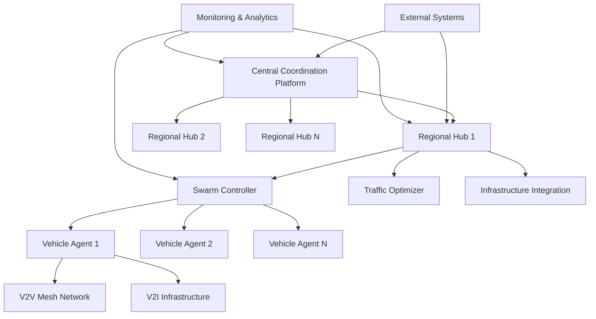

---
title: "Autonomous Vehicle Swarm Coordination with AI Agents"
description: "System design example for Autonomous Vehicle Swarm Coordination with AI Agents"
---

# Autonomous Vehicle Swarm Coordination with AI Agents

## Problem Statement

Design a distributed system to coordinate fleets of autonomous vehicles operating in shared environments, such as urban transportation networks or delivery services. The system must use AI agents to enable swarm intelligence behaviors like collective path planning, collision avoidance, traffic optimization, and adaptive routing. The platform needs to handle real-time decision-making for hundreds to thousands of vehicles simultaneously, ensuring safety, efficiency, and scalability while maintaining low-latency communication and fault tolerance in dynamic environments.

## Requirements

### Functional Requirements

- **Swarm Coordination**
  - Real-time vehicle positioning and status tracking
  - Distributed path planning with collision avoidance
  - Dynamic route optimization based on traffic conditions
  - Formation control for convoy operations
  - Emergency response coordination and rerouting

- **AI Agent Management**
  - Individual vehicle AI agents with local decision-making
  - Coordination algorithms for multi-agent interactions
  - Learning from historical data and real-time feedback
  - Agent health monitoring and failover mechanisms
  - Plugin architecture for different AI models (reinforcement learning, predictive analytics)

- **Communication Infrastructure**
  - Vehicle-to-vehicle (V2V) and vehicle-to-infrastructure (V2I) messaging
  - Low-latency publish-subscribe messaging system
  - Bandwidth-efficient data compression and prioritization
  - Secure authentication and encryption for all communications

- **Fleet Operations**
  - Centralized fleet monitoring and control dashboard
  - Automated dispatch and rebalancing of vehicles
  - Predictive maintenance scheduling based on sensor data
  - Compliance with traffic regulations and safety standards

### Non-Functional Requirements

- **Performance**
  - End-to-end latency < 100ms for critical safety messages
  - Support for 10,000+ concurrent vehicles
  - Real-time processing of sensor data at 100Hz per vehicle
  - 99.999% uptime for core coordination services

- **Safety & Reliability**
  - Fail-safe mechanisms with manual override capabilities
  - Redundant communication channels and backup systems
  - Formal verification of coordination algorithms
  - Comprehensive logging and incident analysis

- **Scalability**
  - Horizontal scaling to support city-wide deployments
  - Auto-scaling based on fleet size and traffic density
  - Multi-region support for nationwide operations
  - Efficient resource utilization during peak hours

- **Security**
  - End-to-end encryption for all vehicle communications
  - Intrusion detection and prevention systems
  - Secure firmware updates for vehicle ECUs
  - Compliance with automotive cybersecurity standards (ISO 21434)

## Key Constraints & Assumptions

- **Assumption**: Vehicles equipped with standard sensors (LiDAR, radar, cameras) and V2V/I communication modules
- **Constraint**: Maximum communication range of 300m for V2V direct links, with infrastructure support for beyond-range coordination
- **Assumption**: AI agents run on vehicle-edge computing platforms with limited computing resources (< 50W power envelope)
- **Constraint**: Must comply with existing traffic infrastructure and regulations in deployment regions
- **Assumption**: Mixed environment with autonomous and human-driven vehicles requiring cooperative behavior
- **Constraint**: Total fleet size scalable from 100 to 100,000+ vehicles with linear performance degradation
- **Assumption**: Vehicles can be grouped into swarms of varying sizes based on operational context (2-50 vehicles per swarm)

## High-Level Design

The system uses a hierarchical architecture combining centralized orchestration with decentralized execution:

- **Central Coordination Platform**: Handles global optimization, fleet management, and infrastructure integration
- **Regional Coordination Hubs**: Manage local swarms and handle regional traffic optimization
- **Vehicle-Level AI Agents**: Execute local decision-making and swarm coordination protocols
- **Communication Mesh**: Enables peer-to-peer and hierarchical messaging between all components



## Data Model

### Core Entities

- **Vehicle**: Represents an autonomous vehicle in the fleet
  ```
  {
    id: string,
    fleet_id: string,
    type: "delivery"|"passenger"|"emergency"|"freight",
    status: "active"|"maintenance"|"offline"|"emergency",
    location: {
      latitude: float,
      longitude: float,
      heading: float,
      speed: float,
      timestamp: timestamp
    },
    capabilities: {
      max_speed: float,
      payload_capacity: float,
      sensor_range: float,
      communication_range: float
    },
    ai_agent: {
      model_version: string,
      parameters: object,
      last_updated: timestamp
    },
    swarm_membership: {
      swarm_id: string,
      role: "leader"|"follower"|"scout",
      formation_position: int
    }
  }
  ```

- **Swarm**: Logical grouping of vehicles for coordinated operations
  ```
  {
    id: string,
    region_id: string,
    vehicles: [string],
    objective: "delivery"|"traffic_optimization"|"emergency_response",
    formation_type: "convoy"|"grid"|"dynamic",
    status: "forming"|"active"|"dissolving",
    parameters: {
      min_spacing: float,
      max_speed: float,
      coordination_algorithm: string
    },
    created_at: timestamp,
    dissolved_at: timestamp
  }
  ```

- **Mission**: Task assigned to individual vehicles or swarms
  ```
  {
    id: string,
    type: "pickup_delivery"|"patrol"|"traffic_management",
    assignee_type: "vehicle"|"swarm",
    assignee_id: string,
    waypoints: [{
      location: {lat: float, lon: float},
      action: string,
      constraints: object
    }],
    priority: "low"|"medium"|"high"|"critical",
    status: "planned"|"active"|"completed"|"failed",
    metrics: {
      estimated_duration: int,
      actual_duration: int,
      fuel_consumption: float,
      safety_score: float
    }
  }
  ```

- **Communication Message**: Real-time data exchanged between vehicles and infrastructure
  ```
  {
    id: string,
    sender_id: string,
    receiver_ids: [string],
    type: "position_update"|"intention_signal"|"emergency_alert",
    priority: int,
    payload: object,
    timestamp: timestamp,
    ttl: int,
    signature: string
  }
  ```

## API Design

### Fleet Management APIs
```
POST   /api/v1/fleets/{id}/vehicles        # Register vehicle
GET    /api/v1/fleets/{id}/vehicles        # List fleet vehicles
PUT    /api/v1/fleets/{id}/vehicles/{vid}  # Update vehicle status
DELETE /api/v1/fleets/{id}/vehicles/{vid}  # Deregister vehicle

POST   /api/v1/swarms                     # Create swarm
PUT    /api/v1/swarms/{id}                # Update swarm parameters
DELETE /api/v1/swarms/{id}                # Dissolve swarm
POST   /api/v1/swarms/{id}/join           # Add vehicle to swarm
```

### Mission Control APIs
```
POST   /api/v1/missions                    # Create mission
GET    /api/v1/missions                    # List missions
PUT    /api/v1/missions/{id}               # Update mission
DELETE /api/v1/missions/{id}               # Cancel mission
GET    /api/v1/missions/{id}/progress      # Get mission progress

POST   /api/v1/missions/batch              # Create batch missions
POST   /api/v1/routes/optimize             # Request route optimization
```

### Real-Time Coordination APIs
```
POST   /api/v1/coordination/intention      # Broadcast vehicle intention
POST   /api/v1/coordination/emergency      # Send emergency signal
GET    /api/v1/coordination/neighbors      # Get nearby vehicles

WebSocket: /ws/coordination/{region}      # Real-time coordination stream
WebSocket: /ws/monitoring/{vehicle}       # Vehicle monitoring stream
```

### Analytics & Monitoring APIs
```
GET    /api/v1/analytics/traffic           # Get traffic analytics
GET    /api/v1/analytics/performance      # Get fleet performance metrics
GET    /api/v1/analytics/safety           # Get safety statistics

POST   /api/v1/alerts                      # Create alert
GET    /api/v1/alerts                      # List active alerts
PUT    /api/v1/alerts/{id}/acknowledge     # Acknowledge alert
```

## Detailed Design

### Core Components

1. **AI Coordination Engine** (Rust/Rocket)
   - Implements swarm intelligence algorithms (particle swarm optimization, flocking)
   - Real-time constraint solving for path planning
   - Machine learning models for predictive coordination
   - Low-latency decision making with sub-10ms response times

2. **Communication Mesh** (Go/NATS)
   - Publish-subscribe messaging with guaranteed delivery
   - Geographic routing based on GPS coordinates
   - Bandwidth optimization through delta encoding
   - Fault-tolerant with automatic failover between nodes

3. **Swarm Controller** (Python/Kubernetes)
   - Manages swarm lifecycle and vehicle assignments
   - Implements consensus protocols for distributed decision-making
   - Monitors swarm health and triggers reformation when needed
   - Integrates with infrastructure sensors for environmental awareness

4. **Vehicle Agent Runtime** (C++/ROS2)
   - On-vehicle execution environment for AI agents
   - Hardware abstraction layer for different vehicle platforms
   - Local sensor fusion and decision-making
   - Emergency protocols for system failures

### AI Algorithms & Models

- **Distributed Path Planning**: Uses A* with conflict resolution and reinforcement learning for optimization
- **Collision Avoidance**: Multi-agent reinforcement learning with safety constraints
- **Traffic Flow Optimization**: Graph-based algorithms with real-time traffic prediction
- **Formation Control**: Consensus-based algorithms for maintaining swarm formations
- **Adaptive Routing**: Machine learning models that learn from historical traffic patterns

### Communication Protocols

- **V2V Protocol**: Custom binary protocol optimized for low bandwidth and high reliability
- **Safety Messages**: Dedicated high-priority channels with redundancy and ACK mechanisms
- **Bulk Data Transfer**: Compression and chunking for sensor data and map updates
- **Security Layer**: ECDSA signatures and AES encryption for all messages

## Scalability & Bottlenecks

### Scalability Considerations

1. **Geographic Partitioning**:
   - Divide operational area into regions managed by local hubs
   - Hierarchical coordination reduces global state management
   - Cross-region communication for long-distance missions

2. **Swarm Size Optimization**:
   - Dynamic swarm sizing based on operational complexity
   - Micro-swarms (2-5 vehicles) for simple tasks
   - Macro-swarms (50+ vehicles) for complex operations

3. **Communication Scaling**:
   - Edge computing reduces backbone network load
   - Content-based routing reduces unnecessary message delivery
   - Adaptive message rates based on vehicle density

4. **Data Management**:
   - Time-series databases for vehicle telemetry
   - Distributed caching for frequently accessed swarm data
   - Data partitioning by geographic regions and time windows

### Potential Bottlenecks

- **Communication Latency**: Mitigated through ultra-reliable low-latency communications (URLLC) and edge caching
- **Computational Complexity**: Addressed by vehicle-edge AI processing and selective offloading to regional hubs
- **State Synchronization**: Resolved through eventual consistency and conflict-free replicated data types (CRDTs)
- **Single Points of Failure**: Eliminated through redundant regional hubs and geographic distribution

## Trade-offs & Alternatives

### Technology Choices

1. **Centralized vs. Decentralized Coordination**
   - Hybrid approach chosen to balance safety guarantees with scalability
   - Trade-off: Reduced autonomy vs. simplified coordination logic

2. **ROS2 vs. Custom Framework**
   - ROS2 selected for mature ecosystem and interoperability
   - Custom framework considered for optimized performance (but higher development cost)

3. **Relational DB vs. Time-Series DB**
   - Time-series chosen for telemetry data with high ingestion rates
   - Relational considered for transactional mission data (but higher query complexity)

4. **ML Model Deployment**
   - Edge deployment prioritized for low-latency decisions
   - Cloud deployment alternative for complex models (trade-off: bandwidth vs. computational power)

### Architecture Decisions

- **Swarm Size Limits**: Balance between coordination complexity and operational efficiency
- **Communication Reliability**: Redundancy vs. bandwidth efficiency trade-offs
- **Real-Time Constraints**: Synchronous processing for safety-critical operations vs. eventual consistency for optimization
- **Energy Efficiency**: On-board processing vs. offloading to infrastructure (trade-off: autonomy vs. range)

## Future Improvements

- **Advanced AI Capabilities**:
  - Federated learning across vehicle fleets for improved coordination
  - Generative AI for dynamic mission planning and unexpected scenario handling
  - Multi-modal sensor fusion for enhanced environmental perception

- **Infrastructure Integration**:
  - Smart city integration with traffic light coordination
  - 5G/6G network slicing for guaranteed bandwidth
  - Satellite communication for rural and cross-continent operations

- **Safety & Compliance**:
  - Formal verification of AI decision-making processes
  - Automated regulatory compliance checking
  - Cyber-physical security with blockchain-based audit trails

- **Sustainability Features**:
  - Energy-optimized routing and formation control
  - Carbon footprint tracking and optimization
  - Integration with renewable energy infrastructure

## Interview Talking Points

1. **How would you handle split-brain scenarios in swarm coordination?** Discuss consensus algorithms, leader election, and graceful degradation strategies.

2. **What communication protocols ensure reliable coordination at scale?** Explain custom V2V protocols, redundancy mechanisms, and adaptive routing.

3. **How do you ensure safety in multi-agent systems?** Discuss formal verification, simulation testing, and layered safety mechanisms.

4. **What algorithms work best for distributed path planning?** Compare A*, RRT*, and reinforcement learning approaches with their trade-offs.

5. **How to handle dynamic environments with moving obstacles?** Explain sensor fusion, predictive modeling, and reactive planning techniques.

6. **What scalability patterns apply to large vehicle fleets?** Discuss geographic partitioning, hierarchical coordination, and edge computing.

7. **How do you validate AI agent behavior?** Cover simulation environments, formal verification, and real-world A/B testing.

8. **What happens during communication failures?** Explain offline operation modes, degraded coordination, and recovery protocols.

9. **How to balance between local and global optimization?** Discuss hierarchical planning, iterative refinement, and constraint propagation.

10. **What monitoring and debugging tools are essential?** Explain distributed tracing, real-time analytics, and incident replay capabilities.
