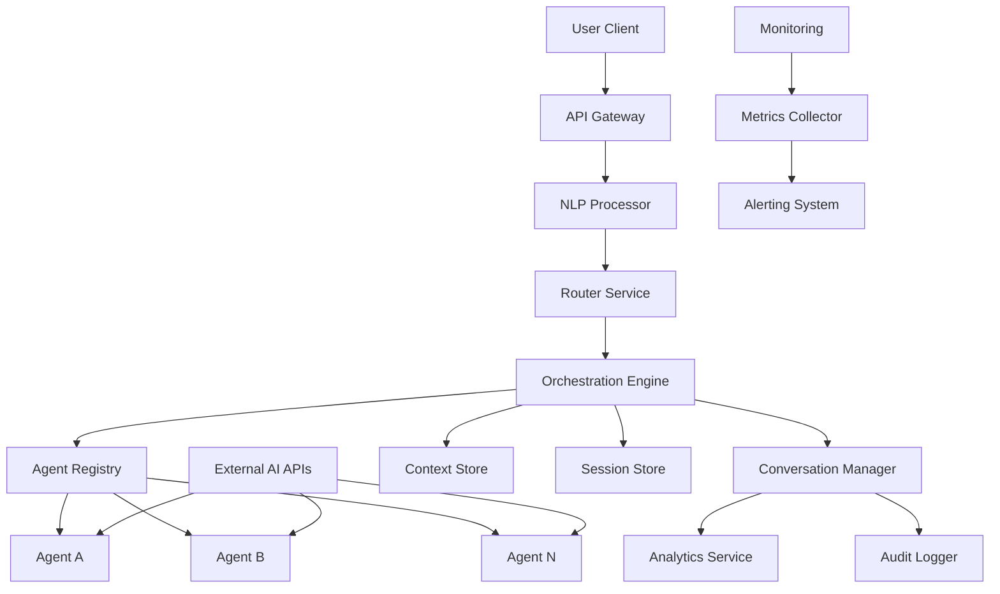

---
title: "Conversational Agent Orchestration System"
description: "System design example for Conversational Agent Orchestration System"
---

# Conversational Agent Orchestration System

## Problem Statement

Design a scalable platform that orchestrates multiple conversational AI agents to handle complex user interactions across various domains. The system must intelligently route user messages to the most appropriate agent, manage agent handoffs, persist conversation context across sessions, and support real-time multi-agent collaboration. This is crucial for building sophisticated customer service bots, personal assistants, and enterprise AI workflows that can handle multifaceted queries involving multiple specialized agents.

## Requirements

### Functional Requirements
- **Agent Management**: Register, configure, and lifecycle management of conversational AI agents with different capabilities and specializations
- **Intelligent Routing**: Analyze user messages and route them to the optimal agent based on context, intent, and agent expertise
- **Conversation Orchestration**: Support agent-to-agent communication and handoffs during ongoing conversations
- **Context Preservation**: Maintain conversation history and context across multiple agents and sessions
- **Real-time Processing**: Handle synchronous conversational flows with low latency
- **Multi-modal Support**: Process text, voice, and multimedia inputs/outputs
- **Policy Enforcement**: Implement security, compliance, and content moderation policies
- **Analytics & Logging**: Provide conversation analytics and audit trails

### Non-Functional Requirements
- **Latency**: <200ms for routing decisions, <500ms for agent responses
- **Throughput**: 100K concurrent conversations, 1M messages per minute
- **Availability**: 99.9% uptime with disaster recovery
- **Scalability**: Support dynamic scaling based on conversation volume
- **Security**: End-to-end encryption, GDPR compliance
- **Extensibility**: Pluggable architecture for adding new agent types and routing algorithms

## Key Constraints & Assumptions

- **Agent Diversity**: Up to 100 different types of specialized agents (customer service, technical support, sales, etc.)
- **Conversation Patterns**: *Assumption: 80% of conversations are single-agent, 20% require multi-agent orchestration*
- **Data Volume**: *Assumption: Store conversation history for 1 year with average conversation length of 20-30 messages*
- **AI Processing**: *Assumption: Use external Large Language Model APIs (OpenAI, Anthropic) with API rate limits and cost considerations*
- **Multi-tenancy**: *Assumption: Support multiple organizations/companies with tenant isolation*
- **Real-time Requirements**: *Assumption: WebSocket-based real-time communication for live chats*

## High-Level Design

The Conversational Agent Orchestration System follows a microservices architecture with clear separation of concerns across routing, orchestration, agent management, and data persistence layers.



### Architecture Components
- **API Gateway**: Entry point handling authentication, rate limiting, and request routing
- **NLP Processor**: Intent recognition and message preprocessing
- **Router Service**: Intelligent agent selection and load balancing
- **Orchestration Engine**: Core orchestration logic managing conversation flows and agent coordination
- **Agent Registry**: Service discovery and health monitoring of registered agents
- **Conversation Manager**: Session management and context preservation
- **Context/Session Stores**: Distributed storage for conversation state and history

## Data Model

### Core Entities

```sql
-- Agent Definition
CREATE TABLE agents (
    id UUID PRIMARY KEY,
    name VARCHAR(255) NOT NULL,
    type VARCHAR(50) NOT NULL, -- customer_service, technical_support, sales
    capabilities JSONB, -- skills, supported_languages, domains
    configuration JSONB, -- routing_rules, timeout, thresholds
    endpoint VARCHAR(500), -- agent gRPC/HTTP endpoint
    health_status VARCHAR(20),
    created_at TIMESTAMP,
    updated_at TIMESTAMP
);

-- Conversation Session
CREATE TABLE conversations (
    id UUID PRIMARY KEY,
    tenant_id UUID NOT NULL,
    user_id VARCHAR(255),
    channel VARCHAR(50), -- web, mobile, voice, api
    status VARCHAR(20), -- active, completed, transferred, abandoned
    context JSONB, -- current state, variables, metadata
    created_at TIMESTAMP,
    updated_at TIMESTAMP
);

-- Message Log
CREATE TABLE messages (
    id UUID PRIMARY KEY,
    conversation_id UUID REFERENCES conversations(id),
    agent_id UUID REFERENCES agents(id),
    content TEXT,
    type VARCHAR(20), -- text, audio, image
    direction VARCHAR(10), -- inbound, outbound
    metadata JSONB, -- sentiment, intent_confidence, tokens
    timestamp TIMESTAMP
);

-- Orchestration Events
CREATE TABLE orchestration_events (
    id UUID PRIMARY KEY,
    conversation_id UUID REFERENCES conversations(id),
    event_type VARCHAR(50), -- route, handover, escalate, timeout
    from_agent_id UUID REFERENCES agents(id),
    to_agent_id UUID REFERENCES agents(id),
    reason TEXT,
    metadata JSONB,
    timestamp TIMESTAMP
);
```

### Performance Optimizations
- Sharding conversations by tenant_id to support multi-tenancy
- Time-series indexing on messages for efficient conversation reconstruction
- JSONB indexes for flexible querying of capabilities and metadata
- Partitioning on timestamp fields for log retention management

## API Design

### RESTful APIs for Agent Management

```http
POST /api/v1/agents
Content-Type: application/json

{
  "name": "Product Support Bot",
  "type": "technical_support",
  "capabilities": {
    "domains": ["electronics", "software"],
    "languages": ["en", "es", "fr"],
    "complexity_level": 0.8
  },
  "endpoint": "grpc://support-agent:50051",
  "configuration": {
    "timeout": 30000,
    "retry_count": 3
  }
}
```

### Real-time Conversation APIs

```http
WebSocket /ws/chat/{conversation_id}

Message Format:
{
  "type": "user_message",
  "content": {
    "text": "How do I reset my password?",
    "metadata": {
      "channel": "web",
      "user_id": "12345"
    }
  }
}

Response Format:
{
  "type": "agent_response",
  "conversation_id": "conv_123",
  "agent_id": "agent_456",
  "content": {
    "text": "I'd be happy to help with password reset...",
    "actions": ["show_reset_form"]
  },
  "metadata": {
    "confidence": 0.95,
    "route_reason": "intent_match"
  }
}
```

### Orchestration Webhooks

```http
POST /webhooks/orchestration/handover
Content-Type: application/json

{
  "conversation_id": "conv_123",
  "from_agent": "triage_bot",
  "to_agent": "premium_support",
  "context": { "escalation_reason": "complex_technical_issue" },
  "transfer_data": { "session_variables": { "priority": "high" } }
}
```

## Detailed Design

### Core Components

#### Router Service
- **Technology Choice**: Golang microservice with gRPC
- **Routing Algorithm**: Multi-layered approach combining rule-based, intent-based, and ML-powered scoring
- **Load Balancing**: Weighted round-robin with agent capacity and performance metrics
- **Fallback Strategy**: Automatic fallback to general-purpose agents when specialized agents unavailable

#### Orchestration Engine
- **Technology Choice**: Python async framework (FastAPI + Celery) for complex workflow management
- **State Machine**: Finite state machine managing conversation lifecycle and agent transitions
- **Concurrency Model**: Async/await pattern with worker pool for parallel agent processing
- **Caching**: Redis for session state and context with TTL-based eviction

#### NLP Processor
- **Technology Choice**: Python service using spaCy + HuggingFace transformers
- **Intent Recognition**: Hierarchical intent classification with confidence scoring
- **Entity Extraction**: Named entity recognition for routing context
- **Real-time Optimization**: Model caching and batching for latency reduction

#### Agent Registry
- **Technology Choice**: Kubernetes-based service mesh with Consul for discovery
- **Health Checks**: Active monitoring with circuit breaker patterns
- **Dynamic Registration**: REST API for agent onboarding/offboarding
- **Configuration Management**: GitOps-style configuration updates

### Communication Patterns
- **Intra-Service**: gRPC for low-latency service communication
- **Agent Communication**: Protocol buffers for structured data exchange
- **Client Communication**: WebSocket for real-time bidirectional messaging

## Scalability & Bottlenecks

### Scalability Solutions
- **Horizontal Scaling**: Stateless microservices with Kubernetes auto-scaling based on CPU/memory metrics
- **Data Partitioning**: Conversation sharding across multiple database instances
- **Caching Layers**: Multi-level caching (L1 in-memory, L2 Redis cluster, L3 CDN)
- **Async Processing**: Queue-based architecture (Kafka) for non-blocking message processing

### Identified Bottlenecks
- **Agent Processing**: External AI API rate limits → Solution: Token bucket algorithm with queuing
- **Database Queries**: Complex conversation reconstruction → Solution: Materialized views and pre-computed aggregates
- **Network Latency**: Agent-to-agent communication across regions → Solution: Regional agent deployment with edge computing
- **Memory Usage**: Large conversation contexts → Solution: Context compression and selective archiving

**Capacity Planning**
- 10K RPS sustained load with 99th percentile latency under 100ms
- 1TB daily message volume with 30-day retention policy
- Auto-scaling triggers at 70% resource utilization

## Trade-offs & Alternatives

### Routing Strategy Decisions
- **Real-time vs Batch Processing**: Real-time routing sacrifices some accuracy for immediate responses vs batch processing which could improve accuracy but increase latency
- **Centralized vs Distributed Routing**: Centralized routing provides global optimization but creates single point of failure vs distributed routing offers better fault tolerance

### Storage Architecture Options
- **NoSQL Aggregation Stores** (MongoDB/DocumentDB) for flexible agent configurations vs **Relational Database** for strict consistency requirements
- **Message Queues** (Kafka/SQS) for decoupling vs **Direct HTTP** calls for simplicity

### Orchestration Patterns
- **Event-Driven Architecture** enables extensibility but increases complexity vs **Request-Response Pattern** for predictable flows
- **Microservices** provide scalability and technology diversity vs **Monolithic Service** reduces operational overhead

## Future Improvements

### Phase 2 Features
- **Multi-Modal Agent Collaboration**: Support for agents specializing in audio, video, or image processing
- **Self-Learning Routing**: ML models that learn from past routing decisions and optimize performance
- **Federated Learning**: Privacy-preserving model updates across tenant boundaries

### Technical Enhancements
- **Edge Computing Deployment**: Move orchestration closer to users for reduced latency
- **Quantum-Safe Encryption**: Prepare for post-quantum cryptographic standards
- **Graph-Based Orchestration**: Use graph databases for complex agent dependency mapping

### Monitoring & Observability
- **Distributed Tracing**: Complete request lifecycle tracking across all services
- **AI Performance Monitoring**: Specialized dashboards for agent response quality and fallback rates
- **Predictive Scaling**: ML-based capacity planning and preemptive resource allocation

## Interview Talking Points

- Ability to handle multi-agent conversations with complex routing logic while maintaining low latency
- Trade-off between routing accuracy (intent classification confidence) and real-time responsiveness
- Horizontal scalability challenges when coordinating state between multiple specialized agents
- Choice of async communication patterns (WebSocket/gRPC) vs synchronous APIs for real-time constraints
- Data partitioning strategy for conversation history across distributed databases while preserving session continuity
- Circuit breaker patterns for agent health monitoring and graceful degradation during AI service outages
- Context compression techniques to manage memory usage in long-running conversations
- Multi-tenancy challenges in routing configuration and resource isolation across different organizations
- Fallback strategy complexity when primary agents fail, requiring dynamic capability matching
