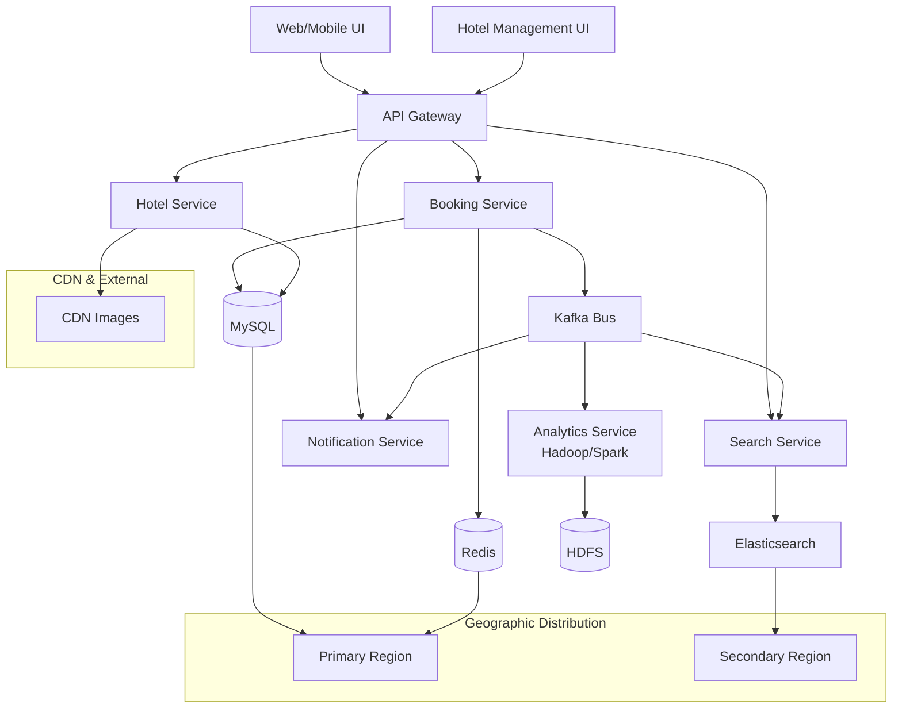

+++
title= "Hotel Reservation"
tags = [ "system-design", "software-architecture", "interview", "hotel-reservation" ]
author = "Me"
showToc = true
TocOpen = false
draft = false
hidemeta = false
comments = false
disableShare = false
disableHLJS = false
hideSummary = false
searchHidden = true
ShowReadingTime = true
ShowBreadCrumbs = true
ShowPostNavLinks = true
ShowWordCount = true
ShowRssButtonInSectionTermList = true
UseHugoToc = true
weight= 21
bookFlatSection= true
+++

# Design Hotel Reservation System

## Problem Statement
Design a hotel booking system similar to Booking.com that handles millions of users searching and booking hotels worldwide. The system needs to support hotel onboarding, property management, user search and booking operations, while maintaining high availability and low latency for a global user base.

Key challenges include handling concurrent bookings across distributed systems, providing real-time availability updates, and ensuring data consistency for financial transactions. The system should scale to support peak holiday traffic (e.g., 100K bookings/minute) with 99.99% uptime and sub-second response times for search queries.

## Requirements
### Functional Requirements
- **Hotel Management**: Hotels can onboard platforms, update property details (rooms, pricing, images), and view booking insights/reporting
- **User Functionality**: Users can search hotels by location, dates, price range, amenities; view hotel details; make bookings; view/manage existing bookings
- **Booking Lifecycle**: Support full booking flow from selection to confirmation, cancellation, and completed status tracking
- **Availability Management**: Real-time inventory tracking for room availability across dates
- **Payment Integration**: Secure payment processing for bookings (assume external payment service)

### Non-Functional Requirements
- **Performance**: Sub-second search response time (<500ms p95), <100ms booking confirmation
- **Availability**: 99.99% uptime with automatic failover
- **Scalability**: Handle 10M active users, 100K searches/minute, 10K bookings/minute at peak
- **Consistency**: Strong consistency for bookings, eventual consistency for hotel data updates
- **Security**: End-to-end encryption for user data and payments, authentication/authorization
- **Observability**: Comprehensive monitoring, alerting, and analytics

## Key Constraints & Assumptions
- Global platform with 10M active users and 1M hotels worldwide
- Peak load: 100K searches/second, 10K bookings/minute (holiday seasons)
- Data retention: 7 years for booking history
- Geographic distribution: Multi-region deployment for global coverage
- Latency SLA: 99% of requests <100ms globally
- No foreign exchange support (single currency)
- Assume OAuth-based user authentication exists
- Booking windows: Up to 1 year in advance
- Consistency: Strong for active bookings, eventual for hotel updates

## High-Level Design
The system adopts a microservices architecture with event-driven messaging for scalability. Core services handle specific domains with polyglot persistence based on access patterns.

**Architectural Components:**
- **User Interface (Web/Mobile)**: Responsive front-end for hotel management and user booking experiences
- **API Gateway**: Request routing, authentication, rate limiting, and response aggregation
- **Hotel Service**: Manages hotel/guest data and property details with MySQL
- **Search Service**: Elasticsearch-powered fuzzy search with inventory aggregation
- **Booking Service**: Transactional booking management with real-time inventory updates
- **Inventory Service**: Room availability tracking and optimization
- **Notification Service**: Email/SMS push notifications for booking updates
- **Analytics Service**: Batch/stream processing for insights and reporting

**Data Flow:**
1. **Search**: User query → API Gateway → Search Service (ES queries) + Inventory Service (real-time availability)
2. **Booking**: Selection → API Gateway → Booking Service (reserves rooms) → Payment Service → Confirmation → Events → Update Search/Index
3. **Hotel Updates**: Property changes → Kafka events → Reindex ES, update cache, notify users if impacted



## Data Model
The system uses polyglot persistence: relational for transactions, document store for analytics, cache for performance.

### Core Entities
- **Hotel**: id (PK), name, location, description, images, amenities, is_active
- **Room**: id (PK), hotel_id (FK), type, price, amenities, capacity, is_active
- **User**: id (PK), email, name, preferences
- **Booking**: id (PK), user_id, room_id, checkin_date, checkout_date, guests, status, total_amount, payment_id
- **Availability**: room_id, date, total_rooms, available_rooms, booked_rooms

### Storage Choices
- **MySQL**: Transactional data (hotels, bookings, users) - ACID for bookings
- **Redis**: Availability cache, session states, rate limiting (TTL-eviction)
- **Cassandra**: Historical bookings archive (>30 days old)
- **Elasticsearch**: Search index for hotels/rooms with faceted filtering
- **Kafka**: Event stream for async processing (bookings, updates, analytics)
- **HDFS**: Analytics data warehouse for reporting/Spark jobs

### Schema Sketch
```sql
-- MySQL Tables
CREATE TABLE hotels (
    id BIGINT PRIMARY KEY,
    name VARCHAR(255),
    location VARCHAR(255),
    description TEXT,
    images JSON,
    amenities JSON,
    is_active BOOLEAN
);

CREATE TABLE rooms (
    id BIGINT PRIMARY KEY,
    hotel_id BIGINT,
    type VARCHAR(50),
    base_price DECIMAL(10,2),
    amenities JSON,
    capacity INT,
    is_active BOOLEAN,
    FOREIGN KEY (hotel_id) REFERENCES hotels(id)
);

CREATE TABLE bookings (
    id BIGINT PRIMARY KEY,
    user_id BIGINT,
    room_id BIGINT,
    checkin_date DATE,
    checkout_date DATE,
    guest_count INT,
    status ENUM('reserved','confirmed','cancelled','completed'),
    total_amount DECIMAL(10,2),
    created_at TIMESTAMP,
    FOREIGN KEY (room_id) REFERENCES rooms(id)
);
```

## API Design
RESTful APIs with JSON payloads, JWT authentication, idempotency keys for writes.

### Core Endpoints
`POST /api/v1/search/hotels`
```json
{
  "location": "New York",
  "checkin": "2024-12-25",
  "checkout": "2024-12-27",
  "guests": 2,
  "filters": {
    "price_range": [100, 500],
    "rating": 4,
    "amenities": ["wifi", "pool"]
  }
}
```
Response: Paginated hotel list with availability/pricing

`POST /api/v1/bookings`
```json
{
  "room_id": 123,
  "checkin": "2024-12-25",
  "checkout": "2024-12-27",
  "guests": 2,
  "user_id": 456,
  "payment_token": "tok_xxx"
}
```
Response: Booking confirmation or error (insufficient availability, payment failure)

`PUT /api/v1/hotels/{id}/rooms`
Hotel management endpoint for updating room inventory/pricing

## Detailed Design
### Hotel Service
CRUD microservice managing hotel/room data. Uses MySQL with read replicas for scalability. Image uploads go to CDN, references stored in DB. Events published to Kafka for search reindexing.

### Search Service
Elasticsearch cluster indexed from hotel data. Aggregates real-time availability from Redis cache. Supports geo-search, fuzzy matching, faceting. Query optimization with pagination and caching.

### Booking Service
Saga-pattern for distributed transactions (reserve inventory → process payment → confirm booking → handle failure compensation). Uses Redis for availability locks (TTL 15min for payment window). Strong consistency via MySQL, eventual via Kafka events.

**Booking Flow:**
1. Validate availability (Redis)
2. Reserve rooms (TTL lock)
3. Process payment (external service)
4. Confirm booking → update availability → publish events
5. Handle failures: Release locks, notify user

### Inventory Service
Manages room availability calendar. Uses Redis for current state, MySQL for persistence. Handles bulk updates (e.g., hotel adds rooms). Prevented overselling through atomic updates.

### Notification Service
Kafka consumer processing booking events. Sends personalized emails (confirmation, reminders) and SMS alerts. Uses Twilio/SendGrid with retry/exponential backoff.

### Analytics Service
Spark streaming jobs on Kafka events. Generates reports: revenue analytics, popular destinations, conversion funnels. Batch ETL to HDFS for ML models (demand forecasting, dynamic pricing).

## Scalability & Bottlenecks
- **Horizontal Scaling**: All services stateless, auto-scale behind load balancers. MySQL/Redis sharded by hotel_id hash for write scaling.
- **Caching Strategy**: 80% read hit rate with Redis (availability, hotel data). TTL eviction for stale data.
- **Message Queue**: Kafka sharded topics handle event bursts. Partitioned by hotel_id for ordering.
- **Database Scaling**: MySQL read replicas for queries. Cassandra for archive to offload old bookings.
- **Geographic**: Multi-region with DNS-based routing. Cross-region replication for consistency.
- **Bottlenecks**:
  - Booking conflicts during peaks → Redis distributed locks
  - Search load → ES cluster scaling, query routing
  - Payment integration → Async processing with webhooks
  - Global consistency → Eventual consistency for hotel updates

## Trade-offs & Alternatives
- **SQL vs NoSQL**: MySQL provides ACID for bookings (critical); NoSQL (Cassandra) for analytics scalability but eventual consistency. Trade-off: data integrity vs. performance.
- **Event Sourcing vs CRUD**: Event-driven (Kafka) for auditability and decoupling but increased complexity; direct DB writes simpler but tighter coupling.
- **Saga vs 2PC**: Saga preferred for microservices (no blocking locks); 2PC stricter consistency but higher coordination overhead.
- **Caching Depth**: Heavy caching reduces DB load but staleness risk; alternatives like read-through cache or refresh invalidation.
- **Centralized vs Distributed**: Monolithic simpler development; microservices enable team scaling but operational complexity.
- **Push vs Pull Updates**: Real-time Kafka events immediate; batch polling cheaper but delayed.

## Future Improvements
- Machine learning recommendations (similar hotels, personalized pricing)
- Mobile app with offline booking capability
- Multi-currency support with FX integration
- AI chatbots for booking assistance
- Integration with travel aggregators (Expedia, Google Travel)
- Advanced fraud detection using user behavior analytics
- Peer-to-peer hotel sharing marketplace
- Carbon footprint calculation for eco-conscious travelers

## Interview Talking Points
1. Microservices with event-driven architecture decouples booking/search for independent scaling and fault isolation.
2. Polyglot persistence optimizes data access patterns: relational (transactions), NoSQL (search/analytics), cache (performance).
3. Saga pattern ensures distributed transaction integrity without blocking locks, critical for high-throughput bookings.
4. Geographic distribution with DNS routing minimizes latency for global users while maintaining consistency through replication.
5. Real-time inventory management prevents overselling through atomic Redis operations with compensation failure handling.
6. Event sourcing provides auditability and replay capability for debugging system issues and historical state reconstruction.
7. Caching strategy with TTL eviction balances performance against data freshness, monitored via hit rates and latency metrics.
8. Scalability achieved through sharding (hotel_id hash) and horizontal auto-scaling, handling 10x traffic spikes during holidays.
9. Trade-off analysis: ACID consistency vs. eventual consistency, evaluated based on user-facing impact (bookings vs. hotel details).
10. Monitoring/observability foundation enables proactive scaling and rapid incident response for 99.99% uptime SLA.
