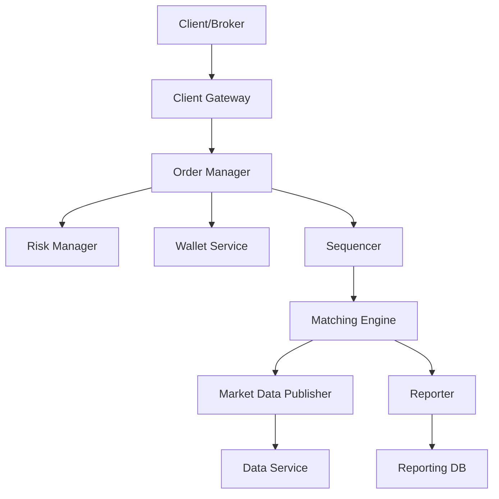

+++
title= "Stock Exchange"
tags = [ "system-design", "software-architecture", "interview", "stock-exchange" ]
author = "Me"
showToc = true
TocOpen = false
draft = false
hidemeta = false
comments = false
disableShare = false
disableHLJS = false
hideSummary = false
searchHidden = true
ShowReadingTime = true
ShowBreadCrumbs = true
ShowPostNavLinks = true
ShowWordCount = true
ShowRssButtonInSectionTermList = true
UseHugoToc = true
weight= 27
bookFlatSection= true
+++

# Design Stock Exchange

## Problem Statement
Design a high-performance electronic stock exchange system that efficiently matches buy and sell orders for up to 100 stock symbols, handling billions of orders daily with real-time execution. The system must support limit orders, provide live order book visibility, enforce risk checks, verify user funds, and ensure trades occur within milliseconds.

## Requirements
### Functional Requirements
- Place and cancel limit orders for stocks (buy/sell at specified price and quantity).
- Match orders in real-time using a First-In-First-Out (FIFO) algorithm on each price level.
- Display real-time order book (L1, L2, L3 price levels) and candlestick charts.
- Enforce risk checks (e.g., daily trade limits per user/symbol).
- Verify and withhold sufficient funds/wallet balance before order placement.
- Publish market data updates in real-time.
- Handle reporting for trading history, compliance, and settlements.

### Non-Functional Requirements
- **Availability**: 99.99% uptime (minimal downtime).
- **Fault Tolerance**: Automatic failover and fast recovery from incidents.
- **Latency**: Round-trip latency <10ms (99th percentile).
- **Scalability**: Support tens of thousands of concurrent users and billions of daily orders, expandable to more symbols/users.
- **Security**: Account management, KYC verification, DDoS protection on public endpoints.

## Key Constraints & Assumptions
- Trade only stocks during normal trading hours (e.g., 9:30 AM - 4:00 PM ET).
- ~100 symbols supported initially.
- 1 billion orders per day (QPS ~43,000 average; peak ~215,000).
- Trading volume spikes at market open.
- Assumption: No order splitting or advanced order types beyond limit orders while supporting basic place/cancel operations.
- Assumption: Wallets/funds in USD with reliable integration for checks.
- Assumption: Sequenced matching for determinism; no partial executions except where orders exceed opposing sides.

## High-Level Design
The system consists of client gateways for order intake, an order manager for validation and risk checks, a matching engine for deterministic order matching, and components for market data publishing and reporting. All critical components can run on a single high-performance server using shared memory (mmap) and event sourcing for sub-millisecond latency.

- **Client Gateway**: Authenticates, validates, and routes orders.
- **Order Manager**: Manages order lifecycle, performs risk/fund checks.
- **Matching Engine**: Maintains order books, matches orders, produces executions.
- **Market Data Publisher**: Builds order books and charts from executions.
- **Reporter**: Handles compliance reporting to db.
- **Data Service**: Distributes market data to subscribers.

## Data Model
Key entities include Products (stock metadata), Orders, and Executions. Order Books and Candystick Charts are specialized structures.

- **Product**: {id, symbol, display_symbol, type (stock), status}.
- **Order**: {id, user_id, symbol, side (buy/sell), price, quantity, type (limit), status (new/filled/canceled), created_at, filled_qty, remaining_qty}.
- **Execution (Fill)**: {id, order_id, symbol, price, quantity, timestamp, side}.
- **Order Book** (per symbol): Doubly-linked list of price levels with queues for FIFO matching. Price levels contain aggregated volume.
- **Candlestick Chart**: Time-series of {open, close, high, low, volume, timestamp, interval} stored in ring buffers for memory efficiency.

Primary storage: In-memory with event sourcing for recovery; persistent KDB/timeseries DB for analytics.

## API Design
RESTful APIs for brokers; FIX protocol for low-latency clients.

- **POST /v1/order**: Create order (params: symbol, side, price, quantity).
- **GET /executions**: Retrieve executions (params: symbol, order_id, start_time, end_time).
- **GET /marketdata/orderBook/L2**: Get L2 order book (params: symbol, depth).
- **GET /marketdata/candles**: Get candlestick data (params: symbol, resolution, start_time, end_time).

## Detailed Design
- **Client Gateway**: Lightweight authentication (API keys, rate limiting); forwards to Order Manager via mmap bus for speed.
- **Order Manager**: State management via event sourcing (immutable events: NewOrder, CancelOrder, OrderFilled); checks risk (volume caps) and wallet (sufficient funds). Funds withheld on order placement.
- **Sequencer**: Single-writer for deterministic sequencing; stamps events with sequence IDs for replay/fairness.
- **Matching Engine**: Per-symbol order books; FIFO matching emits paired executions; uses application loop on pinned CPU for low latency.
- **Market Data Publisher**: Subscribes to execution stream; rebuilds order books/charts; multicasts data via reliable UDP.
- **Reporter**: Asynchronous DB writes for compliance/settlements.

## Scalability & Bottlenecks
- **Horizontal Scaling**: Stateless components (gateways, data service) can scale out; stateful (matching engine) uses warm replicas with Raft for leader election.
- **Load Balancing**: Client gateways load-balanced; internal services communicate via mmap.
- **Caching**: Pre-allocated ring buffers for candlesticks/order books; LRU for market data.
- **Replicas & Replication**: Reliable UDP for cross-datacenter replication; failover in seconds.
- **Bottlenecks**: Matching engine (high QPS); mitigated by single-server design, sharding by symbol-genie.

## Trade-offs & Alternatives
- **Single Server vs. Distributed**: Single-server (mmap) for sub-ms latency vs. multi-server for flexibility/scalability (trade off simplicity for fault tolerance).
- **Event Sourcing vs. Relational DB**: Event sourcing for determinism/recovery vs. RDBMS for ad-hoc queries (trade atomicity for performance).
- **Kafka vs. Custom Sequencer**: Kafka for simplicity vs. custom for lower latency (trade standard tooling for optimization).
- **NoSQL vs. Timeseries DB**: For market data, timeseries (KDB) preferred over NoSQL for analytical queries.

## Future Improvements
- Add market orders, conditional orders, after-hours trading.
- Implement automatic market makers (AMMs) to reduce order book overhead.
- Enhance security with end-to-end encryption, advanced DDoS mitigation.
- Migrate to cloud infrastructure for better elasticity.
- Optimize wallet handling with distributed ledgers for multi-currency.

## Interview Talking Points
1. Describe the matching engine: Event sourcing, sequencer for determinism, FIFO matching – ensures fairness and low latency.
2. Latency Optimization: Single-server mmap, application loops, pinned CPUs – trade-offs against distribution.
3. Scalability: Per-symbol sharding, replicans with Raft – how to handle failures without data loss.
4. Data Models: Order books as doubly-linked lists for fast operations; candlesticks in ring buffers.
5. Trade-offs: Centralized vs. distributed architecture; focus on 99.99% availability with heartbeats/failover.
6. Security: DDoS protection via isolation/caching; KYC for compliance.
7. Real-world: NYSE scales to billions of transactions; emphasize determinism over speed in financial systems.
