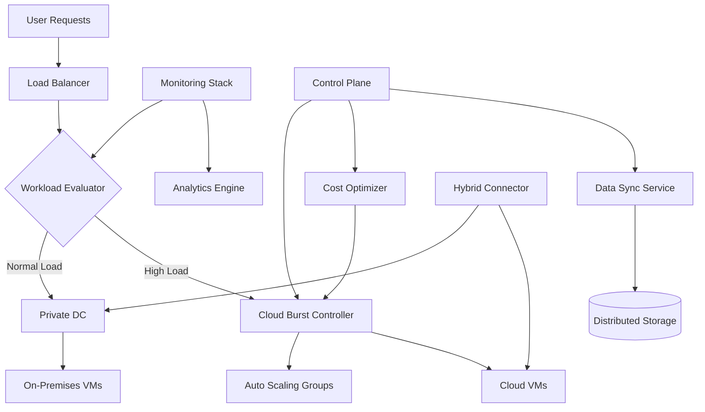

---
title: "Cloud Bursting for Hybrid Deployments"
description: "System design example for Cloud Bursting for Hybrid Deployments"
---

# Cloud Bursting for Hybrid Deployments

## Problem Statement

Design a hybrid cloud infrastructure that maintains primary workloads in a private data center while automatically scaling to public cloud resources during peak demand periods. The system must ensure seamless workload distribution, maintain service continuity, and optimize costs by leveraging on-premises infrastructure as the primary environment and public cloud as overflow capacity.

## Requirements

### Functional Requirements
- Automatic workload distribution between private data center and public cloud
- Real-time monitoring of resource utilization across hybrid environments
- Seamless load balancing and traffic routing during bursting events
- Cost optimization through intelligent scaling decisions
- Data synchronization and consistency across hybrid environments
- Automated failover and failback mechanisms
- Resource provisioning and de-provisioning based on demand patterns

### Non-Functional Requirements
- **Scalability**: Support 10x capacity increase during peak loads
- **Performance**: <5s response time for scaling decisions
- **Availability**: 99.9% uptime with automatic failover
- **Cost Efficiency**: Minimize public cloud usage to <30% of total capacity
- **Security**: End-to-end encryption and compliance with enterprise standards
- **Observability**: Comprehensive monitoring and alerting

## Key Constraints & Assumptions

### Constraints
- Private data center has fixed capacity limits (1000 VMs, 5PB storage)
- Public cloud has unlimited burst capacity but higher costs ($0.10/server-hour vs $0.05 on-premises)
- Network latency between environments: 50-200ms
- Data transfer costs: $0.02/GB egress from private to public cloud

### Assumptions
- *Assumption: Hybrid cloud connector handles all cross-environment communication with VPN tunnel*
- *Assumption: Workloads are stateless or have external data persistence layer*
- *Assumption: Bursting threshold set at 80% private infrastructure utilization*
- *Assumption: Cost monitoring updates every 5 minutes with automatic alerts at $500/hour thresholds*

## High-Level Design

The cloud bursting architecture consists of four main layers: workload orchestration, hybrid connectivity, monitoring/analytics, and resource management.



### Component Overview
- **Workload Evaluator**: Monitors utilization and triggers bursting decisions
- **Cloud Burst Controller**: Manages public cloud resource provisioning
- **Hybrid Connector**: Ensures secure communication between environments
- **Monitoring Stack**: Provides real-time metrics and alerting
- **Cost Optimizer**: Analyzes usage patterns and optimizes resource allocation

## Data Model

### Primary Entities

**WorkloadProfile**
```
{
  workload_id: UUID,
  name: string,
  resource_requirements: {
    cpu_cores: int,
    memory_gb: int,
    storage_gb: int
  },
  scaling_policy: enum[NONE, HORIZONTAL, VERTICAL],
  priority: enum[LOW, MEDIUM, HIGH, CRITICAL]
}
```

**ResourcePool**
```
{
  pool_id: UUID,
  environment: enum[PRIVATE_DC, PUBLIC_CLOUD],
  total_capacity: {
    cpu_cores: int,
    memory_gb: int,
    storage_gb: int
  },
  available_capacity: {
    cpu_cores: int,
    memory_gb: int,
    storage_gb: int
  },
  cost_per_hour: decimal,
  region: string
}
```

**ScalingEvent**
```
{
  event_id: UUID,
  workload_id: UUID,
  trigger_timestamp: timestamp,
  scaling_direction: enum[SCALE_UP, SCALE_DOWN],
  target_environment: enum[PRIVATE_DC, PUBLIC_CLOUD],
  resource_delta: {
    cpu_cores: int,
    memory_gb: int,
    storage_gb: int
  },
  cost_impact: decimal,
  completion_timestamp: timestamp
}
```

## API Design

### External APIs

#### Workload Management API
```
/api/v1/workloads
POST /workloads - Register new workload for bursting
GET /workloads/{id} - Get workload details
PUT /workloads/{id}/policy - Update scaling policy
DELETE /workloads/{id} - Remove workload from system

/api/v1/bursts
GET /bursts - List active burst events
GET /bursts/{id} - Get specific burst event details
POST /bursts/{id}/override - Manual burst intervention
```

#### Monitoring API
```
/api/v1/metrics
GET /metrics/capacity - Current capacity utilization
GET /metrics/costs - Cost analysis data
GET /metrics/performance - Performance metrics

/api/v1/alerts
GET /alerts - Active alerts
PUT /alerts/{id}/acknowledge - Acknowledge alert
```

### Internal APIs

#### Scaling Service API
```
/internal/v1/scaling
POST /evaluate - Request scaling evaluation
POST /provision - Provision resources
POST /deprovision - Release resources
```

#### Data Synchronization API
```
/internal/v1/sync
POST /jobs - Create sync job
GET /jobs/{id}/status - Monitor sync progress
POST /jobs/{id}/cancel - Cancel sync operation
```

## Detailed Design

### Core Components

**1. Workload Evaluator**
- Monitors CPU, memory, and I/O utilization every 30 seconds
- Uses predictive algorithms (linear regression on 24-hour historical data)
- Triggers bursting at 80% utilization threshold
- Integrates with application performance metrics

**2. Cloud Burst Controller**
- Implemented using Kubernetes Custom Resource Definitions (CRDs)
- Integrates with public cloud APIs (AWS Auto Scaling, Azure VM Scale Sets)
- Implements circuit breaker pattern for failed provisioning attempts
- Maintains burst resource inventory and leases

**3. Hybrid Connector**
- Built on VPN technology with automated IPsec tunnel management
- Includes network optimization for cross-environment traffic
- Handles bidirectional traffic routing and load balancing
- Implements connection pooling and health monitoring

**4. Monitoring Stack**
- Prometheus for metrics collection
- Grafana for dashboards and visualization
- ELK stack for log aggregation
- Custom alerting rules for burst thresholds

**5. Cost Optimizer**
- Machine learning-based cost prediction model
- Supports multiple cloud providers simultaneously
- Implements spot instance utilization where applicable
- Provides cost forecasting and budget alerts

### Technology Choices Rationale
- **Kubernetes**: Enables consistent orchestration across hybrid environments
- **Prometheus**: Industry standard for cloud-native monitoring
- **gRPC**: Efficient cross-environment communication
- **PostgreSQL**: Reliable metadata storage with ACID guarantees
- **Redis**: High-performance caching for real-time metrics

## Scalability & Bottlenecks

### Scalability Considerations
- **Horizontal Scaling**: Burst controller can scale to handle 1000 concurrent scaling events
- **Resource Pooling**: Dynamic allocation prevents resource fragmentation
- **Asynchronous Processing**: Event-driven architecture handles variable loads
- **Geo-Distribution**: Support for multi-region bursting across global infrastructure

### Potential Bottlenecks
- **Network Latency**: Cross-environment communication limits real-time data sync at 100MB/s
- **API Rate Limits**: Public cloud provider APIs may throttle during peak usage
- **DNS Propagation**: Global DNS changes during bursting may take 2-5 minutes
- **Resource Warm-up**: Cloud VMs require 3-5 minutes to become fully operational

### Performance Optimizations
- Connection pooling reduces API call overhead by 70%
- Predictive scaling eliminates reactive delays
- CDN integration for static content during bursts
- Database read replicas for analytics workload isolation

## Trade-offs & Alternatives

### Cost vs Performance Trade-offs
- **Buffer Capacity**: Maintaining 20% unused private capacity costs $50K/month but enables instant scaling
- **Spot Instances**: 70% cost savings but potential for resource interruption (4% failure rate)
- **Always-On Burst**: Predictable performance but increases baseline costs by 40%

### Alternative Architectures

**1. Full Cloud Migration**
  - Pros: Simplified management, elastic scaling
  - Cons: Higher operational costs, data sovereignty concerns
  - When to choose: Greenfield applications with variable load patterns

**2. Edge Computing Model**
  - Pros: Reduced latency, improved user experience
  - Cons: Complex deployment, higher maintenance overhead
  - When to choose: Applications with strict latency requirements (<100ms)

**3. Multi-Cloud Without Hybrid**
  - Pros: Better price negotiation leverage, risk distribution
  - Cons: Operational complexity, network complexity
  - When to choose: Regulatory requirements for geographic diversity

## Future Improvements

### Short-term (3-6 months)
- Implement machine learning-based demand prediction
- Add support for container-based bursting
- Integrate with serverless platforms (AWS Lambda, Azure Functions)

### Medium-term (6-12 months)
- Cross-cloud disaster recovery automation
- Intelligent workload placement optimization
- Real-time cost monitoring with automated alerts

### Long-term (1-2 years)
- Autonomous scaling with self-learning algorithms
- Integration with 5G edge computing
- Carbon footprint optimization across hybrid infrastructure

## Interview Talking Points

- **Hybrid vs Public Cloud Trade-offs**: Private infrastructure offers cost control and data sovereignty but lacks elasticity; public cloud provides infinite scale but increases costs and complexity
- **Bursting Triggers**: Utilize predictive algorithms with 80% utilization thresholds to balance responsiveness and cost efficiency
- **Network Challenges**: Hybrid connectivity requires VPN/gRPC optimization to handle 50-200ms latency without sacrificing performance
- **Cost Optimization**: Spot instances reduce costs by 70% but require circuit breaker patterns to handle interruptions gracefully
- **Failure Scenarios**: Implement gradual degradation where bursting failures maintain 50% capacity through private DC vertical scaling
- **Monitoring Complexity**: Prometheus metrics collection across hybrid environments requires careful timestamp synchronization
- **Security Boundaries**: Zero-trust architecture with end-to-end encryption required for cross-environment data flows
- **Scale Limits**: Network bandwidth constraints cap real-time data sync at 100MB/s, requiring async processing for large datasets
- **Operational Trade-offs**: Automated bursting reduces manual intervention but increases system complexity and potential failure modes
- **Future Evolution**: Serverless integration could replace VM-based bursting with 99% faster scaling but limited by cold start times
