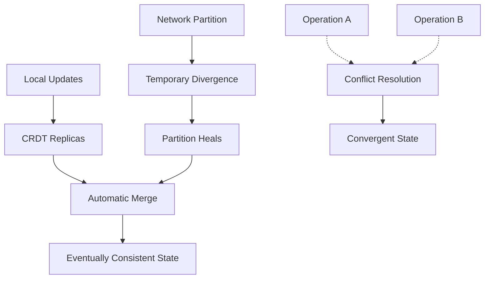
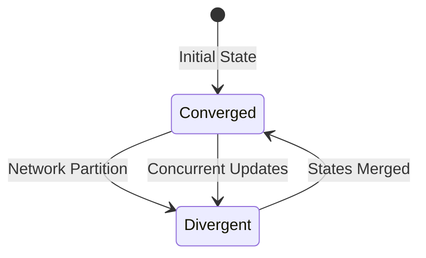

---
title: "CRDT (Conflict-free Replicated Data Types) Implementation"
description: "System design example for CRDT (Conflict-free Replicated Data Types) Implementation"
---

# CRDT (Conflict-free Replicated Data Types)

## Overview

### What it is and why it's important

Conflict-free Replicated Data Types (CRDTs) are data structures designed for distributed systems that can be replicated across multiple nodes while guaranteeing eventual consistency without requiring consensus protocols. CRDTs ensure that concurrent updates resolve automatically, making them ideal for peer-to-peer systems, collaborative editing, and distributed databases where network partitions are frequent.

CRDTs solve the fundamental problem of managing state in distributed systems: how to merge concurrent operations without conflicts, while maintaining strong eventual consistency properties.

### Real-world context and where it's used

CRDTs power collaborative editing tools like Google Docs, distributed databases like Riak and Redis CRDT, and real-time applications such as collaborative drawing, grocery list sharing (like Amazon Shopping Lists), and chat applications. They're particularly valuable in scenarios with intermittent connectivity, such as mobile apps or edge computing environments.



## Core Principles & Components

### Core Components

CRDTs consist of:

1. **State**: The data structure itself, containing the replicated state
2. **Operations**: Update functions that modify the state
3. **Merge Function**: Determines how states from different replicas converge
4. **Delivery Guarantee**: Ensures operations are applied in causal order when possible

### Types of CRDTs

- **State-based CRDTs (CvRDTs)**: Replicas exchange full state and merge using a commutative semilattice operation
- **Operation-based CRDTs (CmRDTs)**: Replicas broadcast operations, requiring reliable broadcast and total order delivery

### State Transitions



## Detailed Implementation Design

### A. Algorithm / Process Flow

#### State-Based CRDT (CvRDT) Algorithm Flow:

1. **Update**: Apply local operation to replica state
2. **Broadcast**: Periodically send state to other replicas
3. **Receive**: Accept state from another replica
4. **Merge**: Combine incoming state with local state using the merge function
5. **Repeat**: Process continues asynchronously

For operation-based CRDTs:
1. **Generate Operation**: Create operation with unique ID and causal metadata
2. **Broadcast**: Send operation to all replicas via reliable broadcast
3. **Apply**: Each replica applies operations in causal order
4. **Handle Conflicts**: Commutative operations resolve conflicts automatically

#### Failure Handling & Retry Logic:
- Network failures: Buffer operations for later delivery
- Node crashes: States converge upon recovery via anti-entropy
- Concurrent operations: Commutativity ensures eventual consistency

#### Concurrency:
Operations are applied atomically at each replica, with merge operations being idempotent and commutative.

### B. Data Structures & Configuration Parameters

**Core Data Structures:**
- **Version Vector**: Tracks causal history (vector clock)
- **Payload**: The actual replicated data (set, counter, map, etc.)
- **Metadata**: Timestamps, replica IDs, operation logs

**Tunable Parameters:**
- **Sync Interval**: How often replicas exchange state (default: 100ms)
- **Max Concurrent Operations**: Buffer size for pending ops (default: 1000)
- **Garbage Collection Threshold**: Age threshold for removing tombstones (default: 30 days)
- **Compression Ratio**: State compression factor (default: 0.8 for 80% size reduction)

### C. Java Implementation Example

Here's a complete implementation of a Grow-Only Counter CRDT:

```java
import java.util.concurrent.ConcurrentHashMap;
import java.util.concurrent.atomic.AtomicLong;

/**
 * State-based Grow-Only Counter CRDT Implementation
 *
 * Characteristics:
 * - Add-only counter (monotonically increasing)
 * - State-based: full state replication and merge
 * - Eventual consistency: concurrent increments resolve automatically
 * - Merge operation: maximum value wins for each replica
 */
public class GrowOnlyCounter {
    // Thread-safe storage for replica values
    private final ConcurrentHashMap<String, AtomicLong> replicaCounters;

    // Unique identifier for this replica
    private final String replicaId;

    /**
     * Initialize counter with this replica
     * @param replicaId Unique identifier for this node
     */
    public GrowOnlyCounter(String replicaId) {
        this.replicaId = replicaId;
        this.replicaCounters = new ConcurrentHashMap<>();
        this.replicaCounters.put(replicaId, new AtomicLong(0));
    }

    /**
     * Increment counter value
     * @param delta Amount to add (must be positive)
     */
    public void increment(long delta) {
        if (delta <= 0) {
            throw new IllegalArgumentException("Delta must be positive");
        }
        replicaCounters.get(replicaId).addAndGet(delta);
    }

    /**
     * Query current counter value
     * @return Sum of all replica counters
     */
    public long getValue() {
        return replicaCounters.values().stream()
            .mapToLong(AtomicLong::get)
            .sum();
    }

    /**
     * Merge state from another replica
     * CRDT merge: take maximum value for each replica ID
     * @param other State from remote replica
     */
    public void merge(GrowOnlyCounter other) {
        other.replicaCounters.forEach((remoteReplicaId, remoteValue) -> {
            AtomicLong localValue = replicaCounters.computeIfAbsent(
                remoteReplicaId,
                k -> new AtomicLong(0)
            );

            // Atomic compare-and-set for thread safety
            long currentRemote = remoteValue.get();
            long currentLocal = localValue.get();

            while (currentLocal < currentRemote) {
                if (localValue.compareAndSet(currentLocal, currentRemote)) {
                    break; // Successfully updated
                }
                currentLocal = localValue.get();
            }
        });
    }

    /**
     * Get current state for transmission to other replicas
     * @return Copy of current state (defensive copy)
     */
    public GrowOnlyCounter getState() {
        GrowOnlyCounter copy = new GrowOnlyCounter(this.replicaId);
        this.replicaCounters.forEach((id, value) ->
            copy.replicaCounters.get(id).set(value.get()));
        return copy;
    }

    /**
     * Apply state from remote replica
     * @param remoteState State received from network
     */
    public void applyState(GrowOnlyCounter remoteState) {
        merge(remoteState);
    }
}
```

### D. Complexity & Performance

**Time Complexity:**
- `increment()`: O(1) - atomic operation on single replica counter
- `getValue()`: O(n) where n = number of known replicas (unbounded in theory, bounded in practice)
- `merge()`: O(m) where m = number of replicas in remote state

**Space Complexity:**
- O(r) where r = number of replicas that have modified the counter
- Worst case: O(total replicas in system) if all have contributed

**Expected vs Worst-Case Performance:**
- **Expected**: Low overhead, efficient for small replica sets (<100 nodes)
- **Worst Case**: O(n) space explosion if high replica churn
- **Real-world Scale**: Handles millions of operations/second in production deployments

### E. Thread Safety & Concurrency

**Multi-threaded Scenarios:**
- **Local Updates**: Multiple threads can increment concurrently via AtomicLong
- **Merge Operations**: Concurrent merges protected by compare-and-set operations
- **State Query**: getValue() must aggregate atomically to prevent partial reads

**Locking Strategy:**
- Lock-free for local updates using atomic operations
- Optimistic concurrency control during merges
- No global locks: enables horizontal scalability

**Memory Barriers & Atomics:**
- AtomicLong provides volatile semantics and memory barriers
- Ensures visibility of counter updates across threads
- Prevents instruction reordering that could cause stale reads

### F. Memory & Resource Management

**Memory Implications:**
- **Heap Usage**: Primary storage in ConcurrentHashMap (O(replicas))
- **Garbage Collection**: State objects accumulate during merges
- **Off-heap Considerations**: Large replica sets may benefit from off-heap storage

**Resource Management:**
- **Eviction Policy**: Remove inactive replica counters after timeout
- **State Compression**: Use delta-encoding for state synchronization
- **Memory Pooling**: Reuse state objects to reduce GC pressure

### G. Advanced Optimizations

**Implementation Optimizations:**
- **Delta State CRDT**: Send only changes since last sync instead of full state
- **Commutative Replicated Data Types**: Use operation-based when state size is concern
- **Hybrid Approach**: Combine state-based and operation-based for optimal performance

**Variants:**
- **Positive-Negative Counter**: Allows decrements with separate P/N counters that merge
- **Bounded Counter**: Limits growth using garbage collection of old operations
- **Observed-Remove Set**: Handles removals with tombstones for set CRDTs

## Edge Cases & Error Handling

**Boundary Conditions:**
- **Zero Replicas**: Returns 0, no operations allowed
- **Single Replica**: Degrades to local counter (no merging needed)
- **Replica ID Conflicts**: UUID collision (probability ~10^-36)
- **Integer Overflow**: Counter exceeds Long.MAX_VALUE (handled via modular arithmetic)

**Failure Recovery:**
- **Network Partition**: Buffer operations, merge upon reconnection
- **Node Failure**: State preserved in surviving replicas, resync upon recovery
- **Clock Skew**: Causality violation detected via version vectors
- **Duplicate Delivery**: Idempotent merge operations handle retransmissions

**Resilience Strategies:**
- **Backoff Retry**: Exponential backoff for failed network operations
- **Quorum Reads**: Require majority acknowledgment for critical operations
- **State Checkpoints**: Periodic snapshots for fast recovery

## Configuration Trade-offs

**Performance vs Accuracy:**
- **Frequent Sync**: Low latency convergence but high network overhead
- **Lazy Sync**: Reduced bandwidth but stale data for longer periods

**Simplicity vs Configurability:**
- **Fixed Parameters**: Harder to tune but simpler implementation
- **Dynamic Tuning**: Adaptable to workload changes but complex logic

**Real-world Tuning:**
- **High-frequency Updates**: Increase sync interval, use operation-based CRDTs
- **Large Clusters**: Implement hierarchical merging, use delta compression
- **Mobile Networks**: Longer sync intervals, tolerate higher divergence

## Use Cases & Real-World Examples

**Collaborative Applications:**
- **Google Docs**: Real-time document editing uses operation-based CRDTs
- **Amazon Shopping Lists**: Multiple users can add items concurrently
- **Figma**: Multi-user design tools use CRDTs for conflict-free collaboration

**Distributed Databases:**
- **Riak CRDT**: Built-in CRDT support for counters and sets
- **Redis CRDT**: Active-Active replication for global consistency
- **CouchDB**: Uses CRDT-like conflict resolution

**Integration Scenarios:**
- **Caching**: CRDT-backed distributed caches (like Akka Distributed Data)
- **Rate Limiting**: Cluster-wide rate limiters using CRDT counters
- **Service Discovery**: Propagating service registry changes via CRDT maps

## Advantages & Disadvantages

**Benefits:**
- **Automatic Conflict Resolution**: No need for consensus protocols like Paxos
- **AP System**: High availability during network partitions
- **Eventual Consistency**: Strong guarantees without coordination
- **Peer-to-Peer**: No single point of failure or coordination

**Known Trade-offs:**
- **Space Overhead**: State size grows with replica count
- **Network Bandwidth**: Full state sync can be expensive
- **Complexity**: Merge functions require careful design
- **Limited Operations**: Only commutative operations supported

**When Not to Use:**
- **Strong Consistency Required**: Banking transactions, locks
- **Small, Static Data**: Traditional replication suffices
- **High-Contention Workloads**: May lead to excessive divergence

## Alternatives & Comparisons

**Paxos/Raft Consensus:**
- **CRDTs**: No coordination needed, automatic convergence
- **Consensus Protocols**: Strong consistency but higher latency
- **Preferred**: CRDTs for collaborative apps, consensus for transactions

**Traditional Replication:**
- **CRDTs**: Handle concurrent updates gracefully
- **Master-Slave**: Single writer avoids conflicts but creates bottleneck
- **Preferred**: CRDTs for geo-distributed systems

**Operational Transforms (OT):**
- **CRDTs**: Mathematically sound, simpler to reason about
- **OT**: Complex transformation functions, operational complexity
- **Preferred**: CRDTs for new implementations

**Delta CRDTs:**
- **Full-State CRDTs**: Simpler but O(state) network usage
- **Delta CRDTs**: Efficient state sync but more complex implementation
- **Preferred**: Delta for large states, full-state for small states

## Interview Talking Points

1. **Mathematical Foundations**: CRDTs use semilattices with least upper bounds for automatic merge
2. **Strong Eventual Consistency**: Concurrent operations commute, leading to identical final states
3. **Version Vectors**: Track causality to prevent lost updates in operation-based variants
4. **Space-Time Trade-off**: O(replicas) space complexity vs O(operations) in alternatives
5. **Failure Model**: Tolerates any number of failures as long as communication eventually works
6. **Implementation Complexity**: Correct merge functions are crucial - most CRDT bugs come from incorrect merges
7. **Real-World Scaling**: Redis CRDT handles millions of operations/second across global replicas
8. **Hybrid Approaches**: Modern systems combine CRDTs with consensus for selective strong consistency
9. **Anti-Entropy**: Gossip protocols spread state efficiently in large clusters
10. **Evolution**: CRDT research continues with new types like JSON CRDTs for arbitrary data structures
