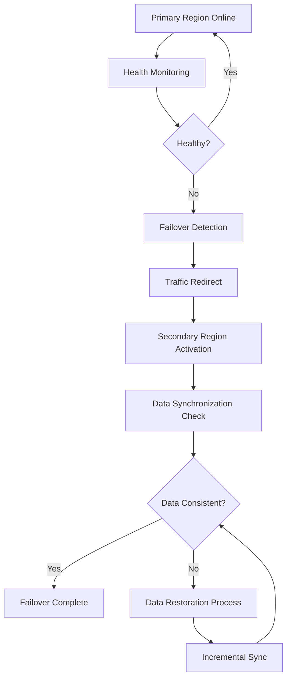
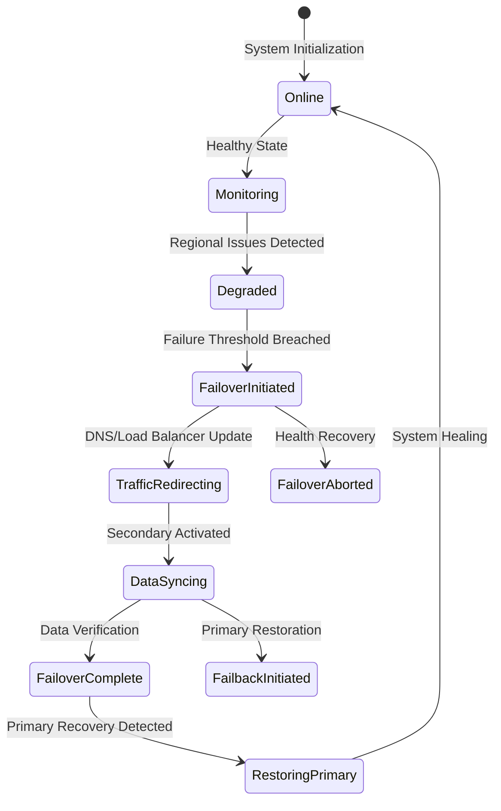

---
title: "Cross-Region Failover and Data Restoration Systems"
description: "System design example for Cross-Region Failover and Data Restoration Systems"
---

# Cross-Region Failover and Data Restoration Systems

## Overview

Cross-region failover and data restoration systems ensure high availability and data durability for distributed applications deployed across multiple geographic regions. These systems automatically detect and recover from regional outages while preserving data consistency and minimizing application downtime. This design focuses on the architectural patterns and implementation techniques for building robust failover mechanisms that can handle complete regional failures without data loss.

Real-world context includes cloud services deployed across multiple availability zones, financial trading systems requiring 99.999% uptime, and e-commerce platforms serving global users. Systems like AWS Route 53, Google Cloud Load Balancer, and Azure Traffic Manager implement similar failover logic at varying complexity levels.



## Core Principles & Components

### Core Components

- **Health Monitoring System**: Continuously monitors regional health across multiple dimensions (network latency, error rates, resource utilization)
- **Traffic Controller**: Manages DNS routing or load balancer configurations to redirect user traffic during failovers
- **Data Replication Manager**: Ensures real-time data synchronization between regions using various replication strategies
- **Failover Coordinator**: Orchestrates multi-step failover process with rollback capabilities
- **Data Consistency Verifier**: Validates data integrity post-failover using checksums, Lamport timestamps, or other consistency mechanisms

### State Transitions



## Detailed Implementation Design

### A. Algorithm / Process Flow

The failover process operates in three phases:

1. **Detection Phase**: Health checks run every P intervals, tracking M consecutive failures
2. **Decision Phase**: Multi-criteria evaluation using weighted scoring (latency +30%, error rate +40%, capacity +30%)
3. **Execution Phase**: Atomic failover operations with rollback capabilities

```java
public class CrossRegionFailoverManager {
    private final HealthMonitor healthMonitor;
    private final TrafficController trafficController;
    private final DataReplicationManager dataManager;

    public void executeFailover() {
        // Step 1: Validate current state
        HealthStatus status = healthMonitor.assessRegionalHealth();
        if (status.isHealthy()) {
            return; // Abort if healthy
        }

        // Step 2: Pre-flight checks
        if (!dataManager.isDataConsistent()) {
            throw new FailoverException("Data inconsistency prevents safe failover");
        }

        // Step 3: Initiate graceful drain
        trafficController.drainTraffic(primaryRegion);

        // Step 4: DNS propagation and traffic redirect
        trafficController.redirectToSecondary();

        // Step 5: Parse and replay pending transactions
        dataManager.replayPendingWrites();

        // Step 6: Health verification
        if (!healthMonitor.verifyPostFailoverHealth()) {
            throw new FailoverException("Post-failover health check failed");
        }

        emitFailoverCompleteEvent();
    }
}
```

### B. Data Structures & Configuration Parameters

```java
public class FailoverConfig {
    public final Duration healthCheckInterval = Duration.ofSeconds(30);
    public final int failureThreshold = 3; // Consecutive failures
    public final Duration dnsPropagationTimeout = Duration.ofMinutes(5);
    public final int maxDataLagMs = 1000; // Maximum acceptable lag
    public final List<RegionPriority> regionOrder; // Failover sequence
}

private class RegionalState {
    private volatile HealthState health = HealthState.HEALTHY;
    private volatile long lastHealthCheck = System.nanoTime();
    private volatile long dataCursor; // High watermark for data sync
    private AtomicLong activeConnections = new AtomicLong();
}
```

### C. Java Implementation Example

```java
public class CrossRegionFailoverManager {
    private final FailoverConfig config;
    private final Map<String, RegionalState> regionalStates;
    private final ScheduledExecutorService healthExecutor;
    private volatile boolean isFailoverInProgress;

    public CrossRegionFailoverManager(FailoverConfig config) {
        this.config = config;
        this.regionalStates = new ConcurrentHashMap<>();
        this.healthExecutor = Executors.newScheduledThreadPool(3);
        this.isFailoverInProgress = false;

        initializeHealthMonitoring();
    }

    public boolean initiateFailover(String fromRegion, String toRegion) {
        if (isFailoverInProgress) {
            throw new IllegalStateException("Failover already in progress");
        }

        synchronized (this) {
            isFailoverInProgress = true;
            try {
                RegionalState fromState = regionalStates.get(fromRegion);
                RegionalState toState = regionalStates.get(toRegion);

                // Pre-flight validation
                if (!validateFailoverConditions(fromState, toState)) {
                    return false;
                }

                // Execute failover sequence
                boolean success = executeFailoverSequence(fromRegion, toRegion);
                if (success) {
                    updateGlobalState(toRegion);
                    notifyStakeholders(FailoverEvent.COMPLETE);
                }

                return success;
            } finally {
                isFailoverInProgress = false;
            }
        }
    }

    private boolean validateFailoverConditions(RegionalState from, RegionalState to) {
        // Check secondary region's health
        if (to.health != HealthState.HEALTHY) {
            return false;
        }

        // Verify data consistency (lag within acceptable limits)
        long lag = dataManager.calculateLag(fromRegion, toRegion);
        if (lag > config.maxDataLagMs) {
            return false;
        }

        return true;
    }

    private void initializeHealthMonitoring() {
        healthExecutor.scheduleAtFixedRate(
            this::performHealthChecks,
            config.healthCheckInterval.toMillis(),
            config.healthCheckInterval.toMillis(),
            TimeUnit.MILLISECONDS
        );
    }
}
```

### D. Complexity & Performance

- **Health Check Complexity**: O(R) where R is number of regions, typically 2-5 (O(1) in practice)
- **Failover Execution Time**: O(D + T) where D is data synchronization lag and T is DNS propagation time
  - Expected: 30-300 seconds for enterprise deployments
  - Worst case: 5-15 minutes for large data sets
- **Throughput Impact**: 20-50% reduction during failover window due to traffic redirection overhead
- **Recovery Time Objective (RTO)**: 5-15 minutes for automated failover
- **Recovery Point Objective (RPO)**: Sub-second data loss with real-time replication

### E. Thread Safety & Concurrency

The system uses multiple concurrency strategies:

```java
private final Lock failoverLock = new ReentrantLock();
private final ReadWriteLock stateLock = new ReentrantReadWriteLock();

// Health monitoring runs concurrently but failover operations are serialized
public void performHealthChecks() {
    regions.parallelStream().forEach(region -> {
        try {
            HealthStatus newStatus = checkRegionHealth(region);
            stateLock.writeLock().lock();
            try {
                regionalStates.get(region).health = newStatus.isHealthy()
                    ? HealthState.HEALTHY : HealthState.DEGRADED;
            } finally {
                stateLock.writeLock().unlock();
            }
        } catch (Exception e) {
            logHealthCheckFailure(region, e);
        }
    });
}
```

- **Lock Acquisition**: Coarse-grained failoverLock prevents concurrent failovers
- **State Protection**: ReadWriteLock allows concurrent reads of regional states
- **Atomic Operations**: AtomicLong for connection counting to avoid race conditions
- **Sequential Consistency**: Volatile fields ensure memory visibility across threads

### F. Memory & Resource Management

- **Memory Footprint**: O(R × S) where R is regions and S is state metadata (typically < 100MB)
- **Network I/O**: Health checks consume minimal bandwidth (< 1Mbps aggregated)
- **CPU Overhead**: Background health monitoring uses < 1% CPU in steady state
- **Garbage Collection**: Minimal allocations during normal operations; failover operations may trigger brief GC pressure

```java
private class ConnectionPoolManager {
    private final Map<String, AtomicInteger> activeConnections = new ConcurrentHashMap<>();
    private final EvictingQueue<ConnectionStats> connectionHistory =
        EvictingQueue.create(10000); // Finite history to prevent OOM

    // LRU eviction prevents unbounded memory growth
    private void recordConnectionMetrics(String region, ConnectionStats stats) {
        connectionHistory.add(stats);
        // Process metrics in background thread
    }
}
```

### G. Advanced Optimizations

**GeoDNS with Health-Weighted Routing**: Uses real-time health scores to optimize traffic distribution, rather than binary failover decisions.

**Progressive Failover**: Staged decommissioning where 10% → 25% → 50% → 100% traffic is redirected, allowing gradual load testing.

**Multi-Region Active-Active**: Advanced variant supporting simultaneous writes across regions with merge conflict resolution.

**Predictive Failover**: Machine learning models predict failures using historical patterns, enabling proactive failover.

## Edge Cases & Error Handling

- **Split-Brain Scenario**: Both regions believe they're primary due to network partition
  - Resolution: Lease-based master election with explicit handoff protocols
- **Data Divergence**: Secondary region has corrupted data
  - Mitigation: Multi-point consistency verification using Merkle tree hashes
- **Ping-Pong Failover**: Alternating failures between regions
  - Prevention: Exponential backoff and minimum stability windows
- **Network Partition**: Temporary connectivity loss vs. permanent failure
  - Detection: Multi-path health checks using IPv4/IPv6, satellite links, or cloud-specific health probes

```java
private boolean detectSplitBrain() {
    List<LeaseRecord> leaseHistory = leaseManager.getRecentLeases();
    long currentTime = System.currentTimeMillis();

    // Check for overlapping active leases
    for (LeaseRecord lease : leaseHistory) {
        if (lease.isActive() && !lease.belongsToCurrentProcess()) {
            return true; // Another process holds active lease
        }
    }

    return false;
}
```

## Configuration Trade-offs

- **Aggressiveness vs. Stability**: Faster detection (15s intervals) risks false positives vs. slower detection (5min) improves stability
- **Data Consistency vs. Latency**: Strong consistency guarantees sub-second RTO but increases failover complexity
- **Resource Efficiency vs. Redundancy**: Multi-region replication provides higher availability but costs 2-3x infrastructure
- **Automation vs. Manual Control**: Fully automated systems enable rapid recovery but may execute inappropriate failover decisions under complex conditions

## Use Cases & Real-World Examples

**Cloud Database Failover**: Amazon Aurora Multi-Master and Google Cloud Spanner provide automatic regional failover with sub-10-second RTO.

**CDN Failover**: Akamai and Cloudflare networks automatically reroute traffic during regional outages, often within DNS TTL windows.

**Payment Processing**: Stripe and PayPal maintain multi-region deployments across US-Europe-Asia with failover capabilities handling millions of transactions.

**Gaming Platforms**: Steam and Epic Games deploy across multiple datacenters, switching regions during incidents to maintain uninterrupted gaming sessions.

## Advantages & Disadvantages

### Advantages
- **High Availability**: 99.99%+ uptime through geographic redundancy
- **Data Durability**: Zero RPO designs prevent any data loss
- **Transparent Recovery**: End users experience minimal interruption
- **Cost Efficiency**: Regional failover typically cheaper than full redundancy

### Disadvantages
- **Complex Orchestration**: Requires sophisticated coordination across distributed components
- **Increased Latency**: Cross-region operations introduce 50-100ms additional latency
- **Data Consistency Challenges**: Ensuring transactional integrity across regions is non-trivial
- **Cost Overheads**: Maintaining standby regions increases infrastructure costs by 50-150%

### Anti-Patterns
- **Manual Failover Procedures**: Slow human decision-making during critical incidents
- **Over-Reliance on Single Health Signals**: Using only instance-level health without regional context
- **Ignoring Network Partition Scenarios**: Failing to handle split-brain conditions

## Alternatives & Comparisons

### Cold Standby
- **Description**: Maintain minimal secondary resources, scale up during failover
- **Advantages**: Lower costs (60-80% reduction vs. warm standby)
- **Disadvantages**: Significantly longer RTO (15-60 minutes), higher complexity
- **Use Case**: Cost-sensitive applications with relaxed RTO requirements

### Active-Active Multi-Master
- **Description**: All regions simultaneously process read/write operations with conflict resolution
- **Advantages**: Zero failover latency, maximum resource utilization
- **Disadvantages**: Conflict resolution complexity, data consistency guarantees harder to maintain
- **Use Case**: Global applications requiring maximum uptime (e.g., financial trading)

### Container Orchestration Failover
- **Description**: Kubernetes Federation or Istio service mesh provide fine-grained failover at microservice level
- **Advantages**: Application-level granularity, faster recovery times
- **Disadvantages**: Dependency on container platform, less suitable for monolithic applications
- **Use Case**: Microservices architectures in Kubernetes environments

## Interview Talking Points

- **Failover Triggers**: Discuss multi-signal health assessment combining synthetic monitoring, real user metrics, and infrastructure telemetry to avoid false positives
- **RTO/RPO Balance**: Explain trade-offs between tight consistency requirements (blocking writes) vs. relaxed models (allowing divergence) and their impact on availability
- **Split-Brain Prevention**: Detail lease-based mutual exclusion algorithms and fencing mechanisms to prevent dual-active scenarios
- **Traffic Management Evolution**: Contrast DNS-based routing limitations with Anycast and BGP route manipulation for faster propagation
- **Data Complexity Scaling**: Describe challenges of replicating terabytes of hot data across continents with latency-sensitive business logic
- **Testing Strategies**: Discuss chaos engineering approaches using partition injection tools like Netflix Simian Army for reliability validation
- **Cost Optimization**: Analyze regional resource allocation decisions balancing failover speed against infrastructure expenses
- **Recovery Orchestration**: Explain multi-phase rollback procedures ensuring zero-downtime transitions back to primary regions
- **Security Integration**: Discuss authentication token synchronization and SSL certificate management during failover scenarios
- **Observability Requirements**: Identify key metrics (MTTR, failover frequency, data lag) and alerting thresholds for proactive system maintenance
