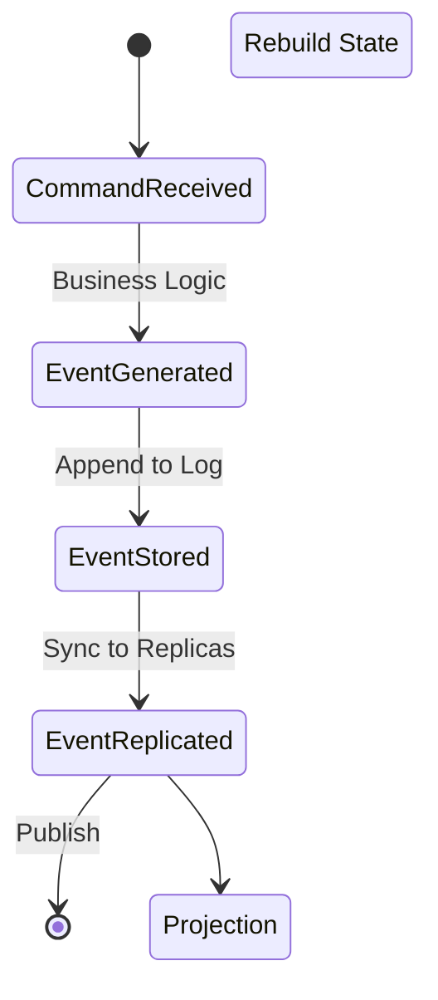
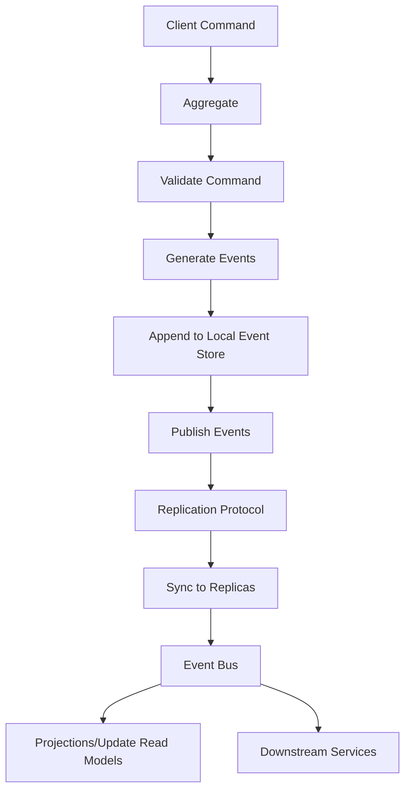

---
title: "Event-Sourced Systems with Distributed Replication"
description: "System design example for Event-Sourced Systems with Distributed Replication"
---

# Event-Sourced Systems with Distributed Replication

## Overview

Event sourcing is a persistence pattern that stores the state of a system as a sequence of immutable events rather than maintaining current state directly. When combined with distributed replication, this pattern enables building highly resilient, scalable systems that can handle data center failures, provide eventual consistency, and support complex analytical queries.

### What It Is and Why It's Important
Event sourcing captures all changes to an application's state as a sequence of immutable event objects. Distributed replication ensures these events are consistently replicated across multiple nodes or data centers, enabling global availability and fault tolerance.

### Real-World Context and Applications
Used in financial systems (e.g., banking transaction logs), event-driven architectures (e.g., IoT sensor data), auditing systems, and collaborative applications. Companies like EventStoreDB, Axon Framework, and production systems at Netflix and Uber implement variations of this pattern.



## Core Principles & Components

### Event Sourcing Fundamentals
- **Event Store**: Append-only log of immutable events. Each event represents a state change with business context, timestamp, and metadata.
- **Aggregates**: Domain objects that validate commands and emit events. Maintain internal state through event replay.
- **Projections**: Materialized views built by consuming events. Can be rebuilt from scratch for data recovery or schema evolution.
- **Snapshots**: Periodic snapshots of aggregate state to optimize event replay performance.

### Distributed Replication Components
- **Event Log Replication**: Using protocols like Raft or Paxos to ensure consistency across replicas.
- **Conflict Resolution**: Strategies like Last-Writer-Wins (LWW) or Vector Clocks for eventual consistency.
- **Event Bus/Streams**: Asynchronous messaging for event dissemination across services and data centers.
- **Eventual Consistency**: Design for AP (Availability + Partition) scenarios while providing strong consistency guarantees within partitions.

### System Architecture Flow



## Detailed Implementation Design

### A. Algorithm / Process Flow

The core flow involves:
1. **Command Reception**: Client sends a command (e.g., "DebitAccount")
2. **Validation & Event Generation**: Aggregate validates command and emits events
3. **Atomic Append**: Events appended to the event store transactionally
4. **Replication**: Events replicated to follower nodes using consensus protocol
5. **Publishing**: Events published to message bus for downstream consumers
6. **Projection Updates**: Read models updated through event processors

**Pseudocode Overview:**
```java
public class AccountService {
    private final EventStore eventStore;
    private final EventPublisher publisher;

    public void processCommand(AccountCommand command) {
        // Optimistic concurrency check
        long expectedVersion = command.getExpectedVersion();

        // Load aggregate state
        List<Event> stream = eventStore.loadEvents(command.getAggregateId());
        Account aggregate = new Account(command.getAggregateId());
        aggregate.replay(stream);

        // Validate command
        List<Event> newEvents = aggregate.handle(command);

        // Append atomically
        eventStore.append(command.getAggregateId(), newEvents, expectedVersion);

        // Publish for replication and projections
        publisher.publish(newEvents);
    }
}
```

### B. Data Structures & Configuration Parameters

**Core Data Structures:**
- Event Stream: Ordered list of events per aggregate ID (`Map<UUID, List<Event>>`)
- Vector Clocks: For conflict detection (`Map<String, Long>`)
- Event Index: For efficient querying (`TreeMap<String, Event>`)
- Replication State: Raft/Paxos log metadata

**Tunable Parameters:**
- `snapshotFrequency`: Events per snapshot (e.g., 1000) – balances replay time vs storage
- `replicationFactor`: Minimum replicas (e.g., 3) – availability vs consistency
- `consistencyTimeout`: Max wait for quorum (e.g., 500ms) – latency vs guarantees
- `maxRetryAttempts`: Failure recovery attempts – resilience vs resource usage

### C. Java Implementation Example

```java
import java.util.List;
import java.util.UUID;
import java.util.concurrent.atomic.AtomicLong;

public class DistributedEventStore {
    private final EventLog eventLog;
    private final ReplicationManager replicationManager;
    private final SnapshotManager snapshotManager;
    private volatile long sequenceNumber;

    public DistributedEventStore(EventLog eventLog,
                                ReplicationManager replicationManager,
                                SnapshotManager snapshotManager) {
        this.eventLog = eventLog;
        this.replicationManager = replicationManager;
        this.snapshotManager = snapshotManager;
        this.sequenceNumber = 0L; // Initialize from persisted state
    }

    public List<Event> append(UUID aggregateId, List<Event> events, long expectedVersion) {
        synchronized (this) { // Simple locking - use distributed locks for cluster
            // Optimistic concurrency check
            long currentVersion = getCurrentVersion(aggregateId);
            if (currentVersion != expectedVersion) {
                throw new ConcurrentModificationException("Version mismatch: expected " +
                    expectedVersion + " but got " + currentVersion);
            }

            // Assign sequence numbers and timestamps
            AtomicLong seq = new AtomicLong(sequenceNumber);
            events.forEach(event -> {
                event.setSequenceNumber(seq.incrementAndGet());
                event.setTimestamp(System.currentTimeMillis());
            });

            // Append to local log
            eventLog.append(aggregateId, events);

            // Initiate replication
            replicationManager.replicate(events);

            // Update sequence number
            sequenceNumber = events.get(events.size() - 1).getSequenceNumber();

            // Trigger snapshot if needed
            if (shouldCreateSnapshot(aggregateId)) {
                snapshotManager.createSnapshot(aggregateId, currentVersion + events.size());
            }

            return events;
        }
    }

    // Thread-safe event streaming for projections
    public EventStream readFrom(UUID aggregateId, long fromVersion) {
        List<Event> history = eventLog.loadFromVersion(aggregateId, fromVersion);

        // Handle snapshot optimization
        if (fromVersion == 0 && snapshotManager.hasSnapshot(aggregateId)) {
            Snapshot snapshot = snapshotManager.loadSnapshot(aggregateId);
            return new LazyEventStream(snapshot.getEvents(), history);
        }

        return new EventStream(history);
    }

    private long getCurrentVersion(UUID aggregateId) {
        return eventLog.getVersion(aggregateId);
    }

    private boolean shouldCreateSnapshot(UUID aggregateId) {
        long currentVersion = getCurrentVersion(aggregateId);
        return currentVersion > 0 && currentVersion % 1000 == 0; // Configurable threshold
    }
}
```

### D. Complexity & Performance

**Time Complexity:**
- Append Operation: O(1) for single event, O(n) for batch where n = batch size
- Replication Latency: O(log N) for Raft consensus (N = cluster size)
- Query by Aggregate: O(m) where m = event count for aggregate
- Snapshot Loading: O(1) followed by O(k) replay (k = events since snapshot)

**Space Complexity:**
- Event Store: O(E) where E = total events (linear growth)
- Snapshots: O(A) where A = aggregate count (constant entropy)
- Memory Footprint: O(C) where C = concurrent aggregates

**Performance Benchmarks:**
- Throughput: 10,000-50,000 events/sec per node
- Latency: 1-5ms for local append, 10-100ms with cross-DC replication
- Storage: ~200 bytes per event + indexing overhead

### E. Thread Safety & Concurrency

**Multi-Threaded Scenarios:**
- Command processing: Single-writer principle per aggregate (serializable consistency)
- Event replication: Background threads using separate executor pools
- Projection building: Parallel consumers with ordered processing guarantees

**Concurrency Strategy:**
```java
// Use striped locks for better parallelism
private final Striped<Lock> aggregateLocks = Striped.lock(locks, 256);

public List<Event> append(UUID aggregateId, List<Event> events) {
    Lock lock = aggregateLocks.get(aggregateId);
    lock.lock();
    try {
        // Atomic operation per aggregate
        return unsafeAppend(aggregateId, events);
    } finally {
        lock.unlock();
    }
}
```

**Atomic Operation Guarantees:**
- **Event Ordering**: Lamport clocks ensure consistent global ordering
- **Memory Barriers**: `volatile` sequence numbers prevent reordering issues
- **Distributed Consistency**: Raft provides linearizability for cluster operations

### F. Memory & Resource Management

**Heap Management:**
- Event Buffering: Use off-heap buffers (ByteBuffer) for high-throughput scenarios
- Snapshot Compression: LZ4 compression reduces memory footprint by 60-80%
- Garbage Collection: Minimize allocations through object pooling

**Storage Considerations:**
- Event Partitioning: Split event streams by aggregate type/range for scalability
- Cold Storage: Archive old events to S3/Blob storage with metadata indexing
- Cache Hierarchy: L1 (hot aggregates), L2 (recent events), L3 (archived data)

### G. Advanced Optimizations

**Replication Optimizations:**
- **Batch Log Shipping**: Send multiple events in compressed batches
- **Follower Optimizations**: Parallel event processing on replica nodes
- **Multi-Raft**: Sharding raft groups for higher throughput

**Query Optimizations:**
- **Event Projections**: Pre-computed materialized views
- **Event Folding**: Compact events into higher-level constructs
- **CQRS Integration**: Separate read/write models for optimized queries

## Edge Cases & Error Handling

### Boundary Conditions
- **Empty Event Streams**: Handle aggregate creation scenarios
- **Duplicate Events**: Idempotent processing with sequence number validation
- **Out-of-Order Events**: Buffer and reorder based on sequence numbers

### Failure Recovery Logic
- **Network Partitions**: Graceful degradation to eventual consistency
- **Node Failures**: Automatic leader election and log replay
- **Data Corruption**: Snapshot rollback + event stream rebuild
- **Split-Brain Scenarios**: Quorum-based conflict resolution

**Error Handling Example:**
```java
public List<Event> appendSafe(UUID aggregateId, List<Event> events) {
    int retryCount = 0;
    while (retryCount < MAX_RETRIES) {
        try {
            return append(aggregateId, events, getExpectedVersion(aggregateId));
        } catch (ReplicationTimeoutException e) {
            retryCount++;
            wait(calculateBackoff(retryCount)); // Exponential backoff
        } catch (VersionConflictException e) {
            // Reload and retry
            refreshAggregateState(aggregateId);
        }
    }
    throw new PersistenceException("Failed to persist events after " + MAX_RETRIES + " attempts");
}
```

## Configuration Trade-offs

### Performance vs Consistency
- **Synchronous Replication**: Lower throughput (1000 ops/sec) but stronger consistency
- **Asynchronous Replication**: Higher throughput (10,000 ops/sec) but eventual consistency
- **Tuning Parameter**: Replication factor (3 for strong consistency, 2 for optimized writes)

### Durability vs Latency
- **Disk Flush**: `fsync` every write reduces performance by 10x but ensures durability
- **In-Memory Buffers**: Batch flushes provide 5-10x throughput improvement

### Storage vs Processing
- **Complete Event History**: Precise auditing but storage costs escalate with time
- **Event Expiration**: Reduces storage by 50% but loses historical context

## Use Cases & Real-World Examples

### Financial Systems
- **Banking Transactions**: Immutable audit trail for regulatory compliance
- **Crypto Exchanges**: Order book reconstruction from event streams
- **Insurance Claims**: Event-driven workflow with complete history

### IoT & Analytics
- **Sensor Networks**: Event streams for real-time telemetry processing
- **Analytics Pipelines**: Event replay for backtesting and A/B analysis
- **Retail Systems**: Inventory tracking with point-in-time reconstruction

### Production Systems
- **EventStoreDB**: Commercial event store with built-in replication
- **Akka Persistence**: Akka framework with Cassandra-based event storage
- **Axon Framework**: Java-based event sourcing with distributed projections

## Advantages & Disadvantages

### Benefits
- **Auditable**: Complete historical record of state changes
- **Correction-Friendly**: Undo/compensate operations through new events
- **Scalable**: Horizontal scaling through event partitioning
- **Testable**: Deterministic replay for testing complex scenarios

### Trade-offs
- **Query Complexity**: Point-in-time queries require event aggregation
- **Storage Growth**: Event logs grow continuously unless archived
- **Learning Curve**: Paradigm shift from CRUD to event-based modeling
- **Eventual Consistency Challenges**: Complex synchronization across bounded contexts

### Anti-Patterns
- **Over-Use**: Simple CRUD problems don't need event sourcing
- **Large Events**: Event sourcing works best with small, focused events
- **Real-Time Requirements**: Strict real-time systems may suffer from projection lag

## Alternatives & Comparisons

### Compared to Traditional CRUD
| Aspect           | Event Sourcing        | CRUD                   |
| ---------------- | --------------------- | ---------------------- |
| Auditing         | Built-in              | Requires triggers/logs |
| Scalability      | Read/write separation | Monolithic scaling     |
| Schema Evolution | Event versioning      | Schema migrations      |
| Temporal Queries | Native support        | Complex to implement   |

### Compared to Change Data Capture (CDC)
- **Event Sourcing**: Application-owned events with business semantics
- **CDC**: Database log tailing, technical events only
- **Replication**: ES provides distributed replication; CDC requires additional tooling

### Prefer This Approach When:
- Business requires complete auditability
- Complex business domain with temporal dependencies
- Need for high fault tolerance and data center replication
- Analytics and reporting demand temporal flexibility

## Interview Talking Points

- Event sourcing enables complete system reconstruction from event logs, making it ideal for financial and audit-critical systems
- Distributed replication using consensus protocols (Raft/Paxos) provides strong consistency within data centers while allowing eventual consistency across regions
- Snapshots optimize replay performance but introduce complexity in version management and schema evolution
- CQRS naturally complements event sourcing by separating write models (event sources) from read models (projections)
- Event versioning and upcasting allow schema evolution without breaking backward compatibility
- Compensation events for error correction maintain immutability while enabling business rule changes
- Replication lag demands careful design of conflict resolution strategies and eventual consistency guarantees
- Storage costs grow linearly with events, requiring intelligent archiving and data lifecycle management
- Thread safety requires strict ordering guarantees and vector clocks for proper event serialization
- Real-time projections must handle duplicate events and ordering issues in distributed environments
