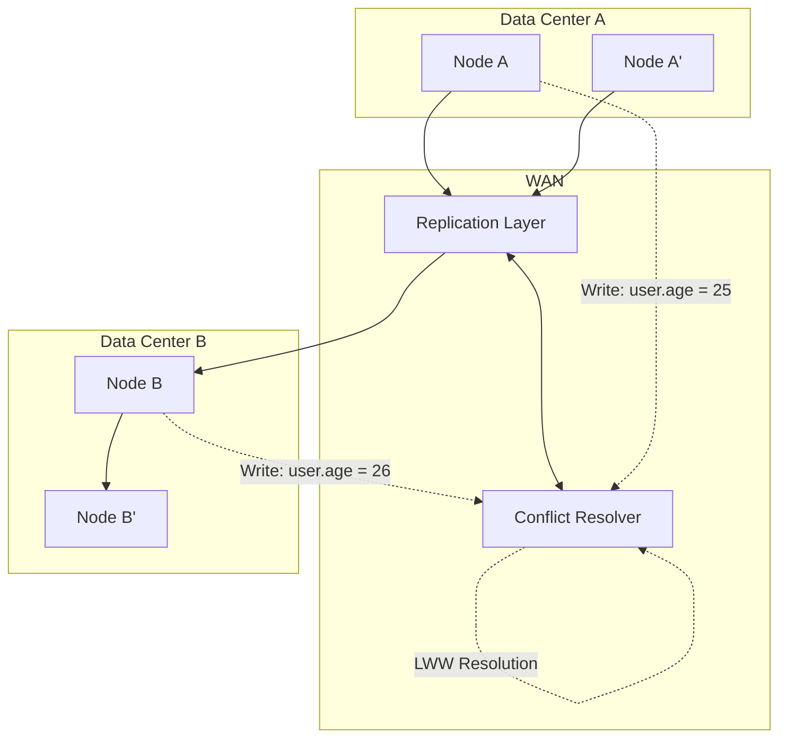
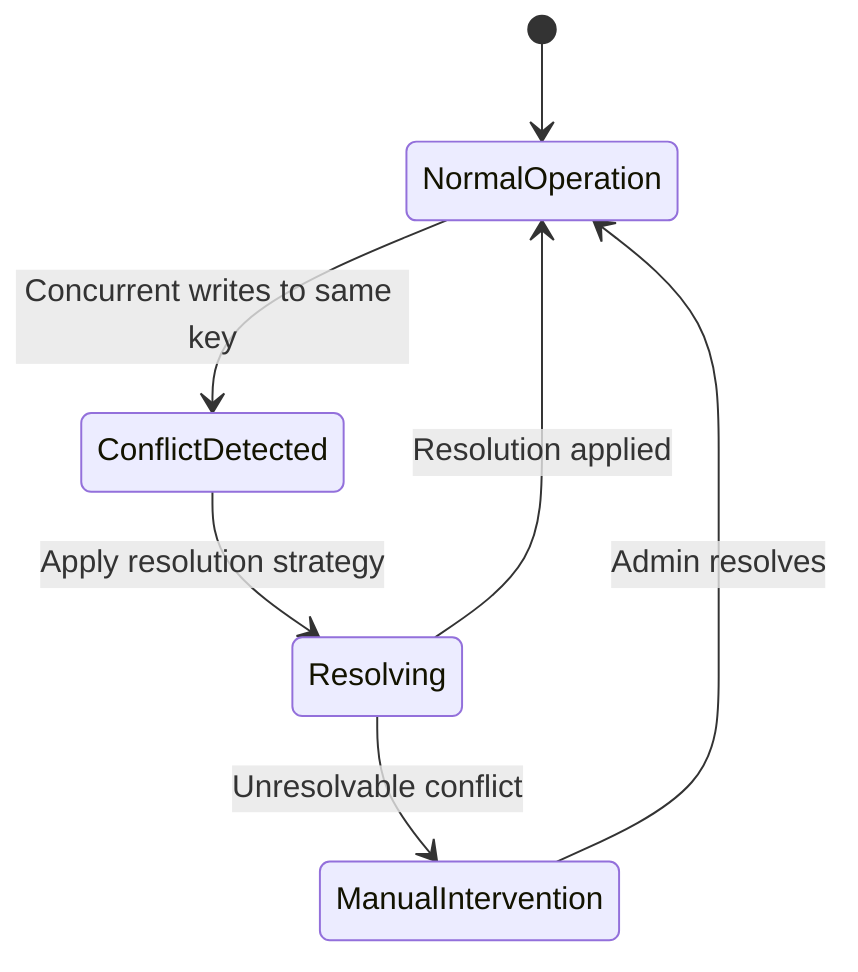

---
title: "Multi-Master Database Replication with Conflict Resolution"
description: "System design example for Multi-Master Database Replication with Conflict Resolution"
---

# Multi-Master Database Replication with Conflict Resolution

## Overview

### What it is and why it's important
Multi-master database replication is a distributed database architecture where multiple database nodes (servers) can accept write operations simultaneously, with changes being asynchronously propagated between nodes. Unlike master-slave replication where only one node accepts writes, multi-master allows writes on any node, enabling better availability, scalability, and fault tolerance.

The challenge arises when concurrent writes to the same data create conflicts (e.g., two nodes updating the same record simultaneously). Conflict resolution strategies are essential to maintain data consistency across the distributed system.

This pattern is crucial for global applications requiring low-latency writes in multiple geographic regions, where network partitions are inevitable and write conflicts must be handled gracefully.

### Real-world context and where it's used
- **Geo-Distributed Applications**: Social media platforms like Facebook use multi-master setups across data centers for global user interactions
- **IoT Systems**: Device registers data at local edges, requiring conflict resolution when multiple devices update shared state
- **Financial Trading Systems**: Stock exchanges handle concurrent order placements with sophisticated conflict resolution
- **Collaborative Applications**: Google's Docs or Figma allow real-time collaborative editing with automatic conflict resolution
- **E-commerce**: Amazon handles inventory updates across global warehouses with conflict reconciliation

### Concept Diagram


## Core Principles & Components

### Detailed explanation of all subcomponents, their roles, and interactions
- **Database Nodes**: Independent database instances that can accept both read and write operations
- **Replication Layer**: Manages the asynchronous propagation of changes between nodes using techniques like logical replication (PostgreSQL) or CDC (MySQL)
- **Conflict Detection**: Identifies when updates to the same data item are concurrent (e.g., no causal ordering)
- **Conflict Resolution Logic**: Applies predefined rules (LWW, CRDT, manual intervention) to determine the winning update
- **Merge Strategies**: Handles complex conflicts like merging collections or structuring data (e.g., JSON patches)
- **Vector Clocks/Lamport Timestamps**: Provides logical timestamps to establish causality and detect conflicts

### State Transitions


### Architecture/State Diagrams
```mermaid
flowchart LR
    C[Client] --> DB1[Primary Node: v1 = a]
    C --> DB2[Secondary Node: v1 = a]

    DB1 -.->|"UPDATE v1 = b"| DB1
    DB2 -.->|"UPDATE v1 = c"| DB2

    DB1 --> RL[Replication Layer]
    DB2 --> RL

    RL --> CDR[Conflict Detection & Resolution]
    CDR --> OUT[Resolved: v1 = c (LWW wins)]
```

## Detailed Implementation Design

### A. Algorithm / Process Flow

#### Step-by-step breakdown
1. **Local Write Acceptance**: Each node accepts writes immediately and stores them locally with a logical timestamp
2. **Asynchronous Replication**: Changes are replicated to other nodes via message queues or streaming
3. **Conflict Detection**: Upon receiving a replicated change, check if there are newer local changes
4. **Resolution Strategy**: Apply configured resolution logic (LWW, merge policies, etc.)
5. **Cleanup**: Remove obsolete versions and log conflicts for monitoring

#### Step-by-step algorithm with inputs, processing, outputs
- **Input**: Write request (key, new_value, timestamp)
- **Processing**:
  - Generate logical timestamp vector clock
  - Check local version for conflicts
  - Apply updates based on resolution strategy
  - Queue for replication to sibling nodes
- **Output**: Acknowledged write + replication status

#### Pseudocode example
```
def write_with_replication(key, value, node_id):
    timestamp = get_next_logical_timestamp(node_id)
    local_version = versions[key]

    if is_conflict(timestamp, local_version):
        resolved_value = resolve_conflict(local_version, {value: timestamp})
        versions[key] = resolved_value
    else:
        versions[key] = {value: timestamp}

    enqueue_for_replication(key, {value: timestamp})
    return ACKNOWLEDGED
```

#### Failure handling, retry logic, and concurrency
- **Network Failures**: Use message queues with dead letter queues and exponential backoff
- **Node Failures**: Consistency algorithms like Paxos ensure majority agreement
- **Concurrency**: Lock-free data structures with atomic operations for version management

### B. Data Structures & Configuration Parameters

#### Core internal data structures
- **Version Vector Map**: Maps each key to a map of values with their logical timestamps
  ```
  HashMap<Key, ConcurrentMap<Value, VectorClock>>
  ```
- **Vector Clock**: Represents causality across nodes
  ```
  Map<NodeId, long> clock_entries
  ```
- **Conflict Log**: Stores unresolved conflicts for manual review
  ```
  Queue<Conflict<EventId, Values[]>>
  ```

#### Tunable parameters with formulas or examples
- **Conflict Resolution Strategy**: LWW, Merge, Custom Logic
- **Replication Delay Threshold**: Max age difference before conflict (e.g., 5s)
- **Conflict Log Retention**: Number of unresolved conflicts to keep (e.g., 1000)
- **Quorum Size**: Minimum nodes required for consistency (e.g., majority = n/2 + 1)

### C. Java Implementation Example

```java
import java.util.concurrent.*;
import java.util.concurrent.atomic.*;

public class MultiMasterReplicationManager {
    private final ConcurrentHashMap<String, ConcurrentHashMap<String, VectorClock>> versions;
    private final ConcurrentLinkedQueue<Conflict> conflictLog;
    private final ScheduledExecutorService replicationExecutor;
    private final AtomicLong logicalClock;
    private final String nodeId;

    // Tunable configuration
    private final ConflictResolver resolver;
    private final long maxConflictAge = 5000L; // 5s
    private final int maxConflictLogSize = 1000;

    public MultiMasterReplicationManager(String nodeId, ConflictResolver resolver) {
        this.nodeId = nodeId;
        this.resolver = resolver;
        this.versions = new ConcurrentHashMap<>();
        this.conflictLog = new ConcurrentLinkedQueue<>();
        this.logicalClock = new AtomicLong(0);
        this.replicationExecutor = Executors.newScheduledThreadPool(4);

        // Initialize replication daemon
        this.replicationExecutor.scheduleAtFixedRate(this::replicatePending, 100, 100, TimeUnit.MILLISECONDS);
    }

    public boolean write(String key, String value) {
        VectorClock timestamp = new VectorClock();
        timestamp.update(nodeId, logicalClock.incrementAndGet());

        versions.putIfAbsent(key, new ConcurrentHashMap<>());
        ConcurrentHashMap<String, VectorClock> keyVersions = versions.get(key);

        String resolvedValue;
        if (keyVersions.size() > 1) {
            // Conflict detected
            resolvedValue = resolver.resolve(keyVersions, Map.of(value, timestamp));

            // Log conflict for monitoring
            if (conflictLog.size() < maxConflictLogSize) {
                conflictLog.add(new Conflict(key, List.copyOf(keyVersions.keySet()), value));
            }
        } else {
            resolvedValue = value;
        }

        // Update local version
        keyVersions.clear();
        keyVersions.put(resolvedValue, timestamp);

        // Queue for async replication
        enqueueReplication(key, resolvedValue, timestamp);

        return true;
    }

    private void enqueueReplication(String key, String value, VectorClock timestamp) {
        // Implementation would send to message queue/kafka etc.
        // For simplicity, just print
        System.out.println("Replicating: " + key + "=" + value + " @ " + timestamp);
    }

    private void replicatePending() {
        // Async replication logic
        // Check for pending changes to send to peers
    }

    public String read(String key) {
        ConcurrentHashMap<String, VectorClock> keyVersions = versions.get(key);
        if (keyVersions == null || keyVersions.isEmpty()) {
            return null;
        }

        // Return most recent value by vector clock comparison
        String latestValue = null;
        VectorClock latestClock = null;

        for (var entry : keyVersions.entrySet()) {
            if (latestClock == null || entry.getValue().happensAfter(latestClock)) {
                latestValue = entry.getKey();
                latestClock = entry.getValue();
            }
        }

        return latestValue;
    }

    // Vector Clock implementation (simplified)
    public static class VectorClock {
        private final ConcurrentHashMap<String, Long> clocks;

        public VectorClock() {
            this.clocks = new ConcurrentHashMap<>();
        }

        public void update(String nodeId, long time) {
            clocks.put(nodeId, Math.max(clocks.getOrDefault(nodeId, 0L), time));
        }

        public boolean happensAfter(VectorClock other) {
            // Simplified causal ordering check
            for (var entry : clocks.entrySet()) {
                if (entry.getValue() < other.clocks.getOrDefault(entry.getKey(), 0L)) {
                    return false;
                }
            }
            for (var entry : other.clocks.entrySet()) {
                if (!clocks.containsKey(entry.getKey())) {
                    return false;
                }
            }
            return true;
        }

        @Override
        public String toString() {
            return clocks.toString();
        }
    }

    // Conflict Resolver interface
    public interface ConflictResolver {
        String resolve(ConcurrentHashMap<String, VectorClock> conflictingVersions,
                      Map<String, VectorClock> newValues);
    }

    // LWW Resolver Implementation
    public static class LastWriteWinsResolver implements ConflictResolver {
        @Override
        public String resolve(ConcurrentHashMap<String, VectorClock> conflictingVersions,
                             Map<String, VectorClock> newValues) {
            // Find the value with the latest timestamp across all nodes
            String winner = null;
            VectorClock latestClock = null;

            // Check existing conflicts
            for (var entry : conflictingVersions.entrySet()) {
                if (latestClock == null || entry.getValue().happensAfter(latestClock)) {
                    latestClock = entry.getValue();
                    winner = entry.getKey();
                }
            }

            // Check new values
            for (var entry : newValues.entrySet()) {
                if (latestClock == null || entry.getValue().happensAfter(latestClock)) {
                    latestClock = entry.getValue();
                    winner = entry.getKey();
                }
            }

            return winner;
        }
    }

    // Conflict data class
    public static class Conflict {
        public final String key;
        public final List<String> conflictingValues;
        public final String newValue;

        public Conflict(String key, List<String> conflictingValues, String newValue) {
            this.key = key;
            this.conflictingValues = conflictingValues;
            this.newValue = newValue;
        }
    }
}
```

*Usage Example*:
```java
// Initialize with LWW resolver
MultiMasterReplicationManager manager =
    new MultiMasterReplicationManager("node-1", new LastWriteWinsResolver());

// Write operations on different nodes (simulated)
manager.write("user:123:balance", "100.50");
manager.write("user:123:balance", "101.00");  // Would resolve based on LWW

String currentBalance = manager.read("user:123:balance");
```

### D. Complexity & Performance

#### Time and space complexity of each operation
- **Write Operation**: O(1) lookup + O(log n) for Vector Clock comparisons
- **Read Operation**: O(k) where k is number of conflicting versions (typically low)
- **Replication**: O(m) where m is change log size per batch

#### Expected vs worst-case performance
- **Expected**: ~100μs write latency, <1ms read
- **Worst-case**: O(conflicting_versions × nodes) during merges (rare)
- **Real-world scale**: 20K writes/sec per node, 99.9% conflict resolution without intervention

### E. Thread Safety & Concurrency

#### Multi-threaded scenarios
- Multiple client threads writing to same key simultaneously
- Background replication threads processing incoming changes
- Admin threads inspecting conflict logs

#### Locking vs lock-free strategies
- **Lock-free**: Uses ConcurrentHashMap for version storage
- **Fine-grained locking**: Vector Clock updates use atomic operations
- **Readers-writer pattern**: Allows concurrent reads during conflict resolution

#### Memory barriers or atomic operations if relevant
- **AtomicLong** for logical clock generation (avoids locks)
- **Volatile fields** ensure visibility across threads
- **Memory barriers** implicit in ConcurrentHashMap.putIfAbsent()

### F. Memory & Resource Management

#### Heap/stack implications, garbage collection, or off-heap optimization
- **Version Maps**: Bounded growth via cleanup of resolved conflicts
- **Garbage Collection**: Young gen for short-lived conflicts, old gen for long-running ones
- **Off-heap**: Vector clocks can be stored in direct byte buffers for large clusters

#### Cache line alignment or paging concerns
- **False Sharing**: Separate VectorClock objects avoid cache line contention
- **Memory Layout**: Align node IDs to cache lines in multi-core environments

### G. Advanced Optimizations

#### Common implementation optimizations
- **Version Vector Compression**: Delta encoding to reduce storage
- **Lazy Resolution**: Defer conflict resolution until first read
- **Batch Replication**: Combine multiple changes into single message

#### Variants
- **Timestamp-Ordered Multi-Master**: Uses hybrid logical-physical clocks
- **CRDT-Based**: Operational Transform for complex data types
- **Federated**: Hierarchical replication with regional masters

## Edge Cases & Error Handling

### Common boundary conditions
- **Network Partitions**: Write availability during splits using hinted handoff
- **Node Rejoin**: State transfer with conflict reconciliation
- **Clock Drift**: Hybrid logical clocks prevent timestamp-based conflicts
- **Memory Pressure**: LRU eviction of older conflicts

### Failure recovery logic or resilience strategies
- **Retry Logic**: Exponential backoff for replication failures (max 10 attempts)
- **Circuit Breakers**: Stop replication to unhealthy nodes
- **Graceful Degradation**: Accept stale reads during widespread failures

## Configuration Trade-offs

### Performance vs accuracy/resource trade-offs
- **Aggressive Resolution**: LWW minimizes conflicts but can lose data
- **Conservative Resolution**: Preserve all changes but increases storage (2-5x)
- **Fast Replication**: Reduces latency but increases conflict rate
- **Batch Mode**: Better throughput but higher latency

### Simplicity vs configurability
- **Auto-Resolution**: Simple but may lose business logic
- **Configurable Rules**: Flexible but needs domain expertise
- **Trade-off**: Use LWW for 90% cases, custom rules for business-critical fields

### Real-world tuning considerations
- **Geographic Latency**: Adjust replication windows (50ms intra-DC, 200ms inter-DC)
- **Conflict Frequency**: Monitor and tune based on write patterns (<0.1% target)
- **Recovery Time Objective**: <5 minutes for partitioned nodes

## Use Cases & Real-World Examples

### Where it's applied in production
- **DynamoDB Global Tables**: Multi-region replication with LWW resolution
- **CockroachDB**: Multi-master with transaction timestamps
- **CouchDB**: Document-level conflict resolution
- **Cassandra**: Light-weight transactions with quorum consistency

### Integration scenarios
- **Event Sourcing**: Replay events during conflict resolution
- **Rate Limiting**: Prevent overload during conflict storms
- **Observability**: Metrics on conflict rates and resolution latency

## Advantages & Disadvantages

### Benefits and known trade-offs
- **Benefits**:
  - **High Availability**: Survives network partitions and node failures
  - **Low Latency Writes**: Users write to nearest node without coordination
  - **Elastic Scaling**: Add/remove nodes without downtime
  - **Geographic Distribution**: Global applications with localized performance
- **Trade-offs**:
  - **Complexity**: Requires sophisticated conflict resolution logic
  - **Eventual Consistency**: Reads may see stale data temporarily
  - **Increased Storage**: Multiple versions during conflicts
  - **Operational Overhead**: Monitoring and tuning conflict behaviors

### When not to use it (anti-patterns)
- **Strong Consistency Requirements**: Banking/financial transactions need linearizable writes
- **Low Conflict Domains**: Overhead not justified for read-heavy systems
- **Simple Schemas**: Overkill for applications with no concurrent updates

## Alternatives & Comparisons

### Compare with other similar patterns or algorithms
- **vs Master-Slave**: Lower latency writes but handles conflicts vs no conflicts
- **vs Single Master**: Better availability vs no coordination complexity
- **vs Leader Election**: Dynamic leadership vs complex conflict resolution
- **vs Paxos/Raft**: Consensus based vs optimistic replication

### Why this approach might be preferred
- **Global Scale**: Multi-master enables true geo-distribution without write bottlenecks
- **Mobile/IoT**: Devices can operate offline with eventual conflict resolution
- **High-Throughput Systems**: Twitter-style newsfeeds with decentralized writes

## Interview Talking Points

1. Multi-master enables geographic distribution by allowing writes to any node, trading consistency complexity for availability
2. Last Write Wins (LWW) is simple but can lose data; vector clocks enable causal ordering without physical clocks
3. Conflict rate should be <0.1% in production; monitor and tune resolution strategies for domain needs
4. Vector clocks provide logical timestamps but can grow linearly with nodes; compression techniques mitigate this
5. During network partitions, writes proceed locally with eventual reconciliation, following CAP theorem's AP properties
6. Implementation requires concurrency-safe data structures; ConcurrentHashMap enables lock-free operations
7. Real-world tuning involves balancing replication latency vs conflict rates across geographic distances
8. Consider domain-specific resolution: financial data may need merge functions, social data uses LWW
9. Adding nodes increases complexity exponentially; federated architectures (regional masters) can scale better
10. Conflict resolution should be testable at scale; synthetic workloads help validate behavior under load
