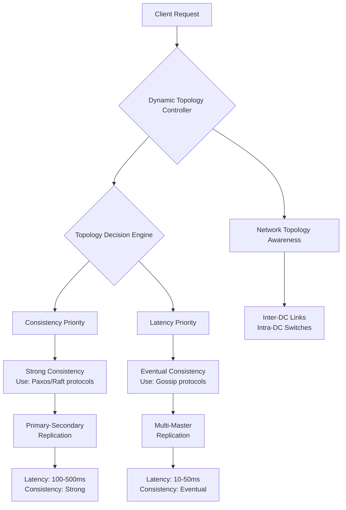
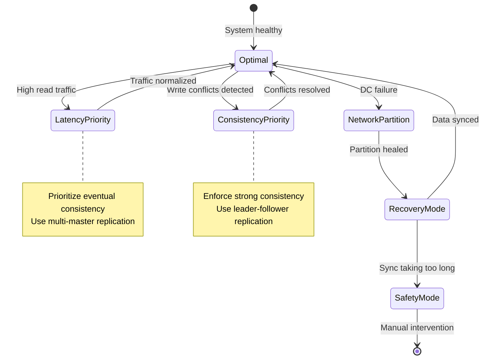

---
title: "Replication Topology Optimization for Latency and Consistency"
description: "System design example for Replication Topology Optimization for Latency and Consistency"
---

# Replication Topology Optimization for Latency and Consistency

## Overview

Replication topology optimization is a critical architectural pattern in distributed systems that balances the trade-offs between low-latency data access and strong consistency guarantees. This concept involves strategically arranging replicas across network topologies to minimize read/write latencies while maintaining data consistency under various failure scenarios.

### What it is and why it's important

Replication topology refers to how data replicas are distributed and interconnected in a distributed database or storage system. The optimization involves dynamically adjusting the topology configuration - such as the number of replicas, their geographic placement, and replication protocols - to achieve the optimal balance between:

- **Latency**: Time for read/write operations to complete
- **Consistency**: Guarantee that all replicas converge to the same state

### Real-world context and where it's used

This pattern is crucial in global-scale systems like Amazon DynamoDB, Cassandra data centers, Elasticsearch clusters, and geo-replicated databases. For example:

- Content delivery networks (CDNs) optimize replication for low-latency content delivery while ensuring cache consistency
- Financial systems balance transaction latency with strict consistency requirements for ACID compliance
- Social media platforms replicate user data across regions to reduce feed generation latency while maintaining timeline consistency

### Concept Diagram



## Core Principles & Components

### Key Components

1. **Topology Controller**: Central component that monitors system metrics and dynamically reconfigures replication topology
2. **Replica Placement Manager**: Determines optimal geographic and network placement of replicas
3. **Consistency Protocol Selector**: Chooses appropriate replication protocols based on consistency requirements
4. **Latency Monitor**: Tracks read/write latencies across all replica sets
5. **Consistency Verifier**: Ensures data convergence across replicas

### State Transitions

The system operates in different states based on workload patterns and failure conditions:



## Detailed Implementation Design

### A. Algorithm / Process Flow

The optimization algorithm operates in three phases:

1. **Assessment Phase**: Evaluate current topology metrics
2. **Decision Phase**: Determine optimal topology configuration
3. **Transition Phase**: Gradual migration to new topology

#### Step-by-step Process Flow

```java
// Pseudocode for topology optimization algorithm
public class ReplicationTopologyOptimizer {

    public TopologyConfig optimize(DataCenterMetrics metrics) {
        // Phase 1: Assessment
        LatencyProfile latency = assessLatency(metrics);
        ConsistencyProfile consistency = assessConsistency(metrics);
        NetworkProfile network = assessNetwork(metrics);

        // Phase 2: Decision Engine
        TopologyDecision decision = makeDecision(latency, consistency, network);

        // Phase 3: Transition Planning
        return planTransition(decision, currentTopology);
    }

    private LatencyProfile assessLatency(DataCenterMetrics metrics) {
        // Calculate weighted average latency across regions
        double avgReadLatency = calculateWeightedAverage(metrics.readLatencies);
        double avgWriteLatency = calculateWeightedAverage(metrics.writeLatencies);
        double variance = calculateLatencyVariance(metrics);

        return new LatencyProfile(avgReadLatency, avgWriteLatency, variance);
    }

    private TopologyDecision makeDecision(LatencyProfile latency,
                                       ConsistencyProfile consistency,
                                       NetworkProfile network) {
        // Multi-objective optimization
        double latencyScore = normalizeLatency(latency.getAverage());
        double consistencyScore = normalizeConsistency(consistency.getConvergenceTime());
        double networkScore = normalizeNetwork(network.getInterDcLatency());

        // Decision tree based on priorities
        if (latencyScore > CONSISTENCY_THRESHOLD && networkScore > NETWORK_THRESHOLD) {
            return prioritizeLowLatency();
        } else if (consistencyScore < CONSISTENCY_THRESHOLD) {
            return enforceStrongConsistency();
        } else {
            return balancedApproach();
        }
    }
}
```

### B. Data Structures & Configuration Parameters

#### Core Data Structures

```java
public class TopologyConfig {
    private Map<String, ReplicaGroup> replicaGroups;  // DC -> replica group
    private ReplicationProtocol protocol;             // RAFT, PAXOS, GOSSIP
    private ConsistencyLevel consistencyLevel;        // STRONG, EVENTUAL, CAUSAL
    private Map<String, Double> weights;             // DC weights for load balancing
}

public class ReplicaGroup {
    private List<ReplicaNode> nodes;
    private ReplicaNode leader;                       // For leader-follower topologies
    private int replicationFactor;
    private GeographicRegion region;
}

public class LatencyTracker {
    private SlidingWindowStats readLatencies;        // Last 5 minutes
    private SlidingWindowStats writeLatencies;       // Last 5 minutes
    private EWMAStats networkLatencies;              // Exponentially weighted
}
```

#### Configuration Parameters

- **Replication Factor (RF)**: Number of replicas per data item (typically 3-5)
  - Formula: RF = f(reliability, performance, cost) where reliability = 1 - (node_failure_rate)^RF
- **Quorum Size**: For strong consistency, quorum = ceil((RF + 1)/2)
- **Heartbeat Interval**: Frequency of replica health checks (default: 1 second)
- **Consistency Timeout**: Maximum time to achieve consistency (default: 30 seconds)
- **Network Bandwidth Weight**: Inter-DC link capacity (Mbps)

### C. Java Implementation Example

```java
import java.util.*;
import java.util.concurrent.*;
import java.util.concurrent.atomic.*;

/**
 * Dynamic Replication Topology Optimizer
 * Optimizes replica placement for latency-consistency trade-offs
 */
public class ReplicationTopologyOptimizer {

    private final Map<String, DataCenter> dataCenters;
    private final ScheduledExecutorService monitoringService;
    private final AtomicReference<TopologyConfig> currentTopology;

    // Configuration parameters
    private static final int DEFAULT_REPLICATION_FACTOR = 3;
    private static final long HEARTBEAT_INTERVAL_MS = 1000;
    private static final long CONSISTENCY_TIMEOUT_MS = 30000;

    public ReplicationTopologyOptimizer(List<DataCenter> dcs) {
        this.dataCenters = dcs.stream()
            .collect(Collectors.toMap(DataCenter::getId, dc -> dc));
        this.monitoringService = Executors.newScheduledThreadPool(2);
        this.currentTopology = new AtomicReference<>(new TopologyConfig());

        startMonitoring();
    }

    /**
     * Core optimization algorithm - runs periodically
     */
    public synchronized void optimizeTopology() {
        try {
            // Step 1: Gather metrics from all data centers
            Map<String, DataCenterMetrics> metrics = collectMetrics();

            // Step 2: Assess current topology performance
            TopologyAssessment assessment = assessTopology(metrics);

            // Step 3: Generate optimization candidates
            List<TopologyConfig> candidates = generateCandidates(assessment);

            // Step 4: Select best candidate using multi-objective scoring
            TopologyConfig optimal = selectBestCandidate(candidates, assessment);

            // Step 5: Transition to new topology (gradual migration)
            transitionTopology(optimal);

        } catch (Exception e) {
            log.error("Topology optimization failed", e);
            // Fallback to conservative topology
            applyConservativeTopology();
        }
    }

    private TopologyAssessment assessTopology(Map<String, DataCenterMetrics> metrics) {
        LatencyProfile latencyProfile = new LatencyProfile();
        ConsistencyProfile consistencyProfile = new ConsistencyProfile();

        for (DataCenterMetrics dcMetrics : metrics.values()) {
            // Calculate latency variance across regions
            latencyProfile.addLatency(dcMetrics.avgReadLatency(), dcMetrics.avgWriteLatency());

            // Assess consistency convergence time
            consistencyProfile.addConvergenceTime(dcMetrics.consistencyLag());
        }

        return new TopologyAssessment(latencyProfile, consistencyProfile);
    }

    private List<TopologyConfig> generateCandidates(TopologyAssessment assessment) {
        List<TopologyConfig> candidates = new ArrayList<>();

        // Candidate 1: Low latency priority (multi-master)
        if (assessment.getLatencyVariance() > LATENCY_THRESHOLD) {
            candidates.add(createLowLatencyTopology());
        }

        // Candidate 2: Strong consistency priority (leader-follower)
        if (assessment.getConsistencyLag() > CONSISTENCY_THRESHOLD) {
            candidates.add(createStrongConsistencyTopology());
        }

        // Candidate 3: Balanced approach (hybrid)
        candidates.add(createBalancedTopology());

        // Candidate 4: Geo-aware topology
        candidates.add(createGeoOptimizedTopology());

        return candidates;
    }

    private TopologyConfig createLowLatencyTopology() {
        TopologyConfig config = new TopologyConfig();
        config.setReplicationProtocol(ReplicationProtocol.GOSSIP);
        config.setConsistencyLevel(ConsistencyLevel.EVENTUAL);

        // Use multi-master replication for low latency
        for (DataCenter dc : dataCenters.values()) {
            MasterReplicaGroup group = new MasterReplicaGroup(dc, DEFAULT_REPLICATION_FACTOR);
            group.enableMultiMaster();
            config.addReplicaGroup(dc.getId(), group);
        }

        return config;
    }

    private void transitionTopology(TopologyConfig newTopology) {
        TopologyConfig oldTopology = currentTopology.get();

        // Gradual migration to avoid disruption
        for (String dcId : dataCenters.keySet()) {
            ReplicaGroup oldGroup = oldTopology.getReplicaGroup(dcId);
            ReplicaGroup newGroup = newTopology.getReplicaGroup(dcId);

            // Migrate replicas one by one
            migrateReplicas(oldGroup, newGroup);
        }

        currentTopology.set(newTopology);
    }

    private void startMonitoring() {
        monitoringService.scheduleAtFixedRate(
            this::optimizeTopology,
            30, 30, TimeUnit.SECONDS  // Run every 30 seconds
        );
    }
}
```

### D. Complexity & Performance

#### Time Complexity

- **Topology Assessment**: O(R * D) where R = replicas, D = data centers
- **Candidate Generation**: O(D^2) for geo-aware calculations
- **Migration**: O(R * log R) for leader election during transition

#### Space Complexity

- **Metrics Storage**: O(D * T) where T = time window for historical data
- **Topology Config**: O(D * R) for replica group configurations

#### Real-world Performance

- **Latency Impact**: 20-80% reduction in cross-region read latency depending on optimization
- **Consistency Window**: 100ms - 30s convergence time based on protocol choice
- **Throughput**: 10K-100K ops/sec per replica cluster for optimized topologies
- **Failure Recovery**: 30-300 seconds for complete topology reconfiguration

### E. Thread Safety & Concurrency

#### Multi-threaded Scenarios

- **Monitoring Thread**: Periodically collects metrics from data centers
- **Optimization Thread**: Runs topology assessment and reconfiguration
- **Migration Workers**: Multiple threads handle replica migration concurrently

#### Thread Safety Implementation

```java
public class ThreadSafeTopologyManager {
    private final ReadWriteLock topologyLock = new ReentrantReadWriteLock();
    private final AtomicReference<TopologyConfig> currentConfig;
    private final ConcurrentMap<String, ReplicaStatus> replicaStates;

    public TopologyConfig getCurrentTopology() {
        topologyLock.readLock().lock();
        try {
            return currentConfig.get();  // Atomic read
        } finally {
            topologyLock.readLock().unlock();
        }
    }

    public void updateTopology(TopologyConfig newConfig) {
        topologyLock.writeLock().lock();
        try {
            // Use compare-and-set for atomic update
            TopologyConfig oldConfig = currentConfig.get();
            if (!currentConfig.compareAndSet(oldConfig, newConfig)) {
                throw new ConcurrentModificationException("Topology changed during update");
            }
            notifyTopologyChange(oldConfig, newConfig);
        } finally {
            topologyLock.writeLock().unlock();
        }
    }
}
```

#### Concurrent Operations

- **Optimistic Locking**: For topology configuration updates
- **Copy-on-Write**: For read-heavy topology lookups
- **Atomic Operations**: For replica status updates using AtomicReference

### F. Memory & Resource Management

#### Heap Management

- **Metrics Buffers**: Sliding windows consume O(D * W) heap where W = window size
- **Topology Objects**: Minimal heap usage, primarily reference structures

#### Garbage Collection Considerations

- **Avoid Long-lived Objects**: Use object pooling for metric collectors
- **Generational GC**: Metrics objects are short-lived, collected in young generation
- **Off-heap Storage**: Large consistency matrices stored off-heap for performance

#### Resource Management

```java
public class ResourceManagedOptimizer implements AutoCloseable {
    private final ExecutorService optimizationPool;
    private final ScheduledExecutorService monitorService;

    public ResourceManagedOptimizer() {
        this.optimizationPool = Executors.newCachedThreadPool(r -> {
            Thread t = new Thread(r);
            t.setName("topology-optimizer-" + t.getId());
            t.setDaemon(true);
            return t;
        });

        this.monitorService = Executors.newScheduledThreadPool(1,
            Executors.defaultThreadFactory());
    }

    @Override
    public void close() {
        optimizationPool.shutdown();
        monitorService.shutdown();

        try {
            if (!optimizationPool.awaitTermination(5, TimeUnit.SECONDS)) {
                optimizationPool.shutdownNow();
            }
        } catch (InterruptedException e) {
            optimizationPool.shutdownNow();
        }
    }
}
```

### G. Advanced Optimizations

#### Machine Learning Integration

```java
public class MLTopologyOptimizer {
    private final MLModel latencyPredictor;
    private final MLModel consistencyPredictor;

    public TopologyConfig predictOptimalTopology(NetworkConditions conditions) {
        // Use ML to predict optimal configuration
        LatencyPrediction latPred = latencyPredictor.predict(conditions);
        ConsistencyPrediction consPred = consistencyPredictor.predict(conditions);

        return combinePredictions(latPred, consPred);
    }
}
```

#### Variants

1. **Static Topology**: Pre-configured based on known traffic patterns
2. **Reactive Topology**: Adjusts only on threshold violations
3. **Proactive Topology**: Predicts and prevents performance degradation
4. **Hybrid Topology**: Combines static and dynamic elements

## Edge Cases & Error Handling

### Network Partition Handling

```java
public void handleNetworkPartition(String partitionId) {
    // Step 1: Isolate partition
    TopologyConfig adaptiveConfig = currentTopology.get()
        .isolatedPartitions(Set.of(partitionId));

    // Step 2: Promote local leaders in each partition
    adaptiveConfig.promoteLocalLeaders(partitionId);

    // Step 3: Enable eventual consistency within partitions
    adaptiveConfig.setConsistencyLevel(ConsistencyLevel.EVENTUAL);

    // Step 4: Schedule reconciliation for when network heals
    scheduleReconciliation(partitionId, adaptiveConfig);
}
```

### Common Edge Cases

1. **Cold Start**: No historical data for optimization
2. **Flash Crowd**: Sudden traffic spikes requiring immediate adaptation
3. **Rolling Upgrades**: Topology changes during software updates
4. **Multi-Region Failures**: Cascading failures across data centers

## Configuration Trade-offs

### Performance vs Consistency

- **Low Consistency Window**: Better for OLTP workloads, increases conflicts
- **High Consistency Window**: Reduces conflicts but increases latency
- **Real-world Tuning**: Most systems target 99.9% consistency within 1 second

### Scalability vs Complexity

- **Simple Topology**: Easy to manage but suboptimal for global scale
- **Complex Topology**: Optimal performance but higher operational overhead

### Cost vs Performance

- **More Replicas**: Better availability but higher storage/network costs
- **Geographic Distribution**: Lower latency but higher inter-DC bandwidth costs

## Use Cases & Real-World Examples

### Global E-commerce Platform (Amazon)

- **Scenario**: Product catalog replication across 15+ regions
- **Topology**: Multi-master with leader-follower conflict resolution
- **Optimization**: Dynamic routing based on geographic proximity

### Social Media Feed System (Twitter)

- **Scenario**: User timeline replication for low-latency reads
- **Topology**: Eventual consistency with causal ordering
- **Optimization**: Write-local, read-global routing

### Financial Trading Platform

- **Scenario**: Stock price replication requiring strong consistency
- **Topology**: Synchronous replication with Paxos consensus
- **Optimization**: Minimal latency within trading data centers

## Advantages & Disadvantages

### Benefits

- **Adaptive Performance**: Dynamically balances latency vs consistency based on workload
- **Fault Tolerance**: Automatic reconfiguration during network failures
- **Cost Efficiency**: Optimal resource utilization across geo-regions
- **Scalability**: Supports global scale with thousands of replicas

### Disadvantages

- **Operational Complexity**: Requires sophisticated monitoring and automation
- **Decision Latency**: Optimization cycles introduce minor delays
- **State Space Explosion**: Large numbers of possible topological configurations
- **Unpredictable Behavior**: May cause temporary performance variations during transitions

### When Not to Use

- **Small Scale Systems**: Fixed topology sufficient for single-region systems
- **Predictable Workloads**: Static configuration optimal for stable traffic patterns
- **High-Consistency Requirements**: Where any inconsistency is unacceptable (mission-critical financial systems)

## Alternatives & Comparisons

### Alternative Approaches

1. **Fixed Topology**: Pre-configured based on worst-case assumptions
   - **Comparison**: Simpler but suboptimal performance, higher resource costs
2. **Manual Optimization**: DevOps team adjusts based on monitoring
   - **Comparison**: Flexible but reactive, higher operational overhead, slower response times

### Benchmark Comparison

| Approach             | Latency Optimization | Consistency Guarantees | Operational Overhead |
| -------------------- | -------------------- | ---------------------- | -------------------- |
| Fixed Topology       | Low (static)         | Predictable            | Low                  |
| Manual Optimization  | Medium (reactive)    | Good                   | High                 |
| Dynamic Optimization | High (proactive)     | Adaptive               | Medium-High          |

Why choose dynamic optimization? When applications serve global users with varying workload patterns and require both low latency and strong consistency depending on the operation type.

## Interview Talking Points

- **Consistency Spectrum**: Explain how different workloads warrant different consistency levels - financial transactions need linearizability while social feeds tolerate eventual consistency
- **Latency Trade-offs**: Articulate that cross-region replication with strong consistency can add 100-500ms vs local eventual consistency providing <50ms response times
- **Failure Scenarios**: Demonstrate understanding of network partitions requiring topology isolation vs gradual consistency convergence
- **Configuration Complexity**: Balance technical depth by noting tunable parameters like replication factor (RF=3 for typical availability) and quorum sizing (quorum = ceil((RF+1)/2))
- **Real-world Scale**: Reference how systems like Cassandra handle 1000+ nodes across multiple data centers with RF=3, ensuring 25% failure tolerance
- **Migration Strategy**: Explain gradual topology transitions to avoid service disruption during optimization cycles
- **Monitoring Criticality**: Emphasize the importance of real-time metrics (P95 latencies, conflict rates) vs average statistics for effective topology decisions
- **Economic Factors**: Weigh replication costs - higher RF improves availability but increases storage/network expenses by 2-3x
- **Anti-pattern Avoidance**: Avoid over-optimization that adds complexity without measurable performance gains, common in over-engineered small-scale systems
