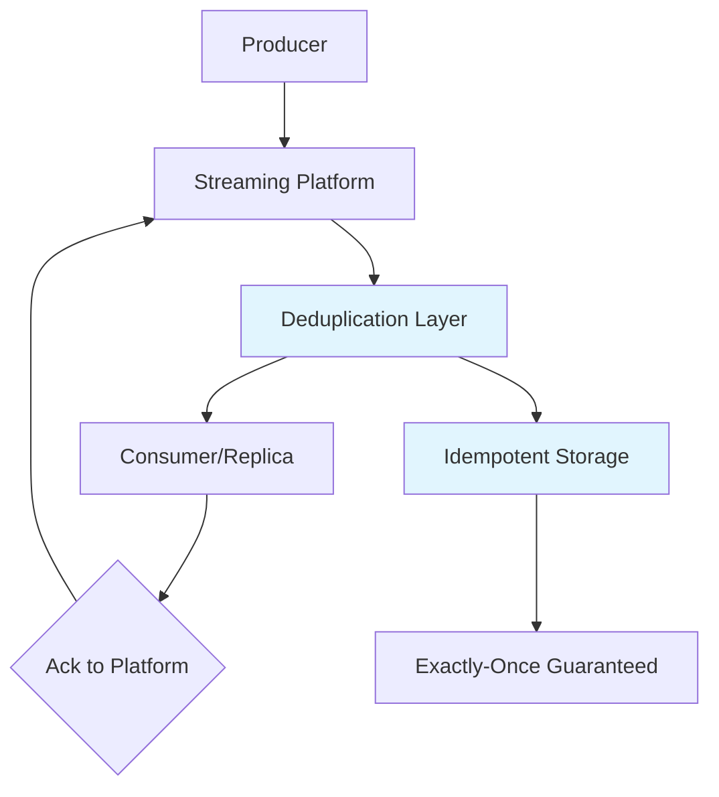
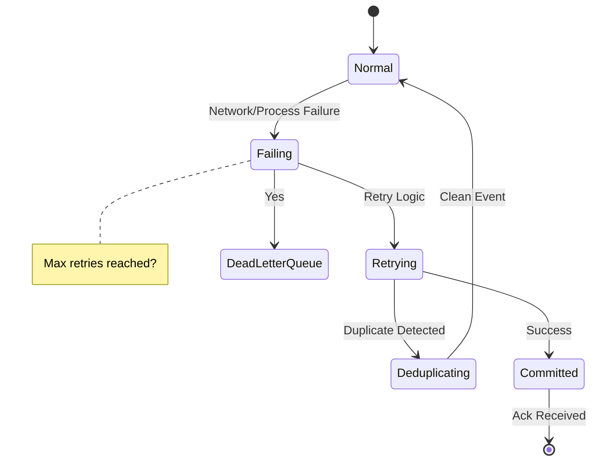

---
title: "Streaming Data Replication with Exactly-Once Delivery"
description: "System design example for Streaming Data Replication with Exactly-Once Delivery"
---

# Streaming Data Replication with Exactly-Once Delivery

## Overview

### What it is and why it's important
Exactly-once delivery in streaming data replication ensures that each data event (message, record, or event) is processed and replicated exactly one time, even in the presence of failures, duplicates, or network issues. This semantic is crucial in systems where duplicate processing could lead to data inconsistency, financial discrepancies, or incorrect analytics, such as transaction processing, order management, or inventory systems.

### Real-world context and where it's used
This concept is widely used in distributed streaming platforms like Apache Kafka, Apache Flink, and Amazon Kinesis. It's essential for event-sourced architectures, real-time data pipelines, and cross-region data replication where guarantees of delivery are paramount to maintain data integrity across replicas.

### Concept diagram


## Core Principles & Components

### Detailed explanation of all subcomponents
The exactly-once delivery mechanism relies on several key components:

1. **Eventual Deduplication**: Uses unique identifiers (sequence numbers, timestamps, or UUIDs) to identify and eliminate duplicate events.
2. **Idempotent Operations**: Ensures that replaying the same event multiple times results in the same state changes.
3. **Exactly-Once Semantics (EOS)**: Combines deduplication with transactional boundaries to guarantee processing.
4. **Checkpointing**: Saves processing state periodically to allow recovery from failures without duplicating work.
5. **Transactional Producers**: Batch multiple events into atomic transactions for all-or-nothing delivery.

### State transitions or flow
The system transitions through states: Normal (processing events), Failing (attempting retry), Deduplicating (removing duplicates), and Committed (delivery confirmed).

### Detailed state diagram


## Detailed Implementation Design

### A. Algorithm / Process Flow
Exactly-once delivery follows this step-by-step process:

1. **Event Ingestion**: Producer sends event with unique ID (e.g., eventId, timestamp, partition key).
2. **Deduplication Check**: Streaming platform checks if eventId exists in deduplication store.
3. **Processing Decision**: If duplicate, skip; if new, process and store eventId.
4. **Atomic Transaction**: Within transaction scope, write to replica and update offset.
5. **Commit**: If transaction succeeds, ack to producer; on failure, rollback.
6. **Checkpoint**: Periodically save state for failure recovery.

Includes failure handling: If processing fails mid-transaction, replay from last checkpoint without duplicating committed events.

Concurrency: Events are processed in order within partitions; retries use exponential backoff.

### B. Data Structures & Configuration Parameters
- **Core internal data structures**:
  - Deduplication store: HashMap or Bloom filter for event IDs.
  - Transaction log: Append-only log for atomic operations.
  - Offset store: Persistent map of consumer positions.

- **Tunable parameters**:
  - `dedupWindowSize`: Time window for deduplication (e.g., 1 hour).
  - `maxRetries`: Number of retry attempts (default: 3).
  - `transactionTimeout`: Max time for transaction completion (default: 30 seconds).
  - `checkpointInterval`: Frequency of state saves (e.g., every 100 events).

### C. Java Implementation Example
```java
import java.util.concurrent.ConcurrentHashMap;
import java.util.concurrent.atomic.AtomicLong;

/**
 * Simplified Exactly-Once Delivery Processor for Streaming Replication
 * Assumes single-threaded processing per partition for simplicity.
 * In production, use distributed state stores like Redis or Cassandra.
 */
public class ExactlyOnceReplicationProcessor {
    private final ConcurrentHashMap<String, Long> deduplicationStore;
    private final AtomicLong checkpointOffset;
    private final int maxRetries;

    public ExactlyOnceReplicationProcessor(int maxRetries) {
        this.deduplicationStore = new ConcurrentHashMap<>();
        this.checkpointOffset = new AtomicLong(0);
        this.maxRetries = maxRetries;
    }

    /**
     * Process event with exactly-once guarantee.
     * @param eventId Unique identifier for deduplication
     * @param data Event payload
     * @param currentOffset Current stream offset
     * @return ProcessingResult indicating success/failure
     */
    public ProcessingResult processEvent(String eventId, byte[] data, long currentOffset) {
        // Deduplication check
        if (deduplicationStore.containsKey(eventId)) {
            // Duplicate event, skip processing
            return ProcessingResult.DUPLICATE_SKIPPED;
        }

        int retryCount = 0;
        while (retryCount < maxRetries) {
            try {
                // Simulate transaction: write to replica and update offset atomically
                replicateToTarget(data);
                deduplicationStore.put(eventId, currentOffset);
                checkpointOffset.set(currentOffset);

                return ProcessingResult.SUCCESS;
            } catch (Exception e) {
                retryCount++;
                // Exponential backoff (simplified)
                try {
                    Thread.sleep(100 * (1L << retryCount));
                } catch (InterruptedException ex) {
                    Thread.currentThread().interrupt();
                    return ProcessingResult.FAILED;
                }
            }
        }

        return ProcessingResult.MAX_RETRIES_EXCEEDED;
    }

    private void replicateToTarget(byte[] data) throws Exception {
        // Simulate network/replication operation
        // In real implementation: Kafka producer, HTTP POST, etc.
        if (Math.random() < 0.1) { // 10% failure rate for simulation
            throw new RuntimeException("Replication failed");
        }
    }

    public enum ProcessingResult {
        SUCCESS,
        DUPLICATE_SKIPPED,
        FAILED,
        MAX_RETRIES_EXCEEDED
    }
}
```

### D. Complexity & Performance
- **Time complexity**: O(1) for deduplication lookup with hash maps; O(log N) for offset updates in persistent stores.
- **Space complexity**: O(N) for deduplication store, where N is unique events in window (typically bounded by time).
- **Expected vs worst-case**: Expected processing throughput: 10k-100k events/sec per partition; worst-case: bounded by transaction timeouts and network latency.
- **Real-world scale estimation**: For 1B daily events with 1-hour dedup window, ~29MB memory for event IDs (assuming 32-byte IDs).

### E. Thread Safety & Concurrency
- **Multi-threaded scenarios**: Partition-based processing ensures thread-safety within partitions; concurrent access to deduplication store requires lock-free structures like ConcurrentHashMap.
- **Locking vs lock-free**: Uses CAS operations for offset updates; deduplication store employs striped locks to minimize contention.
- **Memory barriers/atomic operations**: AtomicLong for checkpoint offsets ensures visibility across threads without explicit barriers.

### F. Memory & Resource Management
- **Heap/stack implications**: Deduplication store grows linearly with event rate; periodic cleanup removes expired entries.
- **Garbage collection**: Full GC pauses minimized by using off-heap stores (e.g., ChronicleMap) for large-scale deployments.
- **Off-heap optimization**: For billions of events, store deduplication data in memory-mapped files to reduce heap pressure.

### G. Advanced Optimizations
- **Common optimizations**: Batch processing for higher throughput; probabilistic deduplication using Bloom filters to reduce memory.
- **Variants**: Transactional EOS (Kafka 0.11+) uses two-phase commit; Idempotent producers for simpler exactly-once without transactions.
- **Integration optimizations**: Combine with compression for network efficiency and sharding for horizontal scaling.

## Edge Cases & Error Handling
- **Common boundary conditions**: Zero events, max partition count reached, clock skew in timestamps.
- **Failure recovery**: On crash, replay from checkpoint; validate deduplication store consistency.
- **Resilience strategies**: Dead letter queue for unprocessable events; circuit breaker for downstream failures.

## Configuration Trade-offs
- **Performance vs accuracy**: Smaller dedup window reduces memory but increases false positives risk; larger windows ensure accuracy but consume more memory.
- **Simplicity vs configurability**: Fixed parameters simplify deployment but limit tuning; dynamic configs enable optimization but add complexity.
- **Real-world tuning**: Start with 1-hour window, adjust based on duplicate rates observed in production.

## Use Cases & Real-World Examples
- **Production applications**: Kafka MirrorMaker for cross-cluster replication; Flink exactly-once sinks to HDFS/S3.
- **Integration scenarios**: Combined with change data capture for database replication; used in payment systems to prevent double charges.
- **Examples**: Uber's real-time data pipeline ensures exactly-once delivery for fare calculations; LinkedIn uses it for activity stream replication.

## Advantages & Disadvantages
- **Benefits**: Guarantees data consistency, simplifies downstream processing logic, enables real-time analytics without duplicates.
- **Disadvantages**: Higher latency due to transactions, increased memory/compute overhead for deduplication.
- **Anti-patterns**: Avoid in low-volume, fire-and-forget scenarios; not needed where at-least-once is sufficient.

## Alternatives & Comparisons
- **At-Least-Once**: Simpler but allows duplicates; compare - exactly-once trades complexity for accuracy.
- **At-Most-Once**: Prevents duplicates but may lose data; exactly-once provides full guarantee.
- **Preferred approach**: Choose EOS when data integrity is critical, despite the performance cost.

## Interview Talking Points
1. Explain how deduplication works with unique event IDs - discuss hash collisions and timestamp-based approaches.
2. Contrast exactly-once with at-least-once/at-most-once semantics with examples (e.g., bank transfers vs. log aggregation).
3. Describe the trade-off between transaction overhead and delivery guarantees in EOS implementations.
4. How does checkpointing enable failure recovery while maintaining exactly-once semantics?
5. Discuss Bloom filters as a space-efficient alternative for deduplication and their false positive implications.
6. Explain how Kafka achieves EOS through idempotent producers and transactional APIs.
7. Walk through an edge case: What happens if the deduplication store crashes mid-processing?
8. Compare memory and performance requirements of hash-based vs. bloom filter deduplication.
9. Why is partition-level ordering crucial for EOS in streaming systems?
