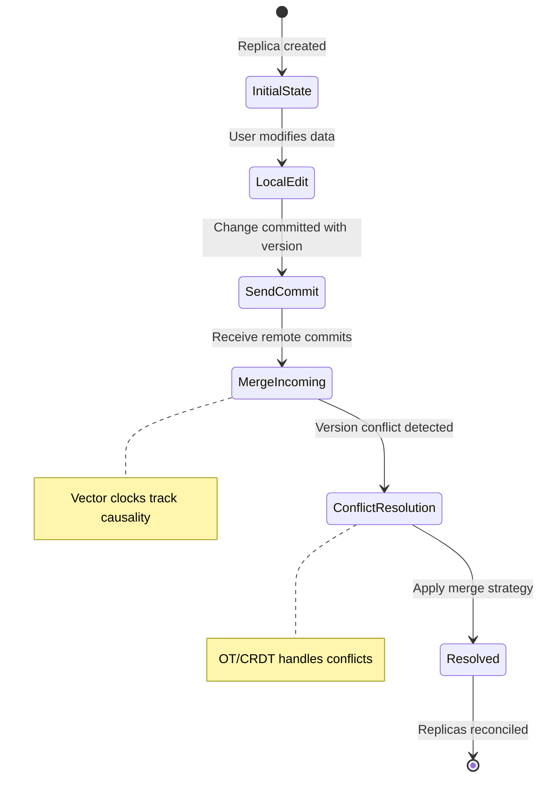
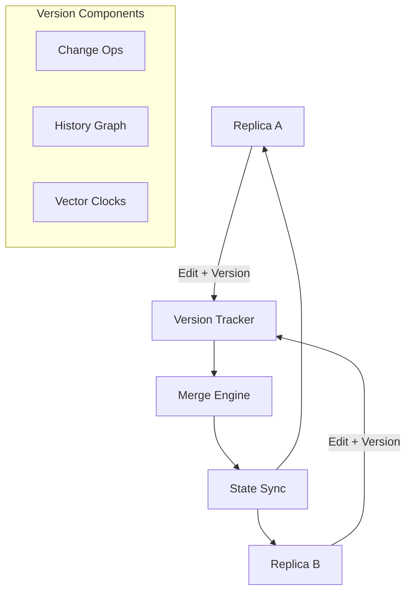

---
title: "Version-Controlled Data Replication for Collaborative Applications"
description: "System design example for Version-Controlled Data Replication for Collaborative Applications"
---

# Version-Controlled Data Replication for Collaborative Applications

## Overview
Version-controlled data replication is a distributed systems pattern that applies version control principles (similar to Git) to manage concurrent data updates across multiple replicas in collaborative applications. It ensures eventual consistency while preserving the history of changes, enabling conflict resolution and offline edits.

- **What it is**: A replication strategy that treats data mutations as commits with versioning, allowing replicas to merge changes using algorithms like Operational Transformation (OT) or Conflict-free Replicated Data Types (CRDTs).
- **Why it's important**: Essential for real-time collaborative applications where users may edit shared data simultaneously, preventing data loss and maintaining consistency without locking.
- **Real-world context**: Used in Google Docs, Notion, Figma, and collaborative IDEs like VS Code Live Share.



## Core Principles & Components
Version-controlled replication relies on four key components:

1. **Version Vectors/Clocks**: Tracks causality of changes across replicas using timestamps or Lamport clocks.
2. **Change Operations**: Atomic operations representing user edits (insert, delete, update).
3. **History Graph**: DAG (Directed Acyclic Graph) storing all versions and their dependencies.
4. **Merge Algorithms**: Resolves concurrent changes using OT or CRDT approaches.



### State Transitions
- **Convergent State**: All replicas reach the same final state despite different operation orders.
- **Causality Preservation**: Lamport's "happens-before" ensures dependent changes are applied in order.
- **Commutativity**: Operations are designed to commute (OT) or converge (CRDT).

## Detailed Implementation Design

### A. Algorithm / Process Flow
The core algorithm handles replication through commit, propagation, and merge phases:

1. **Input**: Local operation + current vector clock (VC)
2. **Local Commit**: Assign new version, update local history
3. **Propagation**: Broadcast operation with VC to peers
4. **Receive Processing**: Compare incoming VC with local
5. **Ordering**: Apply operations respecting causality
6. **Merge Conflicts**: Use OT transform or CRDT merge
7. **Output**: Updated data state + new VC

```java
// Simplified pseudocode for commit and merge
void commit(Operation op) {
    Version newVersion = currentVC.increment(localId);
    Commit commit = new Commit(op, newVersion);
    history.add(commit);
    propagate(commit);
}

void processIncoming(Commit incoming) {
    if (!shouldApply(incoming.vc)) return; // Causality check

    List<Operation> concurrentOps = getConcurrentOps(incoming.vc);
    Operation transformedOp = transformOp(incoming.op, concurrentOps);

    applyToLocalState(transformedOp);
    updateVC(incoming.vc);
}
```

Failure handling: Retry propagation with exponential backoff. Concurrency: Thread-safe queues for incoming commits.

### B. Data Structures & Configuration Parameters
- **Version Vector**: Map<ReplicaId, Integer> tracking logical clocks per replica.
- **Operation Log**: Append-only list of {operation, version, timestamp}.
- **History Graph**: Adjacency list for commit dependencies.
- **Tunable Parameters**:
  - `maxHistorySize` = 1000 (limit retained versions for memory)
  - `propagationTimeout` = 5s (max delay before stale replica warning)
  - `conflictResolutionStrategy` = LAST_WRITE_WINS|OT|CRDT

### C. Java Implementation Example
```java
import java.util.*;
import java.util.concurrent.ConcurrentHashMap;
import java.util.concurrent.atomic.AtomicInteger;

public class VersionControlledReplica {
    private final String replicaId;
    private final Map<String, Integer> versionVector; // ReplicaId -> logical clock
    private final List<Commit> operationLog;
    private final AtomicInteger localClock;
    private final Map<String, OperationTransformer> transformers;

    public VersionControlledReplica(String replicaId) {
        this.replicaId = replicaId;
        this.versionVector = new ConcurrentHashMap<>();
        this.operationLog = Collections.synchronizedList(new ArrayList<>());
        this.localClock = new AtomicInteger(0);
        this.transformers = new HashMap<>();
        // Initialize transformers for different operation types
        transformers.put("INSERT", new InsertTransformer());
        transformers.put("DELETE", new DeleteTransformer());
    }

    public synchronized Commit commit(Operation op) {
        // Increment local clock
        int newClock = localClock.incrementAndGet();
        versionVector.put(replicaId, newClock);

        Version version = new Version(versionVector);
        Commit commit = new Commit(op, version, System.currentTimeMillis());

        operationLog.add(commit);
        propagate(commit); // Async broadcast

        return commit;
    }

    public synchronized void receive(Commit incoming) {
        // Causality check: only apply if incoming is not causally before local
        if (dominates(versionVector, incoming.version.vc)) {
            return; // Already applied
        }

        // Get concurrent operations not in incoming's history
        List<Operation> concurrent = getConcurrentOps(incoming.version.vc);
        Operation transformed = transform(incoming.operation, concurrent);

        apply(transformed);
        // Merge version vectors
        mergeVectorClocks(incoming.version.vc);
    }

    private boolean dominates(Map<String, Integer> local, Map<String, Integer> incoming) {
        return incoming.entrySet().stream()
            .allMatch(e -> local.getOrDefault(e.getKey(), 0) >= e.getValue());
    }

    private List<Operation> getConcurrentOps(Map<String, Integer> incomingVc) {
        return operationLog.stream()
            .filter(c -> isConcurrent(c.version.vc, incomingVc))
            .map(Commit::operation)
            .collect(Collectors.toList());
    }

    private boolean isConcurrent(Map<String, Integer> vc1, Map<String, Integer> vc2) {
        return !dominates(vc1, vc2) && !dominates(vc2, vc1);
    }

    private Operation transform(Operation op, List<Operation> concurrent) {
        Operation transformed = op;
        for (Operation concurrentOp : concurrent) {
            OperationTransformer transformer = transformers.get(concurrentOp.type());
            if (transformer != null) {
                transformed = transformer.transform(transformed, concurrentOp);
            }
        }
        return transformed;
    }

    private void apply(Operation op) {
        // Apply to local data structure (e.g., CRDT or OT-aware state)
        // Implementation depends on data type (text, list, map)
    }

    private void mergeVectorClocks(Map<String, Integer> incoming) {
        incoming.forEach((key, value) ->
            versionVector.merge(key, value, Math::max));
    }

    // Placeholder for propagation mechanism
    private void propagate(Commit commit) {
        // Send to other replicas via network
    }
}

// Supporting classes
record Commit(Operation operation, Version version, long timestamp) {}
record Version(Map<String, Integer> vc) {}

interface OperationTransformer {
    Operation transform(Operation op1, Operation op2);
}

class InsertTransformer implements OperationTransformer {
    @Override
    public Operation transform(Operation insert, Operation other) {
        if (other instanceof DeleteOperation del && overlaps(insert, del)) {
            // Transform insert to avoid deleted region
            return ((InsertOperation) insert).shift(del.length());
        }
        return insert; // No transformation needed
    }

    private boolean overlaps(Operation ins, Operation del) {
        // Position overlap logic
        return false; // Simplified
    }
}

class DeleteTransformer implements OperationTransformer {
    @Override
    public Operation transform(Operation delete, Operation other) {
        // Symmetric transformation
        return delete; // Simplified
    }
}
```

### D. Complexity & Performance
- **Time Complexity**:
  - Commit: O(1) local + O(log n) for VC updates
  - Receive/Merge: O(m + c log c) where m is concurrent ops, c is VC size
  - Overall: Amortized O(1) per operation across replicas
- **Space Complexity**: O(h) where h is retained history depth (bounded)
- **Real-world Scale**: Handles 1000+ concurrent users with 2-5ms latency for small state (<1MB)

### E. Thread Safety & Concurrency
This implementation uses synchronized methods for core operations, ensuring sequential consistency. For higher concurrency:
- Use `ReadWriteLock` for VC access (read-heavy)
- Atomic references for vector clock merges
- Lock-free operation queues with CAS (Compare-And-Swap)
Memory barriers ensure visibility of committed changes across threads.

### F. Memory & Resource Management
- **Heap Usage**: Bounded by `maxHistorySize`; old commits garbage collected
- **Off-heap Optimization**: Store large histories in compressed files
- **Cache Line Alignment**: Align version vectors for atomic operations
- **Paging Concerns**: Keep hot data in memory; page history to disk

### G. Advanced Optimizations
- **Delta Encoding**: Send only changed operations, not full state
- **Commutative Replicas**: Assign operation priorities to reduce transformations
- **Variants**: 
  - Event-Sourced: Store full event log
  - CRDT-Based: Built-in convergence properties
  - Hybrid: OT for text, CRDT for counters

## Edge Cases & Error Handling
- **Network Partition**: Accumulate changes locally; use gossip protocol for merge
- **Duplicate Deliveries**: Idempotent operations with version uniqueness
- **Out-of-Order Messages**: Causality tracking prevents invalid states
- **Clock Skew**: Logical clocks prevent real-time dependency issues

## Configuration Trade-offs
- **History Depth**: Deeper → better conflict resolution, higher memory cost
- **Propagation Strategy**: Immediate broadcast → low latency, high network load
- **Resolution Granularity**: Operation-level → fine-grained control, complex transformations

## Use Cases & Real-World Examples
- **Collaborative Documents**: Google Docs uses OT-based replication with periodic compaction
- **Shared Whiteboards**: Figma employs CRDTs for real-time vector graphics
- **Code Collaboration**: VS Code Live Share uses Operational Transformation
- **Integration**: Combines with Paxos for consensus, S3 for durable history storage

## Advantages & Disadvantages
- **Advantages**: Offline editing support, natural conflict handling, scalable to global deployments
- **Disadvantages**: Increased complexity, potential for unbounded growth if not managed
- **When not to use**: Single-writer scenarios; atomic operations with dependencies

## Alternatives & Comparisons
- **Multi-Version Concurrency Control (MVCC)**: Optimistic locking but requires coordination
- **Leader-Follower Replication**: Strong consistency but blocks during leader failures
- **Full CRDT Adoption**: Automatic convergence but may sacrifice performance for complex types

**Why preferred**: Provides balance of consistency, availability, and partition tolerance (CAP theorem friendly).

## Interview Talking Points
- Version vectors prevent write skew in distributed environments
- OT transformations ensure commutative operations for convergence
- History compaction essential for memory efficiency at scale
- Causality preservation enables offline-first architectures
- Trade-off conflict resolution complexity vs. data consistency guarantees
- Real-world: Google Docs handles millions of concurrent edits with sub-second sync
- Evolution: Start with simple CRDTs, add versioning for advanced use cases
- Pitfall: Incorrect VC merging leads to lost updates or infinite loops
- Testability: Deterministic merge algorithms enable predictable behavior
- Scalability: Gossip protocols efficiently propagate changes across 10K+ nodes
