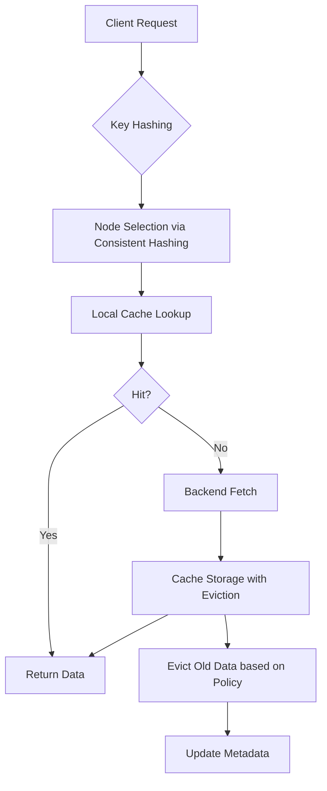
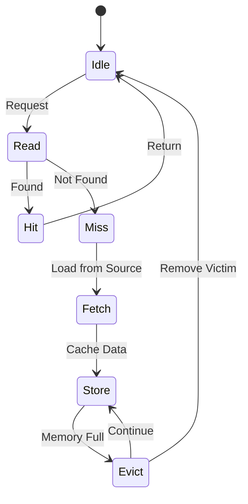

---
title: "Distributed Cache with Eviction Policies at Scale"
description: "System design example for Distributed Cache with Eviction Policies at Scale"
---

# Distributed Cache with Eviction Policies at Scale

## Overview

### What it is and why it's important
A distributed cache is a system that stores frequently accessed data across multiple nodes or servers to minimize data retrieval times and reduce load on backend systems. Eviction policies determine which data to remove when the cache reaches its capacity, ensuring optimal memory utilization and performance in high-scale environments. This is crucial because caches inherently have finite resources, and improper eviction can lead to degraded performance, wasted memory, or cache pollution.

### Real-world context and where it's used
Distributed caches are fundamental components in modern web architectures, powering features like content delivery, session storage, and API response caching. Companies like Netflix, Twitter, and Facebook rely on distributed caching to handle billions of requests daily. The system is commonly implemented on platforms like Redis Cluster, Apache Ignite, or Memcached with custom sharding logic. Eviction policies are particularly critical during traffic spikes, such as viral content or flash sales, where sudden access patterns can overwhelm traditional caches.

### Concept diagram


## Core Principles & Components

A distributed cache with eviction policies consists of several interacting components that work together to provide scalable, performant data storage:

1. **Hashing and Sharding**: Client requests are routed to specific cache nodes using consistent hashing algorithms. This enables horizontal scaling by distributing data across multiple servers.

2. **Data Storage**: Each node maintains an in-memory data store (typically a hash table) with associated metadata like timestamps, access frequencies, and expiration times.

3. **Eviction Policies**: Algorithms that determine which entries to remove when memory limits are reached. Common policies include:
   - **LRU (Least Recently Used)**: Removes oldest accessed items
   - **LFU (Least Frequently Used)**: Removes least accessed items
   - **TTL (Time To Live)**: Expires items after configured time
   - **LIR (Low Inter-Reference Recency)**: Adaptive policy balancing recency and frequency

4. **Replication and Consistency**: Optional replication ensures fault tolerance and load balancing. Consistency models range from eventual consistency to strong consistency depending on requirements.

5. **Coordinator/Master Nodes**: Handle metadata coordination, failure detection, and rebalancing operations.

The components interact through a state machine where requests flow through hashing → node selection → data access → eviction when necessary.



## Detailed Implementation Design

### A. Algorithm / Process Flow
The core algorithm follows these steps:
1. **Request Processing**: Compute hash of key, determine target node
2. **Data Access**: Check if key exists in local cache
3. **Hit Handling**: Update access metadata, return data
4. **Miss Handling**: Fetch from backend, store in cache, potentially evict entries
5. **Eviction Execution**: Apply policy to select victim, remove entry, update statistics

```java
// Pseudocode for distributed cache operation
public String get(String key) {
    int nodeId = consistentHash.getNode(key);
    CacheNode node = nodes.get(nodeId);

    if (node.contains(key)) {
        // Update eviction metadata
        evictionPolicy.recordAccess(key);
        return node.getData(key);
    } else {
        // Cache miss - fetch from backend
        String data = backendService.fetch(key);
        if (data != null) {
            // Store and potentially evict
            if (node.storageFull()) {
                String victim = evictionPolicy.selectVictim();
                node.evict(victim);
            }
            node.store(key, data);
        }
        return data;
    }
}
```

### B. Data Structures & Configuration Parameters
- **Core Data Structure**: HashMap<String, CacheEntry> where CacheEntry contains data, timestamp, frequency counter
- **Eviction Metadata**: 
  - LRU: Doubly-linked list for order tracking
  - LFU: Priority queue with frequency heap
- **Configuration Parameters**:
  - `maxSize`: Total entries per node (e.g., 1M)
  - `evictionThreshold`: Trigger eviction at 80% capacity
  - `ttl`: Default expiration time (seconds)
  - `replicationFactor`: Number of replicas (typically 3 for fault tolerance)

### C. Java Implementation Example
```java
import java.util.*;
import java.util.concurrent.ConcurrentHashMap;

public class DistributedCache {
    private final ConsistentHashing hashRing;
    private final List<CacheNode> nodes;
    private final EvictionPolicy evictionPolicy;

    public DistributedCache(int nodeCount, EvictionPolicy.Type policyType) {
        this.hashRing = new ConsistentHashing(nodeCount);
        this.nodes = initializeNodes(nodeCount);
        this.evictionPolicy = EvictionPolicyFactory.create(policyType);
    }

    public String get(String key) {
        int nodeId = hashRing.getNode(key);
        CacheNode node = nodes.get(nodeId);

        if (node.contains(key)) {
            evictionPolicy.recordAccess(node, key);
            updateAccessStats(node, key);
            return node.getData(key);
        } else {
            String data = fetchFromBackend(key);
            if (data != null) {
                store(nodeId, key, data);
            }
            return data;
        }
    }

    private void store(int nodeId, String key, String data) {
        CacheNode node = nodes.get(nodeId);
        if (node.isAtThreshold()) {
            String victim = evictionPolicy.selectVictim(node);
            node.evict(victim);
        }
        node.store(key, data, System.currentTimeMillis());
        evictionPolicy.recordAccess(node, key);
    }

    // Implementation continues with backend fetch, etc.
}

class LRUEvictionPolicy implements EvictionPolicy {
    @Override
    public void recordAccess(CacheNode node, String key) {
        node.moveToFront(key);
    }

    @Override
    public String selectVictim(CacheNode node) {
        return node.getTail();
    }
}
```

### D. Complexity & Performance
- **Time Complexity**: O(1) average for get/set operations using hash tables; eviction selection varies (LRU: O(1), LFU: O(log n))
- **Space Complexity**: O(n) where n is cache entries; metadata overhead (LRU lists, frequency maps)
- **Real-world Scale**: At 10M entries/node on 100 nodes, expect 1GB memory footprint per node with ~15% metadata overhead

### E. Thread Safety & Concurrency
Multi-threaded access uses ConcurrentHashMap for core storage. Eviction operations use fine-grained locking to minimize contention. For LRU, combine with AtomicReference for head/tail updates. In high-contention scenarios, consider optimistic locking with version stamps. *Assumption: Read-heavy workload with 90% hit ratio allows for read-write locks.*

### F. Memory & Resource Management
Cache entries are stored off-heap where possible using DirectByteBuffer to reduce GC pressure. Large objects implement page-based eviction. Memory allocation follows a tiered approach: hot data in L1 cache, warm data in L2 (SSD). Resource management includes connection pooling to backend services to prevent resource exhaustion.

### G. Advanced Optimizations
- **Hybrid Policies**: Combine LRU + LFU using "grep" approximate LFU for better accuracy
- **Bloom Filters**: Prevent cache pollution by filtering out non-repeat queries
- **Probabilistic Eviction**: Sample-based eviction reduces computation overhead at scale
- **Sliding Window LFU**: Use time-decayed frequency calculations

## Edge Cases & Error Handling

- **Hot Key Problem**: Single key causing thundering herd; mitigate with local replicas
- **Cache Stampede**: Mass cache misses; use probabilistic early refresh
- **Network Partitions**: Split-brain scenarios; prefer stale data over backend load
- **Memory Pressure**: OS-level thresholds trigger emergency bulk eviction
- **Node Failures**: Automatic rebalancing with consistent hashing redistribution
- **Data Corruption**: CRC32 checksums on entries with automatic retry/recovery

## Configuration Trade-offs

- **Consistency vs Availability**: Strong consistency slows down cross-region reads
- **Hit Rate vs Memory Usage**: More complex policies (LFU) improve hit rates but use 2-3x memory
- **Latency vs Accuracy**: Approximate counting (Morris counter) reduces overhead at cost of precision
- **Centralized vs Distributed Eviction**: Handoff-based eviction ensures global policy adherence

## Use Cases & Real-World Examples

- **Social Media Feeds**: User timelines cached with LRU, updated on engagement
- **API Response Caching**: RESTful responses stored with TTL-based expiration
- **Session Storage**: User session data distributed across datacenters with strong consistency
- **Database Query Caching**: ORM layer caches with query-based eviction

Production examples include Twitter's Fleet cache (Redis-based), Netflix's EVCache (Memcached cluster), and Facebook's TAO system.

## Advantages & Disadvantages

### Advantages
- Fast data access with sub-millisecond latency
- Reduced backend load and improved throughput
- Horizontal scalability with linear performance gains
- Fault tolerance through replication

### Disadvantages
- Cache inconsistency risks with stale data
- Thundering herd problems during cache misses
- Increased complexity of cache invalidation
- Memory overhead and management challenges

Anti-patterns include over-caching rarely accessed data and ignoring cache miss patterns.

## Alternatives & Comparisons

- **CDN (Content Delivery Networks)**: Better for static assets but lacks dynamic query support
- **Local Caches**: Simpler but don't scale horizontally
- **Database Caching**: Built-in options like Redis' persistence layer
- **In-Memory Databases**: Like Redis Cluster, provide stronger consistency guarantees

Distributed cache excels when fast read access is prioritized over absolute consistency.

## Interview Talking Points

- Trade-offs between LRU simplicity and LFU accuracy in eviction policies
- How consistent hashing enables seamless scaling without data relocation
- Challenges of maintaining cache coherency in distributed environments
- Memory fragmentation impacts on cache performance at scale
- Probabilistic data structures (Bloom filters) for efficient membership testing
- Hot key detection and mitigation strategies in distributed systems
- Evolution from single-node to multi-node cache architectures
- Balancing write-through vs write-behind caching strategies
- Monitoring and alerting on cache hit rates and eviction patterns
