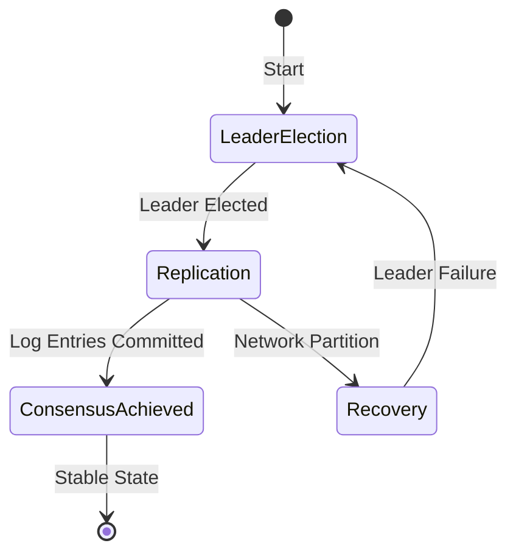

# Distributed Consensus Protocol Platform

## Overview

### What it is and why it's important
Distributed consensus protocols are foundational algorithms that ensure agreement among multiple distributed nodes in the presence of failures. They enable reliable coordination in distributed systems, allowing nodes to agree on shared state changes despite network partitions, node failures, or message delays. Consensus is crucial for building fault-tolerant distributed databases, replicated storage, configuration management, and leader election services.

### Real-world context and where it's used
Consensus protocols power critical infrastructure components like etcd (Kubernetes), Apache ZooKeeper, consensus in blockchains (e.g., Hyperledger), and database replication (MongoDB replica sets, CockroachDB). Platforms like Consul and HashiCorp Vault use consensus for leader election and configuration consensus.

### Concept diagram


## Core Principles & Components

### Core Components
- **Nodes**: Distributed servers running the consensus protocol, acting as servers in a cluster
- **Leader**: Single node responsible for managing log replication and coordinating consensus
- **Followers**: Nodes that replicate the leader's log and participate in elections
- **Candidates**: Nodes attempting to become leader during election periods
- **Log**: Append-only sequence of commands representing state machine operations
- **State Machine**: Deterministic component that applies committed log entries
- **Quorum**: Majority of nodes required for decisions (floor(n/2) + 1)

### State Transitions
```mermaid
flowchart TD
    A[Follower] --> B[Candidate] : Election Timeout
    B --> C[Leader] : Majority Vote
    B --> A : Timeout/Split Vote
    C --> A : Leader Failure
    C --> E[Heartbeats to Followers]
    A --> F[AppendEntries RPC]
```

### Protocol Phases
1. **Election Phase**: Nodes elect a leader using voting mechanism
2. **Replication Phase**: Leader replicates log entries to followers
3. **Safety Phase**: Ensure committed entries are persistent and safe

## Detailed Implementation Design

### A. Algorithm / Process Flow

#### Leader Election Algorithm
1. **Initial State**: All nodes start as followers with randomized election timeouts (150-300ms typically)
2. **Timeout Triggers**: Follower becomes candidate, increments term, votes for itself
3. **Vote Requests**: Candidate sends RequestVote RPCs to all other nodes
4. **Majority Vote**: If majority responses received, candidate becomes leader
5. **Heartbeat**: New leader sends immediate heartbeats to establish authority

#### Log Replication Flow
1. **Client Request**: Leader receives client command, appends to local log (uncommitted)
2. **Replication RPCs**: Leader sends AppendEntries to all followers with log entry
3. **Follower Response**: Followers append if log consistent, reply success/failure
4. **Commitment**: Leader commits when majority acknowledge, notifies followers of commit

#### Failure Recovery
- **Leader Failure**: Followers detect missing heartbeats, start new election
- **Network Partition**: Split-brain scenarios handled via term numbers and majority quorums
- **Slow Followers**: Leader periodically sends snapshots for log compaction

### B. Data Structures & Configuration Parameters

#### Core Data Structures
```java
public class LogEntry {
    private long term;           // Term when entry was received by leader
    private long index;          // Position in log
    private Object command;      // State machine command
    private boolean committed;   // Whether entry is committed
}
```

```java
public class PersistentState {
    private long currentTerm;    // Latest term server has seen
    private Vote votedFor;       // CandidateId voted for in current term
    private List<LogEntry> log;  // Log entries (indexed from 1)
}
```

#### Configuration Parameters
- **Election Timeout**: 150-300ms (randomized to avoid split votes)
- **Heartbeat Interval**: 50-100ms (faster than minimum election timeout)
- **Maximum Batch Size**: 1000 entries (optimizing replication efficiency)
- **Snapshot Threshold**: 10000 entries (when to create snapshot)

### C. Java Implementation Example

```java
import java.util.concurrent.*;
import java.util.concurrent.atomic.*;
import java.util.List;
import java.util.Map;
import java.util.logging.Logger;

public class RaftNode {
    private final Logger logger = Logger.getLogger(RaftNode.class.getName());

    // Persistent state
    private final AtomicLong currentTerm = new AtomicLong(0);
    private volatile String votedFor = null;
    private final CopyOnWriteArrayList<LogEntry> log = new CopyOnWriteArrayList<>();

    // Volatile state
    private volatile long commitIndex = 0;
    private volatile long lastApplied = 0;

    // Leader state (reinitialized after election)
    private volatile Map<String, Long> nextIndex;
    private volatile Map<String, Long> matchIndex;

    private final ScheduledExecutorService scheduler;
    private final String nodeId;
    private final List<String> clusterNodes;
    private final StateMachine stateMachine;
    private final Persistence persistence;

    private enum NodeState { FOLLOWER, CANDIDATE, LEADER }
    private volatile NodeState state = NodeState.FOLLOWER;

    public RaftNode(String nodeId, List<String> clusterNodes,
                   StateMachine stateMachine, Persistence persistence) {
        this.nodeId = nodeId;
        this.clusterNodes = clusterNodes;
        this.stateMachine = stateMachine;
        this.persistence = persistence;

        this.scheduler = Executors.newScheduledThreadPool(3);
        startElectionTimer();
    }

    // Leader election implementation
    public synchronized void startElection() {
        state = NodeState.CANDIDATE;
        currentTerm.incrementAndGet();
        votedFor = nodeId;

        // Persist state before sending requests
        persistence.saveState(currentTerm.get(), votedFor, log);

        AtomicInteger votes = new AtomicInteger(1); // Vote for self

        for (String peer : clusterNodes) {
            if (!peer.equals(nodeId)) {
                sendRequestVote(peer, votes);
            }
        }

        // Set election timeout
        long timeoutMs = 150 + ThreadLocalRandom.current().nextInt(150);
        scheduler.schedule(() -> {
            if (state == NodeState.CANDIDATE) {
                startElection(); // Re-election on timeout
            }
        }, timeoutMs, TimeUnit.MILLISECONDS);
    }

    private void sendRequestVote(String peer, AtomicInteger votes) {
        long term = currentTerm.get();
        long lastLogIndex = log.size() - 1;
        long lastLogTerm = lastLogIndex >= 0 ? log.get((int)lastLogIndex).getTerm() : 0;

        // Async RPC call (implementation details omitted)
        requestVote(peer, term, lastLogIndex, lastLogTerm)
            .thenAccept(response -> {
                if (response.isVoteGranted() && state == NodeState.CANDIDATE
                    && response.getTerm() == currentTerm.get()) {
                    if (votes.incrementAndGet() > clusterNodes.size() / 2) {
                        becomeLeader();
                    }
                }
            });
    }

    private synchronized void becomeLeader() {
        state = NodeState.LEADER;
        logger.info(nodeId + " became leader for term " + currentTerm.get());

        // Initialize leader state
        nextIndex = new ConcurrentHashMap<>();
        matchIndex = new ConcurrentHashMap<>();

        for (String peer : clusterNodes) {
            nextIndex.put(peer, (long) log.size());
            matchIndex.put(peer, 0L);
        }

        startHeartbeat();
    }

    // AppendEntries RPC handler (simplified)
    public AppendEntriesResponse handleAppendEntries(AppendEntriesRequest request) {
        if (request.getTerm() < currentTerm.get()) {
            return new AppendEntriesResponse(currentTerm.get(), false);
        }

        if (request.getTerm() > currentTerm.get()) {
            stepDown(request.getTerm());
        }

        // Log consistency check
        int prevLogIndex = (int) request.getPrevLogIndex();
        if (prevLogIndex >= 0 && (log.size() <= prevLogIndex ||
            log.get(prevLogIndex).getTerm() != request.getPrevLogTerm())) {
            return new AppendEntriesResponse(currentTerm.get(), false);
        }

        // Append new entries
        for (int i = 0; i < request.getEntries().size(); i++) {
            int entryIndex = prevLogIndex + 1 + i;
            if (entryIndex < log.size()) {
                if (log.get(entryIndex).getTerm() != request.getEntries().get(i).getTerm()) {
                    // Delete conflicting entries
                    while (log.size() > entryIndex) {
                        log.remove(log.size() - 1);
                    }
                }
            }
            if (entryIndex == log.size()) {
                log.add(request.getEntries().get(i));
            }
        }

        // Update commit index
        if (request.getLeaderCommit() > commitIndex) {
            long newCommitIndex = Math.min(request.getLeaderCommit(), log.size() - 1);
            commitIndex = newCommitIndex;
            applyCommittedEntries();
        }

        return new AppendEntriesResponse(currentTerm.get(), true);
    }

    private void applyCommittedEntries() {
        while (lastApplied < commitIndex) {
            lastApplied++;
            LogEntry entry = log.get((int)lastApplied);
            try {
                stateMachine.apply(entry.getCommand());
            } catch (Exception e) {
                logger.severe("Failed to apply entry at index " + lastApplied + ": " + e.getMessage());
            }
        }
    }

    // Heartbeat and replication
    private void startHeartbeat() {
        scheduler.scheduleAtFixedRate(() -> {
            if (state == NodeState.LEADER) {
                for (String peer : clusterNodes) {
                    if (!peer.equals(nodeId)) {
                        sendAppendEntries(peer);
                    }
                }
            }
        }, 0, 100, TimeUnit.MILLISECONDS); // Heartbeat every 100ms
    }

    private static class LogEntry {
        private final long term;
        private final long index;
        private final Object command;

        public LogEntry(long term, long index, Object command) {
            this.term = term;
            this.index = index;
            this.command = command;
        }

        public long getTerm() { return term; }
        public long getIndex() { return index; }
        public Object getCommand() { return command; }
    }

    interface StateMachine {
        void apply(Object command) throws Exception;
    }

    interface Persistence {
        void saveState(long term, String votedFor, List<LogEntry> log);
        PersistentState loadState();
    }
}
```

### D. Complexity & Performance

#### Time Complexity
- **Leader Election**: O(nodes) per election (RPC round trips)
- **Log Replication**: O(log size) per append operation
- **Commit Latency**: 2 × network RTT for majority confirmation
- **Recovery**: O(log size) for log replay after failure

#### Space Complexity
- **Per-Node Storage**: O(total log entries) - mitigated by snapshotting
- **Memory Overhead**: O(nodes) for leader state tracking
- **Network Bandwidth**: O(log entries × nodes) during propagation bursts

#### Performance at Scale
- **Throughput**: 10K-100K ops/sec depending on network and disk I/O
- **Latency**: Median 10-50ms for writes, sub-ms for reads from leader
- **Fault Tolerance**: Tolerates up to floor((N-1)/2) simultaneous failures

### E. Thread Safety & Concurrency

#### Threading Model
The implementation uses a single-threaded event loop for protocol logic to avoid complex locking, similar to actual Raft implementations. RPC handlers process requests sequentially using synchronization primitives.

#### Concurrency Considerations
- **State Mutations**: All persistent state changes use `synchronized` blocks
- **RPC Handling**: AppendEntries and RequestVote are thread-safe through atomic comparisons
- **Timer Management**: Uses ScheduledExecutorService for election timeouts and heartbeats
- **Copy-on-Write**: Volatile references to collections minimize lock contention

#### Race Conditions Mitigated
- **Split Brain**: Term numbers ensure old leaders are invalidated
- **Duplicate Elections**: Single state transition per term through synchronization
- **Log Inconsistency**: Pre-flight consistency checks before append operations

### F. Memory & Resource Management

#### Memory Implications
- **Log Growth**: Bounded by periodic snapshots every 10K entries
- **Leader State**: O(nodes) hashmaps scale with cluster size
- **Heap Usage**: Non-heap memory for persistent state storage

#### Optimizations
- **Batch Processing**: Multiple log entries sent in single RPC
- **Compression**: Log entries compressed for network/storage efficiency
- **Off-Heap**: Persistent state using memory-mapped files

### G. Advanced Optimizations

#### Variants and Extensions
- **Multi-Raft**: Partition log across multiple raft groups for horizontal scaling
- **Joint Consensus**: For configuration changes without service interruption
- **Read Indexes**: Allow stale reads for better read performance
- **Witness Nodes**: Non-voting nodes for larger clusters with reduced overhead

#### Performance Optimizations
- **Parallel Replication**: Send to multiple followers concurrently
- **Quorum Optimization**: Dynamic quorums based on node health
- **Log Compaction**: Snapshot-based compaction reduces storage footprint

## Edge Cases & Error Handling

### Term Number Wraparound
*Assumption: Use 64-bit integers, wrapping every 2^64 terms (practical eternity)*

### Network Partition Scenarios
- **Minority Partition**: Isolated nodes increment terms but cannot form quorum
- **Leader Partition**: Followers start election, leader steps down upon reconnection
- **Split Brain Resolution**: Higher term numbers always win leadership

### Log Corruption Recovery
- **Checksum Verification**: Each log entry includes CRC32 for integrity
- **Truncation Recovery**: Failed nodes fetch full log from healthy majority
- **Snapshot Restore**: Corrupted logs restored from leader-provided snapshots

## Configuration Trade-offs

### Performance vs Safety
- **Election Timeout Tuning**: Shorter timeout reduces failover time but increases false elections
- **Batch Size**: Larger batches improve throughput but increase memory pressure
- **Snapshot Frequency**: Frequent snapshots reduce recovery time but increase I/O

### Scalability vs Consistency
- **Cluster Size**: Linear scaling with nodes but quadratic communication overhead
- **Read Quorums**: Relaxed reads reduce latency at cost of potential linearizability violations
- **Async Replication**: Improves performance but increases window for data loss

## Use Cases & Real-World Examples

### Database Replication
- **MongoDB**: Uses Raft-variant for replica set consensus
- **CockroachDB**: Multi-raft for distributed SQL database consensus
- **TiDB**: Raft-based placement drivers for transaction coordination

### Configuration Management
- **etcd**: Core consensus for Kubernetes configuration
- **ZooKeeper**: Similar consensus for service discovery and coordination
- **Consul**: Uses Raft for distributed key-value store and service mesh

### Blockchain Consensus
- **Hyperledger Fabric**: Pluggable consensus with Raft option
- **R3 Corda**: Raft-based notary services for financial transactions

## Advantages & Disadvantages

### Advantages
- **Strong Consistency**: Linearizable operations with known latency bounds
- **Fault Tolerance**: Automatic leader election and failure recovery
- **Understandability**: Simpler than Paxos for implementation
- **Performance**: Single leader eliminates coordination overhead

### Disadvantages
- **Network Dependency**: Assumes reliable network for heartbeats
- **Scalability Limits**: Single leader can become bottleneck at extreme scale
- **Read Latency**: Reads must go through leader (without advanced optimizations)
- **Leader Bias**: All writes bottleneck through single node

### Anti-Patterns
- **High-frequency Elections**: Too aggressive timeouts cause constant leadership churn
- **Large Cluster Sizes**: >50 nodes can cause election storms and memory pressure
- **Inconsistent Configuration**: Changing cluster size without joint consensus

## Alternatives & Comparisons

### Paxos vs Raft
- **Paxos**: Mathematically elegant but complex; no leader concept; harder to understand
- **Raft**: More understandable step-by-step; explicit leader/follower roles; easier to debug
- **Preference**: Raft preferred for practical implementations due to clarity

### Other Consensus Protocols
- **Viewstamped Replication**: Similar to Raft but less widespread
- **ZAB (ZooKeeper)**: Multi-phase broadcast protocol with different trade-offs
- **Raft Advantage**: Single algorithm integrating all consensus aspects

### When to Choose Raft
- **Simple Implementation Needs**: When team needs clear, maintainable code
- **CP Requirements**: Strong consistency over availability
- **Leader-Based Workloads**: Natural fit for primary-backup architectures

## Interview Talking Points

- **Why Raft over Paxos?** Raft provides better understandability and debuggability through explicit leader election and log replication phases vs Paxos' more abstract roles
- **Leader election safety:** Candidates check log completeness, ensuring only up-to-date nodes become leaders (prevents stale reads post-failover)
- **Quorum sizing:** Floor(n/2)+1 ensures majority even with network partitions; can tolerate floor((n-1)/2) simultaneous failures
- **Log consistency:** AppendEntries includes prevLogIndex/prevLogTerm checks, preventing inconsistencies during replication
- **Term mechanism:** Monotonically increasing terms prevent stale messages from disrupting current consensus round
- **Snapshotting frequency trade-off:** Reduces log size and recovery time but introduces additional complexity during replay
- **Heartbeat vs election timeout relationship:** Heartbeat frequency must be << election timeout min to prevent unnecessary elections
- **Linearizability vs eventual consistency:** Raft provides linearizable semantics through leader coordination vs weaker models in AP systems
- **Failure recovery complexity:** O(log size) replay time makes snapshotting crucial for large logs in production systems
