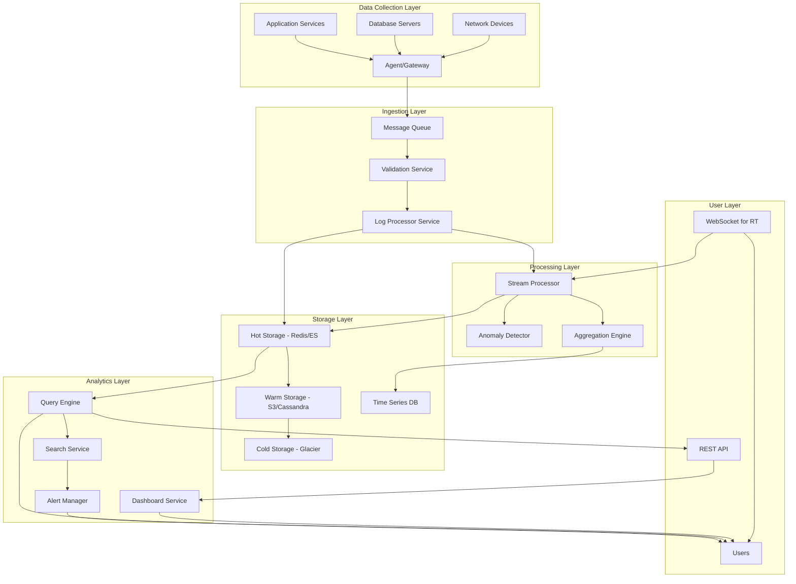

# Global Log Aggregation and Analytics System

## Problem Statement
Design a global-scale system that collects, aggregates, and analyzes logs from thousands of distributed microservices across multiple data centers. The system must provide real-time insights, anomaly detection, and historical analytics while handling massive log volumes (billions of events per day) with sub-second latency for real-time alerts and dashboards.

## Requirements

### Functional Requirements
- **Log Ingestion**: Accept logs from multiple sources (applications, databases, network devices) in various formats (JSON, syslog, custom)
- **Real-time Aggregation**: Process and aggregate logs in near real-time for immediate alerting and monitoring
- **Analytics**: Provide search, filtering, correlation analysis, and trend identification
- **Alerting**: Trigger notifications based on predefined rules or anomaly detection
- **Historical Storage**: Retain logs for extended periods with efficient archival and retrieval
- **Dashboards**: Visualize logs and analytics data in real-time and historical views

### Non-Functional Requirements
- **Scalability**: Handle 10M+ logs/second with global distribution
- **Latency**: <100ms for real-time ingestion, <10s for analytics queries
- **Durability**: 99.999% uptime with zero data loss
- **Availability**: Multi-region deployment with automatic failover
- **Cost Efficiency**: Optimize storage and compute costs for massive scale

## Key Constraints & Assumptions
- **Data Volume**: 1TB of compressed logs per day, growing at 20%/month
- **Retention**: 7 years minimum with configurable retention policies
- **Geographic Distribution**: Services in 10+ regions with inter-region latency <200ms
- **Log Formats**: Support multiple formats with schema validation
- *Assumption*: Logs include standard metadata (timestamp, service name, level, trace ID)
- *Assumption*: 80% of logs are informational, 15% warnings, 5% errors/critical

## High-Level Design



## Data Model

### Log Entry Schema
```json
{
  "id": "uuid",
  "timestamp": "iso8601",
  "service_name": "string",
  "instance_id": "string",
  "level": "INFO|WARN|ERROR|FATAL",
  "message": "string",
  "metadata": {
    "trace_id": "string",
    "user_id": "optional string",
    "request_id": "optional string",
    "tags": ["array of strings"]
  },
  "structured_data": "json object"
}
```

### Analytics Data Models
- **Metric**: Aggregated counts by time windows (1m, 5m, 1h, 1d)
- **Anomaly**: Detected outliers with confidence scores
- **Trend**: Time-series patterns for forecasting
- **Correlation**: Service relationships and dependencies

## API Design

### Ingestion APIs
```
POST /v1/logs/ingest
Headers: Authorization: Bearer <token>
Body: Array of log entries (JSON)

POST /v1/logs/bulk
Headers: Content-Type: application/x-ndjson
Body: Newline-delimited JSON logs
```

### Query APIs
```
GET /v1/logs/search?q={query}&start={time}&end={time}&limit={num}
POST /v1/logs/analytics/aggregate
{
  "filters": {...},
  "group_by": ["service", "level"],
  "time_range": {...},
  "aggregation": "count|sum|avg"
}
```

### Real-time APIs
```
WebSocket: /v1/logs/realtime?filters={...}
// Streams filtered logs in real-time
```

## Detailed Design

### Core Components

#### Log Ingestion Agent
- **Technology**: Lightweight Go agent deployed per service instance
- **Responsibilities**: Buffer logs, compress, batch send via HTTP/2 or gRPC
- **Configurable**: Retry policies, batch sizes, compression level
- **Reasoning**: Go chosen for low memory footprint and native concurrency

#### Message Queue Layer
- **Technology**: Apache Kafka with multi-region mirroring
- **Partitioning**: By service name + timestamp for ordered delivery
- **Retention**: 7 days hot data, replication factor 3
- **Scaling**: Auto-scaling consumer groups based on lag

#### Stream Processing Engine
- **Technology**: Apache Flink for stateful stream processing
- **Use Cases**: Real-time aggregation windows, anomaly detection algorithms
- **State Management**: RocksDB for fault-tolerant state storage

#### Storage Tier
- **Hot Storage (0-1 hour)**: Elasticsearch for search + Redis for cache
- **Warm Storage (1h-30d)**: Cassandra for time-series + S3 for archiving
- **Cold Storage (30d+)**: Glacier for long-term retention
- **Analytics Engine**: Presto for federated queries across storage tiers

#### Distributed Cache Layer
- **Technology**: Redis Cluster for metadata and recent logs
- **Invalidation**: LRU eviction + TTL based policies
- **Consistency**: Eventual consistency with pub/sub for cache invalidation

## Scalability & Bottlenecks

### Horizontal Scaling Strategies
- **Ingestion**: Stateless ingestion services, auto-scaling pods based on queue depth
- **Processing**: Parallel Flink operators, partitioned by service/log type
- **Storage**: Sharded databases with consistent hashing

### Performance Bottlenecks Identified
- **Hot Path**: Log ingestion rate limited by Kafka throughput (10M msg/sec per cluster)
- **Query Path**: Analytics queries bottlenecked by Presto coordinator scale
- **Mitigation**: Multi-cluster Kafka, read replicas, query result caching

### Traffic Patterns
- **Write Heavy**: 95% ingestion, 5% queries during normal operation
- **Spike Handling**: Auto-scaling config for 5x normal traffic bursts
- **Global Routing**: Geo-DNS routing to nearest region, cross-cluster replication

## Trade-offs & Alternatives

### Storage Trade-offs
- **Time-series vs Document Store**: Elasticsearch provides flexible search but higher storage costs vs InfluxDB
- **Hot/Warm/Cold tiers**: Balances cost (Glacier $0.01/GB/month) vs access speed (ES sub-second queries)

### Real-time Processing Trade-offs
- **Speed vs Accuracy**: Approximate algorithms (Count-Min sketch) for <1% error margin vs exact computation
- **CEP engines**: Flink chosen over Storm for exactly-once processing guarantee

### Alternatives Considered
- **ELK Stack**: Basic solution, lacks advanced aggregation and distributed processing
- **Splunk Enterprise**: Commercial solution, high cost at scale ($ per GB)
- **Custom Lambda Architecture**: More complex than Flink-based unified approach

## Future Improvements

### Short-term (3-6 months)
- **Machine Learning Integration**: Auto-anomaly detection using unsupervised learning
- **Log Correlation**: Trace link analysis across services and regions
- **Advanced Alerting**: Smart notification routing and aggregation

### Long-term (1-2 years)
- **AI-powered Insights**: Natural language log analysis and root cause suggestion
- **Predictive Scaling**: ML-based resource allocation based on usage patterns
- **Event-driven Architecture**: Integration with existing DevOps workflows

## Interview Talking Points

- Discuss multi-region data replication challenges and consistency models
- Explain hot-warm-cold storage tiering strategy and data lifecycle management
- Describe how anomaly detection works in real-time stream processing
- Compare pull vs push logging architectures and their trade-offs
- Design failure scenarios: network partition, data center outage, message queue failure
- Estimate costs and performance for billion-scale logging system
- Explain CAP theorem implications in global log aggregation
- Describe correlation analysis for distributed tracing across services
- Discuss GDPR/compliance requirements for log retention and data privacy
- Compare real-time vs batch processing approaches for analytics
