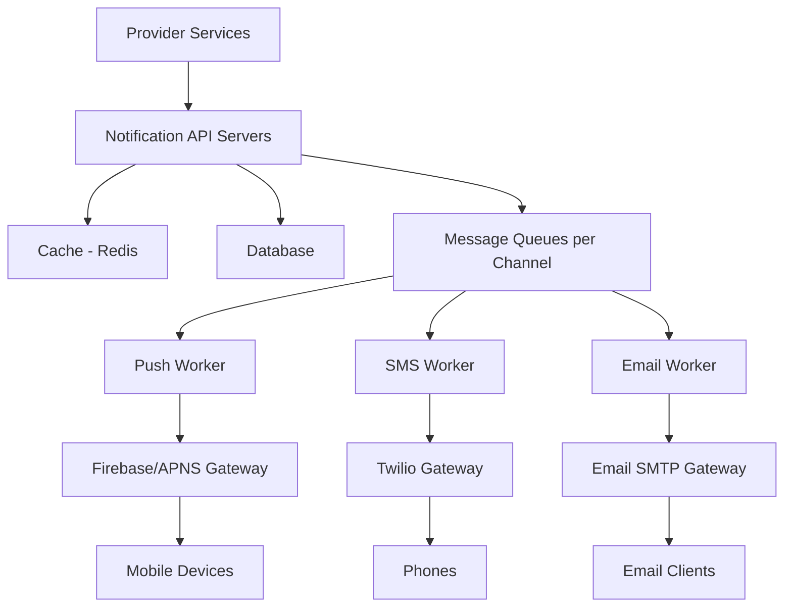

---
title= "Notification System"
tags = [ "system-design", "software-architecture", "interview", "notification-system" ]
author = "Me"
showToc = true
TocOpen = false
draft = false
hidemeta = false
comments = false
disableShare = false
disableHLJS = false
hideSummary = false
searchHidden = true
ShowReadingTime = true
ShowBreadCrumbs = true
ShowPostNavLinks = true
ShowWordCount = true
ShowRssButtonInSectionTermList = true
UseHugoToc = true
weight= 7
bookFlatSection= true
---

# Notification System

## Problem Statement
Design a scalable notification system that delivers messages via multiple channels (push notifications, SMS, email) to users across various devices. The system must handle high-volume notifications (~16 million daily) with soft real-time delivery (within 10 seconds) while providing reliability, security, and flexibility for internal services.

## Requirements

### Functional Requirements
- Support multiple notification types: mobile push (iOS/Android), SMS, and email
- Allow internal services to trigger notifications via API calls
- Support notification templates for consistent messaging
- Enable user opt-in/opt-out preferences per channel
- Handle notification retries and failure handling
- Provide authentication for notification sending APIs
- Track notification delivery and engagement metrics

### Non-Functional Requirements
- Soft real-time delivery with 10-second SLA
- High availability and fault tolerance
- Scalable to 10M push, 1M SMS, and 5M email notifications per day (*assumption: based on scale discussion*)
- Rate limiting to prevent notification spam
- Eventual consistency for message delivery
- Support for multiple device types (iOS, Android, laptops)

## Key Constraints & Assumptions
- Total daily notifications: 16 million (10M push + 1M SMS + 5M email) (*assumption: reasonable scale for large platform*)
- Delivery SLA: 10 seconds (*assumption: soft real-time requirement*)
- Third-party dependencies: Firebase/APNS for push, Twilio for SMS, Mailchimp/SMTP for email
- Notification triggers: Both client-side and server-side events
- User preferences: Opt-out allowed, channel-specific settings
- Device support: iOS, Android, desktop/laptops
- Authentication: App key/secret required for API access
- Retry policy: Multiple attempts with exponential backoff (*assumption: standard reliability approach*)

## High-Level Design
The system uses a decoupled architecture with message queues to handle different notification channels asynchronously. This ensures scalability, fault isolation, and reliable delivery through third-party services.

### Architecture Components
- **Provider Services:** Internal services (microservices/cron jobs) that generate notification requests
- **Notification Servers:** API layer handling validation, rate limiting, and template assembly
- **Cache:** Stores user settings, device tokens, templates (Redis)
- **Database:** Persistent storage for user data, notification history, templates
- **Message Queues:** Separate queues per channel (Kafka/RabbitMQ) for async processing
- **Workers:** Channel-specific workers that pull events and interface with third-party services
- **Third-Party Services:** Firebase/APNS (push), Twilio (SMS), Email providers (SMTP)

### Architecture Diagram


### Notification Flow
1. Provider service calls Notification API with notification details
2. Notification server validates request, fetches user preferences and templates
3. Valid notifications are enqueued in channel-specific message queues
4. Workers pull messages from queues and deliver via third-party services
5. Delivery receipts and failures trigger retries or logging

## Data Model

### User Preferences Schema (SQL/NoSQL)
```
users:
- user_id (PK)
- preferences: JSON {
  push_opt_in: boolean,
  sms_opt_in: boolean,
  email_opt_in: boolean,
  devices: [{
    type: 'ios'|'android',
    token: string,
    app_id: string
  }]
}

notification_log:
- notification_id (PK)
- user_id (FK)
- channel (push/sms/email)
- status (queued/sent/failed/retry)
- sent_at timestamp
- delivered_at timestamp
- retry_count int
- template_id string
```

### Notification Templates Schema (Cache/Database)
```
templates:
- template_id (PK)
- name string
- channel string
- subject string (email only)
- body string (with placeholders like [ITEM_NAME])
- cta_text string
- created_at timestamp
```

### Message Queue Payload Schema (JSON)
```json
{
  "notification_id": "uuid",
  "user_id": "12345",
  "channel": "push|sms|email",
  "priority": "normal|high",
  "payload": {
    "title": "Game Request",
    "body": "Bob wants to play chess",
    "cta": "Play Now",
    "data": {}
  },
  "metadata": {
    "template_id": "game_request",
    "retry_count": 0,
    "scheduled_at": "2024-01-01T10:00:00Z"
  }
}
```

## API Design

### Notification Sending Endpoint
```
POST /api/v1/notifications/send
Authorization: Bearer {app_secret}

Request Body:
{
  "to": [
    {
      "user_id": "123456",
      "channel": "email" // optional override
    }
  ],
  "template_id": "game_request",
  "variables": {
    "item_name": "Chess Board",
    "date": "2024-01-01"
  },
  "priority": "normal",
  "schedule_at": "2024-01-01T10:00:00Z" // optional
}

Response:
{
  "notification_id": "uuid",
  "status": "queued",
  "channel": "email"
}
```

### User Preferences Endpoint
```
GET /api/v1/users/{user_id}/preferences
PUT /api/v1/users/{user_id}/preferences
Authorization: Bearer {user_token}
```

## Detailed Design

### Notification Servers
- **Validation Layer:** Authenticating requests using app_key/app_secret
- **Rate Limiting:** Per-provider and per-user limits to prevent spam
- **Template Processing:** Fetches templates and substitutes variables
- **User Filtering:** Checks opt-in preferences before queuing

### Message Queues
- **Channel Isolation:** Separate queues prevent cross-channel failures
- **Priority Queues:** High-priority notifications processed first
- **Persistence:** Messages survive worker failures

### Workers
- **Deduplication:** Uses notification_id to prevent duplicate sends
- **Retry Logic:** Exponential backoff with dead-letter queues for persistent failures
- **Third-Party Adapters:** Abstract interface for different providers

### Technology Choices
- **Queues (Kafka):** Durable, partitioned queues with high throughput vs RabbitMQ (simpler but lower throughput)
- **Cache (Redis):** Fast key-value storage for user data, templates vs in-memory databases
- **Database (PostgreSQL/MySQL):** Strong consistency for preferences history; MongoDB for flexible schemas

## Scalability & Bottlenecks

### Scaling Strategy
- **Horizontal Scaling:** Notification servers and workers auto-scale based on queue depths
- **Queue Partitioning:** Kafka partitions for parallel processing
- **Database Sharding:** Shard by user_id for user preferences
- **Regional Deployment:** Multi-region setup for global users

### Key Scalability Considerations
- **Queue Backlog:** Monitor queue depths; scale workers dynamically
- **Third-Party Limits:** Respect provider rate limits (e.g., 10K/minute per account)
- **Storage Growth:** Archive old notification logs after retention period
- **Cache Performance:** TTL eviction for stale device tokens

### Load Estimation
- **Peak QPS:** 16M daily / 86400s ≈ 185 notifications/second across all channels
- **Storage:** 16M notifications/day × 90 days retention ≈ 1.4B records
- **Memory:** Cache active users (100M × 2KB avg) ≈ 200GB

## Trade-offs & Alternatives

### Primary Trade-offs
- **Delivery Guarantees:** At-least-once delivery with deduplication vs exactly-once complexity
- **Cancellation Support:** No notification cancellation to maintain simplicity
- **Third-Party Dependencies:** Vendor lock-in vs development complexity of custom SMTP/push

### Architecture Alternatives
- **Synchronous vs Asynchronous:** Queues ensure availability under load; synchronous would fail under high volume
- **Centralized vs Channel-Specific:** Separate workers prevent SMS failures from affecting email
- **In-House vs SaaS Email:** Custom SMTP for privacy; SaaS for ease and deliverability
- **Database vs Cache-Only:** Database provides audit trail; cache-only reduces latency but loses history

### Technology Alternatives
- **RabbitMQ vs Kafka:** RabbitMQ for exactly-once delivery; Kafka for higher throughput
- **Relational vs NoSQL:** SQL for complex queries on preferences; NoSQL for flexible template schemas

## Future Improvements
- Support for scheduled notifications with cron integration
- Advanced A/B testing for notification content
- Machine learning for optimal send times and content
- Real-time analytics dashboard for delivery metrics
- Support for rich media notifications (images, buttons)
- Integration with user engagement data for personalization
- Webhook callbacks for delivery confirmations
- Multi-language template support

## Interview Talking Points
1. **Channel Isolation:** Separate queues per notification type prevent failures from cascading across channels
2. **Third-Party Abstraction:** Adapter pattern allows easy provider switching while maintaining SLA guarantees
3. **Scalability Trade-off:** Queues enable asynchronous processing, trading immediate feedback for system reliability
4. **Data Quality:** Deduplication and retry logic balance delivery guarantees with system complexity
5. **User Experience:** Opt-in preferences respect user choices while maintaining marketing flexibility
6. **Monitoring Focus:** Queue depth monitoring enables proactive scaling compared to reactive failures
7. **Technology Choice:** Kafka chosen for sustained high throughput over RabbitMQ's reliability guarantees
