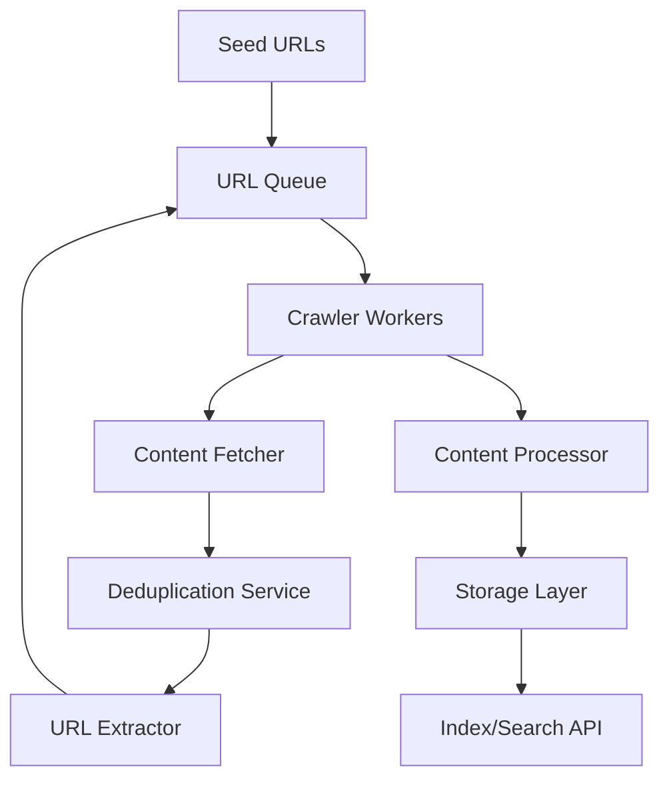

+++
title= "Web Crawler"
tags = [ "system-design", "software-architecture", "interview", "web-crawler" ]
author = "Me"
showToc = true
TocOpen = false
draft = false
hidemeta = false
comments = false
disableShare = false
disableHLJS = false
hideSummary = false
searchHidden = true
ShowReadingTime = true
ShowBreadCrumbs = true
ShowPostNavLinks = true
ShowWordCount = true
ShowRssButtonInSectionTermList = true
UseHugoToc = true
weight= 13
bookFlatSection= true
+++

# Design a Scalable Web Crawler

## Problem Statement
Design a scalable web crawler system that can efficiently fetch and process web content at scale, starting from seed URLs, while handling duplicates, rate limits, and distributed processing to support applications like search engines or data aggregators.

## Requirements

### Functional Requirements
- Accept seed URLs and crawl web pages recursively
- Extract URLs from crawled pages for continued crawling
- Handle URL normalization and deduplication
- Store crawled content or extracted data
- Support politeness policies (rate limiting per domain)
- Detect and avoid problematic content (spider traps, low-value pages)

### Non-Functional Requirements
- High throughput: Process millions of URLs per day
- Low latency fetching and processing
- Fault tolerance and scalability
- Respect robots.txt and rate limits
- Handle varying page sizes and types (HTML, JS-heavy sites)

## Key Constraints & Assumptions
- Scale to crawl billions of pages across the web (assumption)
- Handle 10,000+ requests per second peak load (assumption)
- 99.9% uptime with <5% data loss tolerance (assumption)
- Network latencies vary by geographic location; average page fetch time <2 seconds
- Storage requirements: 1-10 TB daily crawl data (assumption)
- Compliance with web crawling ethics and legal standards

## High-Level Design

The web crawler consists of a distributed set of workers that pull URLs from a queue, fetch content, extract new URLs, and store results. Components include URL Queue, Crawler Workers, Content Storage, and Deduplication Service.

## Data Model

### URL Queue Table
- `url`: Primary key (normalized URL string)
- `priority`: Integer (0-10 for crawl scheduling)
- `status`: Enum (pending, in_progress, completed, failed)
- `last_attempted`: Timestamp
- `domain`: String (for rate limiting)

### Content Storage Table
- `url`: Primary key
- `content_hash`: String (for change detection)
- `content`: BLOB/Text (actual page content or extracted data)
- `metadata`: JSON (headers, crawl timestamp, size)
- `last_crawled`: Timestamp

### Deduplication Bloom Filter
- In-memory Bloom filter for URL visited checks (memory-optimized)
- Secondary Redis store for metadata (crawl frequency, priority)

## Detailed Design

### URL Queue
- Distributed message queue (Kafka/RabbitMQ) for URL management
- Prioritize URLs by importance/freshness
- Shard by domain hash to ensure politeness

### Crawler Workers
- Pool of distributed workers (microservices or containers)
- Handle DNS caching, retries with exponential backoff
- Use headless browsers for JS-heavy pages

### Content Fetcher
- HTTP client with connection pooling
- Handle redirects, timeouts, and various content types
- Integrate with robots.txt parsers

### Deduplication Service
- Bloom filter for O(1) URL existence checks
- Redis for storing crawl metadata and priorities

### Content Processor & Storage
- Extract URLs using HTML parsers (e.g., BeautifulSoup, Jsoup)
- Store full content or metadata in sharded databases (Cassandra/NoSQL)
- Asynchronous processing to avoid blocking workers

## API Design
- **Submit Seed URLs**: POST /api/crawl/seeds
  - Request: `{ "urls": ["http://example.com"], "priority": 8 }`
  - Response: `{ "job_id": "abc", "status": "accepted" }`
- **Get Crawl Status**: GET /api/crawl/status/{job_id}
- **Fetch Results**: GET /api/crawl/results?query=params (for crawled data access)

## Scalability & Bottlenecks

### Key Bottlenecks
- Network I/O: Fetching millions of pages daily
- Storage I/O: Writing large volumes of content
- Queue throughput: Handling high-volume URL submissions
- Memory: Bloom filters grow with unique URLs

### Scaling Strategies
- **Horizontal Scaling**: Add crawler workers dynamically via Kubernetes
- **Sharding**: Partition URLs by domain/hash across workers
- **Caching**: DNS, content caching for frequently accessed sites
- **Geographic Distribution**: Deploy workers closer to target websites
- **Load Balancing**: Distribute requests using consistent hashing
- **Replication**: Multi-region replication for storage layer

Target throughput: 100k pages/sec with sub-second latency via autoscaling.

## Trade-offs & Alternatives

### Queue Technology: Kafka vs. RabbitMQ
- **Kafka**: High throughput for large-scale crawling; better for persistent logs (trade-off: higher complexity vs. performance)
- **RabbitMQ**: Simpler for smaller scale; excellent for task distribution (trade-off: lower throughput vs. ease of use)

### Storage: NoSQL (Cassandra) vs. SQL (PostgreSQL)
- **NoSQL**: Better for unstructured content and high write loads (trade-off: no ACID compliance vs. scalability)
- **SQL**: Strong consistency for metadata (trade-off: slower writes vs. reliability)

### Deduplication: Bloom Filter vs. Redis Set
- **Bloom Filter**: Memory-efficient for billions of URLs (trade-off: false positives vs. space savings)
- **Redis**: Exact deduplication with metadata (trade-off: higher memory usage vs. accuracy)

Overall trade-off: Optimize for scale and speed vs. perfect accuracy.

## Future Improvements
- Machine learning for intelligent crawling (predict change frequency)
- Federation with other crawlers for web coverage
- Real-time content monitoring and alerting
- Integration with CDN for cached content fetching

## Interview Talking Points
1. **Scalability Trade-offs**: Kafka for queue handling massive URL volumes vs. simpler RabbitMQ for smaller systems.
2. **Memory vs. Accuracy**: Bloom filters save space but allow false positives; Redis provides exact checks at higher cost.
3. **Geographic Distribution**: Reduces latency but adds complexity in synchronization and data consistency.
4. **Politeness Handling**: Domain-based sharding and rate limiting prevent blacklisting while maintaining crawl efficiency.
5. **Failure Handling**: Exponential backoff and retries ensure reliability without overwhelming failing endpoints.
6. **Priority Scheduling**: High-value pages crawled first using queue prioritization for fresher index data.
