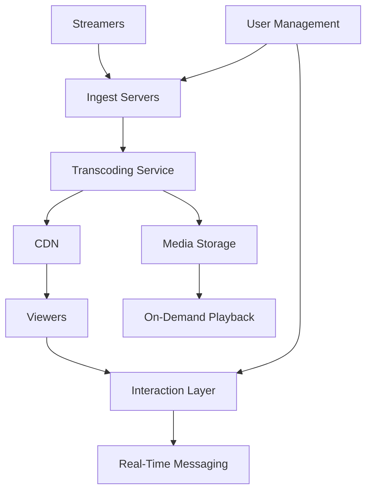

+++
title= "Live Streaming"
tags = [ "system-design", "software-architecture", "interview", "live-streaming" ]
author = "Me"
showToc = true
TocOpen = false
draft = false
hidemeta = false
comments = false
disableShare = false
disableHLJS = false
hideSummary = false
searchHidden = true
ShowReadingTime = true
ShowBreadCrumbs = true
ShowPostNavLinks = true
ShowWordCount = true
ShowRssButtonInSectionTermList = true
UseHugoToc = true
weight= 7
bookFlatSection= true
+++

# Design Live Streaming Platform

## Problem Statement

A live streaming platform enables content creators to broadcast real-time video content (gaming, events, educational) to a global audience, supporting up to 10 million concurrent viewers with low-latency, high-quality streaming and interactive features like chat.

## Requirements

### Functional Requirements
- Live video ingestion and broadcasting
- Adaptive bitrate streaming for varying network conditions
- Real-time chat and viewer interactions
- Stream recording and on-demand playback
- User authentication and content moderation

### Non-Functional Requirements
- Low latency (<5 seconds end-to-end)
- High availability (99.9% uptime)
- Scalability to millions of concurrent users
- Security with data encryption and access control
- Global performance with CDN distribution

## Key Constraints & Assumptions
- **Users & Scale:** 10 million concurrent viewers, 100K active streams; assume 1:100 stream-to-viewer ratio (100K streams max).
- **Throughput:** Peak ingestion up to 1B requests/min, delivery via CDN.
- **Data Size:** Video storage ~10PB/year assuming 1080p at 5Mbps bitrate; live segments cached temporarily.
- **Latency SLA:** Sub-5s glass-to-glass latency; assume standard video codecs (H.264/AVC, H.265/HEVC).
- **Assumptions:** Global users, cloud-based deployment, compliance with GDPR/CCPA for privacy.

## High-Level Design

The platform comprises ingest servers for stream upload, transcoding for format conversion, CDN for global delivery, storage for recorded content, interaction services for chat, and user management. Components communicate via APIs and message queues.

## Data Model

- **User Table (SQL):** Stores user profiles, authentication (e.g., ID, email, role as viewer/streamer).
- **Stream Table (NoSQL):** Metadata for live/on-demand streams (e.g., stream ID, creator ID, bitrate options, timestamps).
- **Chat Messages (NoSQL):** Real-time messages with stream ID, user ID, content, timestamp.
- **Storage:** Videos as blobs in object storage (e.g., S3-compatible); metadata in NoSQL (DynamoDB). Choice: SQL for transactions, NoSQL for high-volume reads.

## API Design

Core endpoints for stream lifecycle and interactions.

- **POST /api/streams** - Start stream ingestion
  - Request: `{creator_id, title, bitrate}`  
  - Response: `{stream_id, ingest_url}`
- **GET /api/streams/{id}** - Retrieve stream metadata and playback URL
  - Response: `{stream_id, status, viewers, cdn_url}`
- **POST /api/streams/{id}/chat** - Send chat message
  - Request: `{user_id, message}`
  - WebSocket Response: Unidirectional stream to viewers
- **PUT /api/streams/{id}/end** - End stream and trigger recording

## Detailed Design

- **Ingest Servers:** Use RTMP/WebRTC protocols, load-balanced for high availability. Scale horizontally in auto-scaling groups.
- **Transcoding Service:** Convert to multiple bitrates (720p, 1080p, 4K) using FFmpeg on EC2/GPU instances. Distribute via Kafka for parallel processing.
- **CDN:** Akamai/Cloudflare with edge caching; global POPs reduce latency.
- **Media Storage:** Object storage for VOD, replicated across regions.
- **Streaming Server:** HLS/DASH for adaptive streaming; WebRTC for ultra-low latency options.
- **User Management:** OAuth/JWT for auth; centralized service for roles.
- **Interaction Layer:** WebSockets or WebRTC data channels for chat; message queues (Kafka) for fan-out to viewers.

Technology Choices: Kafka for transcoding queues (high throughput vs. RabbitMQ's routing). WebRTC for P2P segments where feasible.

## Scalability & Bottlenecks

- **Horizontal Scaling:** All services autoscale; transcoding bottlenecks mitigated by distributed workers.
- **Sharding:** Stream metadata sharded by region; chat by stream ID.
- **Load Balancing:** L7 load balancers (NGINX/ALB) route requests.
- **Caching:** CDN caches segments; Redis for user sessions/metadata.
- **Replication:** Multi-AZ for HA, read replicas for user data.
- **Bottlenecks:** Transcoding CPU-intensive; solve with GPU acceleration. Peak traffic: CDN auto-scales.

## Trade-offs & Alternatives

- **Transcoding Centralization vs. Edge:** Centralized (cost-effective, consistent) vs. edge (lower latency but complex infra).
- **SQL vs. NoSQL:** SQL for user consistency vs. NoSQL for stream volume scalability; chose hybrid.
- **WebRTC vs. HLS:** WebRTC for low latency (~1s) vs. HLS for broad compatibility (~10-15s); hybrid approach.
- **Monolith vs. Microservices:** Microservices for independent scaling vs. monolith's simplicity; trade-off complexity for flexibility.

## Future Improvements

- Integrate AI for content moderation and auto-tagging.
- Support VR/360° video with specialized encoding.
- Implement ABR with machine learning for viewer analytics.
- Add payment integration for premium streams.

## Interview Talking Points

1. Explain low-latency options (WebRTC vs. HLS) and trade-offs.
2. How to handle 10M concurrent viewers with CDN sharding.
3. Transcoding bottlenecks and scaling solutions.
4. Security measures (encryption, moderation).
5. Data modeling for real-time chat at scale.
6. Estimating costs (storage, bandwidth) for 10PB data.
7. Failure modes (network outage) and recovery strategies.
8. Adaptive bitrate logic and viewer experience impact.
