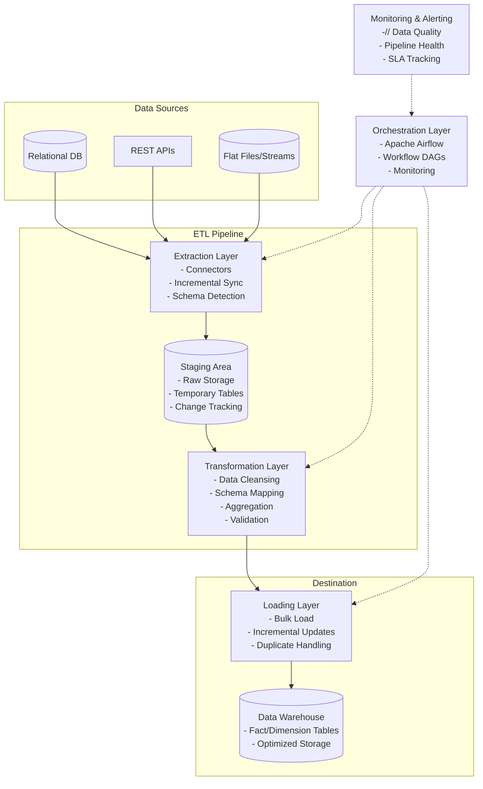

+++
title= "ETL System"
tags = [ "system-design", "software-architecture", "interview", "etl" ]
author = "Me"
showToc = true
TocOpen = false
draft = false
hidemeta = false
comments = false
disableShare = false
disableHLJS = false
hideSummary = false
searchHidden = true
ShowReadingTime = true
ShowBreadCrumbs = true
ShowPostNavLinks = true
ShowWordCount = true
ShowRssButtonInSectionTermList = true
UseHugoToc = true
weight= 28
bookFlatSection= true
+++

# Design ETL System

## Problem Statement
Design a scalable Extract, Transform, Load (ETL) system that can extract data from diverse sources (databases, APIs, files), perform transformations to standardize the data, and load it into a data warehouse or data lake for analytical purposes. The system must handle 10 TB of daily data with low-latency transformations and support both batch and real-time processing.

## Requirements

### Functional Requirements
- Extract data from multiple sources including relational databases, APIs, and flat files
- Transform extracted data through cleansing, filtering, aggregation, and schema mapping
- Load transformed data into a destination data warehouse or data lake
- Support both batch processing (daily) and streaming/real-time updates
- Provide data lineage tracking and error handling for failed transformations
- Support data quality checks and validation rules

### Non-Functional Requirements
- **Scalability:** Handle 10 TB of data per day with ability to scale to 100 TB+ in the future
- **Performance:** Maintain <5 minute latency for real-time transformations and <4 hours for daily batch processing
- **Reliability:** 99.9% uptime with fault-tolerant processing and automatic retries
- **Security:** Data encryption at rest and in transit, GDPR compliance, and role-based access control
- **Observability:** Comprehensive monitoring, logging, and alerting for all ETL pipelines

## Key Constraints & Assumptions
- **Scale Assumptions:** 10 TB daily data volume, 1 billion daily records, 100k requests/second during peak batch processing
- **Cost Constraints:** Optimize for cloud storage costs while ensuring performance
- **Data Latency SLA:** Batch processing within 4 hours end-to-end, real-time processing within 5 minutes
- **Technology Assumptions:** Cloud-native deployment (AWS/Azure/GCP), open-source tools where possible
- **Compliance:** Must adhere to GDPR, CCPA, and standard data retention policies

## High-Level Design

The ETL system consists of six main components: Data Sources, Extraction Layer, Staging Area, Transformation Layer, Loading Layer, and Data Warehouse/Data Lake. An Orchestration Layer manages workflow scheduling and monitoring.



**Architecture Overview:**
- **Data Sources:** External systems providing structured/unstructured data
- **Extraction Layer:** Pulls data using connectors with incremental sync to minimize load
- **Staging Area:** Temporary storage for raw data before transformation
- **Transformation Layer:** Processes data using distributed computing frameworks
- **Loading Layer:** Optimized bulk loading with conflict resolution
- **Data Warehouse:** Analytical storage with partitioning and indexing
- **Orchestration Layer:** Manages dependencies, scheduling, and retries

## Data Model

### Key Entities
- **Source Metadata:** Tables tracking source systems, schemas, and connection details
- **ETL Jobs:** Workflow definitions including DAGs, schedules, and retry policies
- **Data Lineage:** Audit trails tracking data flow from source to destination
- **Quality Metrics:** Validation rules, data quality scores, and error logs

### Storage Choice
- **Staging:** Distributed object store (S3/ADLS) for cost-effective temporary storage
- **Warehouse:** Snowflake/Redshift for analytical workloads, Delta Lake for ACID compliance
- **Metadata:** PostgreSQL for relational metadata, coupled with caching (Redis) for performance

### Schema Sketch
```
Source Metadata Table:
- source_id (UUID)
- source_type (DB/API/File)
- connection_string (encrypted)
- schema_definition (JSON)
- last_sync_timestamp

ETL Job Configuration:
- job_id (UUID)
- dag_definition (JSON)
- schedule_cron (string)
- retry_policy (JSON)
- dependencies (array)

Target Warehouse Schema (Example):
Fact Table: sales_fact
- sale_id (PK)
- customer_id (FK)
- product_id (FK)
- sale_date
- amount
- quantity

Dimension Table: customer_dim
- customer_id (PK)
- source_customer_id (string)
- name (string)
- email (string)
- created_at (timestamp)
```

## API Design
ETL systems primarily expose internal APIs for orchestration, but external APIs provide management capabilities.

### Core Endpoints
1. **POST /jobs** - Create new ETL job
   ```json
   Request:
   {
     "name": "daily_sales_etl",
     "sources": [{"type": "database", "connection": "..."}],
     "transformations": ["deduplicate", "aggregate"],
     "destination": "snowflake://warehouse.sales_fact",
     "schedule": "0 2 * * *"
   }
   Response: {"job_id": "uuid", "status": "created"}
   ```

2. **GET /jobs/{id}/status** - Get job execution status
   ```json
   Response:
   {
     "job_id": "uuid",
     "status": "running",
     "stages": {
       "extraction": "completed",
       "transformation": "running",
       "loading": "pending"
     },
     "progress": 65,
     "start_time": "2025-01-01T02:00:00Z"
   }
   ```

3. **POST /jobs/{id}/retry** - Manual retry failed job
   ```json
   Request: {"reason": "transient_failure"}
   Response: {"status": "queued"}
   ```

## Detailed Design

### Component Details
- **Extraction Layer:** Uses custom connectors for databases (JDBC), APIs (HTTP clients), and files (S3 clients). Implements change data capture (CDC) using timestamps or log-based replication. Includes schema inference and data type detection.
- **Transformation Layer:** Powered by Apache Spark for distributed processing. Supports SQL transformations, custom UDFs, and streaming via Structured Streaming. Includes data quality gates that halt processing on validation failures.
- **Staging Area:** Uses columnar formats (Parquet/Delta) for efficient scanning. Implements partitioning by date/source for fast retrieval.
- **Loading Layer:** Uses bulk insert APIs with parallel loading. Handles duplicates through merge operations and maintains referential integrity.
- **Orchestration Layer:** Apache Airflow for workflow management with custom operators for each ETL phase. Includes alerting hooks and dependency management.

**Technology Choices:**
- Apache Airflow for orchestration (mature, extensive plugin ecosystem)
- Apache Spark for transformations (unified batch/streaming, scalable)
- Parquet for staging files (columnar, compressed, splittable)
- Snowflake as data warehouse (serverless scaling, semi-structured data support)

## Scalability & Bottlenecks

### Horizontal Scaling Strategies
- **Extraction:** Distribute across multiple pods/workers based on source type
- **Transformation:** Auto-scale Spark clusters based on data volume (10-1000 nodes)
- **Loading:** Parallel bulk loads with connection pooling
- **Storage:** Partition data by date/source, use multi-cluster warehouses

### Bottlenecks & Solutions
- **I/O Bottleneck:** Use SSDs for staging, optimize query plans with partitioning
- **Transformation Latency:** Implement caching for reference data, use incremental processing
- **Network Saturation:** Employ data compression and regional deployments
- **Concurrency Limits:** Rate limiting on source systems, queuing for load distribution

**Scaling Metrics:**
- Extraction throughput: 1 GB/min per worker
- Transformation: 10x parallelization on 100-node cluster
- Loading: 10 TB/hour for bulk operations

## Trade-offs & Alternatives

### Key Decisions
1. **Batch vs. Streaming:** Batch chosen for complex transformations (trade-off: latency for consistency), supplemented with Kafka for real-time needs
2. **On-prem vs. Cloud:** Cloud-native for elasticity (trade-off: vendor lock-in for cost efficiency)
3. **SQL vs. NoSQL Storage:** Relational warehouse for analytics (trade-off: schema rigidity for ad-hoc queries)

### Alternatives
- **Orchestration:** Prefect as open-source alternative to Airflow (simpler DAGs vs. extensive features)
- **Processing:** Flink instead of Spark (real-time expertise vs. batch maturity)
- **Storage:** S3 + Athena vs. full warehouse (cost vs. query performance)

**Rationale:** Chose Airflow/Spark combination for maturity and ecosystem support, balancing complexity with performance.

## Future Improvements

### Short-term Enhancements (3-6 months)
- Implement auto-scaling based on queue depth
- Add real-time dashboard for pipeline monitoring
- Integrate with data catalog for schema discovery

### Long-term Features (6-18 months)
- Support for machine learning model scoring in transformations
- Cross-cloud replication for disaster recovery
- Semantic data validation using AI-powered anomaly detection

### Performance Optimizations
- Implement query result caching
- Add data skipping indexes for faster aggregation
- Explore federated queries across multiple sources

## Interview Talking Points

1. **Scale Estimation:** Calculate worker nodes needed (e.g., 1 TB/hour per node → 24 nodes for 10 TB at 4-hour SLA)
2. **Failure Handling:** Design idempotent operations and checkpointing for exactly-once processing
3. **Cost Optimization:** Compare storage tiers vs. compute costs; implement data lifecycle policies
4. **Data Quality:** Implement circuit breaker pattern to halt pipelines on data drift detection
5. **Security Trade-offs:** End-to-end encryption vs. performance impact; zero-trust access control
6. **Real-time vs. Batch:** When to choose Lambda vs. Kappa architecture based on business requirements
7. **Monitoring Strategy:** Alert on SLA breaches, track data lineage for compliance auditing
8. **Technology Selection:** Weigh open-source vs. managed services based on team's expertise and budget
