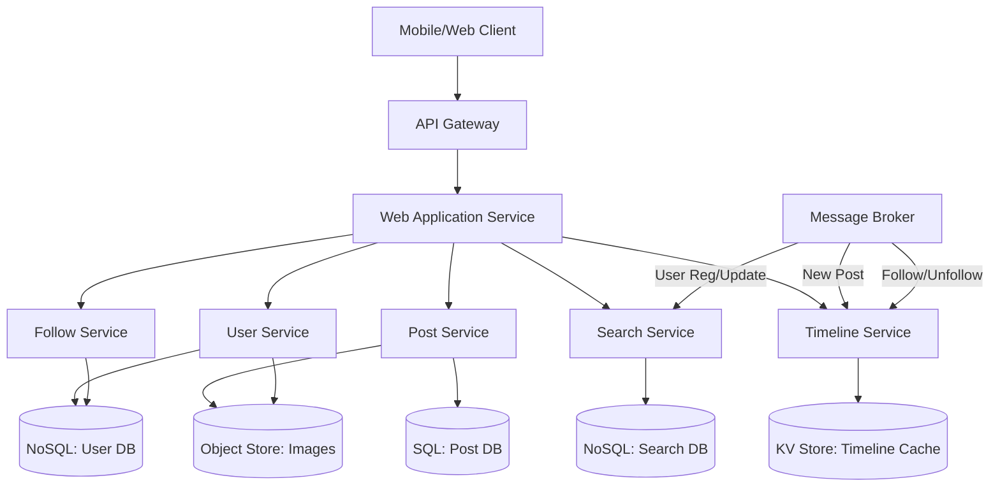

+++
title= "Image Sharing with News Feed"
tags = [ "system-design", "software-architecture", "interview", "news-feed" ]
author = "Me"
showToc = true
TocOpen = false
draft = false
hidemeta = false
comments = false
disableShare = false
disableHLJS = false
hideSummary = false
searchHidden = true
ShowReadingTime = true
ShowBreadCrumbs = true
ShowPostNavLinks = true
ShowWordCount = true
ShowRssButtonInSectionTermList = true
UseHugoToc = true
weight= 8
bookFlatSection= true
+++

# Design Image Sharing Platform with News Feed

## Problem Statement
Design a scalable image sharing social media platform that supports user registration, authentication, image uploads, following other users, user search, and a personalized news feed displaying images from followed accounts, sorted chronologically.

## Requirements

### Functional Requirements
- User registration and login with profile management.
- Upload and share images.
- Search users by name or username.
- Follow/unfollow users.
- View personalized news feed with images from followed users.

### Non-Functional Requirements
- High availability: 99.99% uptime.
- Scalability: Support billions of users and petabytes of daily data.
- Performance: 500ms latency for interactions (P99), 1s for news feed loading (P99).

## Key Constraints & Assumptions
- Scale: Up to 10 billion users, 100 million daily active users (assumption for illustration; adjustable based on market).
- Data Volume: 1-10 petabytes of new images/media daily (assumption).
- Traffic: 10,000-50,000 requests/second at peak (assumption).
- SLAs: 99.99% availability, P99 latency as above.
- Assumption: Focus on images initially; text/video for future.

## High-Level Design
The system uses microservices architecture with event-driven updates, asynchronous processing, and global distribution.

**Architecture Diagram:**

Components overview:
- API Gateway: Routes requests, handles authentication.
- Web Application Service: Serves UI, forwards to microservices.
- User Service: Manages users, auth.
- Post Service: Handles image posts.
- Search Service: Optimized user search.
- Follow Service: Manages followers.
- Timeline Service: Pre-computed news feeds.
- Object Store: Image storage (e.g., S3).
- Message Broker: Async event propagation.

## Data Model
- **User Entity** (NoSQL): `{id, username, name, email, password_hash, profile_image_url}`
- **Post Entity** (SQL): `{id, user_id, image_url, timestamp, type='image'}`
- **Follow Entity** (NoSQL/SQL): `{follower_id, followee_id, timestamp}`
- **Timeline Cache** (KV): `user_id -> [post_ids sorted by timestamp]`
- **Search Index** (NoSQL): Optimized for text search on user fields.

## API Design
Core endpoints:
- `POST /register`: Register user (data: name, email, username, password, profile_image).
- `POST /login`: Authenticate, return token.
- `POST /users/{user_id}/posts`: Upload image.
- `GET /search?q=term`: Paginated user search.
- `POST /users/{target_user_id}/follow`: Follow user.
- `GET /feed?user_id={id}&page=1`: Get news feed (paginated post list).

## Detailed Design
- **User Service**: Built with Node.js/Go, uses DynamoDB/MongoDB for users. Profile images stored in S3 via presigned URLs.
- **Post Service**: Express/Kotlin, PostgreSQL for posts (ACID for consistency). Publishes post events to Kafka.
- **Search Service**: Elasticsearch for fuzzy search. Subscribes to user events via broker.
- **Follow Service**: Graph DB (e.g., Neo4j) or NoSQL for relationships (assumption for simplicity).
- **Timeline Service**: Redis/Memcached cache. On new posts/follows, async jobs compute timelines using distributed workers.
- Async compression pipeline: AWS Lambda/Azure Functions process images post-upload.

## Scalability & Bottlenecks
- Horizontal scaling via Kubernetes/load balancers.
- Database sharding: Hash-based on user_id.
- Read replicas for news feeds.
- Bottlenecks: Timeline computation at scale → Use fan-out on write for influencers (>1M followers).
- CDN (Cloudflare/Akamai) for images. Global replication.

## Trade-offs & Alternatives
- NoSQL for users/profiles: Flexibility vs eventual consistency; alternative: SQL for strong schema.
- SQL for posts: Joins for queries vs sharding complexity.
- Pre-computed timelines: Faster reads vs write amplification (events/fan-out).
- Monolith vs microservices: Simpler ops vs scalability, chose microservices for independence.
- Kafka vs NSQ (RabbitMQ): Scalability vs ease, chose Kafka for high-throughput.

## Future Improvements
- Support multi-media (videos/text), reactions, stories.
- Recommendations (ML-based feeds).
- Real-time notifications.
- GDPR compliance, moderation.

## Interview Talking Points
1. Why microservices? Enables independent scaling and fault isolation.
2. News feed bottleneck: Pre-computation avoids N+1 queries on reads.
3. Fan-out strategies: Write-time for small graphs, read-time merge for influencers.
4. Consistency: Eventual via brokers; eventual consistency acceptable for feeds.
5. Storage choices: SQL for posts (relations), NoSQL for users (flexibility), KV for performance.
6. Scaling data: Sharding by user/post ID, replication for availability.
7. Trade-offs: Speed vs consistency; e.g., cached timelines vs live joins.
8. Failures: Circuit breakers, retries; multi-region deployment.
