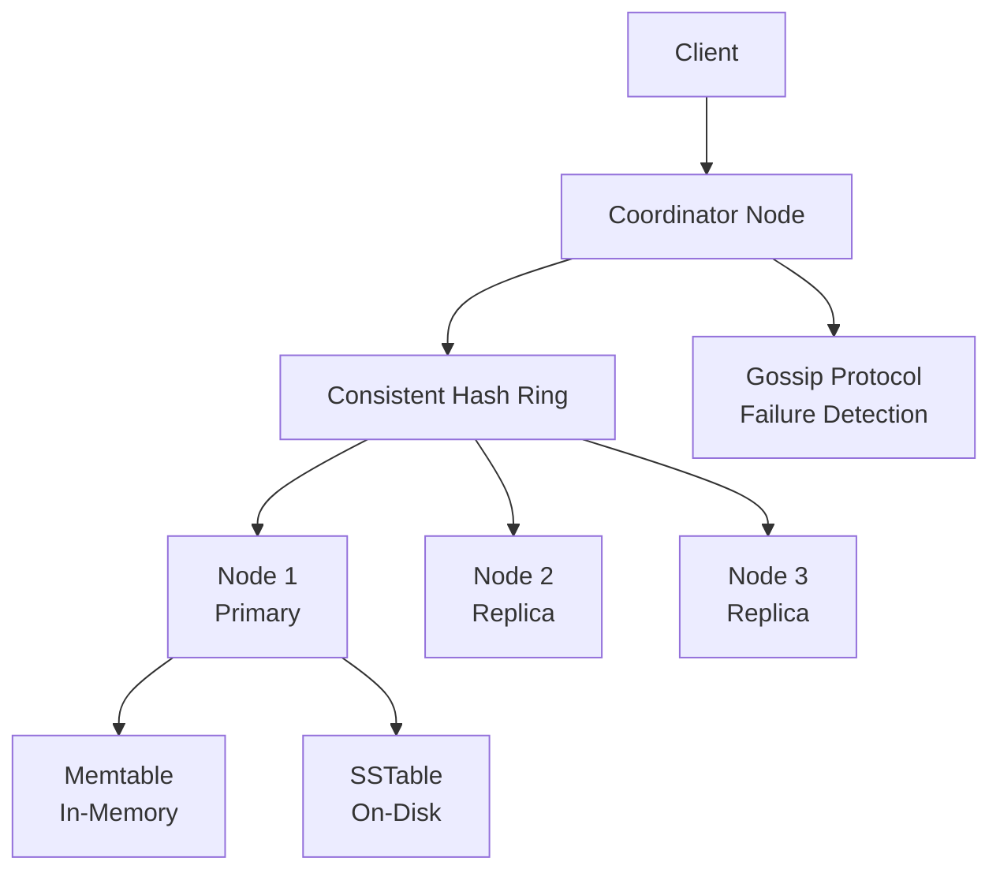

+++
title= "Key Value Store"
tags = [ "system-design", "software-architecture", "interview", "key-value-store" ]
author = "Me"
showToc = true
TocOpen = false
draft = false
hidemeta = false
comments = false
disableShare = false
disableHLJS = false
hideSummary = false
searchHidden = true
ShowReadingTime = true
ShowBreadCrumbs = true
ShowPostNavLinks = true
ShowWordCount = true
ShowRssButtonInSectionTermList = true
UseHugoToc = true
weight= 5
bookFlatSection= true
+++

# Design Key-Value Store

## Problem Statement

Design a highly scalable and available key-value store that supports basic operations to insert and retrieve key-value pairs. The system must handle large datasets, ensure low latency, and maintain high availability even during failures while supporting tunable consistency.

## Requirements

### Functional Requirements

- Support `put(key, value)` to insert or update a value for a given key.
- Support `get(key)` to retrieve the value associated with a key.
- Keys must be unique and can be strings or hashes.

### Non-Functional Requirements

- High scalability: Support billions of key-value pairs and handle millions of requests per second.
- High availability: System remains operational during node failures.
- Low latency: Read and write operations under 100ms.
- Tunable consistency: Allow configuration between strong and eventual consistency.
- Automatic scaling: Dynamically add/remove servers based on load.
- Fault tolerance: Handle network partitions and node failures gracefully.

## Key Constraints & Assumptions

- Key-value pair size: Limited to 10KB per pair (assumption based on typical KV stores like Redis).
- Total data volume: 100TB+ (reasonable assumption for distributed systems).
- Read/write ratio: 80/20 (higher reads than writes, assumption for caching strategies).
- SLA: 99.9% uptime, response times under 100ms for 95th percentile.
- Geographic distribution: Data centers across multiple regions for global availability.
- Network latency: Assume average 50ms inter-data-center latency.

## High-Level Design

The system uses a distributed architecture with data partitioned across multiple nodes using consistent hashing. Each key-value pair is replicated for high availability, and a coordinator handles client requests, routing them to appropriate nodes. Failure detection uses gossip protocols, and consistency is managed via quorum voting with vector clocks for conflict resolution.

### Overall Architecture



**Components and their roles:**
- **Client**: Sends put/get requests.
- **Coordinator**: Acts as a proxy, routes requests based on consistent hashing, manages quorum for consistency.
- **Nodes**: Physical servers storing data, each handling multiple partitions.
- **Data Partitioning**: Consistent hashing distributes keys evenly.
- **Replication**: Each key stored on N replicas (typically 3).
- **Storage**: In-memory memtable and on-disk SSTables with Bloom filters for efficient reads.

## Data Model

- **Key Entity**: String or hash (up to 256 bytes), unique identifier.
- **Value Entity**: Blob up to 10KB, can be any data type.
- **Metadata**: Version information (vector clock), timestamps, TTL if applicable.
- **Storage**: NoSQL key-value format, with partitioning by key hash. Schemas minimized as it's schema-less.

Example schema sketch (simplified):
```
Key: "user:123:profile"
Value: {"name": "John", "email": "john@example.com"}
Metadata: {"version": [1,2,3], "ttl": null}
```

## API Design

Core endpoints for a REST API (or SDK):

- PUT /kv/{key} - Body: {value}, Response: 200 OK or 409 Conflict (version mismatch).
- GET /kv/{key} - Response: 200 {value} or 404 Not Found, with metadata headers for versioning.

Sample request/response:

PUT /kv/user:123:profile
```
Content-Type: application/json
Body: {"name": "Alice", "age": 30}
```

Response: 200 OK

GET /kv/user:123:profile
```
Response: {"name": "Alice", "age": 30}
Headers: X-Version: [1,0,0]
```

## Detailed Design

- **Data Partitioning**: Consistent hashing distributes keys evenly to minimize rebalancing on scaling.
- **Replication**: Each key replicated to N=3 nodes; quorum W=2, R=2 for eventual consistency.
- **Consistency Management**: Vector clocks detect concurrent writes, client resolves conflicts.
- **Storage Layer**: Writes to commit log and memtable; flush to SSTables periodically. Reads check memtable, then SSTables with Bloom filters.
- **Failure Handling**: Gossip protocol detects failures; hinted handoff for temporary outages; Merkle trees for permanent failure recovery.
- **Caching**: In-memory memtable acts as cache; optional external cache for hot data.
- **Load Balancing**: Client-side routing with consistent hashing; coordinator for coordination.

## Scalability & Bottlenecks

Horizontal scaling via consistent hashing allows adding nodes with O(1) data movement. Sharding by key hash ensures even load. Bottlenecks include disk I/O for slow reads, network bandwidth for replication, and hotspot keys. Mitigations: SSDs, compression, multi-threading, cross-region replication.

## Trade-offs & Alternatives

- **SQL vs NoSQL**: NoSQL chosen for scalability and performance; SQL would require complex joins and may not scale.
- **Strong vs Eventual Consistency**: Eventual consistency for high availability; strong consistency increases latency.
- **Centralized vs Decentralized**: Decentralized for no single point of failure; centralized easier but less resilient.
- **Dynamo Replication vs Cassandra**: Similar to Cassandra; Dynamo focuses on high writes.
- **Compression vs Speed**: Data compression reduces storage but increases CPU usage.
- **In-Memory vs Disk**: More in-memory (e.g., Redis) for speed vs current hybrid for cost.

## Future Improvements

- Add secondary indexing for range queries.
- Implement TTL and automatic expiration.
- Support transactions for multi-key operations.
- Integration with existing systems (e.g., pub/sub).
- Analytics layer for data insights.

## Interview Talking Points

1. Why consistent hashing over simple hashing? Reduces data movement on scaling.
2. How does quorum consensus balance consistency and availability?
3. Discuss CAP theorem trade-offs for this system.
4. Explain vector clocks role in conflict resolution.
5. How do Bloom filters optimize reads in SSTables?
6. Trade-offs between strong and eventual consistency.
7. Failure handling: Hinted handoff vs Merkle trees.
8. Scalability: How to handle billions of keys.
