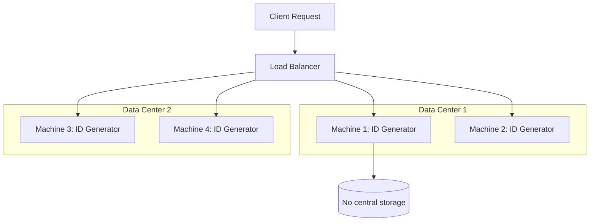

+++
title= "UUID Generator"
tags = [ "system-design", "software-architecture", "interview", "uuid-generator" ]
author = "Me"
showToc = true
TocOpen = false
draft = false
hidemeta = false
comments = false
disableShare = false
disableHLJS = false
hideSummary = false
searchHidden = true
ShowReadingTime = true
ShowBreadCrumbs = true
ShowPostNavLinks = true
ShowWordCount = true
ShowRssButtonInSectionTermList = true
UseHugoToc = true
weight= 6
bookFlatSection= true
+++

# Design Unique ID Generator

## Problem Statement
Design a system that generates unique, sortable, and numeric IDs for use in distributed systems. The system must support generating IDs across multiple servers without centralized coordination, avoiding the latency issues associated with traditional auto_increment in databases.

## Requirements

### Functional Requirements
- Generate unique 64-bit numeric IDs.
- IDs must be sortable by time.
- Ability to generate IDs independently across distributed servers.
- Support for high throughput (10,000 IDs/sec).

### Non-Functional Requirements
- High availability with minimal downtime.
- Low latency ID generation.
- Scalability across multiple data centers.

## Key Constraints & Assumptions
- ID length: 64 bits, numeric only.
- Scale: Generate up to 10,000 IDs per second globally (assumed based on common distributed system needs).
- Latency: ID generation should take under 1ms.
- Distributed: Up to 32 data centers, 32 machines per data center (total 1,024 machines).

## High-Level Design
The system uses a variant of the Twitter Snowflake algorithm to generate IDs in a distributed manner. Each ID generator service runs on individual machines, combining timestamp, machine ID, and sequence number for uniqueness.



## Data Model
No persistent storage is required as IDs are generated on-the-fly. The ID structure:
- Sign bit (1 bit): Reserved.
- Timestamp (41 bits): Milliseconds since epoch (Jan 1, 2020 assumed).
- Datacenter ID (5 bits).
- Machine ID (5 bits).
- Sequence (12 bits): Within the same millisecond.

This results in a compact, self-contained ID without needing a database.

## API Design
A simple REST API for ID generation.

**Endpoint:** `GET /generate-id`

**Response:**
```json
{
  "id": 1288834974657  // Example 64-bit ID
}
```

## Detailed Design
The chosen approach is based on Twitter Snowflake:
- **Timestamp Component:** Ensures sortable IDs by time.
- **Datacenter and Machine IDs:** Assign fixed IDs at startup for uniqueness across servers.
- **Sequence Component:** Handles concurrent requests within the same millisecond (up to 4,096 IDs/ms per machine).
Technology choices: Implemented in a language like Java or Go for performance; no database dependency.

## Scalability & Bottlenecks
- **Horizontal Scaling:** Add more machines; each generates independently.
- **Load Balancing:** Distribute requests across generators.
- **Bottlenecks:** Clock drift could cause collisions if not synced; sequence overflow if exceeding 4,096 IDs/ms/machine.
Mitigations: Use NTP for clock sync; increase sequence bits if needed.

## Trade-offs & Alternatives
- **Vs. UUID v4:** Shorter (64-bit vs 128-bit), sortable, but requires clock sync.
- **Vs. Ticket Server:** Decentralized eliminates single point of failure, but adds clock sync overhead.
- **Vs. Auto-increment with offsets:** Simpler, but hard to scale across regions.

## Future Improvements
- Integrate with Kubernetes for auto-assigning machine IDs.
- Add monitoring for ID generation metrics.
- Support for custom epochs or bit allocations.

## Interview Talking Points
1. Why Snowflake over UUID for sortable, compact IDs?
2. How to handle clock skew in distributed systems?
3. Scaling: What if 10,000 IDs/sec becomes 1M/sec?
4. Trade-offs: Decentralized generation vs centralized efficiency.
5. Assumptions: Why 64 bits, not more or less?
6. Failures: What if NTP fails – fallback strategies?
7. Extensions: How to make IDs monotonic without global ordering?
