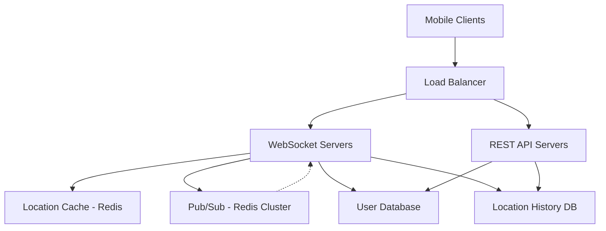

---
title: "Nearby Friends"
tags : [ "system-design", "software-architecture", "interview", "nearby-friends" ]
author : "Me"
showToc : true
TocOpen : false
draft : false
hidemeta : false
comments : false
disableShare : false
disableHLJS : false
hideSummary : false
searchHidden : true
ShowReadingTime : true
ShowBreadCrumbs : true
ShowPostNavLinks : true
ShowWordCount : true
ShowRssButtonInSectionTermList : true
UseHugoToc : true
weight: 16
bookFlatSection: true
------

# Nearby Friends

## Problem Statement
Design a scalable system that allows users to share their location and view nearby friends within a configurable geographic radius (e.g., 5 miles). The system must handle real-time location updates for active users, displaying friend locations with distances and timestamps, while ensuring low-latency updates (within seconds) for a mobile app context.

## Requirements

### Functional Requirements
- Allow users to opt-in to location sharing and view nearby friends on a mobile app
- Display friend distance and last location update timestamp
- Update nearby friends list in real-time (every few seconds)
- Support friends list management (add/remove friends)
- Store location history for analytics and machine learning purposes
- Handle user inactivity by removing friends from view after 10 minutes of no updates

### Non-Functional Requirements
- Low latency for location updates (under 1-2 seconds)
- High availability with tolerance for occasional data point loss
- Eventual consistency for location data across replicas
- Scalable to 100 million daily active users, with ~334,000 location updates per second
- Support for concurrent users (up to 10 million) with average 400 friends each (*assumption: reasonable for social features*)

## Key Constraints & Assumptions
- Total app users: 1 billion (*assumption: large-scale social platform*)
- Active users using feature: 10% of total users (100 million daily)
- Concurrent users: 10% of active users (10 million)
- Location update frequency: 30 seconds (*assumption: balances accuracy with battery life*)
- Distance calculation: Straight-line (Haversine formula) (*assumption: suitable for "nearby" feature*)
- Nearby threshold: 5 miles, configurable per user
- User inactivity timeout: 10 minutes
- Average friends per user: 400
- Display limit: Top 20 nearby friends initially (*assumption: reasonable UI limit*)
- Location history retention: Indefinite for analytics (*assumption: valuable for ML*)

## High-Level Design
The system uses a centralized backend as a fan-out mechanism to distribute location updates to relevant friends, avoiding inefficient peer-to-peer communication.

### Architecture Components
- **Load Balancer:** Distributes traffic across API and WebSocket servers
- **REST API Servers:** Handle user management, friend lists, profile operations (stateless, horizontally scalable)
- **WebSocket Servers:** Manage persistent connections for real-time updates (stateful server per user)
- **Location Cache (Redis):** Stores active user locations with TTL eviction (10-minute expiry)
- **User Database:** Stores user profiles and friendship relationships (sharded relational/NoSQL)
- **Location History Database:** Stores time-series location data for analytics (write-optimized like Cassandra)
- **Pub/Sub System (Redis Cluster):** Broadcasts location updates to subscriber servers using consistent hashing

### Architecture Diagram


### Data Flow Example
1. Mobile client sends location update to WebSocket server
2. Server updates location cache and history DB
3. Server publishes update to user's Pub/Sub channel
4. Subscriber WebSocket servers (handling friends) receive update
5. Recipients calculate distance and forward update if friend is within range

## Data Model

### Location Cache Schema (Redis)
```
Key: user:{user_id}
Value: JSON { "lat": float, "lng": float, "timestamp": int }
TTL: 600 seconds (10 minutes)
```

### User Relationships Schema (NoSQL/Relational)
```
users:
- user_id (PK, sharded)
- username
- profile_data

friendships:
- user_id (PK, sharded)
- friend_id
- status (active/blocked)
- created_at
Index on: user_id
```

### Location History Schema (Cassandra)
```
location_updates:
- user_id (PK, sharded)
- timestamp (clustering key, DESC)
- lat
- lng
- accuracy
```

## API Design

### WebSocket Routines
- **Location Update:** `{"type": "update", "lat": float, "lng": float, "timestamp": int}`
- **Location Receipt:** `{"type": "friend_update", "friend_id": int, "lat": float, "lng": float, "distance": float, "timestamp": int}`
- **Initialize:** `{"type": "init", "user_id": int}` → Server responds with nearby friends list
- **Subscribe Friend:** `{"type": "subscribe", "friend_id": int}`
- **Unsubscribe Friend:** `{"type": "unsubscribe", "friend_id": int}`

### REST API Endpoints
- `GET /users/{user_id}/friends` - Retrieve friend list
- `POST /users/{user_id}/friends` - Add friend
- `DELETE /users/{user_id}/friends/{friend_id}` - Remove friend
- `GET /users/{user_id}/location/history` - Get location history (for analytics)

## Detailed Design

### WebSocket Server Logic
- Maintains persistent connections and in-memory friend channel subscriptions
- Caches recent locations for distance calculations
- Handles connection failures with client-side reconnection logic
- Scales horizontally but requires sticky sessions per user

### Pub/Sub Channel Distribution
- Each user has dedicated channel: `location:{user_id}`
- Channels pre-allocated for all active users
- Consistent hashing distributes channels across Redis cluster
- Service discovery (etcd/Zookeeper) tracks server mappings

### Scaling Strategy
- **Horizontal Scaling:** Auto-scale WebSocket servers, replicate API servers
- **Caching:** Multi-level Redis cluster with sharding
- **Database Sharding:** Hash-based on user_id for even distribution
- **Asynchronous Writes:** Location history uses background processing to avoid blocking updates

## Scalability & Bottlenecks

### Scaling Dimensions
- **Read Load:** Location cache handles high QPS with Redis sharding
- **Write Load:** Pub/Sub publishes to relevant subscribers only (40 friends/user average)
- **Connections:** WebSocket servers handle stateful connections with load balancing
- **Storage Growth:** Location history grows linearly, archived after retention window

### Key Bottlenecks & Solutions
- **Pub/Sub Throughput:** Distributed Redis cluster (140+ nodes for ~14M/second updates)
- **Distance Calculations:** In-memory caching, limit friend subscriptions to max cap
- **Memory Usage:** TTL eviction limits active user storage
- **Hot Users:** Cap friend connections (5000 max), distribute load across servers
- **Geographic Scaling:** Regional clusters for global users

### Load Estimation
- **Location Updates QPS:** 334K (10M concurrent users / 30s)
- **Total Subscriptions:** 4 billion (10M users × 400 friends)
- **Memory Requirements:** 200GB for Pub/Sub channels

## Trade-offs & Alternatives

### Primary Trade-offs
- **Consistency vs. Performance:** Eventual consistency allows location updates without strict ordering
- **Accuracy vs. Efficiency:** 30-second updates balance battery usage with timeliness
- **Privacy vs. Features:** Location sharing opt-in, third-party APIs avoided for compliance

### Architecture Alternatives
- **P2P Communication:** Rejected due to mobile network unreliability and battery constraints
- **Periodic Polling:** Higher server load vs. WebSocket efficiency
- **Kafka vs. Redis Pub/Sub:** Kafka provides durability but Redis offers lower latency for real-time messaging
- **PostGIS vs. Distance Calculations:** PostGIS allows complex geographic queries but adds database complexity; in-memory calculations preferred for speed

### Technology Choices
- **Redis Pub/Sub:** Chosen for lightweight, pub/sub messaging with horizontal scaling
- **WebSocket over HTTP Polling:** Persistent connections reduce latency for real-time features
- **Zookeeper for Coordination:** Manages cluster membership and channel distribution

## Future Improvements
- Implement geohash-based proximity queries for efficient large-radius searches
- Add machine learning for predictive location caching
- Support privacy controls (invisible mode, selective sharing)
- Integrate with mapping services for accurate routing distances
- Optimize battery usage with adaptive update frequencies
- Add analytics dashboard for location-based insights
- Implement global CDN for reduced latency across regions

## Interview Talking Points
1. **Scale Architecture:** Centralized fan-out reduces message complexity from O(friends²) to O(subscribers)
2. **Real-time Communication:** WebSocket + Pub/Sub enables sub-second updates across millions of concurrent users
3. **Fault Tolerance:** Eventual consistency trades strict accuracy for availability in mobile contexts
4. **Geographic Handling:** Configurable radius with straight-line calculations provides clear trade-off between simplicity and accuracy
5. **Database Choice:** Redis for cache/DynamoDB for relationships/Cassandra for time-series location data demonstrates reasoned selection
6. **Trade-offs:** 30-second updates balance battery life, bandwidth, and timeliness while accepting occasional data loss
7. **Scaling Strategy:** Consistent hashing minimizes disruption during cluster changes, enabling seamless horizontal scaling

