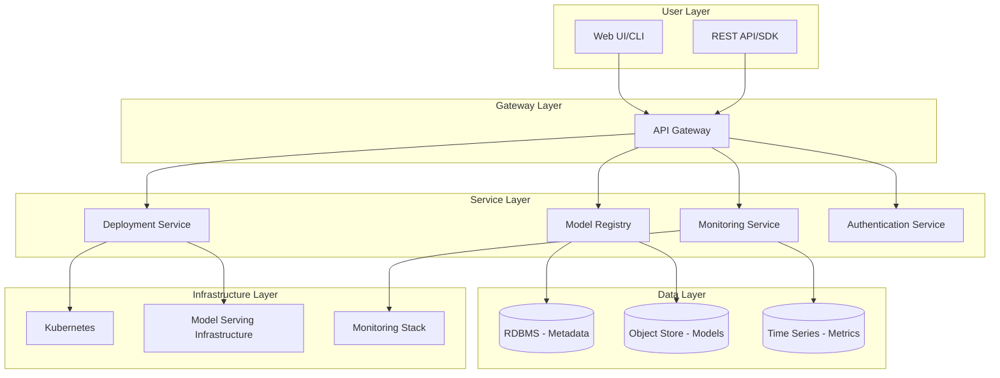

---
title: "ML Model Versioning and Deployment Platform"
description: "System design example for ML Model Versioning and Deployment Platform"
---

# ML Model Versioning and Deployment Platform

## Problem Statement

Enterprises need a robust, scalable platform to manage the complete lifecycle of machine learning models - from development and versioning through automated deployment and monitoring. Current solutions lack unified versioning, seamless deployment across environments, and comprehensive monitoring capabilities. Organizations struggle with model drift detection, rollback strategies, performance monitoring, and ensuring governance and compliance in production ML deployments.

## Requirements

### Functional Requirements
- **Model Versioning**: Semantic versioning, artifact storage, metadata tracking, lineage tracking
- **Model Registry**: Centralized catalog of models with search, tagging, and access control
- **Deployment Pipeline**: Automate deployment to staging/production, A/B testing, canary deployments
- **Model Serving**: Low-latency inference endpoints, autoscaling, load balancing
- **Monitoring & Observability**: Performance metrics, data drift detection, alerting
- **Governance**: Audit logs, approval workflows, compliance reporting
- **CI/CD Integration**: Webhooks, API-driven deployments, environment management

### Non-Functional Requirements
- **Scalability**: Handle thousands of models, millions of daily predictions
- **Latency**: <100ms for inference requests, <30s for model deployments
- **Availability**: 99.9% uptime, zero-downtime deployments
- **Security**: Model encryption, access control, audit trails
- **Reliability**: Automated rollbacks, health checks, circuit breakers

## Key Constraints & Assumptions
- *Assumption: Platform handles models up to 10GB in size, supporting major ML frameworks (TensorFlow, PyTorch, XGBoost)*
- *Assumption: Target deployments support CPU/GPU inference with horizontal scaling up to 1000 pods*
- *Constraint: Must integrate with existing Kubernetes infrastructure and cloud providers (AWS, GCP, Azure)*
- *Assumption: 80% of users are data scientists/developers, 20% are platform administrators*

## High-Level Design

The platform consists of four main layers: User Interface, API Gateway, Core Services, and Infrastructure Layer.

```
flowchart TD
    A[Data Scientists/DevOps] --> B[Web UI & CLI]
    B --> C[API Gateway]
    
    C --> D[Model Registry Service]
    C --> E[Deployment Service]
    C --> F[Monitoring Service]
    
    D --> G[(Metadata DB)]
    D --> H[S3/GCS Object Store]
    
    E --> I[Kubernetes Cluster]
    E --> J[Model Serving Pods]
    
    F --> K[(Metrics DB)]
    F --> L[Time Series DB]
    
    I --> M[Load Balancer]
    M --> N[Inference Endpoints]
```

### Architecture Diagram



## Data Model

### Model Entity
```
Model {
  id: UUID (PK)
  name: String
  description: String
  framework: Enum (TensorFlow, PyTorch, XGBoost, ONNX)
  created_by: User ID
  created_at: Timestamp
  updated_at: Timestamp
  organization_id: UUID (FK)
}
```

### Model Version Entity
```
ModelVersion {
  id: UUID (PK)
  model_id: UUID (FK)
  version: SemanticVersion (e.g., "1.2.3")
  artifact_path: String (S3/GCS path)
  metadata: JSON (hyperparameters, metrics, training data hash)
  status: Enum (pending, approved, rejected, deprecated)
  created_by: User ID
  created_at: Timestamp
  size_bytes: BigInt
  hash: String (SHA256 of artifact)
}
```

### Deployment Entity
```
Deployment {
  id: UUID (PK)
  model_version_id: UUID (FK)
  environment: Enum (dev, staging, prod)
  endpoint_url: String
  status: Enum (creating, running, failed, rolled_back)
  config: JSON (replicas, resource limits, autoscaling rules)
  deployed_at: Timestamp
  deployed_by: User ID
}
```

### Prediction Log Entity
```
PredictionLog {
  id: UUID (PK)
  deployment_id: UUID (FK)
  request_id: String
  input_hash: String
  output: JSON
  response_time_ms: Int
  timestamp: Timestamp
  model_version: String
}
```

## API Design

### Model Management APIs
```
POST   /api/v1/models                    # Create new model
GET    /api/v1/models/{model_id}         # Get model details
PUT    /api/v1/models/{model_id}         # Update model metadata
DELETE /api/v1/models/{model_id}         # Archive model

POST   /api/v1/models/{model_id}/versions # Upload model version
GET    /api/v1/models/{model_id}/versions # List versions with pagination
GET    /api/v1/models/{model_id}/versions/{version} # Get specific version
PATCH  /api/v1/models/{model_id}/versions/{version}/status # Approve/reject version
```

### Deployment APIs
```
POST   /api/v1/deployments               # Create deployment
GET    /api/v1/deployments               # List deployments
GET    /api/v1/deployments/{id}          # Get deployment status
PUT    /api/v1/deployments/{id}          # Update deployment config
DELETE /api/v1/deployments/{id}          # Remove deployment

POST   /api/v1/deployments/{id}/rollback # Rollback to previous version
POST   /api/v1/deployments/{id}/scale    # Scale deployment replicas
```

### Inference APIs
```
POST   /v1/models/{model_id}/predict     # Real-time prediction
POST   /v1/models/{model_id}/batch       # Batch predictions
GET    /v1/models/{model_id}/health     # Health check endpoint
```

### Monitoring APIs
```
GET    /api/v1/monitoring/metrics        # Get platform metrics
GET    /api/v1/deployments/{id}/metrics  # Get deployment-specific metrics
GET    /api/v1/models/{id}/drift         # Get data drift analysis
POST   /api/v1/alerts                    # Configure alerts
```

## Detailed Design

### Core Components and Technology Choices

#### 1. Model Registry Service (Java/Spring Boot)
- **Purpose**: Centralized catalog for model metadata and artifacts
- **Technology**: PostgreSQL for metadata, S3/GCS for binaries
- **Key Features**:
  - Semantic versioning with dependency tracking
  - Model lineage and experiment tracking
  - Access control with RBAC (admin, developer, viewer roles)
- **Implementation**: RESTful API with event-driven updates to search index

#### 2. Deployment Service (Go/Kubernetes)
- **Purpose**: Orchestrate model deployments with rolling updates
- **Technology**: Kubernetes CRDs for model deployments, Istio for traffic management
- **Key Features**:
  - Blue-green deployments for zero-downtime updates
  - A/B testing with traffic splitting
  - Automated canary analysis
  - Resource management with HPA/VPA
- **Implementation**: Kubernetes operator pattern with custom controllers

#### 3. Model Serving Infrastructure (Python/FastAPI)
- **Purpose**: High-performance inference serving
- **Technology**: FastAPI with Gunicorn, TensorFlow Serving/PyTorch Serve
- **Key Features**:
  - Multiple runtime support (CPU/GPU/TensorRT)
  - Request batching and caching
  - Model warm-up and health checks
  - Async inference for I/O bound models
- **Implementation**: Containerized microservices with service mesh

#### 4. Monitoring Service (Python/Prometheus)
- **Purpose**: Comprehensive observability and alerting
- **Technology**: Prometheus + Grafana, ELK stack for logs
- **Key Features**:
  - Performance metrics (latency, throughput, error rates)
  - Data drift detection using Alibi Detect
  - Custom business metrics collection
  - Automated alerting with PagerDuty/Slack integration
- **Implementation**: Event-driven architecture with Kafka streams

### Security & Access Control
- **Authentication**: OAuth2/JWT with integration to corporate identity providers
- **Authorization**: Attribute-based access control (ABAC) with model-level permissions
- **Encryption**: TLS in transit, AES-256 for model artifacts at rest
- **Auditing**: All operations logged to immutable audit trail

## Scalability & Bottlenecks

### Horizontal Scaling Strategy
- **Stateless Services**: All services (registry, deployment, monitoring) designed stateless with external state in databases
- **Sharding**: Model registry partitioned by organization, time-based partitioning for logs
- **Caching**: Redis for hot model metadata, CDN for model artifacts
- **Message Queues**: Kafka for async event processing (deployments, metrics collection)

### Performance Optimizations
- **Model Caching**: Frequently used models cached in GPU memory pools
- **CDN Integration**: Global distribution of model artifacts to reduce latency
- **Load Balancing**: L7 load balancing with session affinity for stateful inference
- **Autoscaling**: HPA based on CPU/memory, custom metrics for prediction queue depth

### Identified Bottlenecks & Mitigations
1. **Large Model Loading**: Mitigated by model pre-warming and incremental loading
2. **Cold Starts**: Mitigated by keep-alive pools and predictive scaling
3. **Data Drift Detection**: Processed asynchronously with sampling to reduce compute overhead
4. **Log Aggregation**: Mitigated by log compaction and distributed processing

**Estimated Performance**: 10,000 models, 100M daily predictions, 99.9% availability

## Trade-offs & Alternatives

### Model Storage Strategy
**Chosen**: S3-compatible object storage with metadata in RDBMS
**Alternative**: HDFS for on-prem deployments, but less cloud-native
**Trade-off**: Higher latency for model loads vs. better integration with cloud services

### Serving Architecture
**Chosen**: Containerized microservices with Kubernetes
**Alternative**: Serverless functions (Lambda/SageMaker) for cost-efficiency
**Trade-off**: Better control and customization vs. simpler management and scaling

### Monitoring Approach
**Chosen**: Prometheus ecosystem
**Alternative**: Commercial APM tools (DataDog, New Relic)
**Trade-off**: Lower cost and open-source ecosystem vs. richer features and support

### Deployment Strategy
**Chosen**: Rolling updates with health checks
**Trade-off**: Some requests may fail during updates vs. blue-green (higher resource usage)

## Future Improvements

### Phase 2 Features
- **Federated Learning**: Support for distributed model training across organizations
- **Model Marketplace**: Public/private model sharing and monetization
- **AutoML Integration**: Automated model optimization and deployment
- **Compliance Automation**: SOX/HIPAA audit trails and compliance reporting

### Technical Enhancements
- **Edge Deployment**: Model deployment to IoT/edge devices
- **Multi-Cloud Support**: Seamless deployment across hybrid cloud environments  
- **Advanced Monitoring**: Predictive analytics for model performance degradation
- **Cost Optimization**: Intelligent resource allocation and spot instance support

## Interview Talking Points

- **Model versioning strategy enables reproducible deployments** - semantic versioning + artifact hashing ensures auditability
- **Microservices architecture provides independent scaling** - registry/deploy/monitoring can scale separately based on load
- **Kubernetes integration enables production reliability** - rolling updates, health checks, auto-healing for zero-downtime
- **Async monitoring prevents performance bottlenecks** - metrics collection and drift detection run independently of inference path
- **Security-first design with encrypted artifacts** - models encrypted at rest, fine-grained access control prevents unauthorized access
- **Trade-off between consistency and availability** - eventual consistency for metadata vs. strong consistency for deployments
- **Scalability achieved through horizontal partitioning** - models sharded by organization, logs by time for efficient querying
- **Monitoring-driven development approach** - comprehensive observability enables data-driven optimization decisions
