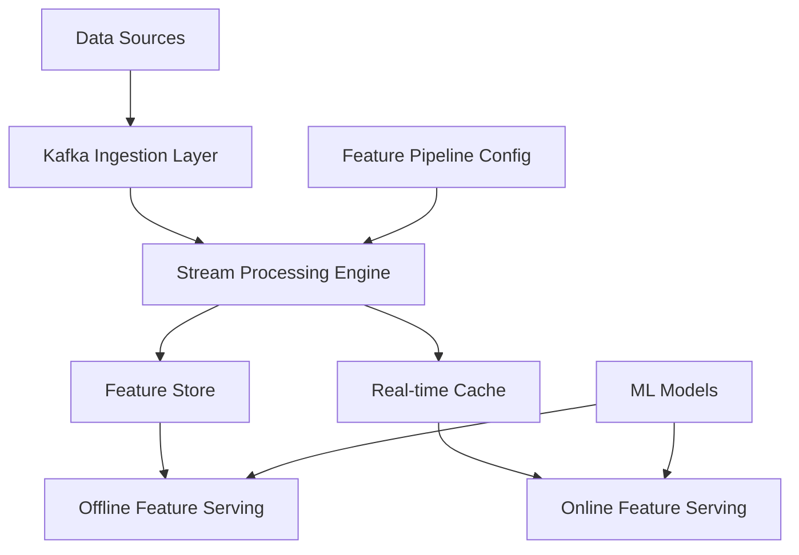

---
title: "Real-Time Feature Engineering Service"
description: "System design example for Real-Time Feature Engineering Service"
---

# Real-Time Feature Engineering Service

## Problem Statement

Design a highly scalable, low-latency feature engineering service that can transform raw streaming data into ML-ready features in real-time. The service must handle high-throughput data from multiple sources, compute complex features requiring state management, and serve features with sub-second latency to ML models during inference. Key challenges include maintaining feature consistency across distributed nodes, handling complex dependency graphs for derived features, and providing exactly-once processing guarantees.

## Requirements

### Functional Requirements
- **Data Ingestion**: Accept streaming data from Kafka, Kinesis, or REST APIs
- **Feature Computation**: Support various feature types (statistical, categorical encoding, temporal aggregations)
- **State Management**: Maintain feature state for time-window aggregations and session-based features
- **Feature Serving**: Provide low-latency feature retrieval for online inference
- **Feature Store**: Persist computed features for batch training and historical lookups
- **Dependency Management**: Handle feature dependencies and computation DAGs
- **Transformation Pipeline**: Support ETL transformations and feature engineering logic

### Non-Functional Requirements
- **Latency**: P99 feature serving latency < 10ms for online features, < 100ms for computed features
- **Throughput**: Handle 100K+ events per second per feature
- **Scalability**: Support 1000+ concurrent feature computations
- **Consistency**: Exactly-once semantics for stateful feature computations
- **Availability**: 99.99% uptime with automatic failover
- **Durability**: Feature store persistence with point-in-time recovery

## Key Constraints & Assumptions

- **Data Volume**: Average 50GB/day raw data, peaking at 200GB/day
- **Feature Count**: 1000+ active features across all feature pipelines
- **Feature Freshness**: Real-time features available within 100ms of raw data arrival
- **Storage Requirements**: Feature store retains 90 days of historical features
- **Network Constraints**: Feature serving must work across global regions with < 50ms inter-region latency
- **Compliance**: Must support GDPR-compliant data deletion and audit logging

*Assumption: Feature computation complexity is bounded - no features requiring exponential time complexity*

## High-Level Design

The architecture comprises four main layers: Ingestion, Processing, Storage, and Serving. The service uses Kappa architecture for real-time processing with change data capture (CDC) for historical feature backfilling.



## Data Model

### Core Entities
- **Feature Schema**: Metadata defining feature name, type, computation logic, dependencies
- **Feature Version**: Immutable feature definitions with versioning for back-compatibility
- **Feature Value**: Timestamped feature values with entity keys (user_id, session_id)
- **Feature Lineage**: Dependency graph tracking how features are derived

### Key Data Structures
```sql
-- Feature metadata table
CREATE TABLE features (
    feature_id UUID PRIMARY KEY,
    name VARCHAR(255) UNIQUE,
    type ENUM('numeric', 'categorical', 'text', 'vector'),
    computation_graph JSON,  -- Serialized DAG
    created_at TIMESTAMP,
    version INT
);

-- Feature values table
CREATE TABLE feature_values (
    entity_key VARCHAR(255),
    feature_id UUID,
    value JSON,  -- Flexible storage for vectors, arrays
    timestamp TIMESTAMP,
    ttl_days INT,
    PRIMARY KEY (entity_key, feature_id, timestamp)
) PARTITION BY timestamp;
```

## API Design

### REST APIs
```yaml
# Feature serving for real-time inference
GET /v1/features?entity_key=user123&features=age,last_purchase_amount

# Batch feature retrieval
POST /v1/features/batch
body: {
  "entity_keys": ["user123", "user456"],
  "feature_names": ["age", "purchase_history"],
  "timestamp": "2024-01-01T00:00:00Z"
}

# Feature registration
POST /v1/features
body: {
  "name": "user_lifetime_value",
  "expression": "sum(purchase_amount) OVER (PARTITION BY user_id ORDER BY timestamp RANGE UNBOUNDED PRECEDING)",
  "dependencies": ["purchase_amount"],
  "window": "90 days"
}
```

### Streaming APIs (gRPC preferred)
```protobuf
service FeatureService {
  rpc GetFeatures(GetFeaturesRequest) returns (GetFeaturesResponse);
  rpc StreamFeatures(StreamFeaturesRequest) returns (stream FeatureUpdate);
}
```

## Detailed Design

### Core Components

#### 1. Stream Processing Engine
- **Technology**: Apache Flink for stateful stream processing
- **Reasoning**: Provides exactly-once processing guarantees, rich windowing APIs, and efficient state management
- **Key Features**:
  -CEP (Complex Event Processing) for pattern matching
  - Custom window functions for time-based aggregations
  - State checkpointing every 30 seconds for fault tolerance

#### 2. Feature Store
- **Architecture**: Hybrid storage with Redis for hot features, DynamoDB/Cassandra for cold storage
- **Organization**: Feature tables partitioned by entity type and time
- **Indexing**: Composite indexes on entity_key + feature_name + timestamp

#### 3. Feature Pipeline Orchestrator
- **Configuration**: Declarative YAML defining feature computation DAGs
- **Execution**: Waterfall dependency resolution with parallel execution
- **Validation**: Schema validation and data quality checks

#### 4. Online Cache Layer
- **Technology**: Redis Cluster with eviction policies
- **Strategy**: Write-through cache for frequently accessed features
- **Consistency**: Cache-aside pattern with TTL-based invalidation

### Feature Computation Patterns

#### Stateless Features
- Simple transformations: age from birth date, is_premium from subscription tier

#### Stateful Features
- Time-window aggregations: avg purchase last 30 days, session length
- Count features: login attempts in last hour
- Trend features: purchase velocity change

#### Derived Features
- Ratio features: bounce rate = bounced visits / total visits
- Categorical encoding: One-hot encoding, label encoding

## Scalability & Bottlenecks

### Performance Bottlenecks
- **State Size**: Accumulating state for large time windows (>90 days)
- **Feature Cardinality**: High-cardinality features generating too many unique values
- **Computation Complexity**: CPU-intensive feature engineering (NLP embeddings)
- **Network IO**: Cross-region data synchronization

### Scaling Strategies
- **Horizontal Scaling**: Auto-scaling Flink task managers based on throughput
- **Partitioning**: Entity-based partitioning ensuring consistent feature computation
- **Caching**: Multi-level caching (L1: local process, L2: Redis cluster, L3: distributed cache)
- **Async Processing**: Background computation for heavy features

### Monitoring Metrics
- **Latency**: P50/P95/P99 feature serving time
- **Throughput**: Events processed per second
- **Error Rate**: Failed feature computations
- **Cache Hit Rate**: Percentage of features served from cache

## Trade-offs & Alternatives

### Architecture Trade-offs

#### Kappa vs Lambda Architecture
- **Current Choice**: Full Kappa (real-time only) for simplified operations
- **Trade-off**: No batch layer means difficulty handling late-arriving data
- **Alternative**: Hybrid approach with periodic batch reconciliation

#### Stateful vs Stateless Processing
- **Current**: Stateful for complex features (rolling averages, session features)
- **Trade-off**: State management complexity and checkpointing overhead
- **Alternative**: Pre-computed statistics stored in external databases

#### Embedded vs External Feature Store
- **Current**: Integrated feature store reduces latency
- **Trade-off**: Increased complexity and coupling
- **Alternative**: External feature stores like Feast or Tecton

### Technology Alternatives
- **Stream Processing**: Flink vs Spark Streaming vs Kafka Streams
- **Storage**: Redis + Cassandra vs DynamoDB vs TiDB
- **Serving**: REST vs gRPC vs GraphQL

## Future Improvements

### Short-term (6 months)
- **Feature Pipeline Testing**: Automated testing framework for feature correctness
- **Feature Monitoring**: Drift detection and quality metrics dashboard
- **Multi-region Deployment**: Active-active replication across regions

### Medium-term (1 year)
- **Advanced Feature Types**: Deep learning feature extraction (CNN embeddings)
- **Real-time ML Integration**: Online learning capabilities
- **Feature Auto-tuning**: Automated optimization of window sizes and cache settings

### Long-term (2+ years)
- **Edge Computing**: Feature computation at IoT device level
- **Federated Learning**: Privacy-preserving feature sharing across organizations
- **Temporal Feature Engineering**: Time-series analysis and forecasting features

## Interview Talking Points

- **Why Kappa over Lambda?** Enables real-time feature serving without batch delays, simplifies overhead though it requires strict time-window data
- **Exactly-once processing trade-offs**: Flink ensures state consistency but adds checkpointing latency (30s intervals)
- **Feature freshness vs computational cost**: Real-time computation uses 10x more resources than batch but enables immediate model adaptation
- **Scaling stateful features**: Request-level affinity routing ensures session features go to same processing node, costing 20% distribution overhead
- **Cache invalidation strategy**: TTL-based eviction (15min) balances read performance with storage costs in distributed Redis clusters
- **Feature dependency graph**: Topological execution ensures correct order but limits parallelization to dependency depth
- **Mixed consistency models**: Strong consistency for financial features, eventual consistency for recommendation features
- **Cross-region replication**: Active-passive setup minimizes latency jitter but adds 50ms replication delay during failovers
- **Feature versioning**: Schema evolution with backward-compatible migrations, costing 2x storage for transitional periods
- **Quality monitoring**: Statistical drift detection catches data schema changes before they break ML models
