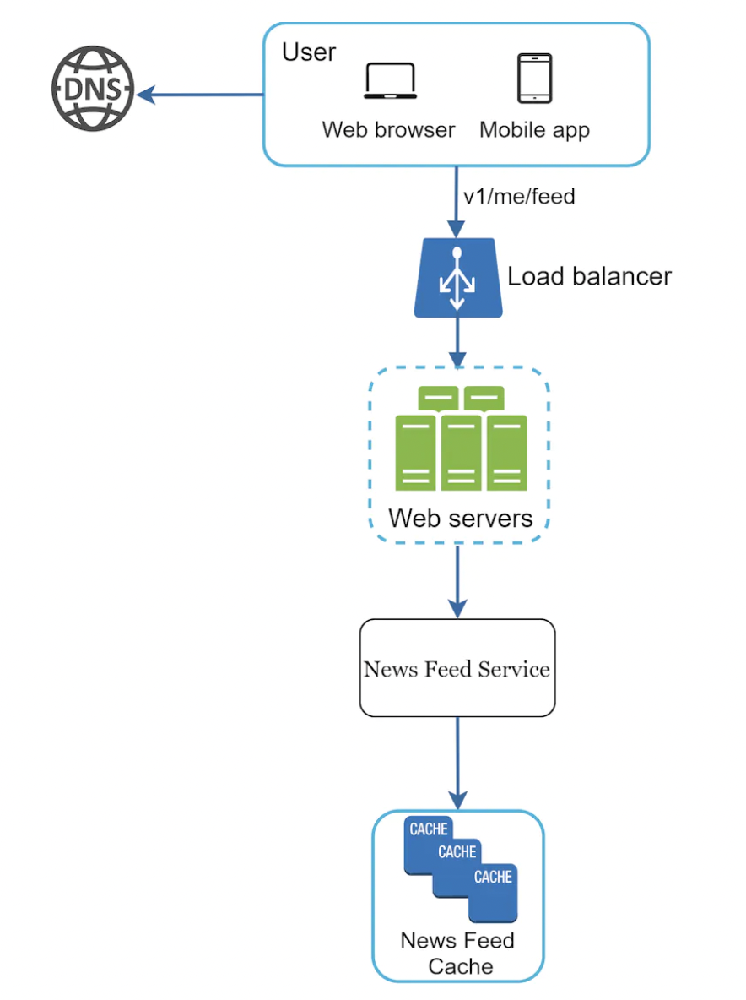
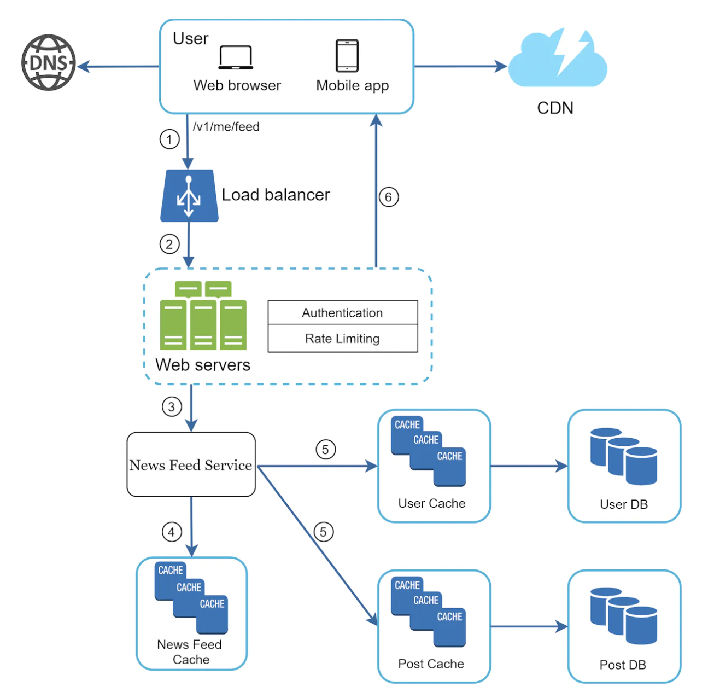
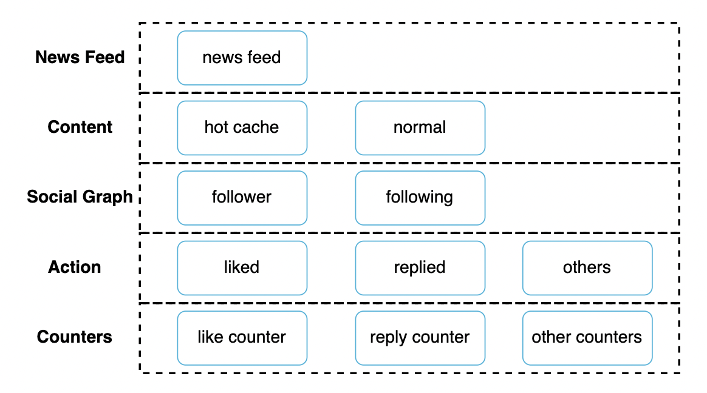

+++
title= "News Feed"
tags = [ "system-design", "software-architecture", "interview", "news-feed" ]
author = "Me"
showToc = true
TocOpen = false
draft = false
hidemeta = false
comments = false
disableShare = false
disableHLJS = false
hideSummary = false
searchHidden = true
ShowReadingTime = true
ShowBreadCrumbs = true
ShowPostNavLinks = true
ShowWordCount = true
ShowRssButtonInSectionTermList = true
UseHugoToc = true
weight= 8
bookFlatSection= true
+++

# Design a News Feed System

A news feed is a constantly updating list of stories on a user's home page, including status updates, photos, videos, links, etc. Similar interview questions include designing a Facebook news feed, Twitter timeline, Instagram feed, etc.

## Step 1 - Understand the Problem and Establish Design Scope

The first step is to clarify the specifics of the system:

- **C:** Mobile, web app?
  - **I:** Both

- **C:** What are the important features?
  - **I:** Users can publish posts and see friends' posts on their news feed.

- **C:** Is the news feed sorted in reverse chronological order or based on rank, e.g., best friends' posts first?
  - **I:** To keep it simple, assume reverse chronological order.

- **C:** Max number of friends?
  - **I:** 5000

- **C:** Traffic volume?
  - **I:** 10 million DAU (Daily Active Users)

- **C:** Can the feed contain media?
  - **I:** It can contain images and videos.

## Step 2 - Propose High-Level Design and Get Buy-In

The design is divided into two parts:

- **Feed Publishing:** When a user publishes a post, the corresponding data is written to cache and DB. The post is then populated to friends' news feeds.

- **Newsfeed Building:** Built by aggregating friends' posts into the news feed.

### Newsfeed API

The Newsfeed API serves as the primary gateway to the news feed services.

Key endpoints include:

- `POST /v1/me/feed` - Publish a post. Payload includes `content` and `auth_token`.
- `GET /v1/me/feed` - Retrieve news feed. Payload includes `auth_token`.

### Feed Publishing

1. **User** makes a new post via the API.
2. **Load Balancer** - Distributes traffic to web servers.
3. **Web Servers** - Redirect traffic to internal services.
4. **Post Service** - Persist post in database and cache.
5. **Fanout Service** - Push posts to friends' news feeds.
6. **Notification Service** - Inform new friends that content is available.

### Newsfeed Building

1. **User** sends a request to retrieve the news feed.
2. **Load Balancer** redirects traffic to web servers.
3. **Web Servers** - Route requests to the newsfeed service.
4. **Newsfeed Service** - Fetch news feed from cache.
5. **Newsfeed Cache** - Store pre-computed news feeds for fast retrieval.

## Step 3 - Design Deep Dive

### Feed Publishing Deep Dive

#### Web Servers

Web servers act as gateways to internal services, performing authentication and applying rate limits to prevent spam.

#### Fanout Service

This service handles delivering posts to friends. Two types of fanouts exist:

- **Fanout on Write (Push Model):** Posts are pre-computed during publishing.

  **Pros:**
  - News feed is generated in real-time and delivered instantly.
  - Fast retrieval of news feed as it's pre-computed.

  **Cons:**
  - Generating the news feed can be slow for users with many friends, affecting post publishing speed (hotkey problem).
  - Pre-computing news feeds for inactive users is wasteful.

- **Fanout on Read (Pull Model):** News feed is generated at read time.

  **Pros:**
  - Better for inactive users, as news feeds are not pre-computed.
  - No hotkey problem since data is not pushed to friends.

  **Cons:**
  - Slower news feed retrieval since it's not pre-computed.

A hybrid approach is adopted: pre-compute news feeds for users with fewer friends and use the pull model for celebrities and users with many friends/followers.

**System Diagram of Fanout Service:**

1. Fetch friend IDs from the graph database.
2. Get friends' info from the user cache, applying filters (e.g., muted/blocked friends).
3. Send friends list and post ID to the message queue.
4. Fanout workers fetch messages and store the news feed data in cache, maintaining `<user_id, post_id>` mappings for quick retrieval.

### News Feed Retrieval Deep Dive

1. **User** sends a request to retrieve the news feed.
2. **Load Balancer** distributes the request to web servers.
3. **Web Servers** call the news feed service.
4. **News Feed Service** gets a list of `post_id` from the news feed cache.
5. The posts are hydrated with usernames, content, media files, etc.
6. The fully hydrated news feed is returned as JSON to the user.
7. Media files are stored in a CDN and fetched from there for better user experience.

### Cache Architecture

Cache is critical for a news feed service and is divided into five layers:

- **News Feed:** Stores IDs of news feeds.
- **Content:** Stores post data. Popular content is kept in hot cache.
- **Social Graph:** Stores user relationship data.
- **Action:** Stores info about user interactions with posts (likes, replies, etc.).
- **Counters:** Counters for replies, likes, followers, following, etc.

## Step 4 - Wrap Up

In this chapter, we designed a news feed system covering two main use-cases: feed publishing and feed retrieval.

### Scalability Considerations

- Vertical vs. horizontal database scaling
- SQL vs. NoSQL
- Master-slave replication
- Read replicas
- Consistency models
- Database sharding

### Other Considerations

- Keep the web tier stateless
- Cache data as much as possible
- Multiple data center setup
- Loose coupling of components via message queues
- Monitoring key metrics such as QPS (Queries Per Second) and latency
