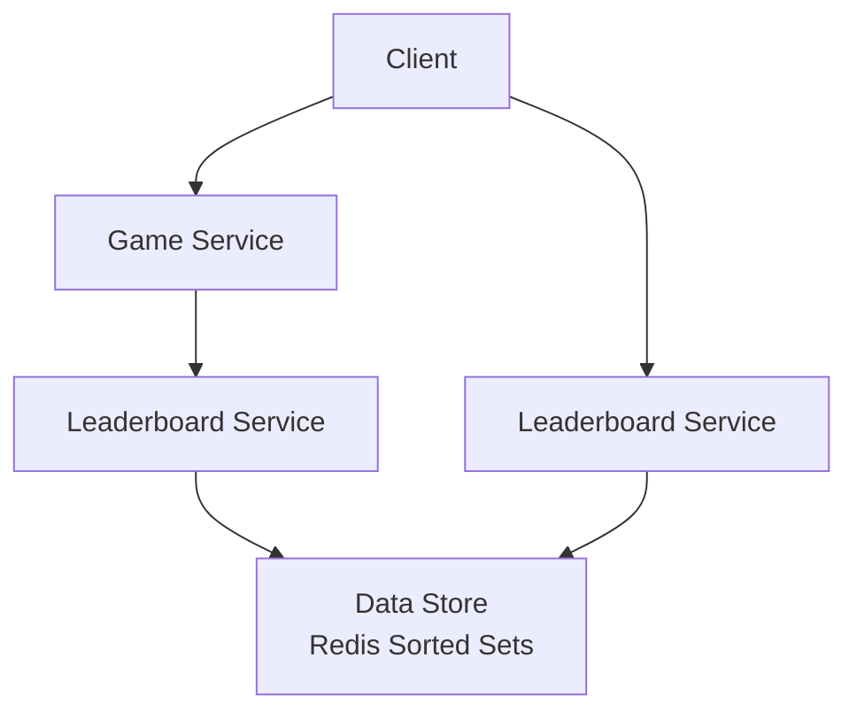

+++
title= "Real-time Gaming Leaderboard"
tags = [ "system-design", "software-architecture", "interview", "real-time-gaming-leaderboard" ]
author = "Me"
showToc = true
TocOpen = false
draft = false
hidemeta = false
comments = false
disableShare = false
disableHLJS = false
hideSummary = false
searchHidden = true
ShowReadingTime = true
ShowBreadCrumbs = true
ShowPostNavLinks = true
ShowWordCount = true
ShowRssButtonInSectionTermList = true
UseHugoToc = true
weight= 24
bookFlatSection= true
+++

# Real-Time Gaming Leaderboard

## Problem Statement
Design a leaderboard system for an online mobile game where players score points by winning matches. The system must display real-time rankings, focusing on top 10 players and individual user ranks, with support for tournaments resetting monthly.

## Requirements

### Functional Requirements
- Display top 10 players on the leaderboard
- Show a specific user's rank and score
- Display users four places above and below a given user (bonus)

### Non-Functional Requirements
- Real-time score updates reflected on the leaderboard
- Scalability to handle 5 million daily active users (DAU) and 25 million monthly active users (MAU)
- High availability and reliability
- Low latency for reads and writes

## Key Constraints & Assumptions
- **Scale Assumptions**: 5 million DAU, 25 million MAU; each player averages 10 games/day, leading to 500 QPS for score updates and ~50 QPS for leaderboard fetches (at peak ~2,500 QPS updates). Worst-case storage: ~650MB for 25 million users if all participate in a monthly tournament.
- **Constraints**: Leaderboards reset monthly; ranks tie when scores equal (assume same rank); real-time (<1s latency) updates required.
- **Assumptions**: Game servers handle win validation; no external data ingestion required; use standard web APIs.

## High-Level Design
The system involves a game service for match logic, a leaderboard service for ranking operations, and an in-memory data store for fast sorted access. Clients interact via APIs for score updates (from game service) and leaderboard fetches.

Client -> Game Service (updates scores) -> Leaderboard Service -> Data Store  
Client -> Leaderboard Service (fetches rankings)

## Data Model
- **Storage Choice**: Redis sorted sets for leaderboard data due to O(log N) operations for inserts/updates and range queries.
- **Schema Sketch**:
  - Sorted Set Key: `leaderboard_<month_year>` (e.g., `leaderboard_feb_2024`)
  - Members: user_id (string)
  - Scores: integer score
- **Supporting Tables**: MySQL for user details (username, etc.) and game history for reconstruction/recovery.

## API Design
- `POST /v1/scores`: Update user score (params: user_id, points). Accessible only by game servers.
- `GET /v1/scores`: Retrieve top 10 players. Response: List of {user_id, username, rank, score}.
- `GET /v1/scores/{user_id}`: Retrieve specific user's rank/score/nearby players. Response: {user_info, nearby_users}.

## Detailed Design
- **Game Service**: Validates wins and calls Leaderboard Service to update scores.
- **Leaderboard Service**: Interfaces with Redis using sorted set operations (ZINCRBY for updates, ZREVRANGE for top K, ZREVRANK for user rank). Supports range queries for nearby users.
- **Data Store (Redis)**: In-memory, persistent sorted sets enable real-time rankings. Replica for data safety.

## Scalability & Bottlenecks
- Current scale fits single Redis instance (~650MB storage, 2,500 QPS).
- **Scaling Strategies**:
  - **Horizontal Sharding**: Range partitioning by score or fixed hash partitioning for distribution across nodes.
  - **Load Balancing**: Application-managed mapping for user-to-shard queries.
- **Bottlenecks**: Hot partitions in NoSQL; top-K queries across shards require merge. Allocate 2x memory for Redis snapshots.

## Trade-offs & Alternatives
- **Redis vs. RDBMS**: Redis provides O(log N) for rankings vs. O(N) scans in SQL (e.g., no efficient rank queries without complex queries).
- **Redis vs. NoSQL (DynamoDB)**: Redis excels in real-time range queries; DynamoDB requires scatter-gather for ranks, better for heavy writes but harder for precise user rankings.
- **Serverless (AWS Lambda/API Gateway) vs. Self-Managed**: Serverless auto-scales, reduces ops overhead; self-managed offers more control.
- Alternative not chosen: Direct client updates (insecure, prone to cheating).

## Future Improvements
- Cache user details in Redis hash for faster top-10 fetches.
- Implement tie-breaking (e.g., by recent game timestamp).
- Enable percentiles for massive scale if exact ranks become costly.
- Add system recovery via MySQL game logs for leaderboard rebuilds.

## Interview Talking Points
1. Real-time ranking via Redis sorted sets for O(log N) operations.
2. Sharding challenge: Top-K aggregation across nodes increases latency.
3. Trade-off: Redis in-memory for speed vs. NoSQL durability for writes.
4. Security: Server-side score updates prevent cheating.
5. Scale bottlenecks: From single instance to partitioned for 10x growth.
6. Recovery strategy: Rebuild from game history logs.
7. API design focuses on minimal, secure endpoints.
8. Monthly resets balance performance and retention.
