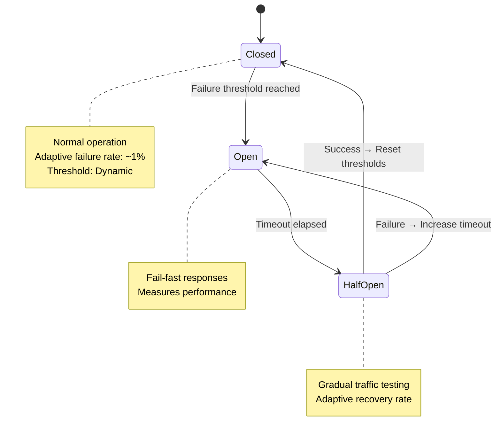

---
title: "Circuit Breaker Patterns with Adaptive Thresholds"
description: "System design example for Circuit Breaker Patterns with Adaptive Thresholds"
---

# Circuit Breaker Patterns with Adaptive Thresholds

## Overview

### What it is and why it's important
A circuit breaker with adaptive thresholds is an advanced resilience pattern that protects downstream services from cascading failures by dynamically adjusting failure thresholds based on system conditions, historical performance, and adaptive algorithms. Unlike traditional circuit breakers with fixed thresholds, adaptive versions continuously learn from traffic patterns, response times, and failure rates to optimize failure detection and recovery.

### Real-world context and where it's used
Circuit breakers with adaptive thresholds are critical in microservices architectures, API gateways, and distributed systems where service reliability varies under different load conditions. They are commonly implemented in:
- E-commerce platforms during flash sales (Netflix)
- Financial transaction systems with variable latency (Stripe, PayPal)
- Cloud auto-scaling environments where service capacity fluctuates
- IoT platforms with unreliable network conditions

### Concept diagram



## Core Principles & Components

### Detailed explanation of all subcomponents, their roles, and interactions

**1. Adaptive Threshold Calculator**
- Dynamically adjusts failure tolerance based on historical data
- Uses exponential moving averages or machine learning models
- Updates thresholds based on:
  - Recent success/failure rates
  - Response time trends
  - System load metrics
  - Seasonal traffic patterns

**2. State Machine Engine**
- Manages state transitions (Closed → Open → Half-Open → Closed)
- Incorporates hysteresis to prevent oscillation
- Uses time-based and count-based triggers

**3. Historical Metrics Collector**
- Tracks request success/failure rates
- Maintains sliding windows of performance data
- Calculates statistical measures (mean, variance, percentiles)

**4. Configuration Manager**
- Allows runtime threshold adjustments
- Supports A/B testing of different algorithms
- Integrates with service mesh control planes

**5. Recovery Strategy Selector**
- Chooses between linear, exponential, or custom backoff
- Adapts recovery speed based on service criticality
- Considers circuit breaker hierarchy in service dependency graphs

### State transitions or flow (if applicable)

The adaptive circuit breaker follows an enhanced state machine:

```
Trigger Event → State Evaluation → Threshold Update → State Transition → Action
```

1. **Closed State**: Normal operation with adaptive thresholds
2. **Open State**: Fail-fast with predictive timeout calculation
3. **Half-Open State**: Testing with graduated traffic percentages

## Detailed Implementation Design

### A. Algorithm / Process Flow

The adaptive circuit breaker uses a multi-step process for each request:

1. **Pre-Request Evaluation**
   - Check if circuit is closed or half-open
   - Evaluate adaptive thresholds against current metrics
   - Apply rate limiting if in half-open state

2. **Request Execution**
   - Forward request to downstream service
   - Start timeout timer (dynamically calculated)

3. **Response Processing**
   - Success: Update positive metrics, potentially lower thresholds
   - Failure: Increment counters, check adaptive thresholds
   - Timeout: Classify as failure, increase adaptive timeout

4. **Post-Processing**
   - Update historical metrics with exponential decay
   - Trigger state evaluation if thresholds crossed
   - Log for monitoring and debugging

**Pseudocode:**

```
function executeWithCircuitBreaker(request):
    if !shouldExecuteRequest():
        return FailFastResponse

    startTime = currentTime()
    try:
        response = downstreamService.call(request)
        endTime = currentTime()
        successDuration = endTime - startTime

        updateMetrics(successDuration, SUCCESS)
        updateAdaptiveThresholds()

        return response
    catch (Exception e):
        endTime = currentTime()
        failureDuration = endTime - startTime

        updateMetrics(failureDuration, FAILURE)
        checkThresholdAndTransition()

        throw CircuitBreakerException
```

### B. Data Structures & Configuration Parameters

**Core Data Structures:**

```java
class AdaptiveCircuitBreaker {
    private AtomicReference<CircuitState> state = new AtomicReference<>(CLOSED);
    private SlidingWindowMetrics metrics = new SlidingWindowMetrics(1000); // 1000 samples
    private AdaptiveThresholds thresholds = new AdaptiveThresholds();
    private BackoffStrategy backoffStrategy = new ExponentialBackoff();
}

class SlidingWindowMetrics {
    private final Queue<MetricSnapshot> window;
    private final int maxSize;
    private volatile double avgResponseTime;
    private volatile double failureRate;
}

class AdaptiveThresholds {
    private volatile double failureThreshold; // 0.05 (5%)
    private volatile long timeoutMs; // 1000ms
    private volatile double recoveryRate; // 0.1 (10% traffic in half-open)
}
```

**Tunable Parameters:**

- `initialFailureThreshold`: Starting failure rate (0.05)
- `maxFailureThreshold`: Maximum adaptive threshold (0.30)
- `minTimeoutMs`: Minimum timeout window (100ms)
- `maxTimeoutMs`: Maximum timeout window (30000ms)
- `adaptiveWindowSize`: Samples for adaptation (1000)
- `backoffMultiplier`: Exponential backoff factor (2.0)
- `recoveryPercentage`: Traffic in half-open state (0.1)

### C. Java Implementation Example

```java
import java.util.concurrent.atomic.*;
import java.time.Instant;
import java.util.Queue;
import java.util.concurrent.ConcurrentLinkedQueue;

public class AdaptiveCircuitBreaker {
    private static final int CLOSED = 0;
    private static final int OPEN = 1;
    private static final int HALF_OPEN = 2;

    private final AtomicInteger state = new AtomicInteger(CLOSED);
    private final SlidingWindowMetrics metrics;
    private final AdaptiveThresholds thresholds;
    private volatile Instant lastFailureTime;
    private final Object lock = new Object();

    // Configuration parameters
    private final double initialFailureThreshold;
    private final long initialTimeoutMs;
    private final int windowSize;
    private final double backoffMultiplier;

    public AdaptiveCircuitBreaker(double initialFailureThreshold,
                                 long initialTimeoutMs,
                                 int windowSize,
                                 double backoffMultiplier) {
        this.initialFailureThreshold = initialFailureThreshold;
        this.initialTimeoutMs = initialTimeoutMs;
        this.windowSize = windowSize;
        this.backoffMultiplier = backoffMultiplier;
        this.metrics = new SlidingWindowMetrics(windowSize);
        this.thresholds = new AdaptiveThresholds(initialFailureThreshold, initialTimeoutMs);
    }

    public <T> T execute(Supplier<T> operation) throws CircuitBreakerException {
        if (!canExecute()) {
            throw new CircuitBreakerException("Circuit breaker is OPEN");
        }

        try {
            T result = operation.get();
            recordSuccess();
            return result;
        } catch (Exception e) {
            recordFailure();
            throw new CircuitBreakerException("Operation failed", e);
        }
    }

    private boolean canExecute() {
        int currentState = state.get();

        if (currentState == CLOSED) {
            return true;
        }

        if (currentState == OPEN) {
            // Check if timeout has elapsed
            if (lastFailureTime != null &&
                Instant.now().isAfter(lastFailureTime.plusMillis(thresholds.getTimeoutMs()))) {
                return attemptHalfOpenTransition();
            }
            return false;
        }

        // HALF_OPEN: allow limited traffic
        return thresholds.allowHalfOpenExecution();
    }

    private boolean attemptHalfOpenTransition() {
        // Atomic state transition with CAS
        return state.compareAndSet(OPEN, HALF_OPEN);
    }

    private void recordSuccess() {
        metrics.recordSuccess();
        adaptThresholds(true);

        // Transition from HALF_OPEN to CLOSED on success
        if (state.compareAndSet(HALF_OPEN, CLOSED)) {
            thresholds.resetToInitial();
        }
    }

    private void recordFailure() {
        lastFailureTime = Instant.now();
        metrics.recordFailure();
        adaptThresholds(false);

        // Transition states based on failure patterns
        if (state.get() == CLOSED && metrics.getFailureRate() > thresholds.getFailureThreshold()) {
            state.set(OPEN);
        } else if (state.get() == HALF_OPEN) {
            state.set(OPEN);
        }
    }

    private void adaptThresholds(boolean success) {
        double currentFailureRate = metrics.getFailureRate();

        if (success) {
            // Gradually lower threshold if system is stable
            double newThreshold = Math.max(initialFailureThreshold,
                                          thresholds.getFailureThreshold() * 0.95);
            thresholds.setFailureThreshold(newThreshold);
        } else {
            // Increase threshold and timeout on failures
            double newThreshold = Math.min(0.3, // max 30%
                                          thresholds.getFailureThreshold() * 1.1);
            thresholds.setFailureThreshold(newThreshold);

            long newTimeout = (long)(thresholds.getTimeoutMs() * backoffMultiplier);
            thresholds.setTimeoutMs(Math.min(newTimeout, 30000L)); // max 30s
        }
    }

    // Metric collection with sliding window
    static class SlidingWindowMetrics {
        private final Queue<MetricSnapshot> window;
        private final int maxSize;
        private int successCount = 0;
        private int failureCount = 0;
        private volatile double avgResponseTime;

        public SlidingWindowMetrics(int maxSize) {
            this.maxSize = maxSize;
            this.window = new ConcurrentLinkedQueue<>();
        }

        public void recordSuccess() {
            record(true);
        }

        public void recordFailure() {
            record(false);
        }

        private synchronized void record(boolean success) {
            if (window.size() >= maxSize) {
                MetricSnapshot removed = window.poll();
                if (removed != null) {
                    if (removed.success) successCount--;
                    else failureCount--;
                }
            }

            window.add(new MetricSnapshot(success, Instant.now()));
            if (success) successCount++;
            else failureCount++;
        }

        public double getFailureRate() {
            int total = successCount + failureCount;
            return total == 0 ? 0.0 : (double) failureCount / total;
        }
    }

    static class MetricSnapshot {
        final boolean success;
        final Instant timestamp;

        MetricSnapshot(boolean success, Instant timestamp) {
            this.success = success;
            this.timestamp = timestamp;
        }
    }

    // Configuration class with atomic updates
    static class AdaptiveThresholds {
        private volatile double failureThreshold;
        private volatile long timeoutMs;
        private volatile AtomicInteger halfOpenCounter = new AtomicInteger(0);
        private final int halfOpenLimit = 10; // Allow 10 requests in half-open

        AdaptiveThresholds(double initialThreshold, long initialTimeout) {
            this.failureThreshold = initialThreshold;
            this.timeoutMs = initialTimeout;
        }

        public double getFailureThreshold() { return failureThreshold; }
        public long getTimeoutMs() { return timeoutMs; }

        public void setFailureThreshold(double threshold) { this.failureThreshold = threshold; }
        public void setTimeoutMs(long timeout) { this.timeoutMs = timeout; }

        public void resetToInitial() {
            failureThreshold = 0.05;
            timeoutMs = 1000;
            halfOpenCounter.set(0);
        }

        public boolean allowHalfOpenExecution() {
            return halfOpenCounter.incrementAndGet() <= halfOpenLimit;
        }
    }

    public static class CircuitBreakerException extends Exception {
        public CircuitBreakerException(String message) {
            super(message);
        }

        public CircuitBreakerException(String message, Throwable cause) {
            super(message, cause);
        }
    }
}
```

### D. Complexity & Performance

**Time Complexity:**
- Request execution: O(1) for state checks and basic operations
- Metric recording: O(1) amortized for queue operations
- Threshold adaptation: O(1) for exponential moving averages

**Space Complexity:**
- O(windowSize) for sliding window metrics
- O(1) additional space per circuit breaker instance
- Total memory: ~2-10KB per circuit breaker depending on configuration

**Expected vs Worst-Case Performance:**
- **Normal operation**: <1μs overhead per request
- **State transition**: ~10-50μs during threshold adaptation
- **Worst case with large window**: O(windowSize) for metric updates during full window replacement

**Real-world scale estimation:**
- Supports 10,000+ requests/second per circuit breaker
- Metrics accuracy within 1-2% with 1000 sample windows
- Memory usage scales linearly with concurrent circuit breakers

### E. Thread Safety & Concurrency

**Thread-Safe Design:**
- `AtomicInteger` for state management with CAS operations
- `ConcurrentLinkedQueue` for lock-free metric collection
- `volatile` fields for visibility across threads
- Synchronized blocks only for critical metric updates

**Multi-threaded Scenarios:**
- **Concurrent requests**: Each thread independently checks state via atomic reads
- **State transitions**: CAS ensures only one thread triggers OPEN→HALF_OPEN
- **Metric updates**: Lock-free queue additions with periodic synchronization

**Locking vs Lock-Free Strategies:**
- Uses lock-free where possible (queue operations, atomic counters)
- Minimal synchronized blocks for complex calculations
- Atomic operations prevent torn reads/writes during state changes

**Memory Barriers and Atomic Operations:**
- `volatile` ensures memory visibility for threshold updates
- CAS operations provide atomic state transitions
- No explicit memory barriers needed due to JVM guarantees for volatile

### F. Memory & Resource Management

**Heap/Stack Implications:**
- Minimal heap usage: fixed-size concurrent collections
- No unbounded growth: bounded sliding windows
- Garbage collection: periodic cleanup of expired metrics

**Resource Management:**
- Bounded memory footprint regardless of request volume
- Automatic cleanup of old metrics via sliding window eviction
- No external dependencies or connection pools required

### G. Advanced Optimizations

**Implementation Variants:**
- **Predictive Circuit Breaker**: Uses statistical models to predict failures
- **Distributed Circuit Breaker**: Coordinates across service instances via consensus
- **Hierarchical Circuit Breakers**: Nested protection for multi-tier services

**Performance Optimizations:**
- Batch metric updates for high-throughput scenarios
- Approximate counting for very high volume (>1M/minute)
- CPU cache alignment for counter structures

## Edge Cases & Error Handling

**Common Boundary Conditions:**
- Zero-request periods: Maintain last known good thresholds
- 100% failure rate: Immediate open state transition
- System startup: Conservative initial thresholds
- Load balancer failover: Detect upstream changes

**Failure Recovery Logic:**
- Exponential backoff with jitter to prevent thundering herd
- Graduated recovery in half-open state (1% → 10% → 50% traffic)
- Success rate monitoring during recovery phase

**Resilience Strategies:**
- Fallback responses during open state
- Timeout handling with configurable percentiles
- Exception type filtering (5xx vs 4xx errors)

## Configuration Trade-offs

**Performance vs Accuracy Trade-offs:**
- Large windows: Accurate but higher memory and computation
- Small windows: Fast adaptation but more false positives
- Complex algorithms: Better prediction but higher CPU usage

**Simplicity vs Configurability:**
- Fixed thresholds: Simple, predictable behavior
- Adaptive thresholds: Complex but self-tuning operation
- ML-based adaptation: Maximum accuracy but requires training data

**Real-World Tuning Considerations:**
- High-stakes systems: Conservative thresholds, larger windows
- Development environments: Aggressive adaptation, smaller windows
- Seasonal services: Adaptive thresholds with trend analysis

## Use Cases & Real-World Examples

**Production Implementations:**
- **Netflix Hystrix**: Pioneered adaptive circuit breakers with dynamic concurrency limits
- **AWS SDK**: Automatic retry and circuit breaking for service clients
- **Kong API Gateway**: Built-in circuit breaker with adaptive thresholds
- **Spring Cloud Circuit Breaker**: Framework integration with custom strategies

**Integration Scenarios:**
- **Service Mesh**: Istio and Linkerd circuit breaker integration
- **API Gateways**: Kong, Apigee with adaptive rate limiting
- **Kubernetes**: HPA integration with circuit breaker metrics
- **Monitoring**: Prometheus integration for threshold alerting

## Advantages & Disadvantages

**Benefits:**
- **Self-tuning**: Adapts to changing conditions without manual intervention
- **Reduced false failures**: Prevents unnecessary opens during temporary spikes
- **Faster recovery**: Intelligent backoff prevents slow recovery cycles
- **Resource efficiency**: Balances protection with system utilization

**Known Trade-offs:**
- **Computational overhead**: Adaptive algorithms require CPU resources
- **Configuration complexity**: More parameters to tune than fixed thresholds
- **Predictability**: Dynamic behavior harder to test and reason about
- **Memory usage**: Metrics storage for historical analysis

**When not to use it (Anti-patterns):**
- Simple systems with predictable workloads
- Real-time systems requiring microsecond latency
- Environments with extremely limited resources
- When manual tuning provides better control

## Alternatives & Comparisons

**Alternative Patterns:**
- **Retry with exponential backoff**: Simpler but doesn't prevent cascading failures
- **Bulkhead pattern**: Resource isolation but doesn't adapt to failure rates
- **Rate limiting**: Prevents overload but allows failing requests through
- **Timeout management**: Basic protection but lacks adaptive intelligence

**Comparisons:**
- **Fixed vs Adaptive**: Fixed provides predictability; adaptive offers better resilience
- **Client-side vs Service-side**: Client-side faster; service-side more comprehensive
- **Statistical vs ML-based**: Statistical simpler; ML potentially more accurate
- **Distributed vs Centralized**: Distributed more fault-tolerant; centralized easier to manage

## Interview Talking Points

1. **Design trade-offs**: Fixed thresholds offer predictability vs adaptive's resilience - explain when to choose each
2. **Scalability patterns**: Sliding window metrics scale poorly with high throughput - discuss approximate alternatives
3. **Failure detection accuracy**: Adaptive thresholds reduce false positives but increase complexity - discuss statistical implications
4. **State machine complexity**: Half-open state prevents oscillation - explain why and implementation considerations
5. **Thread safety challenges**: Compare lock-based vs lock-free implementations for concurrent access
6. **Memory management**: Bounded windows prevent memory leaks - discuss garbage collection implications
7. **Backoff strategies**: Exponential backoff prevents thundering herd - explain jitter and its necessity
8. **Production monitoring**: Circuit breaker metrics are critical for debugging - discuss observability requirements
9. **Integration challenges**: Circuit breakers work best with service mesh - explain architectural considerations
10. **Evolution patterns**: Start with fixed thresholds, evolve to adaptive - discuss migration strategies
