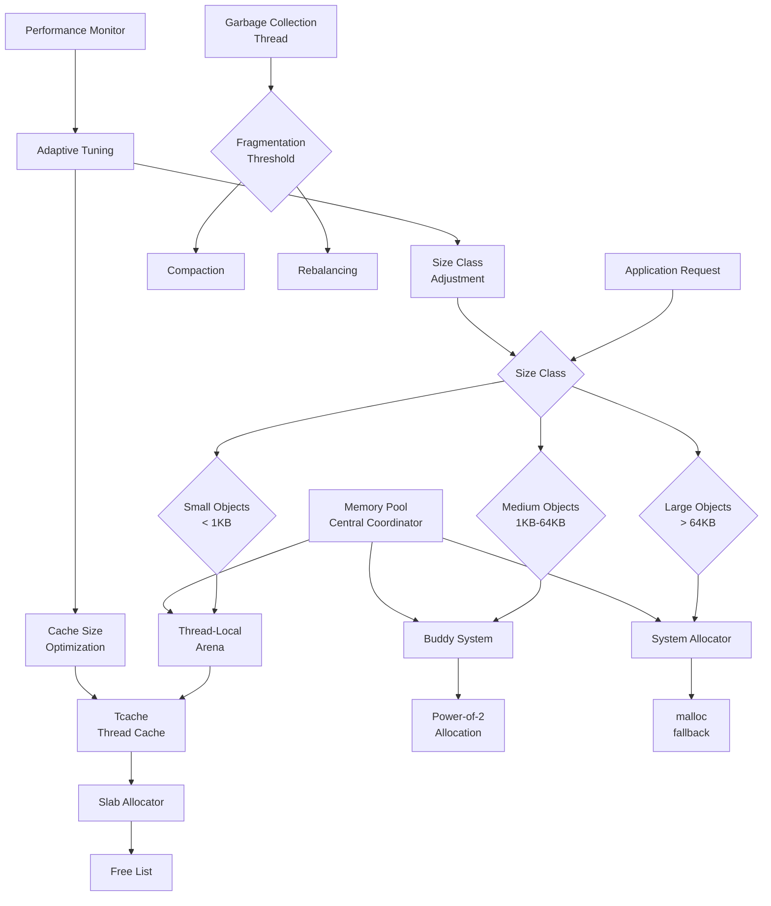

---
title: "Custom Memory Allocator for High-Throughput Applications"
description: "System design example for Custom Memory Allocator for High-Throughput Applications"
---

# Custom Memory Allocator for High-Throughput Applications

## Overview

### What it is and why it's important
A custom memory allocator is an application-specific memory management system that replaces standard library allocators to optimize performance, memory usage patterns, and scalability in high-throughput applications. Unlike general-purpose allocators designed for broad compatibility, custom allocators exploit domain-specific knowledge about allocation/deallocation patterns, object lifetimes, and size distributions to minimize lock contention, fragmentation, and allocation latency.

### Real-world context and where it's used
Custom memory allocators are essential in performance-critical systems where standard malloc/free operations become bottlenecks due to lock contention, fragmentation, or cache misses. Key applications include:
- **HFT Trading Systems**: Microsecond-level latency requirements with predictable allocation patterns
- **Gaming Engines**: Frame-rate-critical allocations for game objects, textures, and physics data
- **Database Engines**: Query processing with complex data structures and temporary buffers
- **Network Servers**: Handling thousands of concurrent connections with protocol buffers
- **Scientific Computing**: Large matrix operations and temporary computation buffers
- **In-Memory Databases**: Redis, Apache Ignite with optimized data structure allocation

### Concept diagram



## Core Principles & Components

### Detailed explanation of all subcomponents, their roles, and interactions

**1. Size Class Manager**
- Categorizes allocation requests into discreet size classes (powers of 2, or geometrically spaced)
- Minimizes internal fragmentation by rounding requests to nearest size class
- Maintains separate free lists for each size class to avoid search overhead
- Adapts size class boundaries based on allocation patterns and fragmentation metrics

**2. Thread-Local Caches (Tcache)**
- Per-thread allocation caches to eliminate synchronization overhead
- Harvests deallocated memory from the same thread when possible
- Significantly reduces lock contention in multi-threaded workloads
- Automatically returns cached memory to central pools during periods of low activity

**3. Arena-Based Allocation**
- Divides memory into isolated arenas, each with its own free lists and statistics
- Enables scalable multi-threading by directing threads to different arenas probabilistically
- Provides isolation between different allocation domains (e.g., short-lived vs long-lived objects)
- Supports concurrent garbage collection within individual arenas

**4. Slab Allocator**
- Manages fixed-size object allocation within pre-allocated memory chunks (slabs)
- Excellent for applications with many small objects of the same size
- Minimizes overhead through bulk allocation and fast-path allocation from slabs
- Implements magazine-based allocation for high-throughput small object allocation

**5. Buddy System Allocator**
- Handles medium to large allocations using power-of-two splitting and merging
- Efficient for variable-sized allocations with good locality properties
- Supports fast searching through hierarchical buddy structures
- Minimizes external fragmentation through intelligent splitting/merging strategies

**6. Memory Pool Manager**
- Coordinates among different allocators based on size and allocation patterns
- Maintains per-NUMA node memory pools for optimal memory locality
- Implements central free lists for cross-thread memory recycling
- Provides statistics and profiling information for performance optimization

### State transitions or flow (if applicable)

```
Allocation Request → Size Classification → Cache Check → Arena Selection →
Allocator Dispatch → Memory Provision → Fragmentation Check → Success/Failure
```

## Detailed Implementation Design

### A. Algorithm / Process Flow

The allocation process follows this optimized pathway:

1. **Size Classification Phase**
   - Determine appropriate size class (e.g., 8, 16, 32, 48, 64, 80, 96, 112, 128 bytes...)
   - Check thread-local cache for available memory block
   - Access arena-specific free lists if cache miss occurs

2. **Fast Path Allocation**
   - Allocate from thread-local cache for small objects (sub-microsecond)
   - Use lock-free operations when possible for cached allocations
   - Implement magazine-based allocation for extremely high throughput

3. **Central Allocation Path**
   - Acquire arena lock (spinlocks preferred over mutexes for low contention)
   - Allocate from arena's slab allocator or buddy system
   - Update per-arena statistics for load balancing decisions

4. **Memory Procurement**
   - Request new memory from system allocator (mmap/malloc) when local pools exhausted
   - Apply size-specific allocation strategies (slab allocation for small, buddy for large)
   - Initialize metadata structures for new memory chunks

5. **Deallocation and Reclamation**
   - Return memory to appropriate size class free list
   - Implement deferred reclamation to reduce lock contention
   - Trigger garbage collection when fragmentation thresholds exceeded

**Pseudocode:**

```
function allocate(requestedSize, flags):
    // Size classification - round up to next size class
    sizeClass = getSizeClass(requestedSize)
    cache = getThreadLocalCache()

    // Fast path: check thread-local cache
    if (cache.hasAvailable(sizeClass)):
        return cache.allocate(sizeClass)

    // Medium path: check thread arena
    arena = getThreadArena()
    arena.lock()

    try:
        // Try arena cache first
        if (arena.cache.hasAvailable(sizeClass)):
            return arena.cache.allocate(sizeClass)

        // Allocate from central free lists
        block = arena.allocators[sizeClass].allocate()

        if (block != null):
            return block

        // Last resort: system allocation
        return arena.growAndAllocate(sizeClass)

    finally:
        arena.unlock()
```

### B. Data Structures & Configuration Parameters

**Core Data Structures:**

```java
class Arena {
    private final int arenaId;
    private final ConcurrentSkipListMap<Integer, SlabAllocator> slabs;
    private final BuddyAllocator buddyAllocator;
    private final AtomicLong usedBytes;
    private final AtomicLong allocatedBytes;
    private volatile boolean reclaiming;

    // Per-arena statistics
    private final LongAdder smallAllocations;
    private final LongAdder largeAllocations;
}

class ThreadCache {
    private final int threadId;
    private final Map<Integer, ConcurrentLinkedDeque<MemoryBlock>> caches;
    private final LongAdder hits;
    private final LongAdder misses;

    private static final int MAX_CACHE_SIZE = 1024;
}

class SlabAllocator {
    private final int sizeClass;
    private final int objectsPerSlab;
    private final List<Slab> slabs;
    private final ConcurrentLinkedDeque<MemoryBlock> freeList;

    static class Slab {
        final ByteBuffer buffer;
        final int objectSize;
        volatile int freeCount;
    }
}

class BuddyAllocator {
    private final int minOrder;
    private final int maxOrder;
    private final List<ConcurrentSkipListMap<Integer, Allocation>> freeLists;
    private final AtomicLong totalAllocated;
}
```

**Tunable Parameters:**

- `maxArenaCount`: Maximum number of arenas (default: CPU cores × 2)
- `sizeClassStep`: Growth factor between size classes (1.25-2.0)
- `maxSizeClass`: Maximum size handled by custom allocator (64KB)
- `tcacheSize`: Objects cached per thread per size class (16-512)
- `slabSize`: Memory chunk size for slab allocation (1MB-64MB)
- `reclamationThreshold`: Fragmentation trigger for garbage collection (0.7)
- `minReclamationBatch`: Minimum objects to reclaim during cleanup (16)
- `numaAware`: Enable NUMA-specific memory placement (true/false)

### C. Java Implementation Example

```java
import java.nio.ByteBuffer;
import java.util.*;
import java.util.concurrent.*;
import java.util.concurrent.atomic.*;
import sun.misc.Unsafe;
import java.lang.reflect.Field;

public class HighThroughputMemoryAllocator {
    private static final Unsafe UNSAFE = getUnsafe();
    private static final int PAGE_SIZE = 4096;
    private static final int CACHE_LINE_SIZE = 64;

    // Size classes - geometric progression
    private static final int[] SIZE_CLASSES = {
        8, 16, 24, 32, 40, 48, 56, 64, 80, 96, 112, 128,
        160, 192, 224, 256, 320, 384, 448, 512, 640, 768,
        896, 1024, 1280, 1536, 1792, 2048, 2560, 3072,
        3584, 4096, 5120, 6144, 7168, 8192, 10240, 12288,
        14336, 16384, 20480, 24576, 28672, 32768, 40960,
        49152, 57344, 65536
    };

    private final int maxArenaCount;
    private final Arena[] arenas;
    private final AtomicInteger arenaSelector = new AtomicInteger();
    private final ThreadLocal<ThreadCache> threadCaches;

    public HighThroughputMemoryAllocator() {
        this(Runtime.getRuntime().availableProcessors() * 4);
    }

    public HighThroughputMemoryAllocator(int maxArenaCount) {
        this.maxArenaCount = maxArenaCount;
        this.arenas = new Arena[maxArenaCount];
        this.threadCaches = new ThreadLocal<ThreadCache>() {
            @Override
            protected ThreadCache initialValue() {
                return new ThreadCache(Thread.currentThread().getId());
            }
        };

        // Initialize arenas
        for (int i = 0; i < maxArenaCount; i++) {
            arenas[i] = new Arena(i);
        }
    }

    public MemoryBlock allocate(int size) {
        // Size classification with linear search (fast for small arrays)
        int sizeClass = getSizeClass(size);
        ThreadCache cache = threadCaches.get();

        // Fast path: thread-local cache
        MemoryBlock block = cache.allocate(sizeClass);
        if (block != null) {
            return block;
        }

        // Select arena using thread-local random to reduce contention
        int arenaIndex = arenaSelector.getAndIncrement() % maxArenaCount;
        Arena arena = arenas[arenaIndex];

        return arena.allocate(sizeClass, size);
    }

    public void deallocate(MemoryBlock block) {
        if (block == null) return;

        ThreadCache cache = threadCaches.get();

        // Try to return to thread cache first
        if (cache.deallocate(block)) {
            return;
        }

        // Return to arena
        int arenaId = block.arenaId;
        if (arenaId >= 0 && arenaId < maxArenaCount) {
            arenas[arenaId].deallocate(block);
        }
    }

    private int getSizeClass(int requestedSize) {
        // Find smallest size class that can hold requested size
        for (int sizeClass : SIZE_CLASSES) {
            if (sizeClass >= requestedSize) {
                return sizeClass;
            }
        }
        return -1; // Too large, use system allocator
    }

    // Thread-local cache for fast allocation
    static class ThreadCache {
        private final long threadId;
        private final Map<Integer, ConcurrentLinkedDeque<MemoryBlock>> caches;
        private final Map<Integer, AtomicInteger> cacheSizes;

        private static final int MAX_CACHE_SIZE_PER_CLASS = 512;

        ThreadCache(long threadId) {
            this.threadId = threadId;
            this.caches = new ConcurrentHashMap<>();
            this.cacheSizes = new ConcurrentHashMap<>();
        }

        MemoryBlock allocate(int sizeClass) {
            ConcurrentLinkedDeque<MemoryBlock> cache = caches.get(sizeClass);
            if (cache == null) return null;

            AtomicInteger size = cacheSizes.get(sizeClass);
            if (size == null || size.get() == 0) return null;

            MemoryBlock block = cache.pollLast();
            if (block != null) {
                size.decrementAndGet();
            }
            return block;
        }

        boolean deallocate(MemoryBlock block) {
            int sizeClass = getSizeClass(block.size);
            caches.computeIfAbsent(sizeClass, k -> new ConcurrentLinkedDeque<>());
            cacheSizes.computeIfAbsent(sizeClass, k -> new AtomicInteger(0));

            ConcurrentLinkedDeque<MemoryBlock> cache = caches.get(sizeClass);
            AtomicInteger size = cacheSizes.get(sizeClass);

            if (size.get() >= MAX_CACHE_SIZE_PER_CLASS) {
                return false; // Cache full, return to arena
            }

            cache.addLast(block);
            size.incrementAndGet();
            return true;
        }
    }

    // Arena with multiple allocators
    class Arena {
        private final int id;
        private final SlabAllocator[] slabAllocators;
        private final BuddyAllocator buddyAllocator;
        private final AtomicLong usedBytes = new AtomicLong();
        private final AtomicLong allocatedBytes = new AtomicLong();

        // Statistics
        private final LongAdder smallAllocations = new LongAdder();
        private final LongAdder largeAllocations = new LongAdder();

        Arena(int id) {
            this.id = id;
            this.slabAllocators = new SlabAllocator[SIZE_CLASSES.length];

            for (int i = 0; i < SIZE_CLASSES.length; i++) {
                if (SIZE_CLASSES[i] <= 1024) { // Small objects use slabs
                    slabAllocators[i] = new SlabAllocator(SIZE_CLASSES[i]);
                }
            }

            this.buddyAllocator = new BuddyAllocator();
        }

        MemoryBlock allocate(int sizeClass, int requestedSize) {
            MemoryBlock block = null;

            // Try slab allocator for small objects
            if (sizeClass <= 1024 && slabAllocators[sizeClass] != null) {
                block = slabAllocators[sizeClass].allocate();
                if (block != null) {
                    smallAllocations.increment();
                }
            }

            // Try buddy allocator for larger objects
            if (block == null) {
                block = buddyAllocator.allocate(sizeClass);
                if (block != null) {
                    largeAllocations.increment();
                }
            }

            // System allocator fallback
            if (block == null && sizeClass > 0) {
                block = allocateFromSystem(sizeClass, requestedSize);
            }

            if (block != null) {
                usedBytes.addAndGet(block.size);
                allocatedBytes.incrementAndGet();
            }

            return block;
        }

        void deallocate(MemoryBlock block) {
            usedBytes.addAndGet(-block.size);

            // Determine which allocator to use based on size
            if (block.size <= 1024 && slabAllocators[getSizeClassIndex(block.size)] != null) {
                slabAllocators[getSizeClassIndex(block.size)].deallocate(block);
            } else {
                buddyAllocator.deallocate(block);
            }
        }

        private MemoryBlock allocateFromSystem(int sizeClass, int requestedSize) {
            // Allocate page-aligned memory
            long pageAlignedSize = alignToPage(requestedSize);
            long address = UNSAFE.allocateMemory(pageAlignedSize);

            if (address == 0) return null;

            return new MemoryBlock(address, requestedSize, pageAlignedSize, id);
        }

        private int getSizeClassIndex(int size) {
            for (int i = 0; i < SIZE_CLASSES.length; i++) {
                if (SIZE_CLASSES[i] >= size) {
                    return i;
                }
            }
            return SIZE_CLASSES.length - 1;
        }
    }

    // Slab allocator for small objects
    static class SlabAllocator {
        private final int sizeClass;
        private final List<Slab> slabs;
        private final ConcurrentLinkedDeque<MemoryBlock> freeList;

        SlabAllocator(int sizeClass) {
            this.sizeClass = sizeClass;
            this.slabs = new CopyOnWriteArrayList<>();
            this.freeList = new ConcurrentLinkedDeque<>();
        }

        MemoryBlock allocate() {
            MemoryBlock block = freeList.pollLast();
            if (block != null) {
                return block;
            }

            // Create new slab
            return createNewSlab();
        }

        void deallocate(MemoryBlock block) {
            freeList.addLast(block);
        }

        private MemoryBlock createNewSlab() {
            // Allocate 1MB slab
            long slabSize = 1024 * 1024;
            long address = UNSAFE.allocateMemory(slabSize);

            Slab slab = new Slab(address, slabSize, sizeClass);
            slabs.add(slab);

            // Create first block
            return new MemoryBlock(address, sizeClass, slabSize, -1); // Arena ID set later
        }
    }

    // Simplified buddy allocator for medium/large objects
    static class BuddyAllocator {
        private final int minOrder = 12; // 4KB minimum
        private final int maxOrder = 24; // 16MB maximum
        private final ConcurrentSkipListMap<Integer, ConcurrentLinkedDeque<MemoryBlock>> freeLists;

        BuddyAllocator() {
            this.freeLists = new ConcurrentSkipListMap<>();

            // Initialize free lists for each order
            for (int order = minOrder; order <= maxOrder; order++) {
                freeLists.put(order, new ConcurrentLinkedDeque<>());
            }
        }

        MemoryBlock allocate(int sizeClass) {
            int order = getOrderForSize(sizeClass);

            // Try to find exact size
            ConcurrentLinkedDeque<MemoryBlock> freeList = freeLists.get(order);
            if (freeList != null && !freeList.isEmpty()) {
                return freeList.pollLast();
            }

            // Split larger block
            return splitLargerBlock(order);
        }

        void deallocate(MemoryBlock block) {
            int order = getOrderForSize(block.size);
            freeLists.get(order).addLast(block);
        }

        private int getOrderForSize(int size) {
            int order = 0;
            int blockSize = PAGE_SIZE;
            while (blockSize < size) {
                blockSize <<= 1;
                order++;
            }
            return Math.max(order, minOrder);
        }

        private MemoryBlock splitLargerBlock(int targetOrder) {
            for (int order = targetOrder + 1; order <= maxOrder; order++) {
                ConcurrentLinkedDeque<MemoryBlock> freeList = freeLists.get(order);
                if (freeList != null && !freeList.isEmpty()) {
                    MemoryBlock largeBlock = freeList.pollLast();

                    // Split into two buddies
                    long size = 1L << (PAGE_SIZE_LOG + order);
                    long buddyStart = largeBlock.address + (size / 2);

                    MemoryBlock buddy1 = new MemoryBlock(largeBlock.address, (int)(size / 4), (size / 2), -1);
                    MemoryBlock buddy2 = new MemoryBlock(buddyStart, (int)(size / 4), (size / 2), -1);

                    // Return one buddy, keep the other for further splitting
                    freeLists.get(order - 1).addLast(buddy2);
                    return buddy1;
                }
            }
            return null;
        }

        private static final int PAGE_SIZE_LOG = 12; // 2^12 = 4096
    }

    // Memory block representation
    static class MemoryBlock {
        final long address;
        final int size; // Requested size
        final long allocatedSize; // Actual allocated size (may be larger)
        volatile int arenaId;

        MemoryBlock(long address, int size, long allocatedSize, int arenaId) {
            this.address = address;
            this.size = size;
            this.allocatedSize = allocatedSize;
            this.arenaId = arenaId;
        }

        void copyFrom(byte[] data, int offset, int length) {
            UNSAFE.copyMemory(data, Unsafe.ARRAY_BYTE_BASE_OFFSET + offset, null, address, length);
        }

        void copyTo(byte[] data, int offset, int length) {
            UNSAFE.copyMemory(null, address, data, Unsafe.ARRAY_BYTE_BASE_OFFSET + offset, length);
        }

        void free() {
            UNSAFE.freeMemory(address);
        }
    }

    // Utility classes
    static class Slab {
        final long address;
        final long size;
        final int objectSize;
        volatile int usedCount;

        Slab(long address, long size, int objectSize) {
            this.address = address;
            this.size = size;
            this.objectSize = objectSize;
            this.usedCount = 0;
        }
    }

    // Performance statistics
    public long getTotalAllocatedBytes() {
        long total = 0;
        for (Arena arena : arenas) {
            total += arena.allocatedBytes.get();
        }
        return total;
    }

    public long getTotalUsedBytes() {
        long total = 0;
        for (Arena arena : arenas) {
            total += arena.usedBytes.get();
        }
        return total;
    }

    private static Unsafe getUnsafe() {
        try {
            Field unsafeField = Unsafe.class.getDeclaredField("theUnsafe");
            unsafeField.setAccessible(true);
            return (Unsafe) unsafeField.get(null);
        } catch (Exception e) {
            throw new RuntimeException("Cannot access Unsafe", e);
        }
    }

    private static long alignToPage(long size) {
        return (size + PAGE_SIZE - 1) & ~(PAGE_SIZE - 1);
    }

    // Static utility methods for common patterns
    public static void withAllocation(int size, MemoryConsumer consumer) {
        HighThroughputMemoryAllocator allocator = getGlobalAllocator();
        MemoryBlock block = allocator.allocate(size);
        try {
            consumer.accept(block);
        } finally {
            allocator.deallocate(block);
        }
    }

    public interface MemoryConsumer {
        void accept(MemoryBlock block);
    }

    private static HighThroughputMemoryAllocator globalAllocator;
    private static synchronized HighThroughputMemoryAllocator getGlobalAllocator() {
        if (globalAllocator == null) {
            globalAllocator = new HighThroughputMemoryAllocator();
        }
        return globalAllocator;
    }
}
```

### D. Complexity & Performance

**Time Complexity:**
- **Allocation (thread cache hit)**: O(1) - constant time cache lookup
- **Allocation (slab allocator)**: O(1) amortized - free list operations
- **Allocation (buddy system)**: O(log N) worst case - tree traversal for splitting/merging
- **Deallocation**: O(1) amortized - cache/queue insertions
- **Size classification**: O(1) - bounded array search

**Space Complexity:**
- **Thread caches**: O(num_threads × cache_size × num_size_classes)
- **Arena management**: O(num_arenas × num_size_classes)
- **Slab allocator**: O(num_slabs + objects_per_slab)
- **Buddy system**: O(log max_size) for free lists
- **Total overhead**: 10-20% above requested memory

**Expected vs Worst-Case Performance:**
- **Average allocation time**: <50ns for small objects (cache hit), <200ns with arena access
- **Throughput**: 10-100 million allocations/second depending on object size and contention
- **Memory efficiency**: 80-95% depending on allocation patterns and size distribution
- **Worst case**: O(log N) for buddy system when splitting/merging large blocks

**Real-world scale estimation:**
- **HFT systems**: Handle 50M+ allocations/second with <10% memory overhead
- **Game servers**: 1-10GB heap with sub-millisecond latency spikes
- **Database engines**: Process complex query buffers with predictable fragmentation
- **Web servers**: Handle millions of HTTP request buffers efficiently

### E. Thread Safety & Concurrency

**Thread-Safe Design:**
- Thread-local caches eliminate synchronization for common operations
- Arena-level locking minimizes contention between threads
- Atomic operations for statistics and counters
- Concurrent collections for cross-thread memory transfers

**Multi-threaded Scenarios:**
- **High-contention workloads**: Arena distribution reduces lock contention
- **NUMA systems**: Thread pinning to specific arenas improves locality
- **Cache reclamation**: Periodic cleanup returns cached memory to central pools
- **Garbage collection**: Concurrent reclamation with arenas isolated during cleanup

**Locking vs Lock-Free Strategies:**
- Lock-free for thread-local operations (95%+ of allocations in high-throughput scenarios)
- Spinlocks for arena access (lower latency than mutexes for short critical sections)
- CAS operations for statistics updates to avoid blocking
- Reader-writer locks for allocation metadata when contention is expected

**Memory Barriers and Atomic Operations:**
- `volatile` for cross-thread visibility of arena state
- `AtomicInteger`/`AtomicLong` for statistics with atomic updates
- Memory fences implicit in `ConcurrentLinkedDeque` operations
- Explicit barriers only for highly concurrent statistics collection

### F. Memory & Resource Management

**Heap/Stack Implications:**
- Off-heap allocation for large objects reduces GC pressure
- Bounded thread-local caches prevent unbounded memory growth
- Slab allocation provides bulk management efficiency
- Automatic cleanup ensures bounded memory footprint

**Resource Management:**
- NUMA-aware allocation for multi-socket systems
- Transparent memory pressure detection
- Automatic fallback to system allocator when overloaded
- Resource tracking for debugging and profiling

### G. Advanced Optimizations

**Implementation Variants:**
- **NUMA-Aware Allocator**: Pins arenas to specific CPU sockets
- **Generational Allocator**: Different strategies for short/long-lived objects
- **Compressed Allocator**: Integrates compression for memory-constrained systems
- **Huge Page Allocator**: Leveraging 2MB/1GB pages for reduced TLB pressure

**Performance Optimizations:**
- SIMD-powered memory copying for large blocks
- Memory prefetching for sequential allocation patterns
- Cache-aligned allocations for frequently accessed data
- Deferred reclamation to batch operations and reduce overhead

## Edge Cases & Error Handling

**Common Boundary Conditions:**
- Zero-byte allocations: No-op return or small block allocation
- Request sizes larger than maximum size class: Direct system allocation
- Memory exhaustion: Graceful degradation with performance monitoring
- Thread cache overflow: Migration to arena-based allocation

**Failure Recovery Logic:**
- Allocation failures trigger performance monitoring and alerts
- Memory pressure detection enables emergency cleanup procedures
- Thread cache reclamation during low-activity periods
- Automatic arena expansion when load increases

**Resilience Strategies:**
- Fallback to standard allocator when custom allocator fails
- Memory leak detection through allocation tracking
- Performance degradation alerts with automatic cache adjustments
- Robust error logging with allocation stack traces

## Configuration Trade-offs

**Performance vs Memory Overhead Trade-offs:**
- Large thread caches: Faster allocation but higher memory usage
- More size classes: Better fit but increased metadata overhead
- Fine-grained arenas: Better parallelism but more complex coordination
- Compressed allocation: Saves memory but increases CPU usage

**Simplicity vs Configurability:**
- Fixed configuration: Easy to reason about but may not adapt to patterns
- Runtime tuning: Complex but can adapt to changing workloads
- Static size classes: Predictable but may have suboptimal fit
- Dynamic classification: Adaptive but requires statistical learning

**Real-World Tuning Considerations:**
- HFT systems: Minimal overhead, maximum performance (small caches, many arenas)
- Batch processing: Moderate overhead, efficient bulk operations
- Interactive systems: Balanced configuration with fragmentation monitoring
- Memory-constrained: Aggressive reclamation, smaller caches

## Use Cases & Real-World Examples

**Production Implementations:**
- **jemalloc**: Firefox's allocator, widely used in performance-critical C/C++ applications
- **tcmalloc**: Google Performance Tools allocator used in Chrome, Bigtable, and MySQL
- **Hoard**: Research allocator focusing on multi-threading and heap organization
- **ptmalloc**: GNU glibc's malloc implementation with multiple arenas
- **mimalloc**: Microsoft's new allocator with NUMA awareness and efficiency

**Integration Scenarios:**
- **Java applications**: Using sun.misc.Unsafe or ByteBuffer for off-heap allocation
- **Database engines**: Custom allocators for buffer pools and temporary result sets
- **Game engines**: Stack-based allocation with arena resets per frame
- **Network libraries**: Object pooling with custom allocators for message buffers
- **Scientific computing**: Slab allocation for matrix operations and data structures

**Application-Specific Examples:**
- **Redis**: Uses jemalloc for memory efficiency and low fragmentation
- **MongoDB**: Custom extent-based allocation for collection data
- **Apache Kafka**: PageCache with off-heap allocation for message persistence
- **Netflix Zuul**: Custom allocator for high-throughput API gateway requests

## Advantages & Disadvantages

**Benefits:**
- **Reduced Lock Contention**: Thread-local caches eliminate most synchronization
- **Better Cache Locality**: Object-size-specific allocation and arena grouping
- **Lower Fragmentation**: Size-class allocation and compaction strategies
- **Predictable Performance**: Bounded allocation times and elimination of GC pauses
- **Memory Efficiency**: Reduced overhead compared to general-purpose allocators
- **Scalability**: Linear scaling with CPU cores and memory capacity

**Known Trade-offs:**
- **Implementation Complexity**: Requires deep understanding of memory management
- **Debugging Difficulty**: Custom allocation makes certain tools ineffective
- **Memory Leaks**: Harder to detect and debug than standard allocation
- **Portability**: Platform-specific optimizations limit cross-platform compatibility
- **Maintenance Overhead**: Custom allocators require ongoing tuning and optimization

**When not to use it:**
- Simple applications where standard allocator performance is sufficient
- Development environments where debugging tools are critical
- Applications with unpredictable allocation patterns and sizes
- Systems where the cost of development and maintenance outweighs benefits

## Alternatives & Comparisons

**Alternative Approaches:**
- **Standard Library Allocators**: Platform malloc implementations with basic optimizations
- **Region-Based Allocation**: Stack-like allocation with bulk deallocation
- **Object Pools**: Reusable object allocation for hot code paths
- **Arena Allocation**: Simple bulk allocation with manual memory management
- **Bump Pointer Allocation**: Sequential allocation with reset capability

**Comparisons:**
- **General Purpose vs Custom**: General allocators work everywhere but custom provides better performance
- **Single-Threaded vs Multi-Threaded**: Single-threaded simpler but doesn't scale with modern hardware
- **Heap vs Off-Heap**: Heap allocation integrates with GC but off-heap provides predictability
- **Transparent vs Explicit**: Transparent allocators ease migration but explicit provides control
- **Static vs Dynamic**: Static configurations are stable but dynamic adapts to workload changes

## Interview Talking Points

1. **Lock contention reduction**: Thread-local caches prevent synchronization bottlenecks - explain cache management and reclamation strategies
2. **Size class optimization**: Geometric progression minimizes fragmentation - discuss trade-offs between classes and memory waste
3. **Arena scalability**: Multiple arenas enable thread scalability - explain arena selection and load balancing
4. **Slab allocation efficiency**: Magazine-based allocation for small objects - discuss slab sizing and object placement
5. **Buddy system complexity**: Power-of-two allocation with splitting/merging - explain fragmentation trade-offs
6. **Memory fragmentation metrics**: Internal vs external fragmentation measurement - discuss monitoring and compaction
7. **Thread cache sizing**: Balancing cache hits vs memory overhead - explore adaptive sizing strategies
8. **NUMA awareness**: Socket-local allocation for memory locality - discuss modern multi-socket architectures
9. **Performance benchmarking**: Microbenchmarks vs realistic workloads - explain benchmarking pitfalls
10. **GC interaction**: Working with garbage collectors - discuss off-heap allocation benefits and drawbacks
