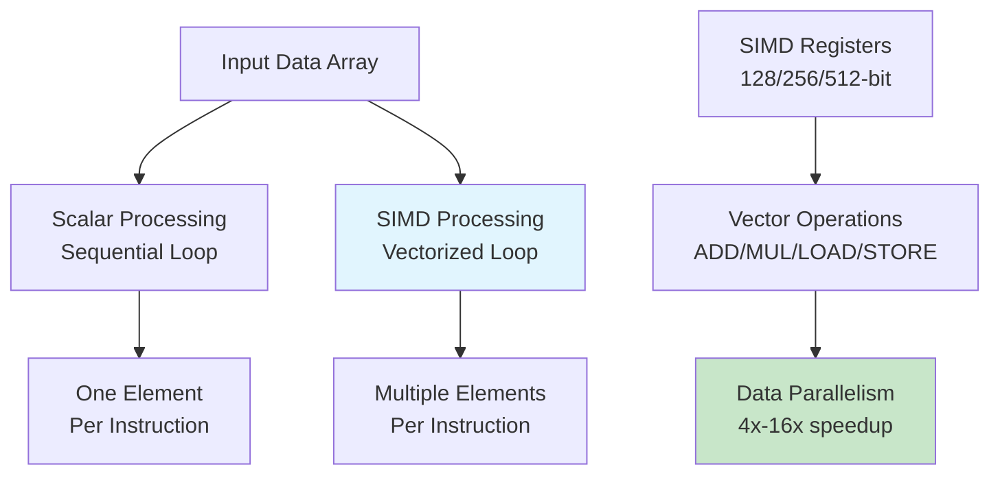
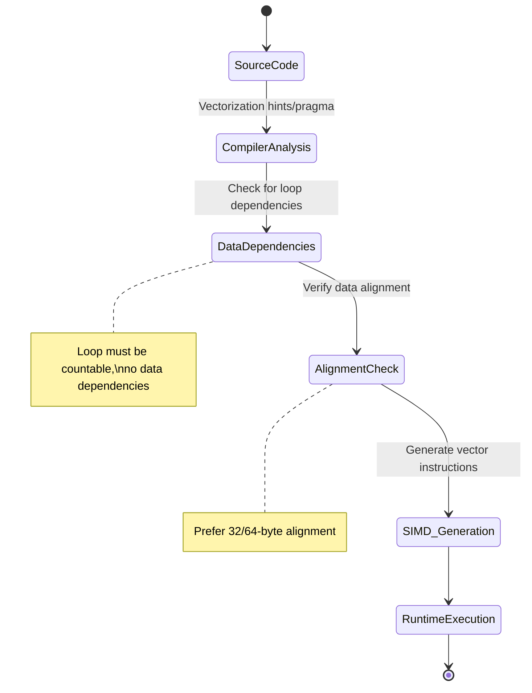

---
title: "SIMD Optimization for Real-Time Processing Engines"
description: "System design example for SIMD Optimization for Real-Time Processing Engines"
---

# SIMD Optimization for Real-Time Processing Engines

## Overview

SIMD (Single Instruction, Multiple Data) is a parallel processing paradigm where a single CPU instruction operates on multiple data elements simultaneously, enabling significant performance improvements in data-intensive computations. For real-time processing engines, SIMD optimization is crucial for achieving the low-latency, high-throughput requirements typical of streaming data pipelines, real-time analytics, and performance-critical applications.

### What it is and why it's important
SIMD allows processing engines to exploit data-level parallelism by grouping scalar operations into vector operations. Instead of processing array elements one-by-one in a loop, SIMD instructions can process 4, 8, 16, or more elements concurrently depending on the vector register width. This is particularly valuable in real-time systems where processing deadlines are measured in microseconds or milliseconds.

### Real-world context and where it's used
- **Real-time analytics platforms** (Apache Spark Streaming, Flink)
- **Media processing engines** (video transcoding, audio processing)
- **Financial trading systems** (high-frequency data processing)
- **Gaming engines** (physics simulation, rendering)
- **Scientific computing** (numerical simulations, signal processing)

### Concept diagram



## Core Principles & Components

### SIMD Architecture Components

1. **Vector Registers**: Fixed-width CPU registers (128-bit SSE, 256-bit AVX, 512-bit AVX-512) that hold multiple data elements
2. **SIMD Instructions**: CPU instruction set extensions providing vector operations (add, multiply, load, store, shuffle)
3. **Vectorization**: Compiler/automatic transformation of scalar loops into vectorized operations
4. **Alignment Requirements**: Data structures optimized for vector register boundaries

### Data Organization Patterns

- **Array of Structures (AoS)**: `struct {float x,y,z;}` - optimal for scalar processing
- **Structure of Arrays (SoA)**: Separate arrays for each field - optimal for SIMD vectorization
- **Hybrid approaches**: Balance between memory layout and access patterns

### Vectorization Process Flow



## Detailed Implementation Design

### A. Algorithm / Process Flow

#### Step-by-Step SIMD Processing Pipeline

1. **Data Preparation Phase**
   - Align input data to vector register boundaries
   - Convert scalar arrays to vector-friendly formats
   - Handle edge cases for non-divisible array sizes

2. **Vector Load Operations**
   - Load contiguous data into vector registers
   - Handle misaligned data with penalty instructions

3. **Vector Computation Phase**
   - Apply SIMD operations (add, multiply, etc.) across all lanes
   - Chain operations to minimize memory access

4. **Conditional Processing**
   - Use mask registers for conditional vector operations
   - Handle branching with blend/select instructions

5. **Store Results**
   - Write vector results back to memory
   - Handle partial vectors at array boundaries

```java
// Conceptual SIMD processing flow
public class SIMDProcessor {
    private static final int VECTOR_SIZE = 8; // floats per vector

    public void processData(float[] input, float[] output, float scalar) {
        // Step 1: Align data processing
        int alignedLength = (input.length / VECTOR_SIZE) * VECTOR_SIZE;

        // Step 2: Vectorized main loop
        for (int i = 0; i < alignedLength; i += VECTOR_SIZE) {
            processVectorBlock(input, output, scalar, i);
        }

        // Step 3: Handle remainder scalar processing
        for (int i = alignedLength; i < input.length; i++) {
            output[i] = input[i] * scalar; // fallback scalar operation
        }
    }

    private void processVectorBlock(float[] input, float[] output, float scalar, int offset) {
        // Vector load, compute, store operations would go here
        // In practice, this uses CPU intrinsics or vector libraries
    }
}
```

### B. Data Structures & Configuration Parameters

#### Core Data Structures

- **Vector Types**: FloatVector, IntVector with fixed lane counts
- **Mask Registers**: Boolean vectors for conditional operations
- **Aligned Arrays**: Memory-aligned data buffers for optimal SIMD access
- **Vector Accumulators**: Temporary storage for reduction operations

#### Configuration Parameters

- **Vector Width**: 128-bit (SSE), 256-bit (AVX), 512-bit (AVX-512) - affects parallelism factor
- **Alignment Boundary**: Typically 32-64 bytes for optimal memory access
- **Unroll Factor**: Loop unrolling depth (2x, 4x, 8x) balancing instruction cache usage
- **Prefetch Distance**: How far ahead to prefetch data (cache line multiples)

### C. Java Implementation Example

Using Java's Vector API (JDK 16+) for portable SIMD operations:

```java
import jdk.incubator.vector.FloatVector;
import jdk.incubator.vector.VectorOperators;
import jdk.incubator.vector.VectorSpecies;

/**
 * SIMD-optimized real-time data processor using Java Vector API.
 * Processes multiple float elements simultaneously for high-performance computations.
 */
public class SIMDRealTimeProcessor {
    // Vector species for float operations (matches SIMD register width)
    private static final VectorSpecies<Float> SPECIES = FloatVector.SPECIES_PREFERRED;

    // Configuration: vector size determines SIMD parallelism factor
    private final int vectorSize = SPECIES.length(); // typically 4, 8, or 16
    private final float scaleFactor;
    private final float threshold;

    public SIMDRealTimeProcessor(float scaleFactor, float threshold) {
        this.scaleFactor = scaleFactor;
        this.threshold = threshold;
    }

    /**
     * Processes input data array using SIMD vectorization.
     * Applies scaling and conditional thresholding operations.
     *
     * @param input  Input data array
     * @param output Output processed array (must be same length)
     */
    public void processData(float[] input, float[] output) {
        int inputLength = input.length;
        int vectorLength = SPECIES.loopBound(inputLength); // Aligned vector operations

        // Main vectorized loop - processes vectorSize elements per iteration
        for (int i = 0; i < vectorLength; i += vectorSize) {
            // Load vector from input array
            FloatVector inputVector = FloatVector.fromArray(SPECIES, input, i);

            // Apply SIMD scaling operation (multiplies all elements simultaneously)
            FloatVector scaledVector = inputVector.mul(scaleFactor);

            // Conditional thresholding using mask operations
            FloatVector thresholdVector = FloatVector.broadcast(SPECIES, threshold);
            // Create mask where elements exceed threshold
            VectorMask<Float> mask = scaledVector.compare(VectorOperators.GT, thresholdVector);

            // Apply conditional operation using blend
            FloatVector processedVector = scaledVector.blend(
                scaledVector.mul(2.0f), // Double values above threshold
                mask
            );

            // Store result vector to output array
            processedVector.intoArray(output, i);
        }

        // Handle remaining elements with scalar processing
        for (int i = vectorLength; i < inputLength; i++) {
            float scaled = input[i] * scaleFactor;
            output[i] = (scaled > threshold) ? scaled * 2.0f : scaled;
        }
    }

    /**
     * Reduction operation: compute sum of all elements using SIMD.
     * Demonstrates horizontal operations across vector lanes.
     */
    public float computeSum(float[] data) {
        int length = data.length;
        int vectorBound = SPECIES.loopBound(length);

        FloatVector sumVector = FloatVector.zero(SPECIES);

        // Accumulate sums across vectors
        for (int i = 0; i < vectorBound; i += vectorSize) {
            FloatVector dataVector = FloatVector.fromArray(SPECIES, data, i);
            sumVector = sumVector.add(dataVector);
        }

        // Horizontal reduction to scalar
        float totalSum = sumVector.reduceLanes(VectorOperators.ADD);

        // Handle remainder
        for (int i = vectorBound; i < length; i++) {
            totalSum += data[i];
        }

        return totalSum;
    }
}
```

### D. Complexity & Performance

#### Time Complexity
- **Scalar Processing**: O(n) - one element per instruction
- **SIMD Processing**: O(n/vector_width) - vector_width elements per instruction
- **Effective Speedup**: 2x-16x depending on vector width and data dependencies

#### Space Complexity
- **Scalar**: O(1) additional space per operation
- **Vectorized**: O(vector_width) temporary space for vector registers
- **Memory Alignment**: May require padding for optimal performance

#### Real-World Performance Characteristics
- **Throughput Improvement**: 4-8x for floating-point operations on modern CPUs
- **Memory Bandwidth**: 10-20x reduction in memory access pressure
- **Cache Efficiency**: Improved spatial locality for contiguous data access
- **Branch Prediction**: Reduced branch misprediction in vectorized code

### E. Thread Safety & Concurrency

#### Multi-Threaded SIMD Usage
- **Thread-Local Vectorization**: Each thread processes independent data partitions
- **Shared Memory Considerations**: Vector loads/stores require cache coherence
- **False Sharing Prevention**: Align data partitions to cache line boundaries (64 bytes)
- **Concurrent Data Access**: Use atomic vector operations for shared state

#### Lock-Free SIMD Operations
```java
// Thread-safe SIMD accumulator using atomic operations
public class SIMDAccumulator {
    private final AtomicReference<FloatVector> accumulated = new AtomicReference<>(FloatVector.zero(SPECIES));

    public void addVector(FloatVector value) {
        FloatVector current, updated;
        do {
            current = accumulated.get();
            updated = current.add(value);
        } while (!accumulated.compareAndSet(current, updated));
    }
}
```

### F. Memory & Resource Management

#### Memory Layout Optimization
- **Cache Line Alignment**: Ensure vector operations don't span cache lines
- **Prefetching**: Use software prefetch instructions for large datasets
- **NUMA Awareness**: Pin threads to CPU cores near memory for vectorized workloads

#### Resource Allocation Strategies
- **Vector Register Allocation**: Minimize spilling to memory during complex computations
- **Instruction Cache Pressure**: Balance loop unrolling with code size
- **Power Management**: SIMD instructions consume more power; consider thermal limits

### G. Advanced Optimizations

#### Compiler Directives and Pragmas
```java
// GCC/Clang pragmas for SIMD optimization
#pragma omp simd
for (int i = 0; i < n; i++) {
    output[i] = input[i] * scale;
}
```

#### Advanced SIMD Variants
- **FMA (Fused Multiply-Add)**: Combined multiply-add operations
- **Gather/Scatter**: Non-contiguous memory access patterns
- **Masked Operations**: Conditional execution within vectors
- **Horizontal Operations**: Cross-lane reductions and permutations

## Edge Cases & Error Handling

### Boundary Conditions
- **Partial Vectors**: Arrays not divisible by vector width require scalar cleanup
- **Memory Alignment**: Handling unaligned data access with performance penalties
- **Denormal Numbers**: Special floating-point values causing performance issues
- **NaN/Inf Propagation**: Vector operations propagating special values

### Failure Recovery Logic
- **Fallback to Scalar Processing**: Graceful degradation when SIMD unavailable
- **Memory Allocation Failures**: Handling large array allocations for vectorized processing
- **CPU Feature Detection**: Runtime checking for required SIMD instruction support

## Configuration Trade-offs

### Performance vs Accuracy Trade-offs
- **Vector Width Selection**: Wider vectors (AVX-512) offer more parallelism but consume more power
- **Precision Considerations**: SIMD operations maintain same numerical accuracy as scalar equivalents
- **Memory Alignment**: 32-byte vs 64-byte alignment balancing compatibility and performance

### Simplicity vs Performance
- **Auto-Vectorization**: Compiler-driven optimization vs manual SIMD intrinsics
- **Code Maintainability**: Assembly-like intrinsics vs high-level vector libraries
- **Portability**: Platform-specific optimizations vs cross-platform compatibility

### Real-World Tuning Considerations
- **Workload Characterization**: Memory-bound vs compute-bound applications
- **Data Layout Choices**: AoS vs SoA based on access patterns
- **Cache Hierarchy Optimization**: L1/L2/L3 cache utilization in vectorized loops

## Use Cases & Real-World Examples

### Production Applications
- **Apache Spark**: SIMD acceleration for DataFrame operations and ML algorithms
- **TensorFlow**: Vectorized tensor operations for neural network inference
- **Video Processing**: Real-time transcoding in YouTube/Netflix streaming pipelines
- **Financial Risk Analysis**: Portfolio simulations requiring massive parallel computations

### Integration Scenarios
- **Database Engines**: SIMD-accelerated query processing in ClickHouse/Apache Arrow
- **Computer Vision**: Image filtering and feature extraction in OpenCV pipelines
- **Signal Processing**: FFT operations for real-time audio/video analysis
- **Machine Learning**: Matrix operations in scikit-learn and ML frameworks

## Advantages & Disadvantages

### Benefits
- **Massive Performance Gains**: 4-16x speedup for data-parallel workloads
- **Energy Efficiency**: Reduced instruction count per processed element
- **Hardware Utilization**: Makes full use of modern CPU capabilities
- **Scalability**: Performance scales with CPU vector width improvements

### Known Trade-offs
- **Code Complexity**: Requires understanding of low-level CPU architecture
- **Hardware Dependency**: Performance varies across CPU generations
- **Debugging Challenges**: Vector operations harder to inspect than scalar code
- **Portability Issues**: SIMD intrinsics are platform-specific

### When Not to Use SIMD
- **Branch-Heavy Code**: Frequent conditionals reduce vectorization effectiveness
- **Irregular Memory Access**: Non-contiguous data patterns prevent efficient vectorization
- **Small Datasets**: Setup overhead outweighs benefits for tiny arrays
- **Legacy Hardware**: Older CPUs without SIMD support

## Alternatives & Comparisons

### Comparison with Other Parallelization Techniques
- **SIMD vs SIMD**: Single-thread parallelism vs inter-thread parallelism
- **SIMD vs GPU**: CPU vectorization vs massively parallel GPU computing
- **SIMD vs Multi-Core**: Intra-core parallelism vs inter-core parallelism

### Why SIMD is Preferred
- **Lower Latency**: No thread synchronization overhead
- **Better Cache Utilization**: Keeps data in CPU caches longer
- **Energy Efficient**: Uses existing CPU resources optimally
- **Portability**: Works across all modern CPUs without special hardware

### Complementary Technologies
- **SIMD + Multi-Threading**: Combine vectorization with parallel execution
- **SIMD + Cache Optimization**: Optimize memory layout for both SIMD and caching
- **SIMD + Compiler Optimizations**: Auto-vectorization with manual tuning

## Interview Talking Points

1. **Vectorization Fundamentals**: SIMD processes multiple data elements per instruction, scaling performance with vector register width (128-bit to 512-bit architectures)

2. **Performance Trade-offs**: 4-8x throughput gains offset by increased code complexity and hardware-specific tuning requirements

3. **Memory Alignment Critical**: 32/64-byte alignment boundaries prevent cache line splits and ensure optimal SIMD register utilization

4. **Fallback Strategies**: Graceful degradation to scalar processing for partial vectors and unsupported CPU architectures

5. **Real-time Constraints**: SIMD enables sub-millisecond processing deadlines in high-frequency trading and streaming analytics systems

6. **Compiler Auto-vectorization**: Modern compilers detect parallelizable loops, but intrinsics provide fine-grained control for performance-critical sections

7. **Data Layout Decisions**: Structure of Arrays (SoA) optimizes for SIMD access patterns compared to Array of Structures (AoS)

8. **Scalability Evolution**: AVX-512 provides 16-lane parallelism vs SSE's 4 lanes, demonstrating hardware-driven performance improvements

9. **Thread Safety Challenges**: Vector operations require careful cache line alignment to prevent false sharing in concurrent environments

10. **Industry Applications**: Powers real-time video processing at Netflix, financial risk calculations at investment banks, and ML inference at scale
