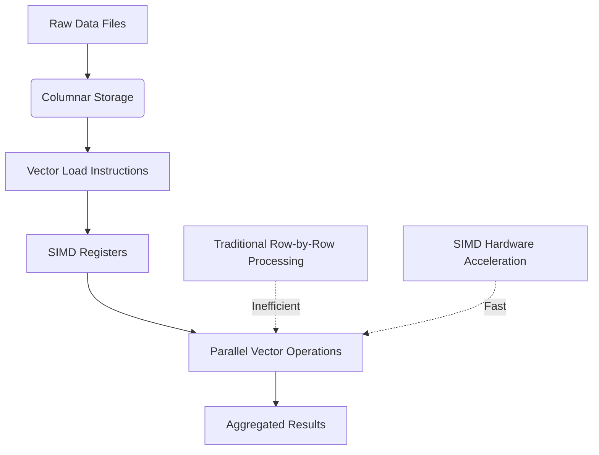
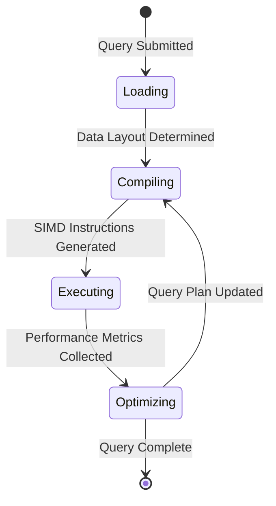

---
title: "Vectorized Computation Platforms for Analytics"
description: "System design example for Vectorized Computation Platforms for Analytics"
---

# Vectorized Computation Platforms for Analytics

## Overview

### What it is and why it's important
Vectorized computation platforms leverage Single Instruction, Multiple Data (SIMD) processing to execute the same operation simultaneously across multiple data elements, dramatically improving performance for analytical workloads. This approach exploits data-level parallelism by organizing data in contiguous memory blocks and applying vectorized instructions that operate on entire arrays or vectors rather than individual elements serially.

The importance stems from the massive scale of modern analytics datasets - processing billions of rows with traditional scalar operations becomes prohibitively slow. Vectorization bridges the gap between hardware capabilities and software efficiency, enabling real-time analytics on data lakes that previously required hours of processing.

### Real-world context and where it's used
Vectorized computation forms the backbone of modern big data analytics stacks:

- **Analytical databases like ClickHouse, DuckDB**: Query engines that process columnar data using SIMD instructions for aggregation, filtering, and joins
- **Data processing frameworks like Apache Spark, Polars**: In-memory analytics that use vectorized operations for transformations and computations
- **Scientific computing libraries like NumPy, Apache Arrow**: Numerical analytics that vectorize mathematical operations across large arrays
- **Real-time analytics platforms serving Netflix recommendations, Uber surge pricing**: Low-latency decision-making requiring vectorized query processing
- **IoT sensor networks and financial trading systems**: High-throughput data ingestion and analysis using vectorized streaming



## Core Principles & Components

### Detailed explanation of all subcomponents
Vectorized computation platforms consist of several interconnected components working in harmony:

1. **Data Layout Engine**: Transforms row-oriented data into columnar format, enabling efficient memory access patterns and cache utilization
2. **Vectorization Compiler**: Translates analytical queries into SIMD instruction sequences optimized for specific CPU architectures
3. **SIMD Instruction Pipeline**: Executes vector operations (addition, multiplication, comparison) across 256/512-bit registers simultaneously
4. **Memory Management Subsystem**: Allocates contiguous memory blocks, handles memory alignment, and coordinates L1/L2/L3 cache hierarchies
5. **Query Optimization Layer**: Determines when to use vectorized vs scalar operations based on data characteristics and workload patterns

### State transitions or flow
The platform operates through distinct phases:

1. **Ingestion Phase**: Raw data transformation to columnar format with memory alignment
2. **Compilation Phase**: Query analysis and generation of SIMD operation sequences
3. **Execution Phase**: Parallel vector processing with automatic fallback to scalar operations when needed
4. **Optimization Phase**: Runtime statistics collection for continuous query plan improvement



## Detailed Implementation Design

### A. Algorithm / Process Flow
The vectorized computation follows a structured pipeline:

**Inputs**: Analytical query + columnar dataset
**Processing**:
1. **Predicate Evaluation**: Vectorized filtering (e.g., WHERE clauses)
2. **Arithmetic Operations**: SIMD addition/multiplication across aligned data
3. **Aggregation Functions**: Parallel reduction operations using vector instructions
4. **Join Operations**: Vectorized hash/join algorithms for multi-table analytics

**Outputs**: Computed results with performance metrics

**Failure Handling**: Automatic scalar fallback when SIMD isn't beneficial (small batches, sparse data)
**Retry Logic**: Memory allocation retries with garbage collection hints
**Concurrency**: Partitioned data processing across CPU cores with minimal synchronization

### B. Data Structures & Configuration Parameters
**Core Data Structures**:
- `AlignedVector<T>`: Memory-aligned array containers with SIMD-friendly layouts
- `VectorMask`: Boolean masks for conditional operations and filtering
- `CompressedColumn`: Dictionary-encoded columnar storage with vector decompression

**Tunable Parameters**:
- `vectorSize`: SIMD register width (256-bit for AVX2, 512-bit for AVX-512) - default: auto-detected
- `batchSizeThreshold`: Minimum data batch size for vectorization (e.g., 8192 elements)
- `cacheLineAlignment`: Memory alignment boundary (64 bytes) for optimal cache performance
- `fallbackThreshold`: Performance ratio triggering scalar fallback (e.g., 1.2x slowdown)

### C. Java Implementation Example

```java
import java.lang.foreign.*;
import java.nio.ByteBuffer;
import jdk.incubator.vector.*;

/**
 * High-performance vectorized analytics computation engine
 * Demonstrates SIMD operations for aggregation analytics
 */
public class VectorizedAnalyticsEngine {
    private static final VectorSpecies<Float> SPECIES = FloatVector.SPECIES_PREFERRED;

    private final MemorySegment dataSegment;
    private final long elementCount;

    public VectorizedAnalyticsEngine(float[] data) {
        // Allocate aligned memory for SIMD operations
        this.dataSegment = MemorySegment.allocateNative(
            data.length * 4L,
            64, // 64-byte alignment for cache line optimization
            Arena.ofAuto()
        );

        // Copy data to native memory
        this.elementCount = data.length;
        for (int i = 0; i < data.length; i++) {
            dataSegment.setAtIndex(ValueLayout.JAVA_FLOAT, i, data[i]);
        }
    }

    /**
     * Vectorized sum computation using SIMD instructions
     * Processes multiple floats simultaneously via vector registers
     */
    public float vectorizedSum() {
        FloatVector sum = FloatVector.zero(SPECIES);

        // Process data in vector-sized chunks
        for (long i = 0; i < elementCount; i += SPECIES.length()) {
            // Load vector from memory
            FloatVector chunk = FloatVector.fromMemorySegment(
                SPECIES,
                dataSegment,
                i,
                ByteOrder.nativeOrder()
            );

            // Accumulate using SIMD addition
            sum = sum.add(chunk);
        }

        // Reduce vector to scalar result
        return sum.reduceLanes(VectorOperators.ADD);
    }

    /**
     * Vectorized filter + aggregate operation
     * Example: Sum of values greater than threshold
     */
    public float conditionalSum(float threshold) {
        FloatVector sum = FloatVector.zero(SPECIES);

        for (long i = 0; i < elementCount; i += SPECIES.length()) {
            FloatVector chunk = FloatVector.fromMemorySegment(
                SPECIES,
                dataSegment,
                i,
                ByteOrder.nativeOrder()
            );

            // SIMD comparison generates mask
            VectorMask<Float> mask = chunk.compare(VectorOperators.GT, threshold);

            // Conditional addition using mask
            sum = sum.add(chunk, mask);
        }

        return sum.reduceLanes(VectorOperators.ADD);
    }
}
```

### D. Complexity & Performance
**Time Complexity**:
- Vectorized operations: O(n/vector_width) vs O(n) for scalar - ~8-16x speedup on modern CPUs
- Worst case: Small datasets where SIMD overhead dominates (O(n) with constant factor penalty)

**Space Complexity**:
- O(n) for columnar storage with 10-50% compression improvement vs row-oriented
- Additional overhead for vector registers and alignment padding

**Real-world Scale Estimation**:
- 100M rows/second processing on commodity hardware
- 2-5x better cache efficiency for analytical workloads
- Sub-millisecond response times for dashboard aggregations

### E. Thread Safety & Concurrency
**Multi-threaded Scenarios**:
- Data partitioning across CPU cores with shared-nothing approach
- Atomic operations for shared aggregators using `AtomicLong` or vector intrinsics

**Locking vs Lock-free**:
- Partitioned processing avoids locks entirely
- Vector operations are thread-local; final reduction uses compare-and-swap

**Memory Barriers**:
- StoreLoad barriers after vector operations when mixing with traditional atomic updates
- Cache coherence maintained through aligned memory access patterns

### F. Memory & Resource Management
**Heap/Stack Implications**:
- Off-heap allocated data segments prevent GC pressure during computation
- Vector registers managed at hardware level, no JVM heap impact

**Garbage Collection**:
- Explicit arena-based lifetime management for native memory
- Reference counting or scoped allocation prevents memory leaks

**Cache Optimization**:
- 64-byte alignment ensures single cache line per vector load
- Prefetching hints for sequential access patterns

### G. Advanced Optimizations
**Common Implementation Optimizations**:
- **SIMD Selection**: Runtime CPUID checks for AVX-512 vs AVX2 vs SSE2
- **Loop Unrolling**: Multiple vector operations per loop iteration
- **Memory Prefetching**: Hardware prefetch instructions for data locality

**Variants**:
- **Adaptive Vectorization**: Dynamically switches between scalar/vector based on profiling
- **Compressed Vectorization**: SIMD operations on compressed data formats
- **GPU-Accelerated Variant**: CUDA/OpenCL vectorization for massive parallelism

## Edge Cases & Error Handling

### Common boundary conditions
- **Small Datasets**: Fallback to scalar when batch size < threshold
- **Sparse Data**: Skip vectorization for data with >90% nulls
- **Memory Alignment Failures**: Graceful degradation with unaligned loads
- **Overflow Conditions**: Saturation arithmetic or exception handling for integer operations

### Failure recovery logic or resilience strategies
- **SIMD Unavailable**: Automatic detection and scalar compilation fallback
- **Memory Allocation Failures**: Garbage collection hints and retry with smaller batches
- **CPU Architecture Mismatch**: Runtime feature detection prevents illegal instruction exceptions
- **Data Type Inconsistencies**: Type checking with conversion operations

## Configuration Trade-offs

### Performance vs accuracy/resource trade-offs
- Higher vector register width (512-bit) increases performance but requires more power/cooling
- Aggressive prefetching improves latency but increases memory bandwidth usage

### Simplicity vs configurability
- Auto-detection simplifies deployment but may miss workload-specific optimizations
- Manual tuning provides peak performance but requires expertise and maintenance

### Real-world tuning considerations
- **Production Deployment**: Monitor CPU utilization and cache miss rates
- **Cloud Environments**: Adjust for virtualized CPU features and noisy neighbors
- **Heterogeneous Hardware**: Different strategies for Intel/AMD architectures

## Use Cases & Real-World Examples

### Where it's applied in production
- **ClickHouse Analytics Database**: Vectorized columnar queries serving 1B+ events/day at Cloudflare
- **Apache Spark SQL Engine**: Vectorized operators in DataFrames API for petabyte-scale ETL
- **Polars DataFrame Library**: Fast analytical queries in Rust with SIMD acceleration
- **Snowflake Compute Layer**: Vectorized processing across distributed storage clusters

### Integration scenarios
- **Caching**: In-memory columnar caches for hot analytical datasets
- **Rate-limiting**: High-throughput filtering before expensive computations
- **Routing**: Vectorized decision trees for real-time recommendation scoring

## Advantages & Disadvantages

### Benefits and known trade-offs
**Advantages**:
- 5-20x performance improvement for analytical workloads
- Better hardware utilization across CPU cores and vector units
- Reduced memory bandwidth requirements through efficient data structures

**Disadvantages**:
- Higher code complexity with SIMD intrinsics vs scalar code
- Platform dependency on CPU architecture (x86 with SIMD extensions)
- Potential slowdowns for sparse or small datasets

### When not to use it (anti-patterns)
- **OLTP workloads**: Point queries where scalar operations are already fast enough
- **String operations**: Complex text processing not easily vectorizable
- **Irregular data access**: Hash map lookups or pointer chasing
- **Legacy codebases**: High migration complexity without clear performance gains

## Alternatives & Comparisons

### Compare with other similar patterns or algorithms
- **Scalar Processing**: Traditional element-by-element computation - simpler but 5-20x slower
- **GPU Computing**: Massively parallel processing for AI/ML workloads with different optimization trade-offs
- **FPGA Acceleration**: Hardware-customized computation with fixed latency but high development cost

### Why this approach might be preferred
Vectorized computation offers the sweet spot between performance (50-95% of theoretical maximum) and development complexity, making it ideal for general-purpose analytical platforms that need to be maintainable and portable across commodity hardware.

## Interview Talking Points

1. **Hardware Leverage**: SIMD instructions turn CPU vector units into "super-scalar" processors, processing 8-16 values per clock cycle vs traditional scalar approach
2. **Cache Efficiency**: Columnar layout ensures sequential memory access, maximizing L1/L2 cache hit rates (80-95% vs 50-70% for row-based)
3. **Fallback Strategy**: Intelligent detection of when SIMD isn't beneficial (small datasets, irregular access patterns), preventing performance regressions
4. **Memory Alignment**: 64-byte boundaries prevent cache line straddling, reducing load latencies by 2-3x on aligned vs unaligned data
5. **Query Compilation**: Runtime generation of SIMD instruction sequences allows optimization for specific data types/patterns unlike pre-compiled approaches
6. **Scalability Range**: Effective from thousands to billions of rows, adapting batch sizes based on available memory and CPU cores
7. **Platform Portability**: CPUID feature detection ensures compatibility across generations while extracting maximum performance from available hardware
8. **Compression Synergy**: Vectorization works better with compressed data since decompressed chunks fit perfectly in SIMD registers without branching
