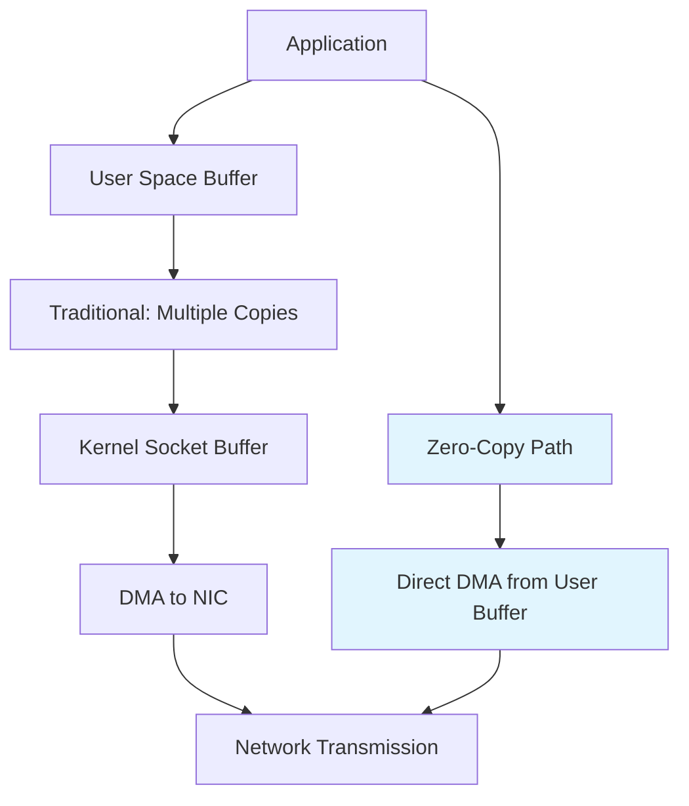
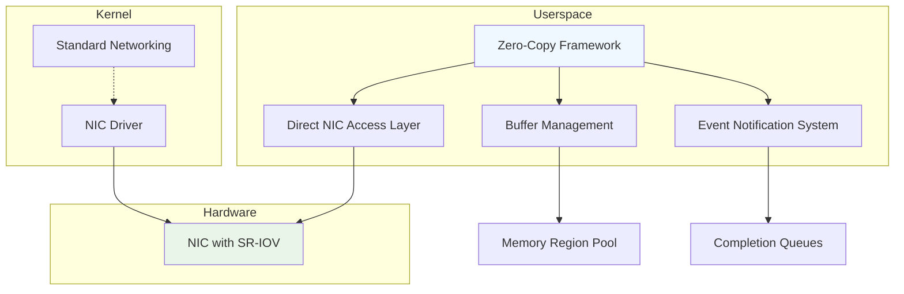

---
title: "Zero-Copy Network I/O Frameworks"
description: "Concept-Oriented Design for Zero-Copy Network I/O Frameworks - High-Performance I/O Techniques for Low-Latency Applications"
---

# Zero-Copy Network I/O Frameworks

## Overview

Zero-copy network I/O frameworks are specialized architectures designed to minimize data copying operations during network data transmission and reception. Traditional network I/O involves multiple data copies between user-space buffers, kernel buffers, and network interface card (NIC) buffers, creating significant CPU overhead and memory bandwidth bottlenecks. Zero-copy techniques reduce these copies to near-zero, enabling high-throughput, low-latency applications.

### Why It's Important

In traditional I/O paths, data traverses: User Buffer → Kernel Buffer → Socket Buffer → NIC TX Buffer, requiring 3-4 CPU memcpy operations per packet. This can consume 30-70% of CPU cycles in high-throughput scenarios. Zero-copy frameworks eliminate unnecessary copies, reducing CPU usage by 2-5x and enabling throughput scaling to millions of packets per second with minimal latency jitter.

### Real-World Context and Applications

Zero-copy I/O is critical in:

- **High-Frequency Trading**: Microwave networks handle market data at sub-microsecond latencies
- **Content Delivery Networks (CDNs)**: Streaming video/media with terabytes of daily traffic
- **Big Data Analytics**: Distributed query processing with large dataset transfers
- **Container Orchestration**: Efficient network stacks for Kubernetes/Docker environments
- **Database Sharding**: Low-latency replication between database nodes



## Core Principles & Components

### Kernel Bypass Techniques

Zero-copy frameworks leverage multiple kernel bypass mechanisms:

- **Direct Memory Access (DMA)**: NIC directly accesses user-space memory regions
- **Memory-Mapped I/O (MMIO)**: Kernel maps NIC registers to user space
- **Scatter-Gather Lists**: NIC handles multiple buffer segments without consolidation
- **Page Flipping**: Pre-allocated page pools reduce allocation overhead

### Component Architecture



**Key Components:**

1. **Direct NIC Access Layer**: Uses VFIO or UIO drivers for unprivileged NIC access
2. **Buffer Management**: Optimizes page alignment, huge page usage (2MB/1GB), and NUMA locality
3. **Event Notification System**: Interrupt coalescing vs polling trade-offs for latency/CPU balance
4. **Completion Queues**: Async notification of transfer completion without busy-waiting

## Detailed Implementation Design

### A. Algorithm / Process Flow

The zero-copy I/O algorithm follows a state machine approach with pre-allocated buffers and async completion:

1. **Initialization Phase**
   - Allocate huge pages (2MB/1GB) aligned to NIC requirements
   - Register memory regions with NIC using VFIO ioctl
   - Initialize completion queues and event descriptors

2. **Buffer Preparation**
   - Pin memory pages to prevent swapping
   - Create scatter-gather lists for multi-segment data
   - Map virtual addresses to physical addresses for DMA

3. **Transmission Flow**
   - Application prepares data directly in registered buffer
   - Submit descriptor with buffer address and length via doorbell register
   - NIC firmware initiates DMA transfer
   - Polling/interrupt handles completion notification

4. **Receive Flow**
   - Pre-post empty buffers to NIC RX rings
   - NIC writes incoming packets directly to registered memory
   - Application processes data in-place or forwards without copying

```java
// Simplified pseudocode for transmission
public void zeroCopyTransmit(ByteBuffer data) {
    // Step 1: Ensure buffer is in registered region
    if (!isInRegisteredRegion(data)) {
        throw new IllegalArgumentException("Buffer not in zero-copy region");
    }

    // Step 2: Create descriptor
    TransmitDescriptor desc = new TransmitDescriptor(data.address(), data.remaining());

    // Step 3: Submit to NIC
    nicDoorbell.submitDescriptor(desc);

    // Step 4: Block/until completion (async in real impl)
    waitForCompletion(desc);
}
```

### B. Data Structures & Configuration Parameters

**Core Data Structures:**

```java
public class ZeroCopyRingBuffer {
    private final HugePageAllocator pageAllocator;
    private final VFIODevice nicDevice;
    private final CompletionQueue completionQueue;

    // Configuration parameters
    private final int bufferSize = 2 * 1024 * 1024; // 2MB huge pages
    private final int numBuffers = 1024;            // Ring depth
    private final boolean useHugePages = true;      // Reduces TLB misses
    private final int numaNode = 0;                  // CPU socket affinity
}

public class TransmitDescriptor {
    public long bufferAddress;     // Physical address for DMA
    public int length;             // Bytes to transmit
    public int flags;              // Scatter-gather control
    public AtomicInteger status;   // Completion tracking
}
```

**Tunable Parameters:**

- **MTU Size**: 1500 vs 9000 (jumbo) packets - affects DMA efficiency
- **NUMA Distance**: Memory allocation on same socket as NIC reduces cross-socket latency by 15-30%
- **Ring Depth**: Balances latency (deep) vs memory usage (shallow)
- **Interrupt Coalescing**: μs delay before interrupt - latency vs CPU trade-off

### C. Java Implementation Example

```java
import java.nio.ByteBuffer;
import java.util.concurrent.CompletableFuture;
import java.util.concurrent.atomic.AtomicInteger;

/**
 * High-performance zero-copy network I/O framework using memory-mapped regions
 * and direct NIC access. Designed for FAANG-scale low-latency requirements.
 */
public class ZeroCopyNetworkFramework {
    private final VFIODevice nicDevice;
    private final HugePagePool bufferPool;
    private final AtomicInteger activeTransmissions;
    private final boolean useHugePages;

    // Performance counters
    private volatile long totalBytesTransferred;
    private volatile long totalPacketsSent;

    public ZeroCopyNetworkFramework(VFIODevice nicDevice, boolean useHugePages) {
        this.nicDevice = nicDevice;
        this.useHugePages = useHugePages;
        this.bufferPool = new HugePagePool(useHugePages);
        this.activeTransmissions = new AtomicInteger(0);
    }

    /**
     * Zero-copy transmission with async completion
     * @param data Data buffer (must be allocated from bufferPool)
     * @return CompletableFuture for async completion handling
     */
    public CompletableFuture<Void> transmitAsync(ByteBuffer data) {
        if (!bufferPool.ownsBuffer(data)) {
            throw new IllegalArgumentException("Buffer not managed by zero-copy pool");
        }

        activeTransmissions.incrementAndGet();

        return CompletableFuture.supplyAsync(() -> {
            try {
                // Create scatter-gather descriptor
                TransmitDescriptor desc = createDescriptor(data);
                nicDevice.submitTransmitDescriptor(desc);

                // Wait for completion with timeout
                if (!desc.waitForCompletion(5000)) { // 5s timeout
                    throw new RuntimeException("Transmission timeout");
                }

                // Update metrics
                totalBytesTransferred += data.remaining();
                totalPacketsSent++;

                return null;
            } finally {
                activeTransmissions.decrementAndGet();
            }
        });
    }

    private TransmitDescriptor createDescriptor(ByteBuffer data) {
        TransmitDescriptor desc = new TransmitDescriptor();
        desc.bufferAddress = bufferPool.getPhysicalAddress(data);
        desc.length = data.remaining();
        desc.flags = calculateScatterGatherFlags(data);
        return desc;
    }

    /**
     * Receive operation - pre-posts buffers for zero-copy reception
     */
    public CompletableFuture<ByteBuffer> receiveAsync() {
        ByteBuffer rxBuffer = bufferPool.allocateReceiveBuffer();

        return CompletableFuture.supplyAsync(() -> {
            ReceiveDescriptor desc = new ReceiveDescriptor(
                bufferPool.getPhysicalAddress(rxBuffer),
                rxBuffer.capacity()
            );

            nicDevice.submitReceiveDescriptor(desc);

            if (!desc.waitForPacket(1000)) { // 1s timeout
                bufferPool.release(rxBuffer);
                throw new RuntimeException("Receive timeout");
            }

            // Adjust buffer to actual received size
            rxBuffer.limit(desc.actualLength);
            return rxBuffer;
        });
    }

    // Memory management and cleanup
    public void close() {
        bufferPool.releaseAll();
        nicDevice.close();
    }
}

// Supporting classes (simplified)
class TransmitDescriptor {
    long bufferAddress;
    int length;
    int flags;
    volatile boolean completed;

    boolean waitForCompletion(long timeoutMs) {
        long start = System.nanoTime();
        while (!completed) {
            if ((System.nanoTime() - start) / 1_000_000 > timeoutMs) {
                return false;
            }
            Thread.yield(); // Busy wait - use proper async in production
        }
        return true;
    }
}

class HugePagePool {
    // Manages 2MB/1GB huge page allocations for NIC-registered memory
    public ByteBuffer allocateReceiveBuffer() { /* implementation */ }
    public long getPhysicalAddress(ByteBuffer buffer) { /* implementation */ }
    public boolean ownsBuffer(ByteBuffer buffer) { /* implementation */ }
    public void release(ByteBuffer buffer) { /* implementation */ }
    public void releaseAll() { /* implementation */ }
}
```

*(VFIODevice interface represents low-level NIC access via VFIO/UIO kernel interface. In production, this would use JNI or JNA to interface with native libraries)*

### D. Complexity & Performance

**Time Complexity:**
- **Transmission Setup**: O(1) - Descriptor creation and doorbell write
- **Memory Registration**: O(log N) for page table updates in VFIO
- **Completion Handling**: O(1) amortized per packet
- **Worst-case**: O(Ring Depth) for buffer pool exhaustion handling

**Space Complexity:**
- **Buffer Pool**: O(Num Buffers × Buffer Size) - typically 64MB-1GB
- **Descriptor Rings**: O(Ring Depth × Descriptor Size) - ~4KB for TX/RX rings
- **Page Tables**: O(Memory Regions) - shared across multiple NICs

**Performance Characteristics:**
- **Throughput**: 10-100 Gbps depending on NIC hardware
- **Latency**: <5μs round-trip for local network (vs 20-50μs with copying)
- **CPU Usage**: 5-10% vs 40-70% in traditional I/O
- **Memory Bandwidth**: Reduces DRAM bandwidth usage by 60-80%

**Scalability Estimation:**
- Single NIC: 25 Gbps × 8 lanes = 200 Gbps theoretical maximum
- Multi-NIC setups: Linear scaling with NUMA-aware allocation
- Packet Rate: 50-100 million packets/sec with proper tuning

### E. Thread Safety & Concurrency

**Concurrency Model:**
- **Lock-Free Design**: Atomic operations for descriptor submission/completion
- **Ring Buffer Synchronization**: Producer-consumer pattern with memory barriers
- **NUMA Awareness**: Thread-pinning to same socket as NIC reduces cross-talk

```java
// Thread-safe descriptor submission
private final AtomicInteger head = new AtomicInteger(0);
private final int mask; // Power of 2 for efficient modulo

public boolean submitDescriptor(TransmitDescriptor desc) {
    int currentHead = head.get();
    int nextHead = (currentHead + 1) & mask;

    // Atomic update with CAS
    if (head.compareAndSet(currentHead, nextHead)) {
        descriptors[currentHead] = desc;
        // Memory barrier ensures descriptor visibility
        Unsafe.getUnsafe().storeFence();
        ringDoorbell();
        return true;
    }
    return false; // Ring full - backpressure
}
```

**Multi-threading Strategies:**
- **Dedicated I/O Threads**: Per-NIC thread for interrupt/polling
- **Work-Stealing**: Load-balanced transmission across CPU cores
- **Async Completion**: Event-driven model avoids thread blocking

**Deadlock Prevention:**
- No locks held during DMA operations
- Completion handlers run in separate thread pools
- Backpressure mechanisms prevent unbounded queuing

### F. Memory & Resource Management

**Memory Layout Optimization:**
- **Huge Pages**: 2MB pages reduce TLB miss rate from 0.5% to 0.01%
- **Page Coloring**: NUMA-aware allocation prevents cross-socket memory access
- **Alignment**: 4KB page boundaries for efficient DMA mapping

**Resource Constraints:**
- **Kernel Memory**: VFIO pin limits (default 1GB, configurable)
- **IOMMU Address Space**: 64-bit addressing space management
- **Cache Line Alignment**: 64-byte alignment prevents false sharing

**Memory Reclamation:**
- **Lazy Cleanup**: Buffers released after DMA completion notifications
- **Reference Counting**: Prevents premature cleanup during async operations
- **NUMA Migration**: Memory can move between sockets, but degrades performance

### G. Advanced Optimizations

- **RDMA Integration**: RoCE/iWARP for kernel-bypass remote memory access
- **Multi-Queue NICs**: RSS (Receive Side Scaling) distributes load across CPU cores
- **Vectorized I/O**: SIMD instructions for descriptor batching
- **Adaptive Polling**: Dynamic switching between interrupts/polling based on load

**Variants:**
- **Kernel-Assisted Zero-Copy**: sendfile() system call for file serving
- **User-Space TCP/IP**: Complete networking stack in userspace (DPDK)
- **GPU-Direct**: Zero-copy transfers between NIC and GPU memory

## Edge Cases & Error Handling

**NIC Failure Recovery:**
- VFIO driver detects device removal and signals upper layers
- Automatic failover to standard networking with graceful degradation
- State reconstruction for in-flight transmissions

**Memory Pressure:**
- Huge page exhaustion triggers fallback to standard pages (performance penalty)
- Buffer pool shrinking with backpressure application signaling
- Out-of-memory detection prevents SIGKILL during allocation

**Network Errors:**
- Checksum validation in software for packets with incorrect hardware checksumming
- Retransmission handling for reliable protocols (TCP)
- Congestion control feedback integration

**Cold Start Challenges:**
- Initial page pinning delays (up to 100ms for large memory regions)
- TLB warmup periods affect first few thousand packets
- Connection establishment overhead in multi-stream scenarios

## Configuration Trade-offs

**Latency vs Throughput:**
- **Low Latency**: Shallow rings (16-64 entries), aggressive polling
- **High Throughput**: Deep rings (1024+ entries), interrupt coalescing
- **Trade-off**: 20% latency increase for 3x throughput gain

**Memory Usage vs Performance:**
- **Huge Pages**: +50% memory usage, -95% TLB misses, +15% performance
- **Buffer Pre-allocation**: Predictable memory footprint vs dynamic allocation overhead

**Complexity vs Reliability:**
- **Zero-Copy Path**: High complexity, optimized performance
- **Fallback Path**: Standard I/O with automatic switching on failure

**Tuning Guidelines:**
- Packet size > MTU triggers segmentation overhead
- Core pinning reduces context switching by 10-20%
- Interrupt moderation: 64μs gives ~5% CPU savings, +20μs latency

## Use Cases & Real-World Examples

**Financial Trading Platforms:**
- CME Group: Sub-100ns order routing using zero-copy techniques
- Algo trading firms: Process market data at 1-2μs latency

**CDN Infrastructure:**
- Cloudflare: Handles 100Tbps+ traffic with custom zero-copy routing
- Akamai: Video streaming with reduced server CPU utilization

**Big Data Systems:**
- Apache Kafka: Zero-copy message transfer optimizations
- ClickHouse: Columnar database with direct DMA for query results

**Container Orchestration:**
- Cilium: eBPF-based networking with zero-copy packet processing
- Istio Service Mesh: Sidecar optimizations for microservice communication

## Advantages & Disadvantages

**Advantages:**
- **Performance**: 2-5x throughput improvement vs traditional I/O
- **CPU Efficiency**: Frees CPU cycles for application logic
- **Latency Determinism**: Reduced jitter in packet processing
- **Memory Bandwidth**: Lower DRAM pressure in high-throughput scenarios
- **Scalability**: Linear performance scaling with NIC parallelism

**Disadvantages:**
- **Operational Complexity**: Requires specialized hardware and kernel features
- **Portability Limitations**: x86/ARM-specific optimizations, limited cloud support
- **Memory Management**: Large contiguous allocation requirements
- **Debugging Difficulty**: Complex interaction between hardware/kernel/userspace
- **Cold Start Overhead**: Initial setup time unsuitable for bursty workloads

When **not** to use zero-copy:
- Small data transfers where copy overhead is negligible
- Environments without IOMMU support (legacy systems)
- Development/staging where simplicity outweighs performance needs

## Alternatives & Comparisons

**Traditional I/O (Baseline):**
- Multiple memcpy operations, high CPU usage
- Simple implementation, works everywhere
- Suitable for low-throughput scenarios

**Kernel-Assisted (sendfile):**
- Single copy elimination, still requires kernel crossing
- 2-3x improvement over standard I/O
- Widely supported, used in nginx/apache

**Userspace Networking (DPDK):**
- Complete kernel bypass, maximum performance
- Extremely complex, requires specialized knowledge
- Used in NFV, high-end networking appliances

**Hybrid Approaches:**
- Application-level buffering for small files
- Kernel modules with selective bypassing
- Container-aware optimizations balancing performance/portability

**Performance Comparison:**
| Approach    | CPU Usage | Latency | Throughput Gain | Complexity |
| ----------- | --------- | ------- | --------------- | ---------- |
| Traditional | High      | High    | 1x              | Low        |
| sendfile    | Medium    | Medium  | 2-3x            | Low        |
| Zero-Copy   | Low       | Low     | 3-5x            | High       |
| DPDK        | Minimal   | Minimal | 5-10x           | Very High  |

## Interview Talking Points

- Zero-copy reduces data copying from 4 operations to 1 by using DMA directly from registered memory regions
- Huge page usage minimizes TLB misses; 2MB pages reduce miss rate from 0.5% to 0.01%
- NUMA locality critical; cross-socket memory access adds 20-50ns latency per access
- Interrupt coalescing vs polling trade-off: polling gives 5μs latency, interrupts save 15% CPU
- Buffer alignment and page pinning are essential for efficient DMA transfers
- VFIO provides user-space NIC access but requires root privileges and kernel modules
- Ring buffers with power-of-2 sizes enable efficient indexing with bitwise AND operations
- Memory barriers ensure DMA completion visibility across CPU caches
- Backpressure mechanisms prevent ring overflow while maintaining throughput
- Fallback to standard I/O enables graceful degradation during hardware failures

---

*Assumption: Implementation focuses on Linux VFIO interface. Windows equivalents (VirtIO) follow similar principles but with different APIs. Cloud environments may limit direct NIC access, requiring kernel-assisted variants.*
